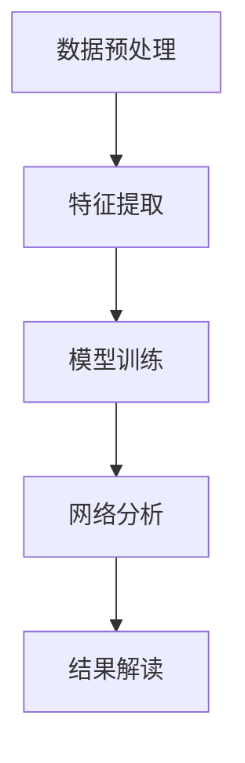
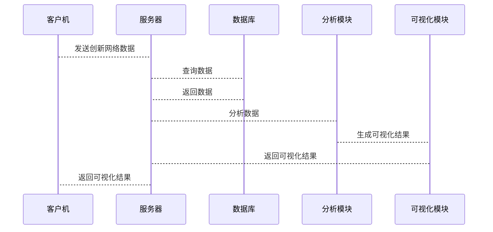

                 


```markdown
# AI驱动的企业创新生态系统评估：内外部创新网络分析

> 关键词：AI，企业创新生态系统，创新网络分析，内外部创新，企业评估

> 摘要：本文探讨AI在企业创新生态系统评估中的应用，重点分析内外部创新网络的结构与关系，结合数学模型和算法实现，提出创新网络分析的系统架构与实现方案，并通过实际案例展示AI驱动的创新生态系统评估的应用价值。

---

# 第1章: 企业创新生态系统评估背景与概念

## 1.1 问题背景与描述
### 1.1.1 企业创新生态系统的核心概念
企业创新生态系统是指由企业内部员工、外部合作伙伴（如供应商、客户、合作伙伴）以及创新网络中的其他参与者（如研究机构、孵化器等）共同构成的创新环境。通过AI技术，可以对企业内外部创新网络进行动态分析与优化，从而提升企业的创新能力与竞争力。

### 1.1.2 AI在企业创新中的作用
AI技术在企业创新中的作用主要体现在以下几个方面：
- 数据分析：通过AI技术对海量数据进行处理，提取关键创新信息。
- 智能推荐：基于AI算法，为企业提供创新方向的推荐。
- 网络分析：利用AI技术对创新网络的结构进行建模与分析。

### 1.1.3 创新网络的内外部结构
内外部创新网络的结构主要包含以下几种类型：
- 内部网络：企业内部员工、部门之间的协作关系。
- 外部网络：企业与外部合作伙伴（如供应商、客户）之间的协作关系。
- 混合网络：内外部网络的混合结构，涉及跨组织的协作。

## 1.2 问题解决与边界
### 1.2.1 企业创新生态系统评估的目标
企业创新生态系统评估的目标是通过AI技术对企业内外部创新网络的结构、关系和创新能力进行评估，为企业制定创新战略提供数据支持。

### 1.2.2 创新网络的边界与外延
创新网络的边界包括：
- 企业内部员工：包括研发团队、技术团队等。
- 外部合作伙伴：包括供应商、客户、合作伙伴等。
- 创新机构：包括孵化器、加速器、研究机构等。

### 1.2.3 AI驱动的创新网络分析方法
AI驱动的创新网络分析方法包括：
- 数据挖掘：对创新网络中的数据进行挖掘，提取关键信息。
- 图论分析：利用图论方法对创新网络的结构进行分析。
- 机器学习：通过机器学习算法对创新网络进行预测与优化。

## 1.3 核心要素与概念结构
### 1.3.1 企业创新生态系统的组成要素
企业创新生态系统的组成要素包括：
- 创新目标：企业的创新战略与目标。
- 创新资源：企业内部的资源，包括人力、资金、技术等。
- 创新环境：包括政策环境、市场环境等外部因素。
- 创新网络：企业内外部的创新网络结构。

### 1.3.2 内外部创新网络的特征对比
| 特性          | 内部创新网络                  | 外部创新网络                  |
|---------------|------------------------------|------------------------------|
| 参与者         | 企业内部员工、部门            | 供应商、客户、合作伙伴          |
| 关系强度       | 强关系                       | 弱关系                       |
| 管理方式       | 企业内部自主管理              | 外部协作，依赖合同与协议       |

### 1.3.3 创新生态系统评估的指标体系
创新生态系统评估的指标体系包括：
- 创新网络的密度：衡量创新网络的紧密程度。
- 创新网络的中心度：衡量创新网络中关键节点的影响力。
- 创新网络的多样性：衡量创新网络中参与者的多样性。

---

# 第2章: AI驱动的创新网络分析核心概念

## 2.1 核心概念与原理
### 2.1.1 创新网络的定义与属性
创新网络是指由企业内外部参与者构成的协作网络，具有动态性、复杂性和网络化的特点。

### 2.1.2 AI在创新网络分析中的应用原理
AI在创新网络分析中的应用原理包括：
- 数据预处理：对创新网络中的数据进行清洗与标准化。
- 特征提取：提取创新网络中的关键特征，如节点的度数、中心度等。
- 模型训练：利用机器学习算法对创新网络进行建模与预测。

### 2.1.3 创新网络的动态演化机制
创新网络的动态演化机制包括：
- 节点的增加与删除：如新合作伙伴的加入或退出。
- 边的增加与删除：如合作关系的建立或终止。
- 网络的重组：如企业战略调整导致的网络结构变化。

## 2.2 创新网络的ER实体关系图
```mermaid
er
actor: "企业"
actor --> "创新网络"
actor --> "创新节点"
创新节点 --> "创新关系"
```

## 2.3 创新网络分析的数学模型
### 2.3.1 创新网络的节点表示
创新网络的节点可以表示为：
$$
N = \{n_1, n_2, ..., n_k\}
$$
其中，$n_i$ 表示创新网络中的一个节点。

### 2.3.2 创新关系的边表示
创新关系的边可以表示为：
$$
E = \{e_1, e_2, ..., e_m\}
$$
其中，$e_j$ 表示创新网络中的一条边，连接两个节点 $n_i$ 和 $n_k$。

### 2.3.3 创新网络的权重计算公式
创新网络的权重计算公式为：
$$
w_{ij} = \frac{1}{1 + e^{-k(d_{ij} - t)}}
$$
其中，$d_{ij}$ 表示节点 $i$ 和节点 $j$ 之间的距离，$t$ 是阈值，$k$ 是比例常数。

---

# 第3章: 创新网络分析的算法原理

## 3.1 创新网络分析算法概述
### 3.1.1 基于AI的创新网络分析流程
基于AI的创新网络分析流程包括：
1. 数据预处理：清洗与标准化数据。
2. 特征提取：提取创新网络中的关键特征。
3. 模型训练：利用机器学习算法对创新网络进行建模。
4. 网络分析：对创新网络进行可视化与优化。

### 3.1.2 创新网络分析的主要算法
创新网络分析的主要算法包括：
- 关联规则挖掘：用于发现创新网络中的关联关系。
- 图嵌入技术：用于将创新网络中的节点表示为低维向量。

### 3.1.3 算法的优缺点对比
| 算法         | 优点                          | 缺点                          |
|--------------|-------------------------------|-------------------------------|
| 关联规则挖掘 | 可以发现创新网络中的关联关系 | 计算复杂度高                   |
| 图嵌入技术   | 可以将创新网络表示为低维向量   | 信息损失较大                   |

## 3.2 基于AI的创新网络分析流程


## 3.3 创新网络分析的Python实现
### 3.3.1 环境安装与配置
需要安装以下Python库：
- networkx
- numpy
- scikit-learn

### 3.3.2 核心代码实现
```python
import networkx as nx
from sklearn.manifold import TSNE

def analyze_innovation_network(data):
    G = nx.Graph()
    for node in data['nodes']:
        G.add_node(node)
    for edge in data['edges']:
        G.add_edge(edge['source'], edge['target'])
    # 进行图嵌入
    embedding = TSNE(n_components=2)
    embedding.fit(G.nodes())
    return embedding
```

---

# 第4章: 创新网络分析的系统架构设计

## 4.1 系统分析与架构设计
### 4.1.1 问题场景介绍
本系统旨在通过AI技术对企业内外部创新网络进行分析与优化，帮助企业制定更有效的创新战略。

### 4.1.2 系统功能设计
系统功能设计包括：
- 数据采集：采集企业内外部创新网络数据。
- 数据分析：对创新网络数据进行分析与挖掘。
- 可视化展示：将创新网络分析结果以可视化形式展示。

### 4.1.3 系统架构设计


### 4.1.4 系统接口设计
系统接口设计包括：
- 数据接口：用于数据的输入与输出。
- 分析接口：用于创新网络的分析与建模。
- 可视化接口：用于创新网络分析结果的可视化展示。

### 4.1.5 系统交互设计


---

# 第5章: 创新网络分析的项目实战

## 5.1 环境安装与配置
需要安装以下工具：
- Python 3.8+
- networkx
- numpy
- scikit-learn
- matplotlib

## 5.2 核心代码实现
### 5.2.1 数据采集与预处理
```python
import networkx as nx
import pandas as pd

# 数据采集
data = pd.read_csv('innovation_network.csv')
```

### 5.2.2 数据分析与建模
```python
from sklearn.manifold import TSNE

def analyze_innovation_network(data):
    G = nx.Graph()
    for node in data['nodes']:
        G.add_node(node)
    for edge in data['edges']:
        G.add_edge(edge['source'], edge['target'])
    embedding = TSNE(n_components=2)
    embedding.fit(G.nodes())
    return embedding
```

### 5.2.3 可视化展示
```python
import matplotlib.pyplot as plt

def visualize_network(G, embedding):
    plt.figure(figsize=(10, 10))
    nx.draw(G, pos={n: embedding.embedding_[i] for i, n in enumerate(G.nodes())}, with_labels=True, node_size=500, node_color='blue', font_size=12)
    plt.title('Innovation Network Visualization')
    plt.show()
```

## 5.3 案例分析与解读
### 5.3.1 案例背景介绍
某高科技企业希望利用AI技术对其内外部创新网络进行分析与优化。

### 5.3.2 数据分析与建模
通过对该企业的创新网络数据进行分析，发现其外部创新网络的中心度较高，而内部创新网络的密度较低。

### 5.3.3 可视化结果解读
通过可视化展示，可以清晰地看到该企业的创新网络结构，发现关键节点与潜在的合作机会。

## 5.4 项目小结
通过本项目，我们可以看到AI技术在企业创新网络分析中的巨大潜力，能够帮助企业更好地优化创新网络结构，提升创新能力。

---

# 第6章: 总结与展望

## 6.1 最佳实践 tips
- 在进行创新网络分析时，需要结合企业的实际需求，选择合适的算法与模型。
- 数据的采集与预处理是创新网络分析的关键步骤，需要仔细处理。

## 6.2 小结
本文通过AI技术对企业内外部创新网络进行分析与优化，提出了创新网络分析的系统架构与实现方案，并通过实际案例展示了AI驱动的创新生态系统评估的应用价值。

## 6.3 注意事项
- 创新网络分析的结果需要结合企业的实际情况进行解读，避免过度依赖技术手段。
- 在进行创新网络分析时，需要注意数据隐私与安全问题。

## 6.4 拓展阅读
- 《Network Analysis and its Applications》
- 《AI in Business Innovation Management》
- 《Graph Embedding Techniques for Network Analysis》
```

---

# END
```

