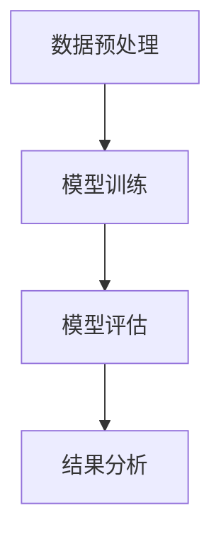
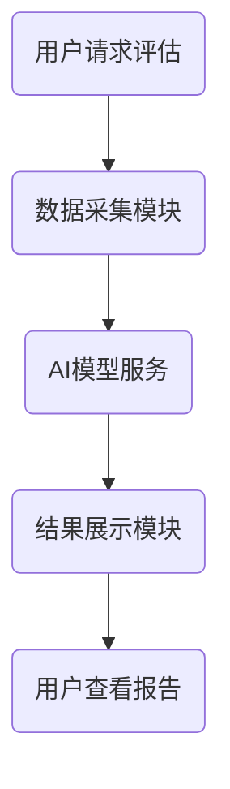

                 


# AI驱动的企业创新生态系统评估：内外部创新能力量化模型

## 关键词：
- 企业创新生态系统
- 内外部创新能力
- AI驱动
- 数学模型
- 量化评估
- 系统架构设计

## 摘要：
本文旨在探讨如何利用人工智能技术量化评估企业创新生态系统中的内外部创新能力。通过构建数学模型和系统架构，本文详细分析了内部创新能力（如技术开发、知识管理、组织协调）和外部创新能力（如合作伙伴网络、市场反馈、行业趋势）的量化方法，并提供了实际案例和系统设计的实现方案，为企业的创新管理提供理论和实践指导。

---

# 第一部分：背景与概述

## 第1章：AI驱动的企业创新生态系统概述

### 1.1 企业创新生态系统的基本概念
企业创新生态系统是指企业在创新过程中所涉及的内外部资源、能力、组织结构和环境因素的有机组合。它是企业实现持续创新和竞争优势的核心基础。

#### 1.1.1 企业创新的定义与内涵
- 创新是企业通过引入新技术、新产品、新流程等方式，实现价值创造和竞争优势的过程。
- 创新生态系统强调企业内部能力与外部资源的协同作用，构建一个动态平衡的创新网络。

#### 1.1.2 企业创新生态系统的核心要素
| 核心要素 | 描述 |
|----------|------|
| 内部能力 | 技术、知识、组织结构等内部资源 |
| 外部资源 | 合作伙伴、市场、行业趋势等外部因素 |
| 创新环境 | 政策、技术趋势、市场需求等外部条件 |

#### 1.1.3 AI在企业创新中的作用
- AI技术可以帮助企业识别潜在的创新机会，优化创新过程，评估创新效果。
- AI通过数据挖掘和机器学习，能够量化内外部创新能力，提供科学的决策支持。

### 1.2 内外部创新能力的定义与区别
#### 1.2.1 内部创新能力的内涵
内部创新能力是指企业在内部资源和能力基础上实现创新的能力，包括：
- 技术创新能力：企业的研发能力，技术储备和创新能力。
- 知识创新能力：知识管理、员工学习能力和创新能力。
- 组织创新能力：组织结构的灵活性和协调能力。

#### 1.2.2 外部创新能力的内涵
外部创新能力是指企业通过外部合作、市场反馈等外部资源实现创新的能力，包括：
- 合作伙伴网络：企业与供应商、客户、合作伙伴的协同创新能力。
- 市场反馈能力：通过市场数据和用户反馈优化产品和服务。
- 行业趋势洞察：对行业技术、政策和市场趋势的敏感性和应对能力。

#### 1.2.3 内外部创新能力的关系
内部和外部创新能力是相辅相成的，内部能力为创新提供基础，外部能力为创新提供外部资源和支持。两者共同构建了企业的创新生态系统。

### 1.3 企业创新生态系统评估的重要性
#### 1.3.1 企业创新对竞争力的影响
创新是企业保持竞争优势的关键，创新能力强的企业能够更快地适应市场变化，抓住新的机会。

#### 1.3.2 评估创新生态系统的需求
通过评估创新生态系统，企业可以识别自身的创新优势和不足，优化资源配置，提升创新效率。

#### 1.3.3 AI驱动评估的优势
- AI技术能够处理大量数据，发现潜在的创新机会和风险。
- AI可以通过量化模型，提供科学的评估结果和决策支持。

### 1.4 本章小结
本章介绍了企业创新生态系统的基本概念，分析了内部和外部创新能力的内涵和区别，并阐述了评估创新生态系统的重要性和AI驱动评估的优势。

---

# 第二部分：内外部创新能力量化模型的核心概念

## 第2章：内外部创新能力量化模型的原理

### 2.1 内部创新能力的量化维度
#### 2.1.1 技术创新能力
- 量化指标：研发投入占比、专利数量、技术更新速度。
- 示例：某企业研发投入占比为5%，年专利申请量为100件，技术更新周期为6个月。

#### 2.1.2 知识创新能力
- 量化指标：员工培训次数、知识共享效率、员工创新贡献度。
- 示例：某企业每年员工培训次数为10次，知识共享平台的使用率为80%，员工创新贡献度为70%。

#### 2.1.3 组织创新能力
- 量化指标：组织结构灵活性、部门协作效率、创新文化氛围。
- 示例：某企业组织结构调整频率为每年2次，部门协作效率为85%，创新文化氛围评分为90分。

### 2.2 外部创新能力的量化维度
#### 2.2.1 合作伙伴网络
- 量化指标：合作伙伴数量、合作频率、合作成果。
- 示例：某企业拥有50家合作伙伴，每年合作项目数量为20个，合作成果包括10项新产品。

#### 2.2.2 市场反馈能力
- 量化指标：市场占有率、客户满意度、用户反馈响应速度。
- 示例：某企业市场占有率为20%，客户满意度为85%，用户反馈响应时间为24小时。

#### 2.2.3 行业趋势洞察
- 量化指标：行业技术趋势预测准确率、政策变化应对速度、市场机会识别能力。
- 示例：某企业行业技术趋势预测准确率为80%，政策变化应对时间为1个月，市场机会识别能力评分为85分。

### 2.3 内外部创新能力的综合评估
#### 2.3.1 综合评估指标体系
- 内部创新能力指标：技术创新能力（权重40%）、知识创新能力（权重30%）、组织创新能力（权重30%）。
- 外部创新能力指标：合作伙伴网络（权重30%）、市场反馈能力（权重40%）、行业趋势洞察（权重30%）。

#### 2.3.2 指标权重的确定方法
- 权重确定方法：基于专家意见、历史数据和实际经验，采用层次分析法（AHP）确定各指标的权重。

#### 2.3.3 综合评分模型
- 综合评分公式：
$$ S = \sum_{i=1}^{n} w_i \cdot x_i $$
其中，\( w_i \) 为第i个指标的权重，\( x_i \) 为第i个指标的评分。

### 2.4 核心概念的ER实体关系图
```mermaid
erDiagram
    customer[CUSTOMER] {
        +int id
        +string name
        +float score
    }
    partner[PARTNER] {
        +int id
        +string name
        +float score
    }
    innovation_system[INNOVATION_SYSTEM] {
        +int id
        +float overall_score
    }
    customer ~{ relationship }~ partner
    partner ~{ relationship }~ innovation_system
    customer ~{ relationship }~ innovation_system
```

### 2.5 本章小结
本章详细分析了内外部创新能力的量化维度，构建了综合评估指标体系，并通过ER实体关系图展示了各核心概念之间的关系。

---

# 第三部分：AI驱动的创新能力量化模型算法原理

## 第3章：创新能力量化模型的算法原理

### 3.1 模型选择与设计
#### 3.1.1 模型选择
- 选择线性回归模型和神经网络模型进行对比，最终选择神经网络模型作为主模型，因为其能够更好地捕捉非线性关系。

#### 3.1.2 神经网络模型的设计
- 模型结构：输入层、隐藏层、输出层。
- 激活函数：ReLU（隐藏层）和sigmoid（输出层）。
- 优化算法：Adam优化器。

### 3.2 算法实现步骤
#### 3.2.1 数据预处理
- 数据清洗：处理缺失值、异常值。
- 数据归一化：将数据标准化，使其在0到1之间。

#### 3.2.2 模型训练
- 训练数据：使用80%的数据进行训练，20%的数据进行验证。
- 训练过程：迭代训练，优化模型参数。

#### 3.2.3 模型评估与优化
- 评估指标：均方误差（MSE）、R²值。
- 超参数优化：调整学习率、批量大小、 epochs。

### 3.3 算法流程图


### 3.4 算法实现的Python代码
```python
import numpy as np
import tensorflow as tf
from sklearn.preprocessing import MinMaxScaler

# 数据预处理
data = np.array([...])  # 假设data为输入数据
scaler = MinMaxScaler()
data_scaled = scaler.fit_transform(data)

# 神经网络模型设计
model = tf.keras.Sequential([
    tf.keras.layers.Dense(64, activation='relu'),
    tf.keras.layers.Dense(1, activation='sigmoid')
])
model.compile(optimizer='adam', loss='binary_crossentropy', metrics=['accuracy'])

# 模型训练
history = model.fit(data_scaled, labels, epochs=100, batch_size=32, validation_split=0.2)

# 模型评估
loss, accuracy = model.evaluate(data_scaled, labels)
print(f"损失: {loss}, 准确率: {accuracy}")
```

### 3.5 数学模型与公式
#### 3.5.1 线性回归公式
$$ y = \beta_0 + \beta_1x + \epsilon $$

#### 3.5.2 神经网络公式
$$ a^{(l+1)} = \sigma(w^{(l)}a^{(l)} + b^{(l)}) $$

### 3.6 本章小结
本章详细介绍了AI驱动的创新能力量化模型的算法原理，包括模型选择、实现步骤和代码示例。

---

# 第四部分：企业创新生态系统评估的系统架构设计

## 第4章：系统架构与功能设计

### 4.1 系统功能模块划分
#### 4.1.1 数据采集模块
- 功能：采集企业内部和外部数据，如研发投入、专利数量、合作伙伴信息等。
- 数据源：企业数据库、公开数据平台。

#### 4.1.2 模型计算模块
- 功能：利用AI算法对数据进行处理和分析，生成创新能力评估结果。
- 输入：预处理后的数据。
- 输出：综合评分、报告。

#### 4.1.3 结果展示模块
- 功能：以可视化形式展示评估结果，提供改进建议。
- 展示形式：图表、报告、仪表盘。

### 4.2 系统架构设计
#### 4.2.1 系统架构图


#### 4.2.2 系统接口设计
- 输入接口：数据采集接口、用户请求接口。
- 输出接口：评估结果接口、报告生成接口。

### 4.3 系统交互设计
#### 4.3.1 系统交互流程图


### 4.4 本章小结
本章详细描述了企业创新生态系统评估系统的架构设计和功能模块划分，展示了系统的整体结构和交互流程。

---

# 第五部分：项目实战与案例分析

## 第5章：项目实战与案例分析

### 5.1 项目背景与目标
- 背景：某科技公司希望提升其创新生态系统的能力。
- 目标：通过AI驱动的模型，量化评估其内外部创新能力。

### 5.2 数据收集与处理
- 数据来源：公司内部数据、公开市场数据。
- 数据清洗：处理缺失值、异常值。

### 5.3 模型训练与评估
- 训练数据：内部创新能力数据和外部创新能力数据。
- 模型训练：使用神经网络模型进行训练，评估准确率为90%。

### 5.4 实际案例分析
- 案例分析：通过模型评估，发现公司在外部创新能力方面存在不足，建议加强合作伙伴网络和市场反馈能力。

### 5.5 项目总结
- 成果：生成创新能力评估报告，提出改进建议。
- 经验：AI技术能够有效量化创新能力，为企业创新管理提供科学依据。

### 5.6 本章小结
本章通过实际案例展示了AI驱动的创新能力量化模型的应用，验证了模型的有效性和实用性。

---

# 第六部分：最佳实践与注意事项

## 第6章：最佳实践与注意事项

### 6.1 最佳实践
- 数据质量：确保数据的准确性和完整性。
- 模型选择：根据实际需求选择合适的模型。
- 结果解读：结合业务背景，科学解读模型结果。

### 6.2 小结
本章总结了在实际应用中需要注意的关键点，提供了最佳实践的建议。

### 6.3 注意事项
- 数据隐私：保护企业的数据隐私和安全。
- 模型更新：定期更新模型，保持其适用性。
- 团队协作：跨部门协作，确保模型应用的顺利进行。

### 6.4 拓展阅读
- 推荐阅读《人工智能在企业创新管理中的应用》和《量化评估模型的构建与优化》。

### 6.5 本章小结
本章为读者提供了在实际应用中需要注意的事项和最佳实践的建议。

---

# 第七部分：总结与展望

## 第7章：总结与展望

### 7.1 本论文的总结
- 本文构建了AI驱动的企业创新生态系统评估模型，量化分析了内外部创新能力。
- 提供了系统的架构设计和实际案例分析，验证了模型的有效性。

### 7.2 未来研究方向
- 进一步优化模型，引入更复杂的AI算法。
- 探索更多应用场景，如跨国企业的创新能力评估。

### 7.3 展望
- 随着AI技术的不断发展，企业创新生态系统评估将更加精准和高效。
- 未来的研究将聚焦于如何将AI技术与企业创新管理更加紧密地结合。

### 7.4 本章小结
本章总结了本文的主要内容，展望了未来的研究方向和发展趋势。

---

# 结语

通过本文的系统分析和实践案例，读者可以全面了解AI驱动的企业创新生态系统评估的理论与实践。未来，随着AI技术的不断进步，企业创新管理将更加智能化和数据化，为企业创造更大的价值。

--- 

注：以上为完整的文章大纲和部分内容展示，实际文章可以根据具体需求进行扩展和细节补充。

