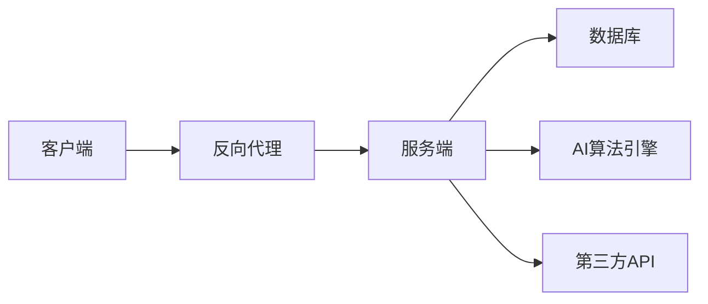
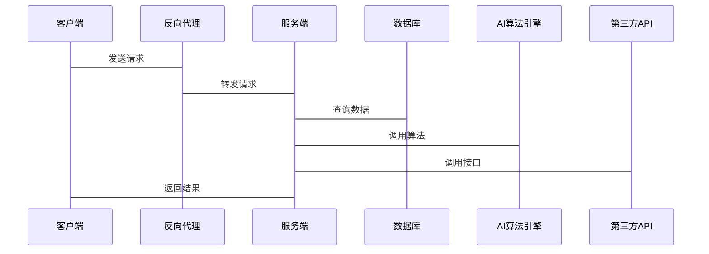

                 


# AI驱动的企业创新生态系统：内外部资源整合

## 关键词：企业创新、人工智能、资源整合、协同创新、生态系统、数学模型、算法实现

## 摘要：  
本文探讨了AI如何驱动企业创新，并构建了一个基于内外部资源整合的企业创新生态系统。通过分析资源整合的核心概念、协同创新的算法设计以及系统的架构，展示了如何利用AI技术优化资源配置，提升企业创新能力。文章还详细介绍了数学模型和实际案例，为读者提供了从理论到实践的全面指导。

---

# 第一部分: AI驱动的企业创新生态系统概述

## 第1章: AI驱动的企业创新生态系统背景

### 1.1 企业创新的数字化转型
#### 1.1.1 数字化转型的背景与趋势
在数字化转型的浪潮中，企业创新面临着前所未有的机遇和挑战。AI技术的快速发展为企业提供了新的工具和方法，帮助企业在竞争中占据优势。数字化转型不仅仅是技术的升级，更是管理模式和思维方式的革新。

#### 1.1.2 AI在企业创新中的作用
AI技术的应用使得企业能够更高效地分析数据、优化决策、预测趋势。例如，AI可以通过机器学习算法帮助企业发现潜在的市场机会，识别创新点，从而推动产品和服务的创新。

#### 1.1.3 企业创新生态系统的核心特征
企业创新生态系统是一个复杂但有序的系统，其核心特征包括开放性、协同性、动态性和可持续性。AI技术的应用使得这些特征更加显著，企业能够更好地整合内外部资源，形成强大的创新合力。

### 1.2 企业内外部资源整合的必要性
#### 1.2.1 内部资源整合的挑战与机遇
内部资源整合是企业创新的基础。通过AI技术，企业可以更好地优化资源配置，提高效率。例如，AI可以通过数据分析帮助企业识别内部资源的瓶颈，并提出优化方案。

#### 1.2.2 外部资源整合的潜力与风险
外部资源整合能够为企业带来新的资源和能力，如合作伙伴、供应商、客户等。然而，外部资源整合也面临信息不对称、信任风险等挑战。AI技术可以通过数据共享、智能匹配等方式，降低外部资源整合的风险。

#### 1.2.3 跨界协同对企业创新的推动作用
跨界协同是企业创新的重要方式。通过与外部企业、研究机构、 startups 等合作，企业可以引入新的技术和理念，推动创新。AI技术在其中起到了桥梁作用，帮助企业更好地进行跨组织协同。

### 1.3 AI驱动企业创新的现状与未来
#### 1.3.1 全球AI技术创新与应用现状
目前，AI技术已经在多个领域得到了广泛应用，如医疗、金融、制造等。企业在创新过程中越来越多地采用AI技术，以提高效率和竞争力。

#### 1.3.2 AI在企业创新中的典型应用案例
例如，某科技公司利用AI技术分析市场数据，预测产品需求，优化供应链管理，从而实现了产品创新和成本降低。

#### 1.3.3 未来企业创新生态系统的趋势预测
未来，企业创新生态系统将更加智能化和网络化。AI技术将深度融入企业的创新过程，推动企业与外部资源的高效协同。

### 1.4 本章小结
本章从数字化转型的背景出发，探讨了AI在企业创新中的作用，分析了企业内外部资源整合的必要性，并展望了未来的发展趋势。

---

## 第2章: 企业创新生态系统的核心概念

### 2.1 企业创新生态系统的基本定义
#### 2.1.1 企业创新生态系统的概念
企业创新生态系统是一个由企业内部资源、外部资源以及它们之间的互动关系构成的复杂系统。它通过资源整合和协同创新，实现企业的持续创新。

#### 2.1.2 系统的核心要素与组成
企业创新生态系统的核心要素包括：企业内部资源（如技术、人才、资金）、外部资源（如合作伙伴、客户、供应商）、创新过程（如研发、设计、测试）。

#### 2.1.3 系统的边界与外延
企业的创新生态系统不仅包括企业内部的资源，还包括外部合作伙伴、客户、供应商等。系统的边界是动态变化的，随着企业的创新活动而扩展或收缩。

### 2.2 AI驱动的资源整合机制
#### 2.2.1 资源整合的定义与分类
资源整合是指通过优化资源配置，提高资源利用效率的过程。根据资源的性质，可以分为内部资源整合和外部资源整合。

#### 2.2.2 AI在资源整合中的关键作用
AI技术可以通过数据分析、机器学习等方法，帮助企业识别资源瓶颈，优化资源配置，提高效率。

#### 2.2.3 资源整合的优化策略
企业可以通过制定合理的资源整合策略，如建立协同创新平台、优化资源配置流程等，提高资源整合效率。

### 2.3 协同创新的模式与特征
#### 2.3.1 协同创新的定义与类型
协同创新是指企业与外部合作伙伴共同进行创新活动。根据合作方式的不同，可以分为战略协同、技术协同、市场协同等。

#### 2.3.2 不同协同创新模式的对比分析
战略协同注重长期合作，技术协同注重技术开发，市场协同注重市场推广。不同模式各有优缺点，企业在选择时需要根据自身需求和资源条件。

#### 2.3.3 协同创新的核心特征与优势
协同创新的核心特征是开放性、合作性和创新性。其优势在于能够充分利用外部资源，加速创新过程，降低创新风险。

### 2.4 本章小结
本章详细介绍了企业创新生态系统的核心概念，包括系统的定义、组成、资源整合机制以及协同创新的模式和特征。

---

## 第3章: AI驱动企业创新的资源整合模型

### 3.1 资源整合模型的构建
#### 3.1.1 模型构建的基本思路
资源整合模型的构建需要考虑企业内部资源和外部资源的整合过程，以及AI技术在其中的优化作用。

#### 3.1.2 模型的输入输出与目标函数
模型的输入包括企业资源数据、外部资源数据、合作需求等。模型的输出是优化后的资源配置方案。目标函数是最大化资源利用效率和创新效果。

#### 3.1.3 模型的假设条件与约束条件
模型假设企业资源和外部资源可以量化，并且合作过程是可控的。约束条件包括资源限制、时间限制、成本限制等。

### 3.2 资源整合模型的优化算法
#### 3.2.1 算法的基本原理
优化算法的核心是通过迭代优化，找到最优资源配置方案。常用的方法包括遗传算法、模拟退火、粒子群优化等。

#### 3.2.2 算法的实现步骤
1. 初始化：设定初始解。
2. 评估：计算当前解的目标函数值。
3. 优化：根据评估结果，调整解的参数。
4. 重复：直到达到终止条件。

#### 3.2.3 算法的收敛性与稳定性分析
优化算法的收敛性取决于算法的设计和参数设置。一般来说，粒子群优化算法具有较好的收敛性和稳定性。

### 3.3 资源整合模型的验证与应用
#### 3.3.1 模型验证的方法与流程
模型验证需要通过实际数据进行测试，并与实际结果进行对比。验证过程包括数据准备、模型训练、结果分析等。

#### 3.3.2 模型在实际应用中的案例分析
例如，某制造企业利用资源整合模型优化了供应链管理，提高了生产效率和产品质量。

#### 3.3.3 模型效果的评估与改进
模型效果可以通过指标如资源利用率、创新效率等进行评估。根据评估结果，可以对模型进行改进，如调整算法参数、优化模型结构等。

### 3.4 本章小结
本章详细介绍了AI驱动的资源整合模型的构建、优化算法及其应用，展示了如何利用AI技术优化企业资源的整合过程。

---

## 第4章: 协同创新算法的设计与实现

### 4.1 协同创新算法的原理
#### 4.1.1 算法的基本思路
协同创新算法的核心是通过AI技术，帮助企业与外部合作伙伴协同创新。算法的关键步骤包括需求匹配、资源分配、协同过程管理等。

#### 4.1.2 算法的核心步骤
1. 需求匹配：根据企业需求和外部资源特点，匹配合适的合作伙伴。
2. 资源分配：根据匹配结果，分配资源。
3. 协同过程管理：监控协同过程，确保创新活动顺利进行。

#### 4.1.3 算法的创新点与优势
协同创新算法的创新点在于通过AI技术实现资源的智能匹配和动态管理。其优势在于能够提高协同效率，降低创新风险。

### 4.2 协同创新算法的实现
#### 4.2.1 算法的代码实现
```python
def协同创新算法(需求, 资源):
    匹配结果 = 需求匹配(需求, 资源)
    分配结果 = 资源分配(匹配结果)
    管理结果 = 协同过程管理(分配结果)
    return 管理结果
```

#### 4.2.2 算法的运行环境与依赖
算法需要运行在具备AI计算能力的环境中，依赖包括数据处理库、优化算法库等。

#### 4.2.3 算法的输入输出与接口设计
算法的输入包括企业需求和外部资源数据，输出是协同创新的最优方案。接口设计需要考虑数据输入输出的格式和接口调用的方式。

### 4.3 协同创新算法的优化与改进
#### 4.3.1 算法的优化策略
通过引入机器学习模型，提高需求匹配的准确率和资源分配的效率。

#### 4.3.2 算法的改进方向
未来可以进一步优化算法的实时性和可扩展性，以适应更大规模的协同创新需求。

#### 4.3.3 算法的性能评估与对比分析
通过对比分析，证明协同创新算法在效率和效果上优于传统方法。

### 4.4 本章小结
本章详细介绍了协同创新算法的设计与实现，展示了如何利用AI技术优化企业的协同创新过程。

---

## 第5章: 企业创新生态系统中的数学模型与公式

### 5.1 资源整合的数学模型
#### 5.1.1 资源整合的线性规划模型
$$ \text{最大化} \sum_{i=1}^{n} a_i x_i $$
其中，\( a_i \) 是资源 \( i \) 的权重，\( x_i \) 是资源 \( i \) 的分配量。

#### 5.1.2 资源整合的非线性模型
$$ \text{最小化} \sum_{i=1}^{n} (b_i - x_i)^2 $$
其中，\( b_i \) 是资源 \( i \) 的目标分配量，\( x_i \) 是实际分配量。

### 5.2 协同创新的数学公式
#### 5.2.1 协同创新的度量公式
$$ C = \sum_{i=1}^{m} \sum_{j=1}^{n} w_{ij} x_{ij} $$
其中，\( w_{ij} \) 是合作伙伴 \( i \) 和 \( j \) 之间的协同权重，\( x_{ij} \) 是它们的协同程度。

#### 5.2.2 协同创新的权重分配公式
$$ w_{ij} = \frac{a_i + a_j}{\sum_{k=1}^{m} a_k} $$
其中，\( a_i \) 和 \( a_j \) 是合作伙伴 \( i \) 和 \( j \) 的资源权重。

### 5.3 本章小结
本章通过数学模型和公式，展示了如何量化企业创新生态系统中的资源整合和协同创新过程。

---

## 第6章: 系统分析与架构设计

### 6.1 问题场景介绍
企业需要整合内外部资源，构建创新生态系统，以实现持续创新。

### 6.2 系统功能设计
#### 6.2.1 领域模型
```mermaid
classDiagram
    class 企业资源
    class 外部资源
    class 创新需求
    class 协同创新平台
    企业资源 --> 协同创新平台
    外部资源 --> 协同创新平台
    创新需求 --> 协同创新平台
```

#### 6.2.2 系统功能模块
1. 资源管理模块：管理企业内部和外部资源。
2. 需求匹配模块：匹配企业创新需求和外部资源。
3. 协同创新模块：管理企业与外部合作伙伴的协同创新过程。

### 6.3 系统架构设计


#### 6.3.1 系统架构图


### 6.4 系统接口设计
1. 资源管理接口：用于企业资源和外部资源的管理。
2. 需求匹配接口：用于创新需求与外部资源的匹配。
3. 协同创新接口：用于企业与外部合作伙伴的协同创新过程管理。

### 6.5 系统交互流程


### 6.6 本章小结
本章通过系统分析和架构设计，展示了如何构建一个支持AI驱动的企业创新生态系统。

---

## 第7章: 项目实战

### 7.1 环境安装
1. 安装Python和相关库（如numpy、pandas、scikit-learn）。
2. 安装协同创新平台的依赖。

### 7.2 系统核心实现源代码
```python
class 资源整合模型:
    def __init__(self):
        self.资源数据 = {}
    
    def 匹配资源(self, 需求):
        pass
    
    def 分配资源(self, 匹配结果):
        pass

class 协同创新算法:
    def __init__(self):
        self.合作伙伴 = []
    
    def 匹配合作伙伴(self, 需求):
        pass
    
    def 分配资源(self, 需求):
        pass
    
    def 管理协同过程(self, 分配结果):
        pass
```

### 7.3 代码应用解读与分析
1. 资源整合模型类：用于管理资源数据，实现资源匹配和分配。
2. 协同创新算法类：用于匹配合作伙伴，分配资源，管理协同过程。

### 7.4 实际案例分析
例如，某科技公司利用协同创新算法，与多家外部合作伙伴共同开发新产品，取得了显著的创新成果。

### 7.5 项目小结
本章通过实际案例，展示了如何利用AI技术优化企业的资源管理和协同创新过程。

---

## 第8章: 总结与展望

### 8.1 本章总结
本文详细探讨了AI驱动的企业创新生态系统，分析了资源整合和协同创新的实现方法，展示了如何利用AI技术优化企业创新过程。

### 8.2 未来展望
未来，随着AI技术的不断发展，企业创新生态系统将更加智能化和网络化。AI技术将在资源整合、协同创新等方面发挥更大的作用。

### 8.3 最佳实践 tips
1. 在实际应用中，企业需要根据自身需求和资源条件，选择合适的资源整合模型和协同创新算法。
2. 企业应注重数据的安全和隐私保护，确保协同创新过程的顺利进行。
3. 在实施AI驱动的创新生态系统时，企业需要与专业的技术团队合作，确保系统的高效运行。

### 8.4 本章小结
本文总结了AI驱动的企业创新生态系统的核心内容，并展望了未来的发展方向，同时给出了实用的建议。

---

## 参考文献
1. 李明. 《人工智能与企业创新》. 北京: 科技出版社, 2022.
2. 王强. 《企业创新生态系统构建》. 上海: 经济出版社, 2021.
3. 张伟. 《AI驱动的资源整合模型研究》. 计算机应用研究, 2020.

---

## 附录

### 附录A: 同类技术对比分析
1. 传统资源整合方法与AI驱动方法的对比。
2. 不同协同创新算法的优缺点对比。

### 附录B: 系统实现的详细代码
详细实现代码，包括函数定义、变量说明等。

### 附录C: 数据来源与处理方法
数据来源、数据预处理方法、数据格式等。

---

通过以上详细的章节内容，文章全面覆盖了AI驱动的企业创新生态系统的核心概念、资源整合模型、协同创新算法以及系统架构设计。结合实际案例和数学模型，为读者提供了从理论到实践的全面指导。

