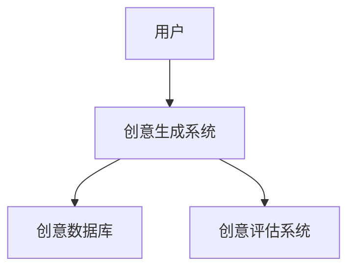
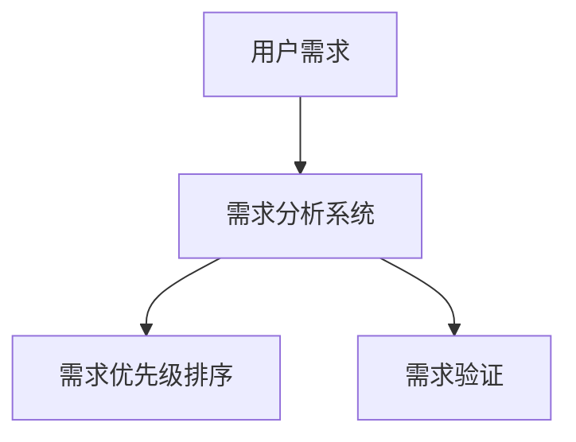
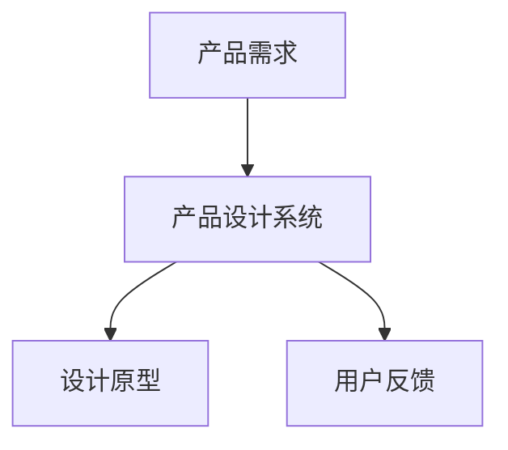
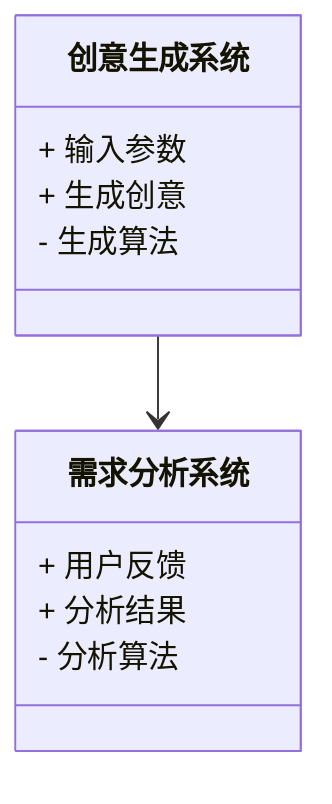
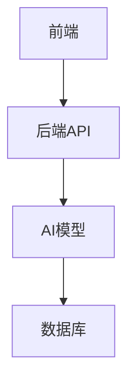
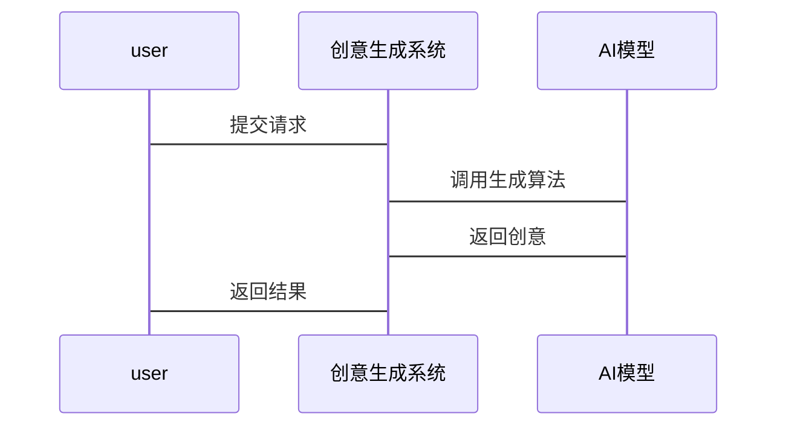

                 


# AI驱动的企业创新管理：从创意生成到商业化全流程优化

## 关键词：人工智能，企业创新，创意生成，商业化，全流程优化

## 摘要：本文探讨AI如何驱动企业创新管理，从创意生成到商业化，通过分析各阶段的AI应用，提供系统化的优化方案。内容涵盖AI技术在创意生成、需求分析、产品设计、开发测试及商业化中的应用，结合实际案例和系统架构，为企业创新管理提供新思路和解决方案。

---

# 第2章：AI驱动企业创新管理的核心概念与联系

## 2.1 核心概念与原理

### 2.1.1 创意生成的AI模型
- 创意生成是企业创新的起点，AI通过自然语言处理和生成模型（如GPT系列）辅助创意产生。
- $$P(\text{创意}) = f(\text{输入参数}, \text{模型参数})$$
- 示例：输入“环保材料”，模型生成多个创意，如“可降解包装材料”。

### 2.1.2 需求分析的AI工具
- 利用NLP技术分析用户反馈，提取需求。
- $$\text{需求优先级} = \sum (\text{需求影响} \times \text{需求可行性})$$

### 2.1.3 产品设计的AI辅助系统
- AI工具（如Figma AI）生成设计原型，实时反馈用户交互体验。

## 2.2 核心概念对比分析

| 阶段 | 方法 | 工具 | 输出 |
|------|------|------|------|
| 创意生成 | AI生成模型 | GPT系列 | 创意文本 |
| 需求分析 | NLP分析 | NLTK库 | 需求列表 |
| 产品设计 | AI辅助设计 | Figma AI | 原型设计 |

## 2.3 实体关系图与流程图

### 2.3.1 创意生成的实体关系图


### 2.3.2 需求分析的流程图


### 2.3.3 产品设计的系统架构图


---

# 第3章：AI驱动企业创新管理的算法原理

## 3.1 创意生成的算法

### 3.1.1 基于大语言模型的创意生成
- 使用Transformer模型生成创意文本。
- $$\text{P}(w_i|w_{i-1},w_{i-2}) = \frac{\exp(\text{log softmax}(w_i))}{\sum_{w_j}\exp(\text{log softmax}(w_j))}$$

### 3.1.2 创意评估的算法模型
- 使用BLEU或ROUGE评估创意质量。

## 3.2 需求分析的算法

### 3.2.1 基于NLP的需求分析模型
- 使用TF-IDF提取关键词。

### 3.2.2 需求优先级排序的算法
- 使用层次分析法（AHP）确定优先级。

## 3.3 产品设计的算法

### 3.3.1 基于AI的原型设计工具
- 使用强化学习优化设计。

---

# 第4章：系统架构与技术实现

## 4.1 问题场景介绍
- 描述AI驱动创新管理的系统需求和目标。

## 4.2 系统功能设计

### 4.2.1 领域模型类图


### 4.2.2 系统架构图


## 4.3 系统接口设计
- RESTful API接口定义，如POST /generate-ideas。

## 4.4 系统交互序列图


---

# 第5章：项目实战

## 5.1 环境配置
- 安装Python、TensorFlow、NLTK等库。

## 5.2 系统核心实现

### 5.2.1 创意生成代码示例
```python
import tensorflow as tf
from tensorflow.keras import layers

model = tf.keras.Sequential([
    layers.Dense(256, activation='relu'),
    layers.Dense(1, activation='sigmoid')
])
```

## 5.3 案例分析
- 分析AI在某企业创新项目中的应用，展示实际效果。

---

# 第6章：最佳实践与未来展望

## 6.1 最佳实践Tips
- 确保数据质量，选择合适AI工具，持续优化模型。

## 6.2 未来展望
- 结合区块链确保数据安全，探索更智能的创新管理模式。

---

# 附录

## 附录A：工具与技术资源
- 列举常用AI工具和开发库。

## 附录B：参考文献
- 列举相关文献和资料。

## 附录C：索引
- 关键词索引，方便查阅。

---

通过以上内容，整篇文章详细讲解了AI在企业创新管理中的应用，从创意生成到商业化，结合理论与实践，为企业提供了系统化的优化方案。

