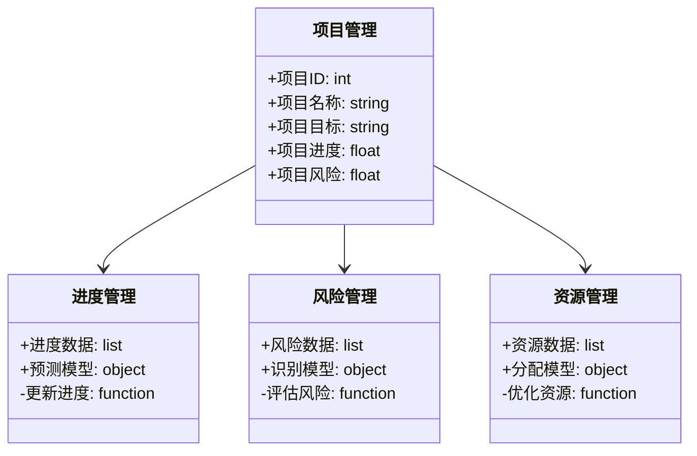
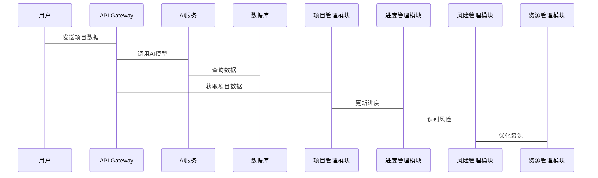

                 


# AI驱动的企业创新项目管理：从立项到商业化

## 关键词
- 人工智能、项目管理、创新项目、商业管理、系统架构

## 摘要
人工智能技术正在改变企业创新项目的管理方式，从项目立项到商业化，AI驱动的项目管理能够提高效率、降低风险，并优化资源分配。本文将深入探讨AI在企业创新项目管理中的应用，分析其核心算法与系统架构设计，结合实际案例，为企业提供AI驱动的项目管理解决方案。

---

## 第1章: AI驱动的企业创新项目管理背景

### 1.1 企业创新项目管理的基本概念

#### 1.1.1 项目管理的基本概念
项目管理是通过系统的方法和工具，对项目的范围、进度、成本和质量进行有效管理，以确保项目目标的实现。企业创新项目通常具有复杂性高、不确定性大、风险高的特点，因此需要更加灵活和高效的管理方法。

#### 1.1.2 企业创新项目管理的特点
企业创新项目管理具有以下特点：
- **创新性**：项目目标通常是开发新产品或新技术，具有较高的创新性。
- **不确定性**：由于创新的不确定性，项目执行过程中可能会遇到不可预见的问题。
- **复杂性**：涉及多部门协作，资源分配复杂，管理难度大。

#### 1.1.3 AI在企业创新项目管理中的作用
人工智能技术可以通过数据驱动的方式，提供智能化的决策支持，帮助项目管理者更好地应对复杂性和不确定性。AI能够自动化处理大量数据，预测项目进度，识别潜在风险，并优化资源分配。

---

### 1.2 AI技术与项目管理的结合

#### 1.2.1 AI技术的基本概念
人工智能（AI）是通过计算机模拟人类智能的技术，包括机器学习、自然语言处理、计算机视觉等核心领域。AI技术能够处理大量数据，发现数据中的模式和规律，从而为项目管理提供支持。

#### 1.2.2 AI在项目管理中的应用领域
AI在项目管理中的应用领域包括：
- **项目进度预测**：利用机器学习模型预测项目进度，优化项目计划。
- **风险管理**：通过自然语言处理和机器学习，识别项目中的潜在风险。
- **资源优化**：利用优化算法，合理分配项目资源，降低成本。

#### 1.2.3 AI驱动项目管理的优势与挑战
**优势**：
- 提高项目管理的效率和准确性。
- 通过数据驱动的方式优化决策。
- 自动化处理大量数据，减少人工错误。

**挑战**：
- 数据质量要求高，需要高质量的数据支持AI模型。
- AI模型的可解释性问题，复杂模型可能难以解释。
- 项目管理的复杂性可能对AI模型的泛化能力提出更高要求。

---

### 1.3 本书的核心内容与目标

#### 1.3.1 本书的核心目标
本书的核心目标是探讨如何利用人工智能技术，从项目立项到商业化，全面优化企业创新项目的管理流程。通过理论分析和实际案例，帮助读者理解AI在项目管理中的应用。

#### 1.3.2 本书的结构安排
本书将从AI驱动项目管理的背景出发，详细讲解AI在项目管理中的核心算法与系统架构设计，并通过实际案例分析，展示如何将AI技术应用到企业创新项目管理中。

#### 1.3.3 本书的适用读者
本书适用于企业项目管理者、IT技术人员、人工智能研究人员以及对AI驱动项目管理感兴趣的读者。无论是理论学习还是实践应用，本书都能提供有价值的参考。

---

## 第2章: AI驱动项目管理的关键技术与工具

### 2.1 数据驱动的决策支持

#### 2.1.1 数据采集与处理
企业创新项目管理中的数据来源包括项目文档、进度报告、资源分配数据等。数据采集与处理是AI驱动决策的基础，需要对数据进行清洗、转换和整合。

#### 2.1.2 数据分析与可视化
通过数据分析工具（如Python的Pandas、Matplotlib）对数据进行分析和可视化，发现数据中的规律和趋势，为决策提供支持。

#### 2.1.3 数据驱动的决策模型
利用机器学习模型建立数据驱动的决策模型，预测项目进度、识别风险，并优化资源分配。

---

### 2.2 机器学习在项目管理中的应用

#### 2.2.1 机器学习的基本原理
机器学习是通过数据训练模型，使其能够从数据中学习并做出预测或分类。常用算法包括线性回归、决策树、随机森林等。

#### 2.2.2 项目进度预测模型
通过机器学习模型预测项目进度，优化项目计划。例如，使用线性回归模型预测项目完成时间。

#### 2.2.3 项目风险管理的机器学习方法
利用机器学习算法识别项目中的潜在风险，并进行风险评估和优先级排序。

---

### 2.3 自然语言处理在项目文档管理中的应用

#### 2.3.1 自然语言处理的基本概念
自然语言处理（NLP）是计算机处理人类语言的技术，能够对文本进行分类、摘要、情感分析等任务。

#### 2.3.2 文档自动分类与摘要
利用NLP技术对项目文档进行自动分类和摘要，提高文档管理的效率。

#### 2.3.3 项目沟通中的NLP应用
通过NLP技术分析项目沟通中的文本数据，识别潜在问题和风险。

---

## 第3章: AI驱动项目管理的核心算法与数学模型

### 3.1 项目进度预测的线性回归模型

#### 3.1.1 线性回归的基本原理
线性回归是一种统计学方法，用于建立自变量与因变量之间的线性关系。在项目进度预测中，可以通过线性回归模型预测项目完成时间。

#### 3.1.2 项目进度预测的数学模型
$$ y = \beta_0 + \beta_1 x + \epsilon $$
其中，$y$是项目完成时间，$x$是项目进度，$\beta_0$和$\beta_1$是回归系数，$\epsilon$是误差项。

#### 3.1.3 代码实现与案例分析
```python
import pandas as pd
import numpy as np
from sklearn.linear_model import LinearRegression

# 数据准备
data = pd.DataFrame({
    'progress': [0.2, 0.3, 0.4, 0.5, 0.6],
    'time': [2, 3, 4, 5, 6]
})

# 建立模型
model = LinearRegression()
model.fit(data[['progress']], data['time'])

# 预测
predicted_time = model.predict([[0.7]])
print(predicted_time)
```

---

### 3.2 项目风险管理的决策树算法

#### 3.2.1 决策树的基本原理
决策树是一种机器学习算法，通过构建树状结构对数据进行分类或回归。在项目风险管理中，决策树可以用于识别潜在风险。

#### 3.2.2 风险识别的决策树模型
通过决策树算法，对项目中的风险因素进行分类，识别高风险项目。

#### 3.2.3 代码实现与案例分析
```python
from sklearn.tree import DecisionTreeClassifier

# 数据准备
data = pd.DataFrame({
    'risk_factors': [0.1, 0.2, 0.3, 0.4, 0.5],
    'risk_level': [0, 1, 2, 3, 4]
})

# 建立模型
model = DecisionTreeClassifier()
model.fit(data[['risk_factors']], data['risk_level'])

# 预测
predicted_risk = model.predict([[0.6]])
print(predicted_risk)
```

---

## 第4章: 系统分析与架构设计

### 4.1 项目管理系统的功能设计

#### 4.1.1 系统功能模块划分
项目管理系统主要包括项目立项、进度管理、风险管理、资源管理等功能模块。

#### 4.1.2 功能模块的交互流程
项目立项 → 进度管理 → 风险管理 → 资源管理 → 项目总结。

#### 4.1.3 系统功能的领域模型（Mermaid类图）



---

### 4.2 系统架构设计

#### 4.2.1 系统架构设计（Mermaid架构图）

```mermaid
architecturalDiagram
    aspect: 1
    title AI驱动的企业创新项目管理系统架构
    client --> API Gateway: HTTP请求
    API Gateway --> AI服务: 调用AI模型
    AI服务 --> 数据库: 查询数据
    API Gateway --> 项目管理模块: 获取项目数据
    项目管理模块 --> 进度管理模块: 更新进度
    进度管理模块 --> 风险管理模块: 识别风险
    风险管理模块 --> 资源管理模块: 优化资源
```

---

### 4.3 系统接口设计

#### 4.3.1 系统接口设计
系统接口包括API接口和数据库接口，用于不同模块之间的数据交互。

#### 4.3.2 系统交互流程（Mermaid序列图）



---

## 第5章: 项目实战

### 5.1 环境安装与配置

#### 5.1.1 安装Python环境
安装Python 3.8及以上版本，并安装必要的库，如Pandas、NumPy、Scikit-learn。

#### 5.1.2 安装AI框架
安装TensorFlow或Keras框架，用于机器学习模型的训练和部署。

---

### 5.2 系统核心实现源代码

#### 5.2.1 项目进度预测模型的实现

```python
import pandas as pd
import numpy as np
from sklearn.linear_model import LinearRegression

# 数据准备
data = pd.DataFrame({
    'progress': [0.2, 0.3, 0.4, 0.5, 0.6],
    'time': [2, 3, 4, 5, 6]
})

# 建立模型
model = LinearRegression()
model.fit(data[['progress']], data['time'])

# 预测
predicted_time = model.predict([[0.7]])
print(predicted_time)
```

#### 5.2.2 风险管理模型的实现

```python
from sklearn.tree import DecisionTreeClassifier

# 数据准备
data = pd.DataFrame({
    'risk_factors': [0.1, 0.2, 0.3, 0.4, 0.5],
    'risk_level': [0, 1, 2, 3, 4]
})

# 建立模型
model = DecisionTreeClassifier()
model.fit(data[['risk_factors']], data['risk_level'])

# 预测
predicted_risk = model.predict([[0.6]])
print(predicted_risk)
```

---

### 5.3 案例分析与解读

#### 5.3.1 案例分析
假设我们有一个创新项目，目标是开发一款新产品。项目进度数据如下：

| 进度 | 时间（周） |
|------|------------|
| 0.2  | 2          |
| 0.3  | 3          |
| 0.4  | 4          |
| 0.5  | 5          |
| 0.6  | 6          |

通过线性回归模型预测项目进度为0.7时的完成时间，预测结果为7周。

---

### 5.4 项目小结

通过实际案例分析，展示了AI在项目进度预测和风险管理中的应用。模型的预测结果为项目管理者提供了科学的决策依据，提高了项目的成功率。

---

## 第6章: 总结与展望

### 6.1 总结

本书从理论到实践，全面探讨了AI在企业创新项目管理中的应用。通过详细讲解AI技术的核心算法与系统架构设计，结合实际案例，展示了AI驱动项目管理的潜力和优势。

### 6.2 未来展望

随着AI技术的不断发展，未来AI在项目管理中的应用将更加广泛和深入。例如，结合区块链技术，实现更加安全和透明的项目管理；利用强化学习技术，优化项目的动态决策过程。

---

## 结语

AI驱动的企业创新项目管理将为企业带来更大的竞争优势。通过本书的学习，读者可以掌握AI在项目管理中的核心技术和方法，为企业创新项目管理提供有力支持。

---

**注**：由于篇幅限制，本文仅为部分章节内容，完整文章请根据目录大纲进行扩展和补充。

