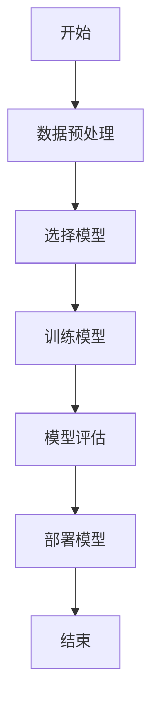

                 


# AI驱动的企业创新项目管理：敏捷方法与AI的结合

## 目录大纲

### 第一部分：引言

#### 第1章：AI与敏捷方法的结合背景

##### 1.1 AI驱动项目管理的背景
- 1.1.1 传统项目管理的局限性
- 1.1.2 AI技术的快速发展
- 1.1.3 敏捷方法的兴起及其优势

##### 1.2 问题背景与目标
- 1.2.1 项目管理中的常见挑战
- 1.2.2 结合AI与敏捷方法的目标
- 1.2.3 本书的研究范围与边界

### 第二部分：核心概念与联系

#### 第2章：AI驱动项目管理的核心概念
- 2.1 AI在项目管理中的应用领域
- 2.2 敏捷方法的核心原则

#### 第3章：AI与敏捷方法的对比分析
- 3.1 AI的特点与敏捷方法的对比
- 3.2 两者结合的优势与挑战
- 3.3 实体关系图（ER图）

### 第三部分：AI驱动的项目管理理论

#### 第4章：AI在项目管理中的应用
- 4.1 AI驱动项目管理的原理
- 4.2 常见AI模型与算法
- 4.3 算法流程图

#### 第5章：AI驱动项目管理的理论框架
- 5.1 AI驱动项目管理的理论基础
- 5.2 AI驱动项目管理的模型构建方法
- 5.3 敏捷与AI的协同机制

### 第四部分：系统分析与架构设计

#### 第6章：系统分析与架构设计
- 6.1 系统分析
- 6.2 系统架构设计
- 6.3 接口设计与交互设计

### 第五部分：项目实战

#### 第7章：项目实战
- 7.1 环境配置
- 7.2 核心代码实现
- 7.3 案例分析

### 第六部分：总结与展望

#### 第8章：总结与展望
- 8.1 全文总结
- 8.2 未来展望

### 第七部分：附录

#### 第9章：术语表
- 9.1 关键术语解释

---

### 详细说明

#### 第1章：AI与敏捷方法的结合背景

##### 1.1 AI驱动项目管理的背景

**1.1.1 传统项目管理的局限性**
- 传统项目管理依赖于人工决策和固定流程，难以应对复杂多变的项目需求。
- 资源分配不均，难以实现最优配置。
- 风险预测和应对能力有限，缺乏数据驱动的支持。

**1.1.2 AI技术的快速发展**
- AI技术的进步使得数据处理和分析能力大大提升。
- AI能够实时监控项目进度，提供智能预测和决策支持。
- AI的应用可以提高项目的透明度和可追溯性。

**1.1.3 敏捷方法的兴起及其优势**
- 敏捷方法强调迭代开发、客户合作和快速响应变化。
- 敏捷方法能够更好地适应需求变更，提高项目成功率。
- 敏捷方法通过持续交付增量产品，降低项目失败的风险。

##### 1.2 问题背景与目标

**1.2.1 项目管理中的常见挑战**
- 项目需求变更频繁，导致计划频繁调整。
- 项目团队成员之间的沟通不畅，导致协作效率低下。
- 项目进度难以准确预测，导致资源分配不合理。

**1.2.2 结合AI与敏捷方法的目标**
- 利用AI技术提高项目管理的智能化水平。
- 结合敏捷方法，实现项目管理的灵活性和高效性。
- 提供数据驱动的决策支持，优化项目执行过程。

**1.2.3 本书的研究范围与边界**
- 研究范围包括AI技术在项目管理中的应用，敏捷方法的核心原则。
- 研究边界不包括传统项目管理方法的具体实施细节。
- 本书旨在探讨AI与敏捷方法结合的创新项目管理方式。

#### 第2章：AI驱动项目管理的核心概念

##### 2.1 AI在项目管理中的应用领域

**2.1.1 项目进度预测**
- 利用机器学习模型预测项目完成时间。
- 通过历史数据和当前进度，预测项目延期风险。

**2.1.2 资源分配优化**
- 利用AI算法优化资源分配，提高资源利用率。
- 根据任务优先级和团队成员能力分配任务。

**2.1.3 风险管理**
- 利用自然语言处理技术分析项目文档，识别潜在风险。
- 通过实时监控项目状态，预测并应对风险。

##### 2.2 敏捷方法的核心原则

**2.2.1 迭代开发**
- 将项目分解为多个小的迭代周期，每个周期交付可工作的软件。
- 通过持续反馈和调整，逐步接近最终目标。

**2.2.2 客户合作**
- 与客户保持紧密合作，确保项目需求符合客户期望。
- 通过持续交付增量产品，及时获取客户反馈。

**2.2.3 响应变化**
- 适应需求变化，灵活调整项目计划。
- 通过持续的团队协作和自我组织，应对变化。

#### 第3章：AI与敏捷方法的对比分析

##### 3.1 AI的特点与敏捷方法的对比

**3.1.1 数据驱动 vs. 以人为本**
- AI驱动的项目管理依赖于数据和算法，注重客观性和准确性。
- 敏捷方法强调人的因素，注重团队协作和客户反馈。

**3.1.2 自动化 vs. 手动化**
- AI能够自动化处理大量数据，提高管理效率。
- 敏捷方法依赖于手动协作和沟通，强调过程的灵活性。

**3.1.3 预测性 vs. 迭代性**
- AI能够提供准确的预测和风险分析。
- 敏捷方法强调迭代开发，注重实时反馈和调整。

##### 3.2 两者结合的优势与挑战

**3.2.1 优势**
- 提高项目管理的智能化水平，优化资源分配。
- 提供数据驱动的决策支持，降低项目风险。
- 结合敏捷方法的灵活性，提高项目执行效率。

**3.2.2 挑战**
- 数据质量和数据隐私问题，影响AI模型的准确性。
- 团队成员对AI技术的适应性和接受度问题。
- AI算法的复杂性和维护成本较高。

##### 3.3 实体关系图（ER图）

```mermaid
er
    actor: 项目经理
    actor: 团队成员
    actor: 项目利益相关者
    database: 项目数据
    database: AI模型
    database: 敏捷方法框架
    relationship: 项目经理 --> 项目数据
    relationship: 团队成员 --> 项目数据
    relationship: 项目经理 --> AI模型
    relationship: 敏捷方法框架 --> AI模型
```

#### 第4章：AI在项目管理中的应用

##### 4.1 AI驱动项目管理的原理

**4.1.1 数据驱动的决策支持**
- 通过收集和分析项目数据，提供智能预测和决策支持。
- 使用机器学习模型进行风险预测和资源优化。

**4.1.2 自动化任务分配与跟踪**
- 利用AI算法自动分配任务，提高效率。
- 实时跟踪任务进度，及时发现和解决问题。

**4.1.3 风险预测与管理**
- 通过自然语言处理技术分析项目文档，识别潜在风险。
- 利用时间序列分析预测项目风险，制定应对策略。

##### 4.2 常见AI模型与算法

**4.2.1 机器学习模型**
- 决策树：用于分类和预测，例如项目进度预测。
- 随机森林：用于分类和回归，提高模型的准确性。
- 支持向量机（SVM）：用于分类和回归，适用于小数据集。

**4.2.2 自然语言处理模型**
- 词嵌入（Word2Vec）：用于文本表示，帮助分析项目文档。
- 文本分类：用于主题识别和情感分析，辅助风险识别。
- 命题逻辑（BERT）：用于文本理解和生成，辅助项目需求分析。

**4.2.3 时间序列分析模型**
- ARIMA：用于时间序列预测，预测项目进度和资源需求。
- LSTM：用于长期依赖关系的建模，适用于复杂时间序列预测。

##### 4.3 算法流程图



#### 第5章：AI驱动项目管理的理论框架

##### 5.1 AI驱动项目管理的理论基础

**5.1.1 数据驱动决策**
- 强调数据的重要性，通过数据分析支持决策。
- 利用统计学和机器学习方法，提高决策的科学性。

**5.1.2 系统思维**
- 将项目视为一个复杂的系统，考虑各部分之间的相互作用。
- 通过系统分析和优化，提高项目整体效率。

**5.1.3 智能优化**
- 利用AI技术进行智能优化，提高资源利用效率。
- 通过自适应算法，动态调整项目计划。

##### 5.2 AI驱动项目管理的模型构建方法

**5.2.1 数据采集与处理**
- 从项目管理系统中采集项目数据。
- 对数据进行清洗、转换和特征提取。

**5.2.2 模型训练与优化**
- 根据数据选择合适的机器学习模型。
- 进行模型训练，优化模型参数，提高模型准确性。

**5.2.3 模型部署与应用**
- 将训练好的模型部署到项目管理系统中。
- 实际应用中持续监控模型性能，进行模型更新和维护。

##### 5.3 敏捷与AI的协同机制

**5.3.1 迭代开发与AI预测**
- 在敏捷迭代过程中，利用AI预测项目进度和风险。
- 根据预测结果，动态调整迭代计划，优化项目执行。

**5.3.2 自动化测试与AI辅助**
- 利用AI技术进行自动化测试，提高测试效率。
- 通过AI分析测试结果，快速定位问题，缩短修复时间。

**5.3.3 智能协作与AI支持**
- 利用AI技术辅助团队协作，提高沟通效率。
- 通过AI分析团队成员的能力和偏好，优化任务分配。

#### 第6章：系统分析与架构设计

##### 6.1 系统分析

**6.1.1 项目需求分析**
- 明确项目目标和范围。
- 列出项目需求，包括功能需求和非功能需求。

**6.1.2 系统功能分析**
- 确定系统需要实现的功能模块。
- 分析各功能模块之间的交互和依赖关系。

**6.1.3 系统性能分析**
- 评估系统在不同负载下的性能表现。
- 确定系统的可扩展性和可维护性。

##### 6.2 系统架构设计

**6.2.1 系统架构设计**
- 采用分层架构，将系统划分为表示层、业务逻辑层和数据访问层。
- 确定各层之间的交互方式和数据流向。

**6.2.2 系统组件设计**
- 设计核心组件，如项目数据管理组件、AI模型组件、任务分配组件。
- 确定各组件的功能和接口。

**6.2.3 数据流设计**
- 绘制数据流图，展示数据在系统中的流动过程。
- 确定数据的来源、处理过程和存储方式。

##### 6.3 接口设计与交互设计

**6.3.1 接口设计**
- 定义系统组件之间的接口，包括接口名称、输入输出参数和调用方式。
- 确保接口的兼容性和可扩展性。

**6.3.2 交互设计**
- 设计用户与系统之间的交互流程，包括用户操作和系统响应。
- 确保交互流程的直观性和高效性。

#### 第7章：项目实战

##### 7.1 环境配置

**7.1.1 安装开发环境**
- 安装Python、Jupyter Notebook等开发工具。
- 安装必要的库，如numpy、pandas、scikit-learn、tensorflow等。

**7.1.2 数据准备**
- 收集项目管理数据，包括项目进度、任务完成情况、资源分配等。
- 数据清洗和预处理，确保数据质量。

##### 7.2 核心代码实现

**7.2.1 数据预处理**
```python
import pandas as pd
import numpy as np

# 读取数据
data = pd.read_csv('project_data.csv')

# 数据清洗
data.dropna(inplace=True)
data = data[~data['完成时间'].isna()]
```

**7.2.2 模型训练**
```python
from sklearn.model import RandomForestRegressor

# 特征选择
features = ['任务数量', '资源分配', '时间跨度']
target = '完成时间'

# 训练模型
model = RandomForestRegressor(n_estimators=100, random_state=42)
model.fit(data[features], data[target])
```

**7.2.3 模型应用**
```python
# 预测项目完成时间
new_project = pd.DataFrame({
    '任务数量': [10],
    '资源分配': [5],
    '时间跨度': [2]
})
predicted_time = model.predict(new_project[features])
print(f'预测完成时间：{predicted_time[0]}')
```

##### 7.3 案例分析

**7.3.1 案例背景**
- 项目目标：开发一个新的在线教育平台。
- 项目团队：开发团队、设计团队、测试团队。
- 项目需求：功能需求包括用户注册、课程发布、在线学习等。

**7.3.2 实施步骤**
1. 数据采集：收集项目相关数据，包括任务完成情况、资源分配情况等。
2. 数据预处理：清洗和转换数据，提取特征。
3. 模型训练：选择合适的机器学习模型，进行训练和优化。
4. 模型部署：将训练好的模型部署到项目管理系统中。
5. 实际应用：利用模型预测项目进度和风险，动态调整项目计划。

##### 7.4 项目优化与扩展

**7.4.1 优化建议**
- 定期更新模型，保持模型的准确性。
- 持续监控项目执行情况，及时发现和解决问题。
- 利用AI技术优化团队协作和沟通效率。

**7.4.2 拓展方向**
- 研究更先进的AI算法，提高模型的预测能力。
- 将AI技术应用到更多的项目管理环节，如需求分析、成本控制等。
- 探索AI与敏捷方法的更深层次结合，提高项目管理的整体效率。

#### 第8章：总结与展望

##### 8.1 全文总结

**8.1.1 核心观点回顾**
- AI技术为项目管理带来了新的可能性，特别是在数据驱动的决策支持和自动化任务管理方面。
- 敏捷方法强调灵活性和客户合作，与AI技术结合能够提高项目执行效率和质量。
- 两者的结合能够优化资源分配，降低项目风险，提高项目成功率。

**8.1.2 主要结论**
- AI驱动的项目管理是未来的发展趋势，能够帮助企业在复杂多变的环境中更好地应对挑战。
- 敏捷方法与AI的结合能够实现项目管理的智能化和高效化，为企业的创新和竞争力提供有力支持。

##### 8.2 未来展望

**8.2.1 技术发展**
- 随着AI技术的不断进步，项目管理的智能化水平将不断提高。
- 更先进的算法和工具将被引入，提高项目的预测和决策能力。

**8.2.2 应用拓展**
- AI技术将被应用到更多的项目管理环节，如需求分析、成本控制、团队协作等。
- 敏捷方法将与更多的新兴技术结合，推动项目管理的创新和发展。

**8.2.3 企业实践**
- 企业将更加重视AI驱动的项目管理，推动数字化转型。
- 更多的企业将采用敏捷方法与AI结合的项目管理模式，提高项目执行效率和质量。

### 第七部分：附录

#### 第9章：术语表

##### 9.1 关键术语解释

**AI驱动项目管理**
- 利用人工智能技术进行项目管理，包括数据驱动的决策支持、自动化任务分配和风险预测等。

**敏捷方法**
- 一种以迭代、增量和协作为核心的项目管理方法，强调快速响应变化和持续交付价值。

**机器学习**
- 一种人工智能技术，通过数据训练模型，使其能够从数据中学习并做出预测或决策。

**自然语言处理**
- 人工智能技术，用于处理和理解人类语言，应用于文本分类、情感分析等领域。

**时间序列分析**
- 一种统计分析方法，用于分析随时间变化的数据，预测未来趋势。

---

### 总结

这本书详细探讨了AI驱动的企业创新项目管理，结合敏捷方法，提供了理论与实践相结合的指导。通过系统的分析和实际案例，读者可以全面理解如何利用AI技术优化项目管理流程，提高项目成功率。

