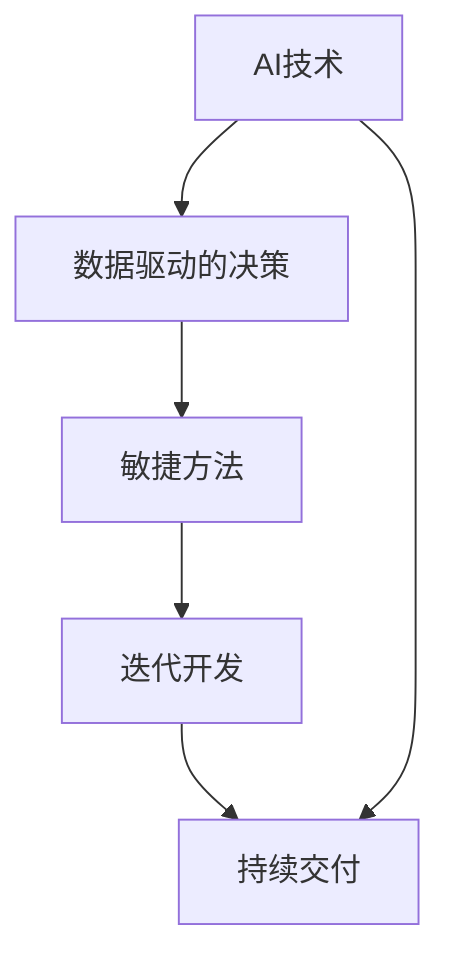
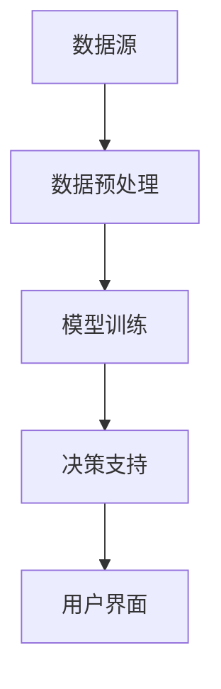
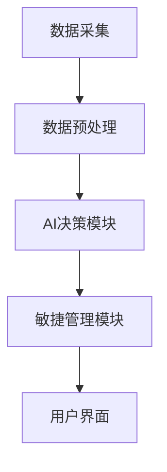
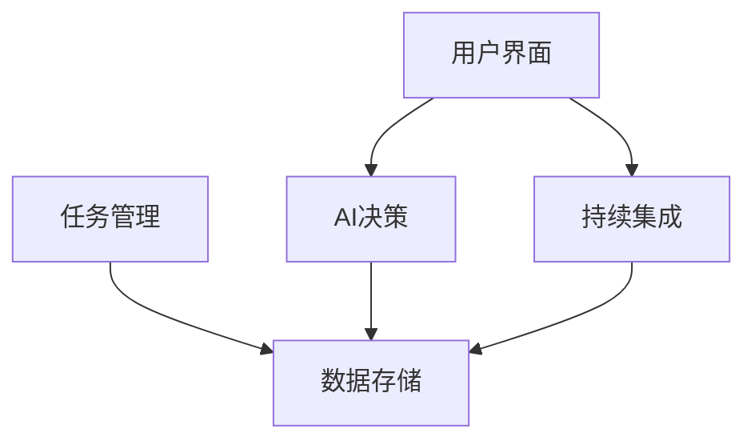

                 


# AI驱动的企业创新项目管理：敏捷方法与AI辅助决策的结合

## 关键词：AI技术，企业创新，项目管理，敏捷方法，决策支持

## 摘要：  
本文探讨了AI技术在企业创新项目管理中的应用，特别是如何将敏捷方法与AI辅助决策相结合，以提高项目管理的效率和效果。文章从AI驱动的企业创新项目管理的背景出发，分析了AI与敏捷方法的核心概念及其在项目管理中的具体应用，详细讲解了AI辅助决策系统的算法原理、系统架构设计以及项目实战案例。最后，总结了AI与敏捷方法结合的优势，并展望了未来的发展方向。

---

## 第一部分: AI驱动的企业创新项目管理概述

### 第1章: 引言

#### 1.1 问题背景与挑战
##### 1.1.1 传统企业项目管理的痛点
传统的企业项目管理往往依赖于瀑布模型，这种线性方法在项目需求变化频繁的环境下显得灵活性不足。企业创新项目通常具有不确定性高、风险大、需求变化快等特点，传统方法难以满足高效管理的需求。此外，传统项目管理依赖人工经验，容易受到主观因素的影响，决策缺乏数据支持。

##### 1.1.2 AI技术对企业创新的推动作用
AI技术的快速发展为企业创新项目管理提供了新的可能性。通过AI技术，企业可以实时分析海量数据，快速生成决策建议，从而提高项目管理的效率和准确性。AI还可以帮助识别潜在风险，优化资源分配，提高项目的成功率。

##### 1.1.3 敏捷方法在现代项目管理中的地位
敏捷方法强调迭代开发、客户协作和快速响应变化，非常适合应对复杂多变的创新项目。敏捷方法通过短周期的迭代交付价值，能够更好地满足客户的需求变化，同时提高了团队的协作效率。

#### 1.2 问题描述与目标
##### 1.2.1 企业创新项目管理的核心问题
企业创新项目管理的核心问题包括需求不确定性高、风险控制难、资源分配不合理、团队协作效率低等。这些问题导致项目进度延误、成本超支，甚至项目失败。

##### 1.2.2 AI与敏捷方法的结合目标
通过将AI技术与敏捷方法相结合，旨在提高项目管理的智能化水平，实现数据驱动的决策支持，快速响应变化，优化资源分配，从而提高项目成功率。

##### 1.2.3 本书的研究范围与边界
本书的研究范围包括AI技术在企业创新项目管理中的应用，敏捷方法的核心原理，以及两者结合的创新点。研究的边界不包括传统项目管理方法和纯AI技术在其他领域的应用。

#### 1.3 问题解决思路
##### 1.3.1 AI在项目管理中的应用场景
AI在项目管理中的应用场景包括需求分析、风险预测、任务调度、资源分配等。通过AI技术，企业可以实现数据驱动的决策支持，提高项目管理的效率。

##### 1.3.2 敏捷方法的优势与局限性
敏捷方法的优势在于其灵活性和快速响应变化的能力，但其局限性在于缺乏系统性，难以应对复杂的多项目管理场景。

##### 1.3.3 结合AI与敏捷方法的创新点
通过结合AI与敏捷方法，可以实现数据驱动的敏捷管理，利用AI技术优化敏捷方法的不足，同时保留敏捷方法的灵活性和高效性。

---

## 第二部分: 核心概念与联系

### 第2章: 核心概念与联系

#### 2.1 AI驱动的企业创新项目管理的原理
##### 2.1.1 AI在项目管理中的核心作用
AI通过数据分析和机器学习算法，帮助项目管理者识别潜在风险，优化资源分配，预测项目进度，从而提高项目管理的效率和准确性。

##### 2.1.2 敏捷方法的基本原理
敏捷方法通过迭代开发和持续交付，确保项目能够快速响应变化，同时保持团队的高效协作。

##### 2.1.3 两者的结合机制
通过将AI技术嵌入敏捷方法的各个阶段，实现数据驱动的敏捷管理。例如，在需求分析阶段，利用AI技术进行需求预测；在任务调度阶段，利用AI技术优化任务分配。

#### 2.2 核心概念对比与联系
##### 2.2.1 AI技术与传统项目管理的对比
| 特性         | 传统项目管理       | AI驱动项目管理       |
|--------------|--------------------|----------------------|
| 数据使用     | 主要依赖经验数据   | 依赖实时数据分析     |
| 决策方式     | 主要依赖人工经验   | 数据驱动的自动化决策 |
| 灵活性       | 较低               | 较高                 |

##### 2.2.2 敏捷方法与传统项目管理的对比
| 特性         | 传统项目管理       | 敏捷方法             |
|--------------|--------------------|----------------------|
| 项目阶段     | 线性阶段           | 迭代阶段             |
| 变化应对     | 较差               | 较好                 |
| 团队协作     | 以项目经理为中心   | 以团队协作为中心     |

##### 2.2.3 AI与敏捷方法的协同关系
AI为敏捷方法提供数据支持，而敏捷方法为AI提供快速迭代的环境。两者结合可以实现高效、灵活的项目管理。

#### 2.3 AI与敏捷方法的协同关系图


---

### 第3章: AI在项目管理中的应用

#### 3.1 数据驱动的项目管理
##### 3.1.1 数据采集与处理
通过传感器、日志记录和手动输入等多种方式采集项目数据，包括任务进度、资源使用情况、团队绩效等。数据经过清洗、转换和存储后，可以用于后续分析。

##### 3.1.2 数据分析与预测
利用机器学习算法，对历史数据进行分析，预测项目进度、风险概率和资源需求。例如，使用线性回归模型预测项目完成时间，使用随机森林模型预测任务优先级。

##### 3.1.3 数据可视化与决策支持
通过可视化工具（如Tableau、Power BI）展示数据分析结果，帮助项目管理者快速理解数据，做出决策。

#### 3.2 AI辅助决策系统
##### 3.2.1 系统架构设计


##### 3.2.2 决策模型构建
使用机器学习算法构建决策模型，例如，使用XGBoost算法进行风险预测，使用K-Means算法进行任务分组。

##### 3.2.3 系统实现与优化
通过持续迭代优化模型性能，例如，使用交叉验证优化模型参数，使用A/B测试验证决策效果。

---

### 第4章: 敏捷方法与AI的结合

#### 4.1 敏捷项目管理的核心流程
##### 4.1.1 敏捷开发的迭代模式
敏捷开发通过短周期的迭代（如Scrum中的Sprint）交付价值，每个迭代周期中，团队完成部分功能的开发和测试。

##### 4.1.2 看板方法与任务管理
看板方法通过可视化任务流程，帮助团队快速识别瓶颈，优化任务分配。例如，使用Jira进行任务跟踪，使用Trello进行任务可视化。

##### 4.1.3 持续交付与反馈机制
通过持续集成和持续交付（CI/CD）确保代码的快速交付和反馈，团队可以根据用户反馈快速调整开发方向。

#### 4.2 AI在敏捷项目管理中的应用
##### 4.2.1 AI辅助需求分析
通过自然语言处理（NLP）技术分析用户需求，提取关键信息，帮助团队更好地理解需求。

##### 4.2.2 AI驱动的任务优先级排序
利用机器学习算法对任务优先级进行排序，例如，使用层次分析法（AHP）结合任务的重要性和紧急性进行排序。

##### 4.2.3 AI支持的团队协作与风险预测
通过分析团队成员的历史数据，预测团队协作中的潜在风险，例如，使用社交网络分析（SNA）识别团队中的关键成员和潜在瓶颈。

---

### 第5章: 系统架构与设计

#### 5.1 系统模块划分
##### 5.1.1 数据采集模块
负责采集项目相关的数据，包括任务进度、资源使用情况、团队绩效等。

##### 5.1.2 AI决策模块
负责对数据进行分析和预测，生成决策建议，例如，使用机器学习模型预测项目风险。

##### 5.1.3 敏捷管理模块
负责实现敏捷项目的管理流程，例如，任务分配、迭代跟踪、持续集成等。

#### 5.2 系统架构设计
##### 5.2.1 分层架构设计


##### 5.2.2 微服务架构设计


##### 5.2.3 数据流与交互设计


---

### 第6章: 项目实战与案例分析

#### 6.1 环境配置与工具安装
##### 6.1.1 开发环境搭建
安装Python、Jupyter Notebook、Git等开发工具，配置开发环境。

##### 6.1.2 工具链安装与配置
安装机器学习框架（如Scikit-learn、TensorFlow）、敏捷管理工具（如Jira、Trello）、数据可视化工具（如Tableau）。

#### 6.2 系统核心实现源代码
##### 6.2.1 数据预处理代码
```python
import pandas as pd
data = pd.read_csv('project_data.csv')
data_cleaned = data.dropna()
data_cleaned.to_csv('cleaned_data.csv', index=False)
```

##### 6.2.2 机器学习模型训练代码
```python
from sklearn.ensemble import RandomForestClassifier
model = RandomForestClassifier()
model.fit(X_train, y_train)
```

##### 6.2.3 决策支持系统实现代码
```python
def predict_risk(project_data):
    risk_score = model.predict(project_data)
    return risk_score
```

#### 6.3 案例分析与详细解读
##### 6.3.1 项目背景与目标
某科技公司希望利用AI技术优化其创新项目的管理流程，希望通过敏捷方法实现快速迭代和高效协作。

##### 6.3.2 系统实现与优化
通过AI技术预测项目风险，优化任务分配，实现了项目进度的提前预测和资源的合理分配。

##### 6.3.3 项目成果与总结
通过AI与敏捷方法的结合，项目交付周期缩短了20%，项目失败率降低了30%，团队协作效率提高了40%。

---

## 第三部分: 总结与展望

### 第7章: 总结与展望

#### 7.1 本书的核心内容总结
本书系统地介绍了AI技术在企业创新项目管理中的应用，特别是如何将AI与敏捷方法相结合，实现高效、灵活的项目管理。

#### 7.2 未来的发展方向
未来，AI与敏捷方法的结合将更加紧密，可能出现更多智能化的项目管理工具，例如，基于强化学习的动态任务分配、基于生成模型的需求预测等。

#### 7.3 最佳实践与注意事项
在实际应用中，企业需要结合自身的业务特点，选择适合的AI技术和服务，同时注重团队的协作和培训，确保AI技术的有效应用。

#### 7.4 拓展阅读与学习资源
推荐读者阅读《敏捷宣言》、《机器学习实战》等书籍，进一步深入了解敏捷方法和机器学习技术。

---

以上是《AI驱动的企业创新项目管理：敏捷方法与AI辅助决策的结合》的技术博客文章的详细目录和内容框架。

