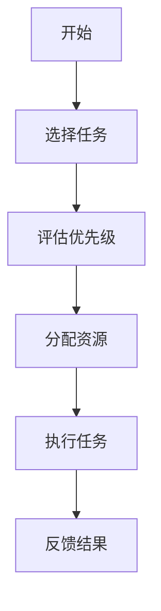
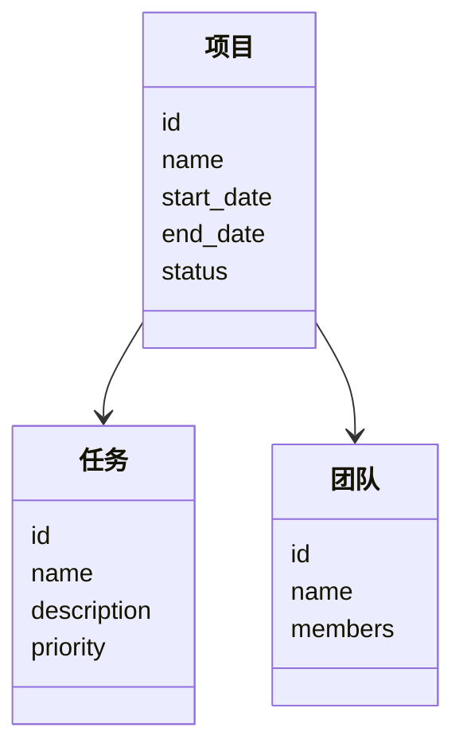
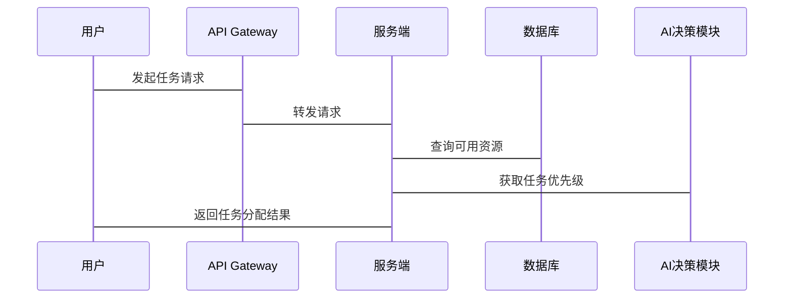

                 


# AI驱动的企业创新项目管理：敏捷方法与AI辅助决策的融合

> 关键词：AI驱动，企业创新，项目管理，敏捷方法，AI辅助决策

> 摘要：随着企业创新项目管理的复杂性增加，传统项目管理方法逐渐暴露出其局限性。人工智能（AI）技术的引入为项目管理带来了新的可能性，特别是在敏捷方法与AI辅助决策的结合方面。本文将详细探讨AI驱动的企业创新项目管理，分析敏捷方法与AI辅助决策的融合，探讨其优势、实现方法以及实际应用中的挑战和解决方案。

---

## 第一部分：AI驱动的企业创新项目管理背景与概念

### 第1章：AI驱动的企业创新项目管理概述

#### 1.1 企业创新项目管理的背景与挑战

##### 1.1.1 传统项目管理的局限性
传统的项目管理方法，如瀑布模型，通常在项目初期明确需求后进行线性开发，但这种方法难以应对需求变更和不确定性。在企业创新项目中，需求往往是模糊的，且需要快速迭代和调整，传统方法显得效率低下。

##### 1.1.2 企业创新的痛点与需求
企业创新项目通常具有高风险、高不确定性和快速变化的特点。传统的项目管理方法难以适应这些特点，导致项目进度拖延、成本超支甚至失败。因此，企业需要一种更灵活、更智能的项目管理方法。

##### 1.1.3 AI技术在项目管理中的潜力
AI技术能够通过数据分析和预测，帮助项目管理者更好地识别风险、优化资源分配、预测项目进度，并实时调整策略。这使得项目管理更加智能化和高效。

#### 1.2 敏捷方法与AI辅助决策的融合

##### 1.2.1 敏捷方法的核心理念
敏捷方法是一种以迭代和增量开发为核心的项目管理方法，强调个体互动、客户合作、响应变化和交付可用的软件。其核心理念是通过持续反馈和调整来确保项目成功。

##### 1.2.2 AI辅助决策的基本原理
AI辅助决策通过机器学习算法分析历史数据和当前情况，提供基于数据的决策建议。这种方法能够帮助项目管理者做出更准确、更及时的决策。

##### 1.2.3 两者的结合对企业创新的意义
将敏捷方法与AI辅助决策相结合，能够充分发挥两者的优点，使项目管理更加灵活、高效，并能够快速响应变化。这种方法特别适合企业创新项目，能够显著提高项目的成功率。

### 第2章：AI驱动项目管理的核心概念与联系

#### 2.1 核心概念原理

##### 2.1.1 项目管理的敏捷方法
敏捷方法通过迭代开发、持续交付和客户反馈，确保项目能够快速适应变化。这种方法强调团队协作和个体互动，能够有效应对项目中的不确定性。

##### 2.1.2 AI辅助决策的算法模型
AI辅助决策基于机器学习算法，通过分析历史数据和当前情况，提供决策建议。常用的算法包括回归分析、聚类分析和神经网络等。

##### 2.1.3 两者的协同机制
敏捷方法提供了一个灵活的框架，而AI辅助决策提供数据支持和预测能力。两者协同工作，使得项目管理更加智能化和高效。

#### 2.2 核心概念对比分析

##### 2.2.1 敏捷方法与传统项目管理的对比
| 对比维度 | 敏捷方法 | 传统项目管理 |
|----------|----------|--------------|
| 项目阶段 | 迭代开发 | 线性开发       |
| 变化应对 | 灵活     | 固定           |
| 团队协作 | 强调个体互动 | 强调层级结构   |

##### 2.2.2 AI辅助决策与传统决策支持的对比
| 对比维度 | AI辅助决策 | 传统决策支持 |
|----------|------------|---------------|
| 数据来源 | 大数据     | 结构化数据     |
| 决策速度 | 实时       | 周期性         |
| 决策准确性 | 高         | 中             |

##### 2.2.3 项目管理中的关键指标对比
| 对比维度 | 敏捷方法 | AI辅助决策 |
|----------|----------|------------|
| 关键指标 | 迭代速度、客户满意度 | 预测准确性、决策效率 |

#### 2.3 ER实体关系图

```mermaid
er
    %% 项目管理中的实体关系图
    项目 (Project)
    任务 (Task)
    团队 (Team)
    里程碑 (Milestone)
    依赖关系 (Dependency)

    项目 --> 任务
    项目 --> 里程碑
    任务 --> 依赖关系
    团队 --> 任务
```

---

## 第二部分：AI驱动项目管理的算法原理

### 第3章：AI驱动项目管理的算法原理

#### 3.1 算法原理概述

##### 3.1.1 任务调度算法
任务调度算法用于确定任务的执行顺序和资源分配。常用的算法包括贪心算法和动态规划算法。

##### 3.1.2 风险预测算法
风险预测算法通过分析历史数据，预测项目中可能出现的风险，并提供应对策略。

##### 3.1.3 资源分配算法
资源分配算法用于合理分配项目资源，确保项目顺利进行。常用的算法包括线性规划和遗传算法。

#### 3.2 任务调度算法实现

##### 3.2.1 贪心算法


##### 3.2.2 Python代码实现
```python
def greedy_task_scheduling(tasks, resources):
    scheduled_tasks = []
    remaining_resources = resources
    for task in sorted(tasks, key=lambda x: x['priority']):
        if remaining_resources >= task['resources_needed']:
            scheduled_tasks.append(task)
            remaining_resources -= task['resources_needed']
    return scheduled_tasks
```

#### 3.3 数学模型与公式

##### 3.3.1 任务调度模型
$$ \text{最大化} \sum_{i=1}^{n} w_i $$
$$ \text{受限于} \sum_{i=1}^{n} t_i \leq T $$

##### 3.3.2 风险预测模型
$$ P(r) = \frac{\text{历史风险数据中风险出现的次数}}{\text{总项目数}} $$

---

## 第三部分：系统分析与架构设计

### 第4章：系统分析与架构设计方案

#### 4.1 项目场景介绍
假设我们正在开发一个在线教育平台，项目需要在有限的时间和资源内完成。使用敏捷方法与AI辅助决策的融合，确保项目按时交付并满足客户需求。

#### 4.2 系统功能设计

##### 4.2.1 领域模型设计


#### 4.3 系统架构设计

##### 4.3.1 架构图


#### 4.4 系统接口设计
- API接口：RESTful API，用于任务分配、进度跟踪和风险预测。

#### 4.5 系统交互设计

##### 4.5.1 序列图


---

## 第四部分：项目实战

### 第5章：项目实战

#### 5.1 环境安装

##### 5.1.1 安装Python
```bash
python --version
pip install --upgrade pip
```

##### 5.1.2 安装机器学习库
```bash
pip install scikit-learn numpy pandas
```

#### 5.2 系统核心实现

##### 5.2.1 任务调度实现
```python
from sklearn.linear_model import LinearRegression
import numpy as np

# 训练任务调度模型
model = LinearRegression()
X = np.array([[1, 2], [3, 4], [5, 6]])
y = np.array([7, 8, 9])
model.fit(X, y)

# 预测下一个任务的优先级
new_task = np.array([[7, 8]])
print(model.predict(new_task))
```

#### 5.3 实际案例分析

##### 5.3.1 案例分析
假设我们有一个在线教育平台项目，项目需求包括开发一个用户注册系统和课程管理系统。使用敏捷方法与AI辅助决策的融合，项目团队能够快速响应需求变化，按时完成项目。

---

## 第五部分：最佳实践与总结

### 第6章：最佳实践

#### 6.1 总结与回顾

##### 6.1.1 总结
本文详细探讨了AI驱动的企业创新项目管理，分析了敏捷方法与AI辅助决策的融合，提供了系统的实现方法和实际案例。

##### 6.1.2 小结
通过结合敏捷方法和AI辅助决策，企业能够更高效地进行创新项目管理，提高项目成功率。

#### 6.2 注意事项

##### 6.2.1 数据质量
确保数据的准确性和完整性，避免因数据问题导致决策失误。

##### 6.2.2 团队协作
敏捷方法强调团队协作，确保团队成员之间的良好沟通和协作。

#### 6.3 拓展阅读

##### 6.3.1 推荐书籍
- 《敏捷宣言》
- 《机器学习实战》

##### 6.3.2 相关技术
- 项目管理工具：Jira、Trello
- AI工具：Python机器学习库、TensorFlow

---

通过本文的分析，读者可以全面了解AI驱动的企业创新项目管理，掌握敏捷方法与AI辅助决策的融合方法，并能够在实际项目中应用这些技术，提高项目管理的效率和成功率。

