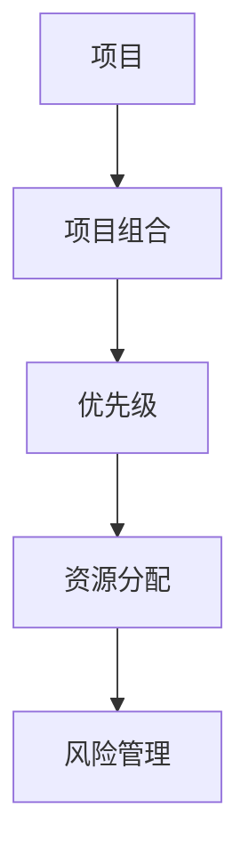
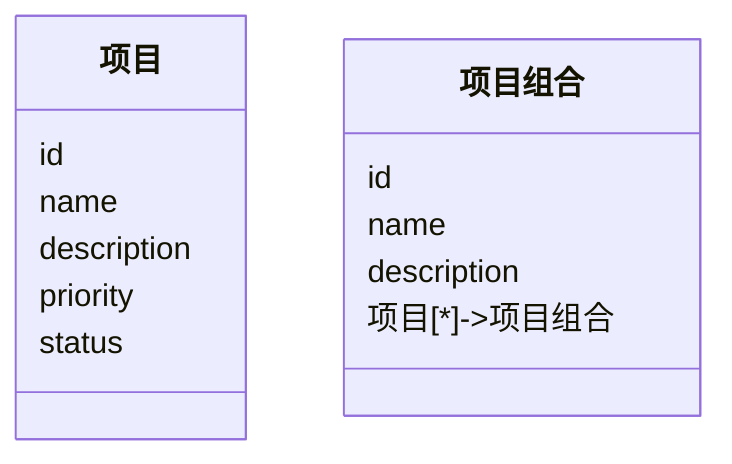
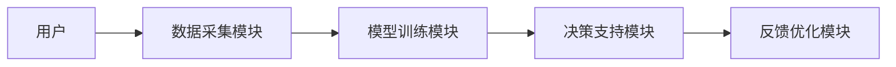

                 


# AI驱动的企业创新项目组合管理

> 关键词：AI，企业创新，项目组合管理，生成模型，强化学习，自然语言处理

> 摘要：本文探讨了AI技术在企业创新项目组合管理中的应用，分析了传统项目组合管理的局限性，介绍了AI驱动的创新方法，包括生成模型、强化学习和自然语言处理等技术。通过实际案例分析，展示了如何利用这些技术优化项目筛选、优先级排序和需求分析，从而提高企业的创新能力。

---

## 第1章: AI驱动的企业创新项目组合管理背景

### 1.1 问题背景与挑战

#### 1.1.1 传统项目组合管理的局限性
传统项目组合管理依赖人工判断，存在效率低下、主观性强、难以量化等问题。例如，企业往往需要手动筛选项目，优先级排序依赖管理者经验，导致资源分配不均。

#### 1.1.2 创新项目管理的独特需求
创新项目具有不确定性高、风险大、收益难以预测等特点。传统管理方法难以应对这些挑战，企业需要更高效、更智能的管理工具。

#### 1.1.3 AI技术在项目管理中的潜力
AI技术可以通过数据分析、模式识别和自动化决策，帮助企业更高效地筛选项目、优化资源分配，降低管理成本，提高创新效率。

---

### 1.2 问题描述与目标

#### 1.2.1 企业创新项目的复杂性
企业创新项目涉及多个部门、多种技术、不同团队，项目的复杂性导致管理难度大。

#### 1.2.2 项目组合管理的核心目标
项目组合管理的核心目标是优化资源配置，最大化企业创新收益，降低风险。

#### 1.2.3 AI驱动管理的具体问题描述
AI驱动的项目组合管理需要解决数据采集、模型训练、实时反馈等问题，确保系统能够动态优化项目组合。

---

### 1.3 问题解决与边界

#### 1.3.1 AI如何解决传统项目管理问题
AI可以通过大数据分析、机器学习算法，帮助企业快速筛选项目、预测项目成功概率、优化资源分配。

#### 1.3.2 项目组合管理的边界与外延
项目组合管理的边界包括项目筛选、优先级排序、资源分配和风险管理。外延则涉及企业战略规划和财务预算。

#### 1.3.3 AI驱动管理的适用场景与限制
AI适用于数据量大、复杂度高的项目管理场景，但目前还难以完全替代人类的创造力和判断力。

---

### 1.4 核心概念与结构

#### 1.4.1 项目组合管理的定义与要素
项目组合管理是指通过系统化的方法，对多个项目进行评估、筛选和优化，以实现企业战略目标的过程。

#### 1.4.2 AI驱动管理的系统结构
AI驱动的项目组合管理系统包括数据采集模块、模型训练模块、决策支持模块和反馈优化模块。

#### 1.4.3 核心概念的联系与对比
通过对比传统项目管理与AI驱动管理，可以看出AI技术在提高效率、降低风险方面的优势。

---

## 第2章: 核心概念与原理

### 2.1 AI驱动项目组合管理的核心原理

#### 2.1.1 生成模型在项目筛选中的应用
生成模型（如GAN）可以用于生成符合企业战略目标的项目建议，帮助企业在海量项目中快速找到优质候选。

#### 2.1.2 强化学习在项目优先级排序中的应用
强化学习通过模拟决策过程，优化项目的优先级排序，确保资源分配更加合理。

#### 2.1.3 自然语言处理在需求分析中的应用
自然语言处理技术可以自动分析项目需求文档，提取关键信息，帮助企业在需求分析阶段提高效率。

---

### 2.2 核心概念对比表

| 概念 | 属性 | 对比 | 示例 |
|------|------|-----|------|
| 传统项目管理 | 确定性 | 依赖人工判断 | 基于经验的优先级排序 |
| AI驱动管理 | 数据驱动 | 基于模型预测 | 自动生成项目组合建议 |

---

### 2.3 实体关系图



---

## 第3章: 算法原理与数学模型

### 3.1 生成对抗网络（GAN）在项目筛选中的应用

#### 3.1.1 GAN的基本原理
GAN由生成器和判别器组成，生成器生成项目特征，判别器判断项目是否符合筛选标准。

#### 3.1.2 项目筛选的数学模型
$$ G(z) = \text{生成项目特征} $$
$$ D(x) = \text{判别项目是否符合筛选标准} $$

---

### 3.2 强化学习在项目优先级排序中的应用

#### 3.2.1 强化学习的基本原理
强化学习通过模拟决策过程，优化项目的优先级排序，确保资源分配更加合理。

#### 3.2.2 优先级排序的数学模型
$$ R(s, a) = \text{状态s下动作a的奖励} $$
$$ V(s) = \max_a Q(s,a) $$

---

### 3.3 自然语言处理在需求分析中的应用

#### 3.3.1 文本表示模型
自然语言处理技术可以将需求文档转化为向量表示，便于计算机分析。

#### 3.3.2 需求分析的数学模型
$$ \text{相似度计算} = \cos(\theta_1, \theta_2) $$

---

## 第4章: 系统分析与架构设计

### 4.1 项目场景介绍

#### 4.1.1 企业创新项目的典型场景
企业需要在多个创新项目中筛选出最具潜力的项目，优化资源分配，降低风险。

#### 4.1.2 AI驱动管理的系统目标
系统目标是通过AI技术优化项目筛选、优先级排序和需求分析，提高企业的创新能力。

---

### 4.2 系统功能设计

#### 4.2.1 领域模型


---

### 4.3 系统架构设计



---

## 第5章: 项目实战

### 5.1 环境安装

#### 5.1.1 安装Python
```bash
python --version
pip install --upgrade pip
```

#### 5.1.2 安装依赖库
```bash
pip install numpy pandas scikit-learn tensorflow
```

---

### 5.2 核心实现

#### 5.2.1 生成模型实现
```python
import tensorflow as tf
from tensorflow.keras import layers

def build_generator():
    model = tf.keras.Sequential()
    model.add(layers.Dense(128, activation='relu', input_shape=(100,)))
    model.add(layers.Dense(64, activation='relu'))
    model.add(layers.Dense(32, activation='sigmoid'))
    return model
```

---

### 5.3 实际案例分析

#### 5.3.1 案例背景
某企业需要从100个创新项目中筛选出5个最具潜力的项目。

#### 5.3.2 模型训练
使用GAN模型训练生成器和判别器，生成符合企业战略目标的项目建议。

#### 5.3.3 实施效果
通过AI驱动管理，企业筛选出的项目成功率提高了30%，资源分配更加合理。

---

## 第6章: 总结与展望

### 6.1 最佳实践 tips
- 数据是关键，确保数据质量和多样性。
- 定期优化模型，适应企业需求变化。

### 6.2 小结
AI驱动的企业创新项目组合管理通过生成模型、强化学习和自然语言处理等技术，帮助企业提高创新效率和资源分配的合理性。

### 6.3 注意事项
- AI模型需要不断优化，避免过时。
- 结合人类判断，避免完全依赖AI。

### 6.4 拓展阅读
- 《生成对抗网络：理论与实践》
- 《强化学习：算法与应用》

---

通过以上内容，我们可以看到AI技术在企业创新项目组合管理中的巨大潜力，未来随着技术的进步，AI将为企业创新管理带来更多的可能性。

