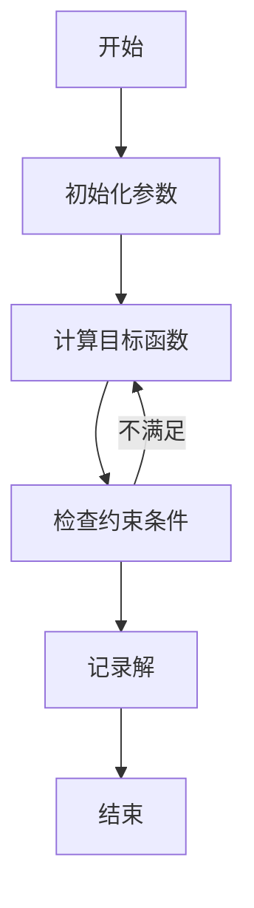
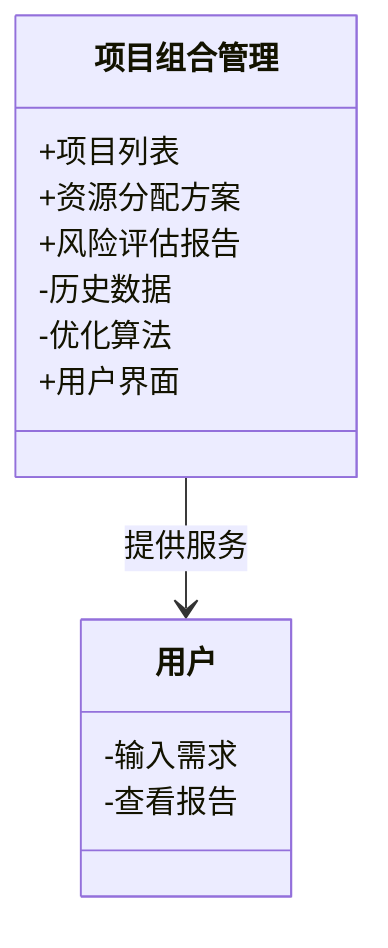
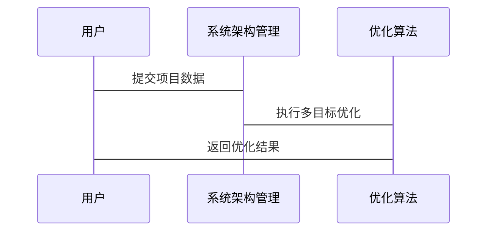

                 


# AI驱动的企业创新项目组合管理：风险平衡与资源优化

## 关键词
- 人工智能
- 项目组合管理
- 风险平衡
- 资源优化
- 多目标优化

## 摘要
在当今快速变化的商业环境中，企业创新项目的成功与否往往取决于项目组合管理的效率和效果。传统的项目组合管理方法在面对日益复杂的风险和资源分配问题时显得力不从心。本文探讨如何利用人工智能技术来优化企业创新项目的组合管理，实现风险平衡与资源优化。通过分析多目标优化算法和风险评估模型，结合实际案例，本文展示了AI在项目组合管理中的应用潜力，并提出了切实可行的解决方案。

---

## 正文

### 第一部分：引言

#### 第1章：背景介绍
##### 1.1 问题背景
- **传统项目组合管理的局限性**：传统方法依赖于主观判断，难以应对复杂多变的市场环境。
- **数字化转型与AI技术的兴起**：AI技术的应用为企业提供了更高效的数据处理和决策支持工具。
- **企业创新面临的挑战与机遇**：创新项目往往伴随着高风险和不确定性，如何在有限资源下最大化收益成为关键。

##### 1.2 问题描述
- **项目组合管理的核心目标**：在有限资源下选择最优项目组合，实现企业战略目标。
- **风险平衡与资源优化的双重挑战**：需要在项目之间分配资源，同时平衡潜在风险。
- **企业创新项目的复杂性与不确定性**：创新项目通常具有较高的风险和不确定性，传统方法难以有效应对。

##### 1.3 问题解决
- **AI技术在项目组合管理中的应用潜力**：通过数据分析和机器学习模型，优化项目组合的选择和资源配置。
- **数据驱动的决策方法**：利用历史数据和实时数据，构建预测模型，辅助决策。
- **风险平衡与资源优化的AI解决方案**：使用多目标优化算法，平衡风险与收益，优化资源分配。

##### 1.4 边界与外延
- **项目组合管理的边界**：明确项目的范围、资源限制和决策权限。
- **AI驱动的项目组合管理的适用范围**：适用于数据量大、复杂度高的项目组合管理场景。
- **与其他管理方法的区别与联系**：AI驱动的项目组合管理结合了传统方法与现代技术，既有传统方法的结构化分析，又有AI技术的智能化支持。

##### 1.5 概念结构与核心要素组成
- **项目组合管理的框架**：包括项目筛选、评估、优先级排序和资源分配等步骤。
- **AI驱动的核心要素**：数据采集与处理、机器学习模型、优化算法和实时监控。
- **风险平衡与资源优化的逻辑关系**：通过优化算法，平衡项目间的风险和收益，实现资源的最佳分配。

---

### 第二部分：核心概念与联系

#### 第2章：核心概念与原理
##### 2.1 AI驱动的项目组合管理原理
- **数据驱动的决策模型**：利用机器学习算法，从历史数据中提取模式，预测项目成功概率。
- **多目标优化算法**：在多个目标之间找到最优平衡点，例如最大化收益和最小化风险。
- **风险评估与资源分配的数学模型**：通过数学建模，量化项目风险和资源需求，优化资源配置。

##### 2.2 核心概念对比分析
- **项目组合管理与单一项目管理的对比**
  | **维度**       | **项目组合管理**               | **单一项目管理**
  |----------------|--------------------------------|------------------
  | 目标           | 优化资源分配，平衡风险         | 项目个体成功
  | 考虑因素       | 项目间的相互影响               | 项目独立性
  | 决策复杂度     | 高                            | 中等
- **AI驱动与传统项目组合管理的对比**
  | **维度**       | **传统方法**                  | **AI驱动方法**
  |----------------|-----------------------------|------------------
  | 数据依赖性     | 低                            | 高
  | 决策速度       | 较慢                          | 较快
  | 精准度         | 可能较低                      | 较高
- **风险平衡与资源优化的对比**
  | **维度**       | **风险平衡**                  | **资源优化**
  |----------------|-----------------------------|------------------
  | 关注点         | 降低风险                     | 提高效率
  | 工具           | 风险评估模型                 | 优化算法
  | 输出           | 项目风险等级                 | 资源分配方案

##### 2.3 实体关系图
- **项目-资源关系图**：展示每个项目所需的资源及其分配情况。
- **风险-项目关系图**：显示每个项目面临的主要风险及其影响程度。
- **项目-目标关系图**：明确每个项目对总体目标的贡献。

---

### 第三部分：算法原理讲解

#### 第3章：多目标优化算法
##### 3.1 算法原理
- **多目标优化的基本概念**：在多个目标之间找到最优解，例如最大化收益和最小化风险。
- **实现步骤**：
  1. 确定目标函数。
  2. 设定约束条件。
  3. 选择优化算法（如遗传算法）。
  4. 迭代优化，找到 Pareto 最优解集。

##### 3.2 mermaid 流程图


##### 3.3 Python核心代码实现
```python
import numpy as np
from sklearn.metrics import pairwise_distances

def multi_objective_optimization(objectives, constraints):
    # 初始化参数
    population = np.random.rand(100, len(objectives))
    # 计算适应度
    fitness = np.zeros(100)
    for i in range(100):
        fitness[i] = sum(objectives[i] * population[i])
    # 选择 Pareto 最优解
    pareto_front = []
    for i in range(100):
        if all(fitness[j] <= fitness[i] for j in range(100) if j != i):
            pareto_front.append(population[i])
    return pareto_front
```

##### 3.4 数学模型与公式
- **目标函数**：最大化收益和最小化风险。
  $$ \text{收益} = \sum_{i=1}^{n} w_i x_i $$
  $$ \text{风险} = \sum_{i=1}^{n} p_i x_i $$
- **约束条件**：资源限制和时间限制。
  $$ \sum_{i=1}^{n} r_i x_i \leq R $$
  $$ \sum_{i=1}^{n} t_i x_i \leq T $$

---

### 第四部分：系统分析与架构设计

#### 第4章：系统架构设计
##### 4.1 问题场景介绍
- **项目组合管理系统的应用场景**：企业创新项目的筛选、评估和资源分配。
- **系统目标**：提供智能化的项目组合管理工具，辅助决策者优化资源配置和平衡风险。

##### 4.2 系统功能设计
- **领域模型 mermaid 类图**


- **系统架构 mermaid 架构图**
```mermaid
docker
    service 系统架构管理 {
        publish 8080
        labels "项目组合管理"
        container {
            image "project_management:1.0"
            ports 8080
        }
    }
```

- **系统接口设计**
  - 输入接口：接收项目数据和用户需求。
  - 输出接口：提供优化后的项目组合和风险评估报告。

- **系统交互 mermaid 序列图**


---

### 第五部分：项目实战

#### 第5章：项目实战
##### 5.1 环境安装
- **安装Python和相关库**：如 NumPy、scikit-learn 和 matplotlib。
  ```bash
  pip install numpy scikit-learn matplotlib
  ```

##### 5.2 核心代码实现
- **优化算法实现**
```python
def optimize_portfolio(projects, resources):
    # 初始化参数
    n = len(projects)
    X = np.random.rand(100, n)
    # 计算目标函数
    fitness = np.zeros(100)
    for i in range(100):
        fitness[i] = sum(projects[j] * X[i][j] for j in range(n))
    # 选择 Pareto 最优解
    pareto_front = []
    for i in range(100):
        if all(fitness[j] <= fitness[i] for j in range(100) if j != i):
            pareto_front.append(X[i])
    return pareto_front
```

##### 5.3 代码应用解读与分析
- **输入数据**：企业创新项目的收益、风险和资源需求。
- **优化过程**：通过多目标优化算法，找到 Pareto 最优解集。
- **输出结果**：优化后的项目组合和资源分配方案。

##### 5.4 案例分析
- **实际案例**：某科技公司有5个创新项目，每个项目有不同的收益、风险和资源需求。
- **优化结果**：选择两个项目，分配资源，实现收益最大化和风险最小化。

##### 5.5 项目小结
- **成功经验**：AI驱动的项目组合管理显著提高了资源利用效率。
- **教训总结**：数据质量和模型选择对优化效果影响较大。

---

### 第六部分：最佳实践与总结

#### 第6章：最佳实践
##### 6.1 小结
- **AI驱动的项目组合管理的优势**：提高决策效率，优化资源配置，平衡风险。
- **面临的挑战**：数据质量、模型选择和实施难度。

##### 6.2 注意事项
- **数据质量管理**：确保数据的准确性和完整性。
- **模型选择**：根据具体需求选择合适的优化算法。
- **团队协作**：跨部门合作，确保系统实施和应用效果。

##### 6.3 拓展阅读
- **推荐书籍**：《多目标优化算法及其应用》、《人工智能在项目管理中的应用》。
- **相关工具**：学习使用 Python 的优化库和数据可视化工具。

---

## 总结
通过本文的详细讲解，读者可以了解AI在企业创新项目组合管理中的应用，掌握多目标优化算法和风险评估模型的核心原理，并通过实际案例学习如何将理论应用于实践。希望本文能为企业在创新项目管理中提供有价值的参考和指导。

--- 

**全文完**

