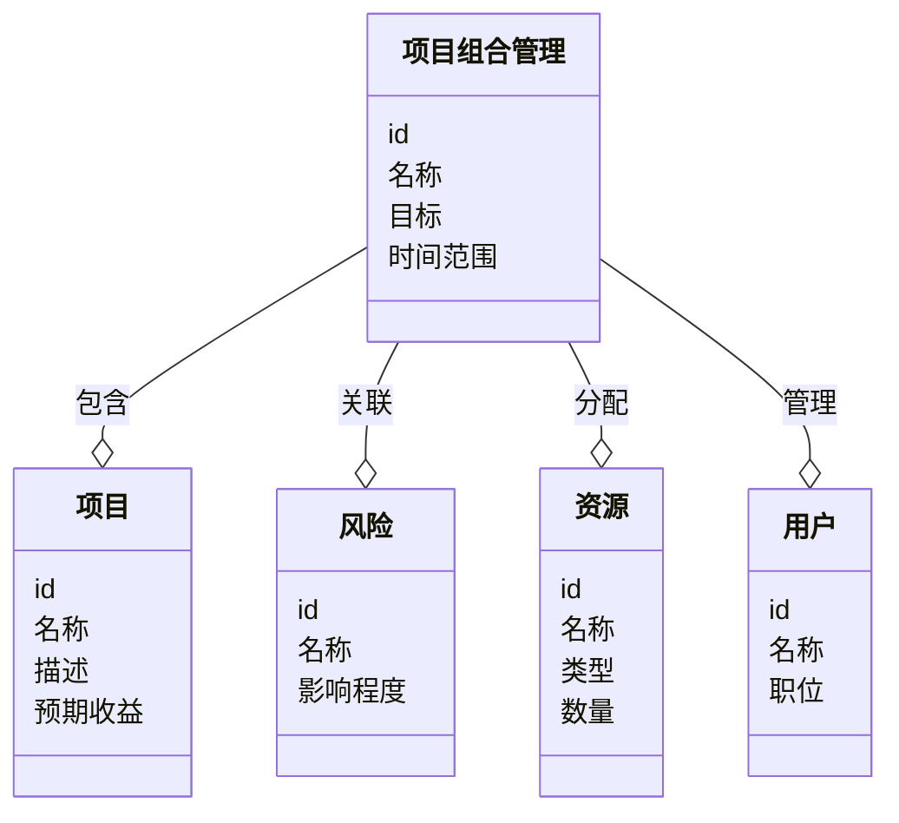
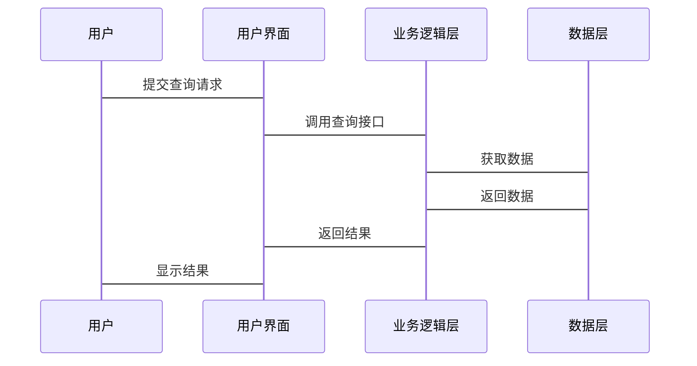

                 


# AI驱动的企业创新项目组合管理：风险平衡与资源优化的智能化

> 关键词：AI驱动、项目组合管理、风险平衡、资源优化、智能化

> 摘要：在数字化转型的浪潮中，企业创新项目组合管理面临着前所未有的挑战和机遇。传统的项目组合管理方式逐渐显露出效率低下、资源浪费和风险不可控等问题。AI驱动的企业创新项目组合管理，通过智能化的风险平衡与资源优化，为企业提供了更高效、更精准的管理方式。本文将深入探讨AI如何驱动企业创新项目组合管理的变革，分析其核心技术、系统架构与设计，并通过实际案例展示其应用与价值。

---

## 第1章：AI驱动的项目组合管理背景

### 1.1 项目组合管理概述

#### 1.1.1 项目组合管理的基本概念

项目组合管理（Portfolio Management）是指对一组项目进行选择、优先级排序和资源配置的过程，旨在实现组织的战略目标和最大化价值。项目组合管理不仅仅是对项目的简单管理，还包括对项目之间的协同效应和资源分配的优化。

#### 1.1.2 项目组合管理的重要性

在企业创新过程中，项目组合管理是确保资源合理分配、风险可控、价值最大化的核心环节。有效的项目组合管理能够帮助企业：

- 确保战略目标与项目的对齐。
- 优化资源配置，避免资源浪费。
- 降低项目风险，提升项目成功率。
- 持续创造价值，推动企业创新。

#### 1.1.3 传统项目组合管理的局限性

传统项目组合管理方法依赖于人工经验和主观判断，存在以下问题：

- 数据量有限，难以全面捕捉项目相关信息。
- 风险评估缺乏动态性，难以实时调整。
- 资源分配不够精准，可能导致资源浪费或不足。
- 项目优先级排序主观性强，缺乏客观依据。

### 1.2 AI驱动的创新

#### 1.2.1 AI在企业创新中的作用

人工智能（AI）技术的快速发展为企业创新提供了新的工具和方法。AI能够通过大数据分析、机器学习算法和自然语言处理技术，帮助企业更高效地识别创新机会、优化项目组合管理、降低创新风险。

#### 1.2.2 AI如何优化项目组合管理

AI通过以下方式优化项目组合管理：

- 数据驱动的决策：利用大数据分析技术，从海量数据中提取有价值的信息，为项目选择和资源配置提供科学依据。
- 风险预测与管理：通过机器学习模型，预测项目风险，制定风险应对策略。
- 资源优化：利用AI算法优化资源分配，确保资源利用最大化。

#### 1.2.3 AI驱动的创新趋势

随着AI技术的不断进步，企业创新正朝着更加智能化、数据化和个性化的方向发展。AI不仅能够提高项目组合管理的效率，还能通过实时数据分析和动态调整，实现创新过程的持续优化。

### 1.3 项目组合管理的智能化转型

#### 1.3.1 智能化转型的必要性

面对复杂多变的市场环境和日益增长的创新需求，传统项目组合管理方法已无法满足企业的实际需求。智能化转型能够帮助企业更好地应对不确定性，提高管理效率。

#### 1.3.2 智能化转型的关键因素

智能化转型的关键因素包括：

- 数据的全面性：需要收集和分析与项目相关的全维度数据。
- 算法的先进性：依赖于高效的机器学习算法和数据分析技术。
- 系统的集成性：需要建立智能化的管理系统，实现数据、算法和管理流程的无缝集成。

#### 1.3.3 智能化转型的未来展望

未来，AI驱动的项目组合管理将更加智能化、个性化和动态化。AI技术将不仅能够优化资源配置和预测风险，还能通过不断学习和优化，提供更加精准的管理建议，帮助企业在复杂多变的环境中持续创新。

---

## 第2章：AI驱动的项目组合管理核心概念

### 2.1 核心概念与定义

#### 2.1.1 项目组合管理的定义

项目组合管理是一种系统化的方法，用于选择、优先排序和管理一组项目，以实现组织的战略目标和价值最大化。

#### 2.1.2 AI驱动的定义

AI驱动是指利用人工智能技术，通过数据分析、机器学习和自动化工具，驱动企业创新项目组合管理的过程。

#### 2.1.3 风险平衡与资源优化的定义

风险平衡是指在项目组合管理中，通过合理分配资源和风险控制，实现项目风险与收益的最优平衡。资源优化是指在有限资源条件下，通过科学分配，最大化项目组合的总体价值。

### 2.2 核心概念的联系

#### 2.2.1 项目组合管理与AI的联系

AI技术为项目组合管理提供了强大的数据处理和分析能力，能够帮助企业在复杂环境中做出更明智的决策。

#### 2.2.2 风险平衡与资源优化的内在联系

风险平衡和资源优化是项目组合管理的两个核心目标，AI技术能够通过数据驱动的方法，实现两者的动态平衡。

#### 2.2.3 AI在风险平衡与资源优化中的应用

AI技术在风险平衡中的应用包括风险预测、风险评估和风险应对。在资源优化中的应用包括资源分配、优先级排序和动态调整。

### 2.3 核心概念的ER实体关系图

以下是一个简化的ER实体关系图，展示了AI驱动的项目组合管理中的核心实体及其关系：

```mermaid
er
    %% AI驱动的项目组合管理ER实体关系图
    classDiagram
        class 项目组合 {
            id
            名称
            目标
            时间范围
        }
        class 项目 {
            id
            名称
            描述
            预期收益
        }
        class 风险 {
            id
            名称
            影响程度
        }
        class 资源 {
            id
            名称
            类型
            数量
        }
        class 用户 {
            id
            名称
            职位
        }
        项目组合 --o 项目: 包含
        项目组合 --o 风险: 关联
        项目 --o 风险: 影响
        项目组合 --o 资源: 分配
        项目组合 --o 用户: 负责
```

---

## 第3章：AI驱动的项目组合管理核心技术

### 3.1 数据采集与预处理

#### 3.1.1 数据采集方法

AI驱动的项目组合管理需要收集与项目相关的各种数据，包括项目数据、风险数据、资源数据和市场数据。数据采集方法包括：

- 数据库查询：从企业现有的数据库中提取项目相关数据。
- API接口：通过API接口获取外部数据，如市场趋势数据。
- 数据挖掘：从非结构化数据中提取有价值的信息，如从文档中提取项目描述。

#### 3.1.2 数据清洗与预处理

数据清洗与预处理是确保数据质量和一致性的关键步骤，主要包括：

- 数据去重：去除重复数据。
- 数据填充：处理缺失数据。
- 数据标准化：将不同来源的数据转换为统一格式。

#### 3.1.3 数据存储与管理

数据存储与管理需要建立高效的数据管理系统，支持快速查询和分析。常用的数据存储方式包括：

- 数据库：如MySQL、MongoDB。
- 数据仓库：用于存储大量结构化数据。
- 数据湖：用于存储各种类型的数据，包括结构化、半结构化和非结构化数据。

### 3.2 模型构建与优化

#### 3.2.1 机器学习模型选择

在AI驱动的项目组合管理中，机器学习模型的选择取决于具体的应用场景和数据特性。常用模型包括：

- 线性回归：用于预测项目的价值或成本。
- 支持向量机（SVM）：用于分类问题，如项目成功与否的分类。
- 随机森林：用于特征重要性分析和分类/回归问题。
- 神经网络：用于复杂的非线性问题。

#### 3.2.2 算法原理与实现

以随机森林为例，其算法原理如下：

随机森林是一种基于树的集成学习方法。每个树的构建基于训练数据的一个样本集（通过袋装法生成），然后在每个节点进行特征选择（如信息增益）。最终的预测结果通过投票法或平均法得出。

随机森林的伪代码如下：

```python
def random_forest_train(X_train, y_train, n_estimators=100, max_depth=None):
    forest = []
    for _ in range(n_estimators):
        # 生成样本集
        sample_indices = np.random.choice(len(X_train), len(X_train), replace=True)
        X_sample = X_train[sample_indices]
        y_sample = y_train[sample_indices]
        # 构建一棵决策树
        tree = decision_tree_train(X_sample, y_sample, max_depth)
        forest.append(tree)
    return forest

def random_forest_predict(X_test, forest):
    # 对每个树进行预测，并取多数投票
    predictions = []
    for tree in forest:
        pred = decision_tree_predict(X_test, tree)
        predictions.append(pred)
    final_pred = np.array(predictions).mean(axis=0)
    return final_pred
```

#### 3.2.3 模型优化与调参

模型优化的关键在于选择合适的参数和调整模型结构。常用的方法包括：

- 参数调优：如使用网格搜索（Grid Search）或随机搜索（Random Search）。
- 正则化：如L1正则化（Lasso）和L2正则化（Ridge）。
- 模型集成：如投票法和加权法。

### 3.3 结果分析与可视化

#### 3.3.1 结果分析方法

结果分析包括对模型预测结果的评估和解释。常用的评估指标包括：

- 分类问题：准确率、召回率、F1分数。
- 回归问题：均方误差（MSE）、平均绝对误差（MAE）。

#### 3.3.2 可视化方法

可视化是理解和解释模型结果的重要手段。常用的可视化方法包括：

- 特征重要性分析：通过特征重要性排序，找出影响项目组合管理的关键因素。
- 预测结果可视化：如绘制预测值与实际值的散点图，评估模型的拟合效果。
- 风险分布图：通过热力图或条形图，展示不同项目的风险分布。

#### 3.3.3 可视化示例

以下是一个简单的项目风险预测结果的可视化示例：

```python
import matplotlib.pyplot as plt
import seaborn as sns

# 假设 risk_predictions 是一个包含项目名称和风险概率的 DataFrame
plt.figure(figsize=(10,6))
sns.barplot(x='项目名称', y='风险概率', data=risk_predictions)
plt.title('项目风险概率分布')
plt.xlabel('项目名称')
plt.ylabel('风险概率')
plt.show()
```

---

## 第4章：AI驱动的项目组合管理系统架构与设计

### 4.1 系统功能设计

#### 4.1.1 领域模型类图

以下是一个AI驱动的项目组合管理系统的基本领域模型类图：



#### 4.1.2 系统架构设计

AI驱动的项目组合管理系统通常采用分层架构，包括数据层、业务逻辑层和用户界面层。以下是系统架构图：

```mermaid
containerDiagram
    container 数据层 {
        数据库
        数据预处理模块
    }
    container 业务逻辑层 {
        项目组合管理模块
        风险评估模块
        资源分配模块
    }
    container 用户界面层 {
        用户界面
        交互模块
    }
    数据层 -- 业务逻辑层
    业务逻辑层 -- 用户界面层
```

#### 4.1.3 接口设计与交互设计

接口设计通常采用RESTful API，以下是一个简单的API接口设计示例：

- `GET /projects`：获取所有项目列表。
- `POST /projects`：创建新项目。
- `PUT /projects/{id}`：更新指定项目的详细信息。
- `DELETE /projects/{id}`：删除指定项目。

交互设计可以通过序列图展示，例如：



---

## 第5章：项目实战

### 5.1 环境安装

要运行本章的代码，需要以下环境：

- Python 3.6+
- pip
- 以下Python库：
  - pandas
  - scikit-learn
  - matplotlib
  - seaborn

安装命令：

```bash
pip install pandas scikit-learn matplotlib seaborn
```

### 5.2 核心代码实现

以下是一个简单的项目组合管理系统的代码实现示例：

#### 5.2.1 数据预处理

```python
import pandas as pd

# 加载数据
df = pd.read_csv('projects.csv')

# 数据清洗
df.dropna(inplace=True)
df = df[~df.isin([' ', np.nan, np.inf]).any(axis=1)]
```

#### 5.2.2 模型训练

```python
from sklearn.ensemble import RandomForestClassifier
from sklearn.metrics import accuracy_score

# 特征选择
features = ['项目成本', '项目时间', '团队规模']
target = '项目成功概率'

model = RandomForestClassifier(n_estimators=100, max_depth=20, random_state=42)
model.fit(df[features], df[target])
```

#### 5.2.3 结果可视化

```python
import matplotlib.pyplot as plt

# 预测结果
y_pred = model.predict(df[features])
print(f'模型准确率：{accuracy_score(df[target], y_pred):.2f}')

# 可视化特征重要性
feature_importance = pd.DataFrame({'特征': features, '重要性': model.feature_importances_})
feature_importance = feature_importance.sort_values('重要性', ascending=False)

plt.figure(figsize=(10, 6))
sns.barplot(x='重要性', y='特征', data=feature_importance)
plt.title('特征重要性分析')
plt.show()
```

### 5.3 案例分析

#### 5.3.1 案例背景

假设某企业有以下项目组合：

| 项目名称 | 描述 | 预期收益 | 项目成本 | 团队规模 | 项目时间 | 项目成功概率 |
|----------|------|----------|----------|----------|----------|--------------|
| 项目A    | 新产品开发 | 100万 | 50万 | 20人 | 6个月 | 0.8 |
| 项目B    | 市场推广 | 80万 | 30万 | 10人 | 3个月 | 0.7 |
| 项目C    | 技术研发 | 150万 | 70万 | 30人 | 12个月 | 0.6 |

#### 5.3.2 分析过程

通过AI模型分析，可以得出以下结论：

- 项目A的成功概率最高，应优先考虑。
- 项目C的风险较高，需要额外的资源投入。
- 项目B的资源需求较低，可以作为补充项目。

#### 5.3.3 结论

通过AI驱动的项目组合管理，企业可以更科学地分配资源，优化项目优先级，降低风险，提高整体创新效率。

### 5.4 项目小结

本项目展示了AI如何驱动企业创新项目组合管理的优化。通过数据预处理、模型训练和结果可视化，企业能够更好地识别项目风险，优化资源配置，提升管理效率。

---

## 第6章：总结与展望

### 6.1 总结

AI驱动的企业创新项目组合管理通过智能化的风险平衡与资源优化，为企业提供了更高效、更精准的管理方式。本文深入探讨了AI在项目组合管理中的核心技术、系统架构与设计，并通过实际案例展示了其应用与价值。

### 6.2 未来展望

随着AI技术的不断进步，企业创新项目组合管理将更加智能化、个性化和动态化。未来，AI将不仅能够优化资源配置和预测风险，还能通过实时数据分析和动态调整，提供更加精准的管理建议，帮助企业在复杂多变的环境中持续创新。

### 6.3 最佳实践 Tips

- 在实际应用中，建议企业结合自身特点，选择合适的AI工具和技术。
- 数据的准确性和完整性是AI模型性能的关键，需加强数据质量管理。
- 模型的可解释性是企业决策的重要因素，需注重模型解释能力的提升。

---

以上是《AI驱动的企业创新项目组合管理：风险平衡与资源优化的智能化》的完整目录大纲及部分章节内容。

