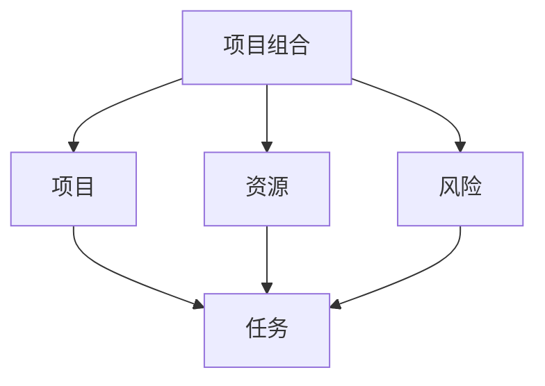
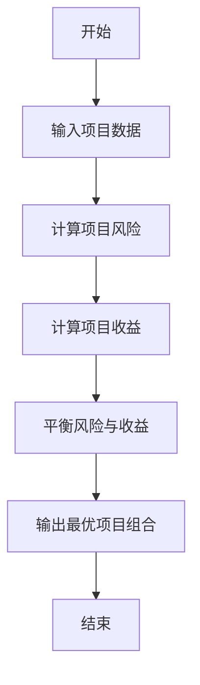
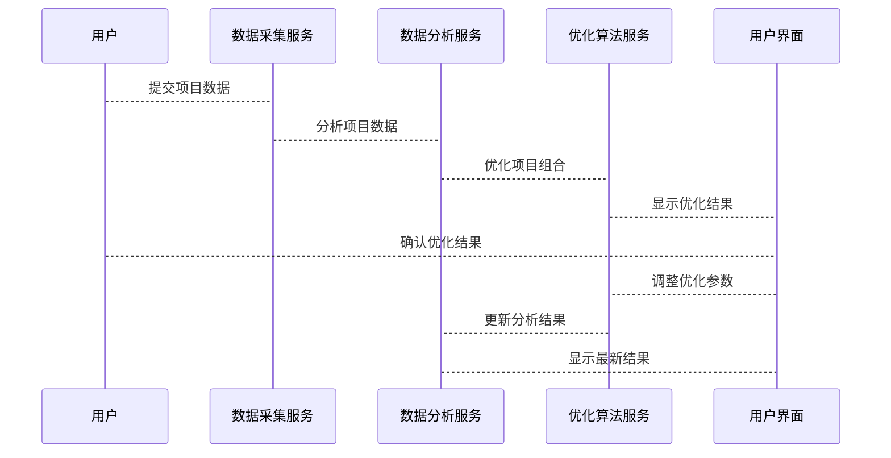

                 


# AI驱动的企业创新项目组合管理：风险平衡与资源最优分配

> 关键词：AI驱动，项目组合管理，风险平衡，资源优化，创新管理，多目标优化，企业创新

> 摘要：随着人工智能技术的迅速发展，企业创新项目组合管理也在不断进化。本文深入探讨了AI如何驱动企业创新项目组合管理的变革，分析了AI在风险平衡与资源最优分配中的作用，并提出了基于多目标优化的AI算法，结合实际案例展示了如何通过系统架构设计和项目实战实现创新项目的高效管理。

---

# 第一部分：AI驱动的企业创新项目组合管理背景

## 第1章：AI驱动的企业创新项目组合管理背景

### 1.1 问题背景与挑战

#### 1.1.1 传统项目组合管理的局限性
传统项目组合管理依赖于人工经验，难以应对复杂多变的创新环境。主要问题包括：
- **信息不对称**：难以全面收集和分析市场、技术和团队能力等多维度数据。
- **决策滞后**：依赖历史数据和经验判断，难以快速响应新兴机会和风险。
- **资源分配不均**：难以在多个项目之间找到最优的资源分配方案，导致资源浪费或项目失败。

#### 1.1.2 AI技术对企业创新管理的变革作用
AI技术的引入为项目组合管理带来了革命性的变化：
- **数据驱动决策**：通过机器学习算法，可以实时分析海量数据，提取有价值的信息。
- **动态调整能力**：AI能够根据市场变化和项目执行情况，实时优化项目组合。
- **风险预测与控制**：通过自然语言处理和时间序列分析，可以提前识别潜在风险。

#### 1.1.3 当前企业创新管理中的主要问题
当前企业在创新项目组合管理中面临的主要问题包括：
- **复杂性增加**：创新项目的类型多样，涉及的技术领域广泛，管理难度大。
- **资源分配不当**：缺乏系统化的资源分配模型，导致资源浪费或重点项目资源不足。
- **风险难以平衡**：创新项目往往具有高风险，如何在风险与收益之间找到平衡点是关键。

### 1.2 问题描述与目标

#### 1.2.1 项目组合管理的核心目标
项目组合管理的核心目标是通过优化资源配置，最大化企业创新项目的整体价值。具体目标包括：
- **价值最大化**：确保资源分配到最有潜力的项目。
- **风险平衡**：在风险与收益之间找到最优平衡点。
- **动态调整**：根据外部环境变化和项目执行情况，实时优化项目组合。

#### 1.2.2 AI驱动创新管理的实现路径
AI驱动创新管理的实现路径包括：
1. **数据收集与分析**：利用AI技术收集和分析市场、技术、团队能力等数据。
2. **模型构建与优化**：基于机器学习算法，构建项目组合优化模型。
3. **实时监控与调整**：根据实时数据，动态调整项目组合。

#### 1.2.3 风险平衡与资源最优分配的关键问题
风险平衡与资源最优分配的关键问题包括：
- **多目标优化**：如何在多个目标（如收益、风险、资源）之间找到最优解。
- **动态调整**：如何快速响应环境变化和项目执行情况。
- **模型准确性**：如何保证AI模型的预测和优化结果准确可靠。

### 1.3 核心概念与边界

#### 1.3.1 项目组合管理的基本概念
项目组合管理是指对一组项目进行选择、优先级排序、资源分配和监控，以实现企业战略目标的过程。核心概念包括：
- **项目组合**：一组相互关联的项目，共同实现企业战略目标。
- **项目优先级**：根据项目的价值、风险和资源需求，对项目进行排序。
- **资源分配**：根据项目优先级和资源约束，分配有限资源到不同项目。

#### 1.3.2 AI在项目组合管理中的应用边界
AI在项目组合管理中的应用边界包括：
- **数据驱动决策**：AI依赖数据进行预测和优化，数据的质量和完整性直接影响结果。
- **实时性要求**：AI需要实时处理数据，快速调整项目组合。
- **模型可解释性**：AI模型的可解释性影响决策者的信任和使用。

#### 1.3.3 创新项目管理的特殊性与复杂性
创新项目管理的特殊性与复杂性包括：
- **不确定性高**：创新项目往往涉及未知的技术和市场风险。
- **动态变化快**：创新环境变化迅速，项目需求和目标可能随时调整。
- **资源需求多样**：创新项目可能需要多种资源，包括技术、资金、人才等。

---

## 第2章：AI驱动项目组合管理的核心概念与联系

### 2.1 核心概念原理

#### 2.1.1 项目组合管理的三要素：目标、资源、风险
项目组合管理的三要素是：
- **目标**：企业希望通过项目组合实现的战略目标。
- **资源**：企业可用于项目组合的资源，包括资金、人员、技术等。
- **风险**：项目组合中各项目可能面临的风险，包括技术风险、市场风险等。

#### 2.1.2 AI技术在项目组合管理中的应用原理
AI技术在项目组合管理中的应用原理包括：
- **数据收集与预处理**：收集市场、技术、团队能力等数据，并进行清洗和特征提取。
- **模型训练与优化**：利用机器学习算法，训练项目优先级预测模型和资源分配优化模型。
- **实时监控与调整**：根据实时数据，动态调整项目组合，确保资源分配最优。

#### 2.1.3 数据驱动的决策模型
数据驱动的决策模型包括：
- **预测模型**：基于历史数据，预测项目成功的概率和潜在收益。
- **优化模型**：基于预测结果，优化项目组合，实现资源最优分配。

### 2.2 核心概念属性对比表

| 概念       | 传统项目组合管理 | AI驱动项目组合管理 |
|------------|-------------------|--------------------|
| 数据驱动   | 低               | 高                 |
| 动态调整    | 低               | 高                 |
| 风险平衡    | 依赖经验         | 数据优化           |

### 2.3 实体关系图



---

## 第3章：AI驱动项目组合管理的算法原理

### 3.1 算法概述

#### 3.1.1 多目标优化算法
多目标优化算法用于在多个目标之间找到最优解。常见的多目标优化算法包括：
- **遗传算法（GA）**：通过模拟自然选择和遗传机制，找到最优解。
- **粒子群优化（PSO）**：通过模拟粒子群的运动，找到最优解。
- **多目标进化算法（MOEA）**：通过进化策略，找到多个目标的最优解。

#### 3.1.2 风险平衡算法
风险平衡算法用于在项目组合中平衡风险与收益。常见的风险平衡算法包括：
- **风险中性优化**：在收益和风险之间找到平衡点。
- **风险厌恶优化**：根据企业对风险的厌恶程度，调整项目组合。
- **风险偏好优化**：根据企业对风险的偏好，调整项目组合。

#### 3.1.3 资源分配优化算法
资源分配优化算法用于在有限资源下，优化项目组合。常见的资源分配优化算法包括：
- **线性规划（LP）**：通过线性规划模型，找到资源分配的最优解。
- **整数规划（IP）**：通过整数规划模型，找到资源分配的最优解。
- **动态规划（DP）**：通过动态规划算法，找到资源分配的最优解。

### 3.2 算法实现

#### 3.2.1 多目标优化算法的数学模型

$$
\text{目标函数：} \quad \min f_1(x) + f_2(x) + \dots + f_n(x)
$$

其中，\( f_i(x) \) 表示第 \( i \) 个目标函数，\( x \) 表示决策变量。

#### 3.2.2 风险平衡算法的流程图



#### 3.2.3 资源分配优化算法的代码实现

```python
import numpy as np

def multi_objective_optimization(projects, resources):
    # 初始化种群
    population = np.random.rand(100, len(projects))
    
    # 计算目标函数
    objectives = []
    for project in projects:
        objectives.append(project.value - project.cost)
    
    # 适应度函数
    fitness = np.zeros(100)
    for i in range(100):
        fitness[i] = sum(objectives[i])
    
    # 选择和交叉
    selected = np.argsort(-fitness)[:50]
    new_population = np.zeros((50, len(projects)))
    for i in range(50):
        for j in range(len(projects)):
            new_population[i,j] = population[selected[i],j]
    
    # 变异
    mutation_rate = 0.1
    for i in range(50):
        for j in range(len(projects)):
            if np.random.rand() < mutation_rate:
                new_population[i,j] = 1 - new_population[i,j]
    
    # 选择最优解
    best = np.max(fitness)
    best_index = np.argmax(fitness)
    return population[best_index]
```

---

## 第4章：系统分析与架构设计方案

### 4.1 问题场景介绍

#### 4.1.1 项目背景
某科技公司计划通过AI技术优化其创新项目组合管理，希望通过AI技术实现以下目标：
- **提高项目选择的准确性**：通过数据分析，选择最有潜力的项目。
- **优化资源分配**：在有限资源下，最大化项目组合的收益。
- **降低风险**：通过风险预测和优化，降低项目组合的整体风险。

#### 4.1.2 项目介绍
项目名称：AI驱动的企业创新项目组合管理系统
项目目标：开发一个基于AI的创新项目组合管理系统，实现以下功能：
- **数据采集与分析**：收集市场、技术、团队能力等数据，并进行分析。
- **项目优先级排序**：根据数据分析结果，对项目进行优先级排序。
- **资源分配优化**：在有限资源下，优化项目组合。
- **实时监控与调整**：根据实时数据，动态调整项目组合。

### 4.2 系统功能设计

#### 4.2.1 领域模型（Mermaid 类图）

```mermaid
classDiagram
    class 项目组合管理 {
        +项目列表
        +资源分配方案
        +风险评估报告
        -目标设定
        -数据采集
        -优化算法
    }
    class 项目 {
        +项目ID
        +项目名称
        +项目描述
        +项目风险
        +项目收益
        +资源需求
    }
    class 资源 {
        +资源ID
        +资源类型
        +资源数量
        +资源分配情况
    }
    class 风险 {
        +风险ID
        +风险类型
        +风险概率
        +风险影响
    }
    项目组合管理 --> 项目：包含
    项目组合管理 --> 资源：分配
    项目组合管理 --> 风险：评估
```

#### 4.2.2 系统架构设计（Mermaid 架构图）

```mermaid
docker
    service 数据采集服务 {
        image python:3.8
        command "python3 -m data_collector"
        ports:
            5000:5000
    }
    service 数据分析服务 {
        image python:3.8
        command "python3 -m data_analyzer"
        ports:
            5001:5001
    }
    service 优化算法服务 {
        image python:3.8
        command "python3 -m optimizer"
        ports:
            5002:5002
    }
    service 用户界面 {
        image nginx:1.21
        command "nginx -g 'daemon off;'"
        ports:
            80:80
    }
    数据采集服务 --> 数据分析服务
    数据分析服务 --> 优化算法服务
    优化算法服务 --> 用户界面
```

#### 4.2.3 系统接口设计

| 接口名称       | 输入       | 输出       |
|----------------|------------|------------|
| 项目数据接口    | 项目ID     | 项目数据    |
| 资源数据接口    | 资源ID     | 资源数据    |
| 风险数据接口    | 风险ID     | 风险数据    |
| 项目优先级接口  | 项目列表   | 优先级列表  |
| 资源分配接口    | 资源列表   | 分配方案    |
| 风险评估接口    | 风险列表   | 评估报告    |

#### 4.2.4 系统交互设计（Mermaid 序列图）



---

## 第5章：项目实战

### 5.1 环境安装

#### 5.1.1 安装依赖
```bash
pip install numpy pandas scikit-learn matplotlib
```

### 5.2 系统核心实现源代码

#### 5.2.1 数据采集与预处理代码

```python
import pandas as pd
import numpy as np

def load_data():
    # 加载项目数据
    projects = pd.read_csv('projects.csv')
    resources = pd.read_csv('resources.csv')
    return projects, resources

def preprocess_data(projects, resources):
    # 数据清洗
    projects = projects.dropna()
    resources = resources.dropna()
    # 特征提取
    projects['potential'] = projects['market_size'] * projects['technology_maturity']
    resources['cost'] = resources['resource_price'] * resources['quantity']
    return projects, resources
```

#### 5.2.2 优化算法实现代码

```python
from sklearn.metrics import mean_squared_error
import numpy as np

def multi_objective_optimizer(projects, resources):
    # 初始化种群
    population = np.random.rand(100, len(projects))
    # 计算目标函数
    objectives = []
    for project in projects:
        objectives.append(project.value - project.cost)
    # 适应度函数
    fitness = np.zeros(100)
    for i in range(100):
        fitness[i] = sum(objectives[i])
    # 选择和交叉
    selected = np.argsort(-fitness)[:50]
    new_population = np.zeros((50, len(projects)))
    for i in range(50):
        for j in range(len(projects)):
            new_population[i,j] = population[selected[i],j]
    # 变异
    mutation_rate = 0.1
    for i in range(50):
        for j in range(len(projects)):
            if np.random.rand() < mutation_rate:
                new_population[i,j] = 1 - new_population[i,j]
    # 选择最优解
    best = np.max(fitness)
    best_index = np.argmax(fitness)
    return population[best_index]
```

---

## 第6章：总结与展望

### 6.1 总结

#### 6.1.1 核心结论
- AI技术能够显著提高企业创新项目组合管理的效率和准确性。
- 多目标优化算法是实现资源最优分配和风险平衡的关键技术。
- 数据驱动的决策模型是AI驱动项目组合管理的核心。

#### 6.1.2 实践意义
- 通过AI技术，企业可以更科学地选择和管理创新项目。
- AI驱动的项目组合管理能够提高资源利用效率，降低项目风险。

### 6.2 展望

#### 6.2.1 技术发展
- 更先进的机器学习算法，如深度学习和强化学习，将进一步提升项目组合管理的智能化水平。
- 多模态数据的融合分析将为项目组合管理提供更全面的支持。

#### 6.2.2 应用前景
- AI驱动的项目组合管理将在更多行业得到广泛应用。
- 随着技术的成熟，AI在创新管理中的应用将更加深入和精细。

---

## 第7章：注意事项与最佳实践

### 7.1 注意事项

#### 7.1.1 数据质量
- 数据质量直接影响AI模型的预测和优化结果，必须确保数据的准确性和完整性。

#### 7.1.2 模型可解释性
- 模型的可解释性影响决策者的信任和使用，必须重视模型的可解释性。

#### 7.1.3 实时性要求
- AI驱动的项目组合管理需要实时处理数据，快速调整项目组合，必须保证系统的实时性。

### 7.2 最佳实践

#### 7.2.1 数据驱动决策
- 通过数据分析和预测，科学选择和管理创新项目。

#### 7.2.2 动态调整
- 根据市场变化和项目执行情况，实时优化项目组合。

#### 7.2.3 团队协作
- 强调跨部门协作，确保数据、技术、业务的有机结合。

---

## 第8章：扩展阅读

### 8.1 相关文献

#### 8.1.1 经典书籍
- 《项目组合管理：理论与实践》
- 《人工智能：一种现代方法》

#### 8.1.2 专业期刊
- 《管理科学》
- 《人工智能与应用》

### 8.2 在线资源

#### 8.2.1 开源项目
- GitHub上的AI驱动项目组合管理开源项目。

#### 8.2.2 在线课程
- Coursera上的相关课程。

---

通过以上内容，我们可以看到，AI驱动的企业创新项目组合管理是一个复杂但充满潜力的领域。通过结合多目标优化算法和数据驱动的决策模型，企业可以在风险与收益之间找到最优平衡，实现资源的最优分配。未来，随着AI技术的不断发展，企业创新项目组合管理将变得更加智能化和高效化。

