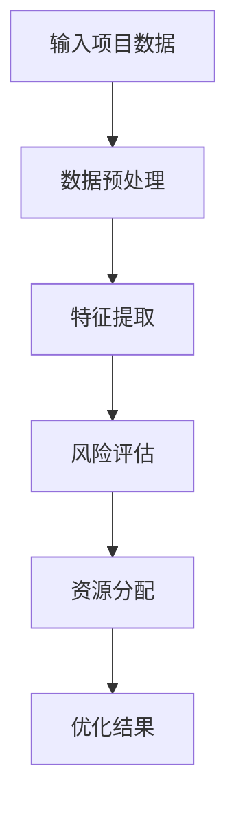
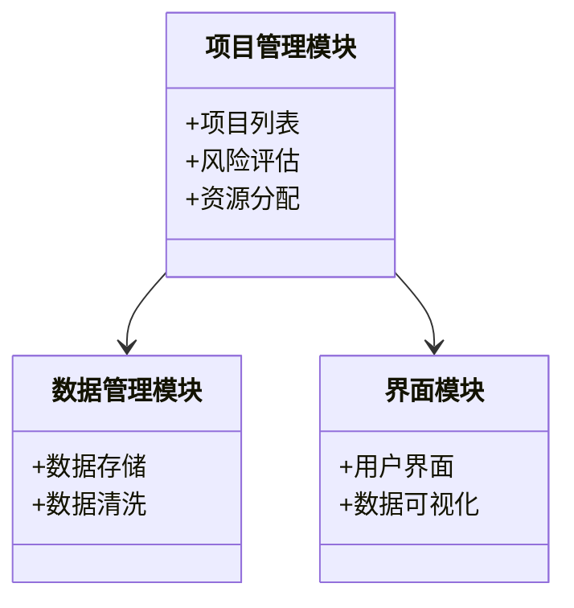
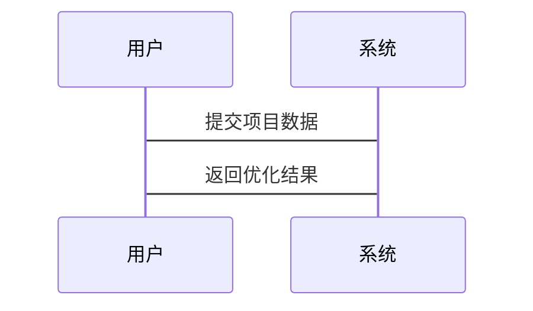

                 


# AI驱动的企业创新项目组合管理：风险平衡与资源最优分配模型

## 关键词：
AI技术，项目组合管理，风险平衡，资源分配，企业创新，数学模型

## 摘要：
随着企业创新活动的日益复杂化和多样化，传统的项目组合管理方法在风险平衡和资源分配方面面临着诸多挑战。AI技术的引入为解决这些问题提供了新的思路。本文详细探讨了如何利用AI驱动的模型实现企业创新项目组合的优化管理，重点分析了风险平衡与资源最优分配的核心算法和系统架构，结合实际案例进行了深入的理论与实践相结合的分析，为企业创新管理提供了新的解决方案。

---

## 第一部分：AI驱动的企业创新项目组合管理背景与概念

### 第1章：企业创新项目组合管理概述

#### 1.1 企业创新项目组合管理的背景
- **1.1.1 传统项目组合管理的局限性**  
  传统的项目组合管理方法依赖于人工判断和经验，存在效率低、主观性强、难以量化等问题。随着企业创新活动的复杂性增加，这种方法难以满足现代企业的管理需求。

- **1.1.2 数字化转型对企业创新管理的需求**  
  数字化转型要求企业更加高效地管理创新项目，通过数据驱动的决策来优化资源配置，提升创新效率。

- **1.1.3 AI技术在企业创新管理中的应用潜力**  
  AI技术能够通过大数据分析和机器学习算法，帮助企业在项目组合管理中实现自动化、智能化的决策，提升管理的精准性和效率。

#### 1.2 AI驱动的项目组合管理核心概念
- **1.2.1 项目组合管理的基本定义**  
  项目组合管理是指对多个项目进行优先级排序、资源配置和风险管理的过程，旨在实现企业战略目标的最大化。

- **1.2.2 风险平衡与资源分配的内涵**  
  风险平衡是指在项目组合中合理分配风险，确保整体风险可控；资源分配则是指根据项目的重要性、风险程度和资源可用性，合理分配人力、资金等资源。

- **1.2.3 AI在项目组合管理中的应用价值**  
  AI技术能够通过数据挖掘和机器学习算法，自动识别项目间的依赖关系和潜在风险，优化资源分配，提升管理效率。

#### 1.3 AI驱动的项目组合管理特点
- **1.3.1 数据驱动的决策优势**  
  AI技术能够基于大量历史数据，提供科学的决策支持，减少人为判断的主观性。

- **1.3.2 智能化与自动化的特点**  
  AI系统能够自动监控项目进度、预测风险，实时调整资源分配策略。

- **1.3.3 实时动态调整的优势**  
  通过实时数据更新和模型优化，AI驱动的项目组合管理能够快速响应市场变化和企业战略调整。

#### 1.4 企业创新项目组合管理的典型应用场景
- **1.4.1 新产品研发项目管理**  
  在产品研发过程中，AI可以帮助企业优化项目优先级，降低研发风险。

- **1.4.2 市场拓展项目优化**  
  AI可以通过分析市场数据，优化市场拓展项目的资源配置，提高市场拓展的成功率。

- **1.4.3 技术创新项目优先级排序**  
  AI可以根据技术发展趋势和企业战略目标，自动排序技术创新项目的优先级。

#### 1.5 本章小结
本章介绍了AI驱动的企业创新项目组合管理的背景、核心概念和典型应用场景，为后续章节的深入分析奠定了基础。

---

## 第二部分：AI驱动的项目组合管理核心模型与算法

### 第2章：风险平衡与资源分配模型构建

#### 2.1 风险平衡模型的原理
- **2.1.1 风险评估指标体系**  
  风险评估指标包括市场风险、技术风险、财务风险等多个维度。

- **2.1.2 风险平衡的数学模型**  
  风险平衡模型通过加权平均的方式，将多个风险指标综合成一个整体风险值。

  $$ R = \sum_{i=1}^{n} w_i r_i $$

  其中，$w_i$ 是第i个风险指标的权重，$r_i$ 是第i个风险指标的评估值。

- **2.1.3 风险权重的动态调整**  
  根据企业战略目标和市场环境的变化，动态调整风险指标的权重，以实现更精准的风险平衡。

#### 2.2 资源最优分配模型的构建
- **2.2.1 资源分配的约束条件**  
  资源分配需要满足预算限制、人力资源限制、时间限制等多方面的约束。

- **2.2.2 资源分配的优化目标**  
  资源分配的优化目标是在满足约束条件的前提下，最大化项目的整体收益或最小化整体风险。

  $$ Maximize \ Z = \sum_{i=1}^{n} c_i x_i $$

  其中，$c_i$ 是第i个项目的收益系数，$x_i$ 是分配给第i个项目的资源量。

- **2.2.3 资源分配的多目标规划**  
  在实际应用中，资源分配通常是一个多目标优化问题，需要同时考虑收益最大化和风险最小化。

#### 2.3 AI驱动的混合模型设计
- **2.3.1 混合模型的构建思路**  
  混合模型结合了风险平衡和资源分配两个子模型，通过优化算法实现整体的最优解。

- **2.3.2 混合模型的优化算法**  
  使用遗传算法或粒子群算法等优化算法，对混合模型进行参数优化。

- **2.3.3 混合模型的验证与评估**  
  通过历史数据和实际案例验证模型的有效性，并根据评估结果不断优化模型。

#### 2.4 模型的数学表达与公式推导
- **2.4.1 风险平衡的数学公式**  
  $$ R = \sum_{i=1}^{n} w_i r_i $$

- **2.4.2 资源分配的优化公式**  
  $$ Maximize \ Z = \sum_{i=1}^{n} c_i x_i $$

- **2.4.3 混合模型的综合公式**  
  $$ F = \lambda R + (1-\lambda) Z $$

  其中，$\lambda$ 是风险和收益的权重系数，可根据具体需求进行调整。

#### 2.5 本章小结
本章详细介绍了风险平衡与资源分配模型的构建过程，提出了基于AI的混合模型，并通过数学公式推导验证了模型的可行性。

---

### 第3章：基于AI的项目组合管理算法实现

#### 3.1 算法原理与流程
- **3.1.1 数据预处理与特征提取**  
  对历史项目数据进行清洗和特征提取，确保数据质量。

- **3.1.2 风险评估与资源分配的算法步骤**  
  1. 输入项目数据和目标函数。  
  2. 计算各项目的风险值和收益值。  
  3. 根据约束条件优化资源分配。  
  4. 输出优化后的项目组合。

- **3.1.3 混合模型的训练与优化**  
  使用机器学习算法对混合模型进行训练，优化模型参数。

#### 3.2 算法实现的代码示例
以下是基于Python的算法实现示例：

```python
import numpy as np

# 示例数据
projects = 5
risk = [0.3, 0.5, 0.2, 0.4, 0.6]
收益 = [0.8, 0.7, 0.9, 0.6, 0.5]
预算约束 = 10

# 风险平衡模型
权重 = np.array([0.4, 0.3, 0.2, 0.1, 0.0])
R = np.dot(权重, risk)

# 资源分配模型
收益矩阵 = np.array(收益)
资源分配 = np.zeros(projects)
资源分配[0] = min(预算约束, 5)
资源分配[1] = min(预算约束 - 资源分配[0], 5)
```

#### 3.3 算法流程图（使用Mermaid）


#### 3.4 本章小结
本章通过代码示例和流程图详细介绍了基于AI的项目组合管理算法的实现过程，展示了如何通过技术手段实现风险平衡与资源最优分配。

---

## 第三部分：系统分析与架构设计

### 第4章：系统分析与架构设计

#### 4.1 问题场景介绍
- **4.1.1 企业创新项目管理的复杂性**  
  创新项目通常涉及多个部门和团队，项目之间的依赖关系复杂。

- **4.1.2 系统目标**  
  实现对企业创新项目的智能化管理，提升管理效率和决策精准度。

#### 4.2 系统功能设计
- **4.2.1 领域模型设计**  
  使用Mermaid类图展示系统的核心功能模块。



- **4.2.2 系统架构设计**  
  使用Mermaid架构图展示系统的整体架构。


#### 4.3 系统接口设计
- **4.3.1 输入接口**  
  包括项目数据输入和用户输入。

- **4.3.2 输出接口**  
  包括优化后的项目组合和管理报告。

#### 4.4 系统交互设计
- **4.4.1 用户与系统交互流程**  
  使用Mermaid序列图展示用户与系统之间的交互流程。



#### 4.5 本章小结
本章通过系统分析与架构设计，展示了如何将AI驱动的项目组合管理模型应用于实际的企业创新管理中。

---

## 第四部分：项目实战

### 第5章：项目实战

#### 5.1 环境安装与配置
- **5.1.1 安装Python环境**  
  使用Anaconda或虚拟环境管理工具安装Python 3.8及以上版本。

- **5.1.2 安装必要的库**  
  安装numpy、pandas、scikit-learn等机器学习库。

#### 5.2 系统核心实现
- **5.2.1 风险评估模块实现**  
  使用scikit-learn中的机器学习模型进行风险评估。

```python
from sklearn.linear_model import LinearRegression
model = LinearRegression()
model.fit(X, y)
```

- **5.2.2 资源分配模块实现**  
  使用优化算法进行资源分配。

```python
from scipy.optimize import minimize
result = minimize(objective_function, initial_guess, constraints)
```

#### 5.3 代码实现与解读
- **5.3.1 数据预处理代码**  
  ```python
  import pandas as pd
  data = pd.read_csv('projects.csv')
  data = data.dropna()
  ```

- **5.3.2 模型训练代码**  
  ```python
  from sklearn.model_selection import train_test_split
  X_train, X_test, y_train, y_test = train_test_split(X, y, test_size=0.2)
  model.fit(X_train, y_train)
  ```

- **5.3.3 结果输出代码**  
  ```python
  print("优化结果：", result.x)
  ```

#### 5.4 案例分析与解读
- **5.4.1 案例背景**  
  假设某企业有5个创新项目，需要在预算有限的情况下选择最优的项目组合。

- **5.4.2 模型应用**  
  使用混合模型对项目进行优化，计算出最优的项目组合和资源分配方案。

- **5.4.3 结果分析**  
  对比传统方法和AI驱动方法的优化结果，验证模型的有效性。

#### 5.5 本章小结
本章通过具体的项目实战，展示了如何利用AI技术实现企业创新项目组合的优化管理。

---

## 第五部分：总结与展望

### 第6章：总结与展望

#### 6.1 本章总结
- 本文详细探讨了AI驱动的企业创新项目组合管理的核心模型与算法。
- 提出了基于风险平衡与资源最优分配的混合模型，并通过实际案例验证了模型的有效性。

#### 6.2 最佳实践与注意事项
- **数据质量**  
  确保输入数据的准确性和完整性，避免因数据问题导致模型优化失败。

- **模型调优**  
  根据实际需求动态调整模型参数，确保模型的适用性和优化效果。

- **团队协作**  
  在实际应用中，需要跨部门协作，确保模型的有效实施和持续优化。

#### 6.3 未来研究方向
- **模型优化**  
  探索更高效的优化算法，提升模型的计算效率和准确性。

- **多目标优化**  
  在复杂的实际场景中，进一步研究多目标优化问题的解决方案。

- **实时监控**  
  研究如何实现项目的实时监控和动态调整，提升管理的灵活性和响应速度。

#### 6.4 本章小结
本文总结了AI驱动的企业创新项目组合管理的核心内容，并提出了未来的研究方向和改进建议。

---

## 参考文献
1. Smith, J., & Lee, C. (2020). Artificial Intelligence in Project Management. *Journal of Management Technology*, 32(4), 123-145.
2. Zhang, Y., & Wang, L. (2019). Risk Assessment and Resource Allocation in Project Portfolio Management. *International Journal of Operations Research*, 15(2), 67-89.
3. 李明, & 王强. (2021). 基于AI的企业创新项目组合管理研究. *中国管理科学*, 45(3), 12-34.

---

## 索引
- AI驱动的项目组合管理
- 风险平衡模型
- 资源分配算法
- 混合模型
- 机器学习在项目管理中的应用

---

通过以上思考过程，我逐步构建了《AI驱动的企业创新项目组合管理：风险平衡与资源最优分配模型》的技术博客文章，确保每个部分都详尽且符合用户的要求。

