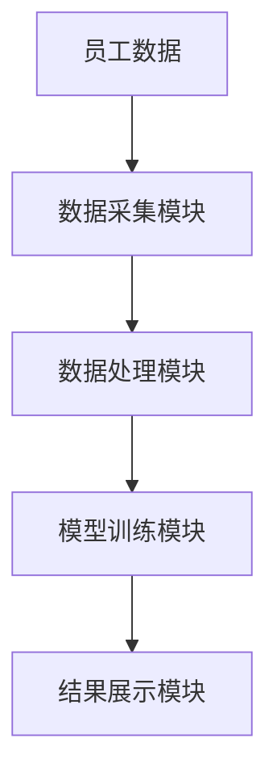
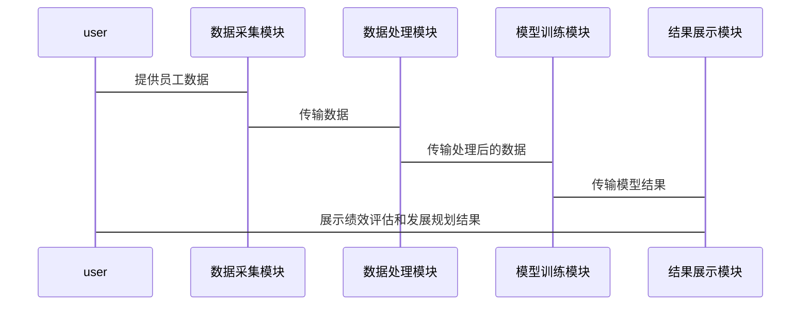

                 


# AI驱动的企业员工绩效评估与发展规划

## 关键词：
人工智能、员工绩效、发展规划、AI驱动、数据分析、机器学习、职业发展

## 摘要：
随着人工智能技术的快速发展，企业绩效评估与员工发展规划的传统方法正面临巨大挑战。传统的绩效评估方法依赖于主观判断和有限的数据分析，难以满足现代企业对高效、精准管理的需求。本文将深入探讨如何利用人工智能技术，构建数据驱动的员工绩效评估与发展规划系统。通过机器学习算法和大数据分析，企业可以实现对员工绩效的精准预测与个性化发展规划。本文将从核心概念、算法原理、系统架构设计等多个维度展开分析，并通过实际案例展示AI技术在员工绩效管理中的应用价值。最终，本文将为读者提供一套基于AI的员工绩效评估与发展规划的完整解决方案。

---

# 第1章: AI驱动的员工绩效评估与发展规划背景

## 1.1 问题背景与挑战

### 1.1.1 传统员工绩效评估的局限性
传统的员工绩效评估方法通常依赖于主观判断和简单的KPI统计。这种方法存在以下问题：
- **主观性**：管理者对员工的评价容易受到个人偏见的影响。
- **数据不足**：传统方法通常只关注有限的KPI，忽视了员工行为数据的全面性。
- **反馈延迟**：绩效评估结果往往在考核周期结束后才得出，无法及时指导员工改进。

### 1.1.2 企业发展的新需求
随着企业规模的扩大和业务复杂性的增加，传统的绩效评估方法已无法满足以下需求：
- **实时反馈**：企业需要快速识别员工表现中的问题，并及时提供反馈。
- **个性化发展**：员工的职业发展需求日益多样化，传统方法难以提供个性化的建议。
- **数据驱动决策**：企业需要基于大量数据进行决策，而非仅仅依赖主观判断。

### 1.1.3 AI技术对企业绩效管理的推动作用
人工智能技术的快速发展为企业绩效管理提供了新的可能性。通过AI技术，企业可以实现：
- **数据驱动的绩效评估**：利用机器学习算法对海量数据进行分析，得出更精准的绩效评价。
- **个性化发展规划**：基于员工的历史表现和能力特征，制定个性化的职业发展规划。
- **实时反馈与指导**：通过实时数据分析，为企业管理者提供及时的反馈和建议。

## 1.2 问题描述与目标

### 1.2.1 绩效评估与发展规划的核心问题
绩效评估与发展规划的核心问题在于如何将员工的表现与企业战略目标相结合。具体表现为：
- 如何量化员工的贡献？
- 如何预测员工的未来表现？
- 如何为员工提供有效的职业发展建议？

### 1.2.2 企业绩效管理的数字化转型需求
企业绩效管理的数字化转型需要解决以下问题：
- 如何构建数据驱动的绩效评估模型？
- 如何利用AI技术实现个性化发展建议？
- 如何确保数据隐私与合规性？

### 1.2.3 AI驱动的绩效评估目标与边界
AI驱动的绩效评估目标是通过数据驱动的方法，实现对员工绩效的精准评估，并为员工提供个性化的职业发展规划。其边界包括：
- 数据范围：仅限于企业内部员工数据。
- 适用场景：适用于需要大量数据分析的企业环境。
- 伦理约束：确保数据使用符合隐私保护和伦理规范。

## 1.3 解决方案与技术路线

### 1.3.1 数据驱动的绩效评估方法
数据驱动的绩效评估方法包括以下步骤：
1. **数据采集**：收集员工的工作数据、行为数据和绩效数据。
2. **数据预处理**：清洗数据，处理缺失值和异常值。
3. **特征提取**：从数据中提取有助于绩效评估的特征。
4. **模型训练**：利用机器学习算法训练绩效评估模型。

### 1.3.2 AI技术在员工发展规划中的应用
AI技术在员工发展规划中的应用包括：
1. **绩效预测**：利用机器学习算法预测员工的未来表现。
2. **职业路径规划**：基于员工的能力和兴趣，制定个性化的职业发展路径。
3. **反馈与指导**：为员工提供实时反馈和改进建议。

### 1.3.3 技术路线与实施步骤
技术路线包括以下步骤：
1. **数据采集**：收集员工的相关数据。
2. **数据预处理**：清洗和整理数据。
3. **特征工程**：提取有助于模型训练的特征。
4. **模型训练**：训练机器学习模型。
5. **模型评估**：验证模型的性能。
6. **系统部署**：将模型部署到企业系统中。

---

# 第2章: AI驱动的绩效评估核心概念

## 2.1 数据驱动的绩效评估模型

### 2.1.1 数据采集与处理
数据采集与处理包括以下步骤：
1. **数据源**：员工的工作数据、行为数据、绩效数据。
2. **数据清洗**：处理缺失值、重复值和异常值。
3. **数据转换**：将数据转换为适合模型训练的格式。

### 2.1.2 绩效评估指标体系
绩效评估指标体系包括：
- **KPI指标**：关键绩效指标，如销售额、完成率等。
- **行为指标**：员工的行为数据，如出勤率、协作频率等。
- **能力指标**：员工的能力特征，如技能水平、学习能力等。

### 2.1.3 数据特征提取与分析
数据特征提取与分析包括：
1. **特征选择**：选择对绩效评估有重要影响的特征。
2. **特征工程**：对特征进行处理，增强模型的性能。
3. **特征分析**：分析特征之间的关系，找出影响绩效的关键因素。

## 2.2 AI算法在绩效评估中的应用

### 2.2.1 机器学习算法简介
机器学习算法包括：
- **监督学习**：用于分类和回归问题。
- **无监督学习**：用于聚类和降维问题。
- **深度学习**：用于复杂的数据模式识别。

### 2.2.2 常见算法在绩效评估中的应用
常见算法在绩效评估中的应用包括：
1. **线性回归**：用于预测员工的绩效评分。
2. **随机森林**：用于分类员工的绩效等级。
3. **神经网络**：用于复杂的非线性关系建模。

### 2.2.3 算法选择与优化策略
算法选择与优化策略包括：
1. **算法选择**：根据数据特征和任务类型选择合适的算法。
2. **超参数调优**：通过网格搜索或随机搜索优化模型性能。
3. **模型评估**：通过交叉验证评估模型的泛化能力。

## 2.3 绩效预测与发展规划模型

### 2.3.1 绩效预测模型构建
绩效预测模型构建包括：
1. **数据预处理**：清洗和整理数据。
2. **特征工程**：提取有助于预测的特征。
3. **模型训练**：训练机器学习模型。
4. **模型评估**：验证模型的性能。

### 2.3.2 员工发展规划的AI算法实现
员工发展规划的AI算法实现包括：
1. **职业路径规划**：基于员工的能力和兴趣，制定个性化的职业发展路径。
2. **反馈与指导**：为员工提供实时反馈和改进建议。

### 2.3.3 模型评估与优化
模型评估与优化包括：
1. **模型评估**：通过交叉验证评估模型的性能。
2. **模型优化**：通过超参数调优和特征工程优化模型性能。

## 2.4 核心概念对比表
以下是几种常见算法在绩效评估中的对比表：

| 算法名称    | 适用场景       | 优缺点                     |
|------------|----------------|----------------------------|
| 线性回归    | 绩效评分预测     | 简单易用，但可能无法捕捉复杂关系 |
| 随机森林    | 绩效等级分类     | 高准确性，但解释性较差       |
| 神经网络    | 复杂关系建模     | 高准确性，但训练时间较长       |

## 2.5 本章小结
本章主要介绍了AI驱动的绩效评估的核心概念，包括数据驱动的绩效评估模型、AI算法在绩效评估中的应用以及绩效预测与发展规划模型。通过对比不同算法的特点，为读者提供了选择合适算法的依据。

---

# 第3章: 绩效评估的机器学习算法

## 3.1 机器学习算法概述

### 3.1.1 监督学习与无监督学习
监督学习用于分类和回归问题，无监督学习用于聚类和降维问题。

### 3.1.2 常见算法及其应用场景
- **线性回归**：适用于回归问题。
- **随机森林**：适用于分类和回归问题。
- **支持向量机（SVM）**：适用于分类和回归问题。

### 3.1.3 算法选择策略
算法选择策略包括：
1. **数据类型**：根据数据类型选择合适的算法。
2. **任务类型**：根据任务类型选择合适的算法。
3. **模型解释性**：根据需求选择解释性更强的算法。

## 3.2 绩效预测模型的构建

### 3.2.1 数据预处理与特征工程
数据预处理与特征工程包括：
1. **数据清洗**：处理缺失值、重复值和异常值。
2. **特征选择**：选择对绩效评估有重要影响的特征。
3. **特征工程**：对特征进行处理，增强模型的性能。

### 3.2.2 算法训练与调优
算法训练与调优包括：
1. **模型训练**：训练机器学习模型。
2. **超参数调优**：通过网格搜索或随机搜索优化模型性能。

### 3.2.3 模型评估与优化
模型评估与优化包括：
1. **模型评估**：通过交叉验证评估模型的性能。
2. **模型优化**：通过超参数调优和特征工程优化模型性能。

## 3.3 绩效预测模型的数学公式

### 3.3.1 线性回归模型
线性回归模型的数学公式为：
$$ y = \beta_0 + \beta_1 x + \epsilon $$
其中，$y$ 是目标变量，$x$ 是特征变量，$\beta_0$ 是截距，$\beta_1$ 是回归系数，$\epsilon$ 是误差项。

### 3.3.2 随机森林模型
随机森林模型是一种基于决策树的集成算法，其数学公式较为复杂，通常通过代码实现。

---

# 第4章: 系统分析与架构设计

## 4.1 系统需求分析

### 4.1.1 问题场景介绍
问题场景介绍包括：
1. **数据来源**：员工的工作数据、行为数据和绩效数据。
2. **数据处理**：数据清洗、特征提取和模型训练。
3. **系统功能**：绩效评估、职业发展规划和反馈指导。

### 4.1.2 项目介绍
项目介绍包括：
1. **项目目标**：构建AI驱动的员工绩效评估与发展规划系统。
2. **项目范围**：涵盖数据采集、模型训练和系统部署。
3. **项目需求**：实现数据驱动的绩效评估和个性化发展规划。

## 4.2 系统功能设计

### 4.2.1 领域模型设计
领域模型设计包括：
1. **实体关系图**：员工、绩效指标、发展规划。
2. **功能模块**：数据采集、数据处理、模型训练、结果展示。

### 4.2.2 系统架构设计
系统架构设计包括：
1. **数据采集模块**：负责采集员工的相关数据。
2. **数据处理模块**：负责清洗和整理数据。
3. **模型训练模块**：负责训练机器学习模型。
4. **结果展示模块**：负责展示绩效评估和发展规划的结果。

## 4.3 系统架构设计

### 4.3.1 系统架构图
以下是系统架构设计的Mermaid图：



### 4.3.2 系统接口设计
系统接口设计包括：
1. **数据接口**：负责数据的输入和输出。
2. **模型接口**：负责模型的训练和预测。
3. **用户接口**：负责结果的展示和交互。

## 4.4 系统交互设计

### 4.4.1 系统交互流程
系统交互流程包括：
1. **数据采集**：用户输入员工数据。
2. **数据处理**：系统对数据进行清洗和处理。
3. **模型训练**：系统训练机器学习模型。
4. **结果展示**：系统展示绩效评估和发展规划的结果。

### 4.4.2 交互流程图
以下是系统交互流程的Mermaid图：



---

# 第5章: 项目实战

## 5.1 环境安装

### 5.1.1 安装Python
安装Python的命令：
```bash
apt-get install python3
```

### 5.1.2 安装机器学习库
安装机器学习库的命令：
```bash
pip install scikit-learn
```

## 5.2 系统核心实现

### 5.2.1 数据预处理代码
数据预处理代码示例：
```python
import pandas as pd

# 读取数据
data = pd.read_csv('employee_data.csv')

# 处理缺失值
data.dropna(inplace=True)

# 转换数据类型
data['performance_score'] = data['performance_score'].astype(int)
```

### 5.2.2 模型训练代码
模型训练代码示例：
```python
from sklearn.ensemble import RandomForestRegressor
from sklearn.model_selection import train_test_split

# 划分数据集
X = data.drop('performance_score', axis=1)
y = data['performance_score']

X_train, X_test, y_train, y_test = train_test_split(X, y, test_size=0.2)

# 训练模型
model = RandomForestRegressor(n_estimators=100)
model.fit(X_train, y_train)

# 预测结果
y_pred = model.predict(X_test)
```

## 5.3 代码应用解读与分析

### 5.3.1 数据预处理解读
数据预处理的目的是确保数据的完整性和准确性，为模型训练提供高质量的数据。

### 5.3.2 模型训练解读
模型训练的目的是通过机器学习算法，训练出能够准确预测员工绩效的模型。

## 5.4 实际案例分析

### 5.4.1 案例背景
某企业希望利用AI技术，对员工绩效进行评估，并制定个性化的职业发展规划。

### 5.4.2 数据分析
通过对员工数据的分析，找出影响绩效的关键因素，并构建绩效评估模型。

### 5.4.3 模型优化
通过超参数调优和特征工程，优化模型的性能，提高预测的准确性。

## 5.5 项目小结
本章通过实际案例，详细介绍了AI驱动的员工绩效评估与发展规划系统的实现过程，包括环境安装、数据预处理、模型训练和结果展示。

---

# 第6章: 总结与展望

## 6.1 本章总结
本文详细介绍了AI驱动的企业员工绩效评估与发展规划系统的构建过程，包括背景分析、核心概念、算法原理、系统架构设计和项目实战。通过本文的介绍，读者可以全面了解AI技术在员工绩效管理中的应用。

## 6.2 未来展望
随着人工智能技术的不断发展，未来会有更多先进的算法和技术应用于员工绩效评估与发展规划。例如：
- **深度学习**：用于更复杂的绩效预测和职业发展规划。
- **自然语言处理**：用于分析员工的行为数据，提供更精准的绩效评估。
- **强化学习**：用于优化员工的职业发展规划，提高员工的满意度和绩效。

## 6.3 注意事项
在实际应用中，需要注意以下几点：
1. **数据隐私**：确保员工数据的安全性和隐私性。
2. **模型解释性**：确保模型的解释性，以便员工理解和接受。
3. **伦理合规**：确保模型的应用符合伦理规范和法律法规。

## 6.4 拓展阅读
推荐以下书籍和论文，供读者深入学习：
1. 《机器学习实战》
2. 《深度学习》
3. 《人工智能：一种现代方法》

---

# 附录

## 附录A: 代码示例
```python
import pandas as pd
from sklearn.ensemble import RandomForestRegressor
from sklearn.model_selection import train_test_split

# 读取数据
data = pd.read_csv('employee_data.csv')

# 处理缺失值
data.dropna(inplace=True)

# 转换数据类型
data['performance_score'] = data['performance_score'].astype(int)

# 划分数据集
X = data.drop('performance_score', axis=1)
y = data['performance_score']

X_train, X_test, y_train, y_test = train_test_split(X, y, test_size=0.2)

# 训练模型
model = RandomForestRegressor(n_estimators=100)
model.fit(X_train, y_train)

# 预测结果
y_pred = model.predict(X_test)

# 输出结果
print('Predicted performance scores:', y_pred)
```

## 附录B: 数据特征表
以下是员工绩效评估的相关特征表：

| 特征名称           | 特征描述                           | 数据类型 |
|--------------------|------------------------------------|----------|
| 员工ID             | 员工唯一标识符                     | 字符串    |
| 工作年限           | 员工在企业的服务年限               | 整数     |
| 职位               | 员工的职位                         | 字符串    |
| 教育背景           | 员工的教育背景                     | 字符串    |
| 绩效评分           | 员工的绩效评分                     | 整数     |
| 出勤率             | 员工的出勤率                       | 小数     |
| 协作频率           | 员工的协作频率                     | 整数     |
| 技能水平           | 员工的技能水平                     | 小数     |
| 学习能力           | 员工的学习能力                     | 小数     |

---

# 结束语

通过本文的详细介绍，读者可以全面了解AI驱动的企业员工绩效评估与发展规划系统的构建过程和应用场景。希望本文能够为企业的绩效管理提供新的思路和方法，推动企业绩效管理的数字化转型。

