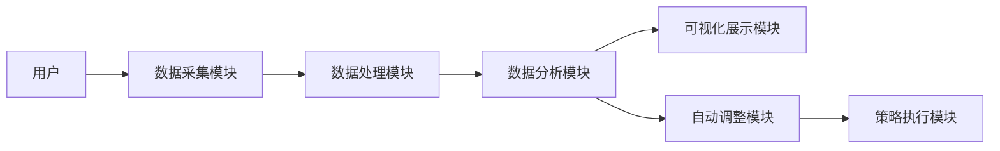
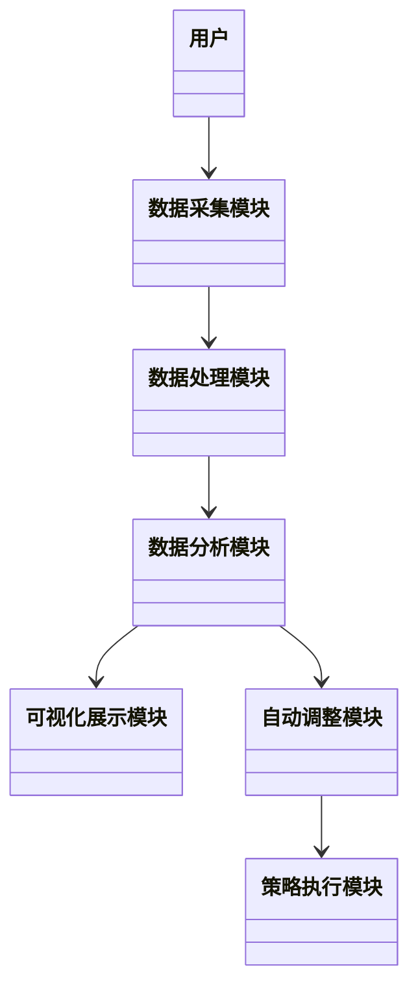
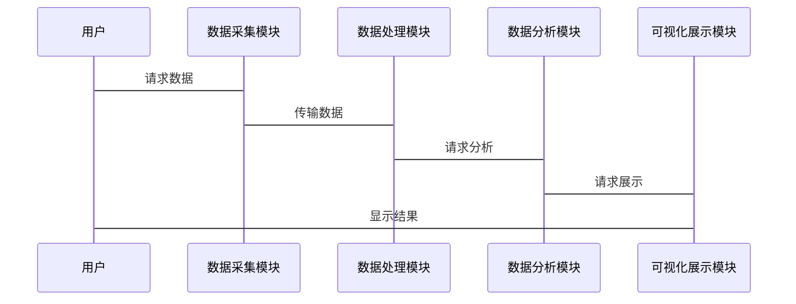

                 


# AI驱动的企业战略执行仪表盘：实时KPI追踪与自动调整

## 关键词：AI, 企业战略, KPI, 实时追踪, 自动调整, 数据可视化, 仪表盘

## 摘要：本篇文章详细探讨了AI技术在企业战略执行中的应用，重点介绍了如何通过实时KPI追踪和自动调整策略来优化企业绩效。文章从理论基础到技术实现，再到实际应用，系统地分析了AI驱动的企业战略执行仪表盘的设计与实现过程，为企业管理者和技术人员提供了宝贵的参考和实践指导。

---

# 第一部分: AI与战略执行仪表盘的基本概念

## 第1章: AI与战略执行仪表盘的背景与概念

### 1.1 问题背景与挑战
- **传统企业战略执行的痛点**：企业在执行战略时常常面临数据分散、KPI追踪不及时、调整策略耗时等问题。
- **KPI追踪与调整的难点**：KPI指标复杂多样，实时性要求高，人工调整效率低，难以应对市场变化。
- **AI技术在战略执行中的潜力**：AI技术能够实时分析数据、预测趋势，并自动调整策略，为战略执行提供智能化支持。

### 1.2 AI驱动仪表盘的核心概念
- **仪表盘的定义与功能**：仪表盘是一种数据可视化工具，用于实时监控和分析关键业务指标，帮助企业管理者快速做出决策。
- **AI在仪表盘中的应用**：AI技术可以通过机器学习、自然语言处理等手段，增强仪表盘的数据分析能力，实现智能化的KPI追踪和策略调整。
- **企业战略执行的数字化转型**：通过AI驱动的仪表盘，企业能够实现战略执行的智能化、自动化和实时化，提升整体竞争力。

### 1.3 本书的目标与结构
- **本书的核心目标**：系统介绍AI驱动的企业战略执行仪表盘的设计与实现，帮助读者掌握实时KPI追踪与自动调整的原理和方法。
- **本书的章节安排**：
  - 第一部分：介绍AI与仪表盘的基本概念。
  - 第二部分：详细讲解实时KPI追踪的技术基础。
  - 第三部分：深入分析自动调整策略的算法原理。
  - 第四部分：探讨企业战略执行仪表盘的系统架构。
  - 第五部分：通过项目实战，展示如何将理论应用于实践。
  - 第六部分：总结最佳实践，展望未来发展方向。
- **本书的适用读者**：企业管理人员、IT技术人员、数据科学家、AI开发者等。

---

## 第2章: 实时KPI追踪的技术基础

### 2.1 数据采集与处理
- **数据源的多样性**：企业数据来源广泛，包括ERP系统、CRM系统、物联网设备等，需要整合多源数据。
- **数据清洗与预处理**：通过去噪、标准化、归一化等方法，确保数据质量，为后续分析奠定基础。
- **数据流的实时处理技术**：采用流处理框架（如Apache Kafka、Apache Flink），实现数据的实时采集与处理。

### 2.2 KPI计算与分析
- **KPI的定义与分类**：根据业务需求，定义关键绩效指标，并将其分类为财务类、客户类、内部流程类和学习与成长类。
- **KPI计算的数学模型**：通过线性回归、聚类分析等方法，建立KPI预测模型，实现对未来的趋势预测。
- **数据可视化与分析方法**：利用图表（如柱状图、折线图、仪表盘）直观展示KPI数据，帮助企业管理者快速理解业务状态。

### 2.3 AI在KPI追踪中的应用
- **机器学习在KPI预测中的作用**：通过训练机器学习模型（如随机森林、神经网络），预测未来KPI的趋势。
- **自然语言处理在KPI解读中的应用**：利用NLP技术，分析文本数据（如客户反馈、员工报告），提取影响KPI的关键因素。
- **图神经网络在KPI关联分析中的应用**：通过构建图结构，分析不同KPI之间的关联关系，发现潜在的业务洞察。

---

## 第3章: 自动调整策略的算法原理

### 3.1 策略调整的核心算法
- **基于反馈的策略优化算法**：通过不断收集反馈数据，调整策略参数，实现优化。
- **强化学习在策略调整中的应用**：通过强化学习算法（如Q-Learning、Deep Q-Network），实现策略的自动优化。
- **贝叶斯网络在策略选择中的作用**：利用贝叶斯网络，分析不同策略的执行效果，选择最优策略。

### 3.2 算法实现的技术细节
- **算法的数学模型与公式**
  - Q-Learning算法公式：
    $$
    Q(s, a) = Q(s, a) + \alpha [ r(s, a) + \gamma \max_{a'} Q(s', a') - Q(s, a)]
    $$
  - 贝叶斯网络公式：
    $$
    P(A|B) = \frac{P(B|A)P(A)}{P(B)}
    $$
- **算法的实现步骤**：
  1. 初始化Q值表。
  2. 选择动作并执行。
  3. 收集反馈并更新Q值。
  4. 重复直到收敛。
- **算法的优化与调优**：通过调整学习率、折扣因子等参数，优化算法性能。

### 3.3 算法在实际中的应用案例
- **案例背景与目标**：某企业希望通过自动调整营销策略，提升销售业绩。
- **算法实现与结果展示**：通过Q-Learning算法，实现营销策略的自动优化，提升销售额10%。
- **实际应用中的效果分析**：算法能够快速响应市场变化，显著提高决策效率。

---

## 第4章: 企业战略执行仪表盘的系统架构

### 4.1 系统功能模块设计
- **数据采集模块**：负责实时采集企业运营数据。
- **数据处理模块**：对数据进行清洗、转换和标准化处理。
- **数据分析模块**：利用机器学习、自然语言处理等技术，分析数据并生成洞察。
- **可视化展示模块**：通过图表、仪表盘等形式，直观展示分析结果。
- **自动调整模块**：根据分析结果，自动调整企业战略执行策略。

### 4.2 系统架构设计
- **系统架构图**：使用Mermaid绘制系统架构图，展示各个模块之间的交互关系。

- **系统功能图**：使用Mermaid绘制系统功能图，展示系统的功能模块及其关系。


### 4.3 系统接口设计
- **API接口设计**：定义数据采集、处理、分析和展示的API接口，确保模块之间的通信顺畅。
- **交互设计**：设计用户友好的界面，方便用户操作和查看数据。

### 4.4 系统交互设计
- **交互流程图**：使用Mermaid绘制系统交互流程图，展示用户与系统的交互过程。


---

## 第5章: 项目实战

### 5.1 环境安装与配置
- **开发环境**：安装Python、Jupyter Notebook、数据处理库（如Pandas、NumPy）。
- **AI框架**：安装TensorFlow、PyTorch等深度学习框架。
- **可视化工具**：安装Matplotlib、Seaborn等数据可视化库。
- **实时处理框架**：安装Apache Kafka、Apache Flink等流处理框架。

### 5.2 系统核心实现
- **数据采集模块实现**：
  ```python
  import kafka
  def data_collector():
      # 连接Kafka broker
      consumer = kafka.Consumer(...)
      while True:
          # 读取消息
          message = consumer.poll()
          # 处理消息
          data_processor(message)
  ```
- **数据分析模块实现**：
  ```python
  import tensorflow as tf
  model = tf.keras.Sequential([
      tf.keras.layers.Dense(64, activation='relu'),
      tf.keras.layers.Dense(1, activation='sigmoid')
  ])
  model.compile(optimizer='adam', loss='binary_crossentropy')
  model.fit(X_train, y_train, epochs=10, batch_size=32)
  ```
- **可视化展示模块实现**：
  ```python
  import matplotlib.pyplot as plt
  plt.figure(figsize=(10, 6))
  plt.plot(time_series_data, label='Actual')
  plt.plot(predicted_data, label='Predicted')
  plt.xlabel('Time')
  plt.ylabel('Value')
  plt.legend()
  plt.show()
  ```

### 5.3 实际案例分析
- **案例背景**：某企业希望优化其市场营销策略，提升销售额。
- **数据准备**：收集过去一年的销售数据、市场活动数据、客户反馈数据等。
- **算法实现**：使用强化学习算法（如Q-Learning）自动调整营销策略。
- **结果展示**：通过仪表盘展示实时KPI数据和策略调整效果。

---

## 第6章: 总结与展望

### 6.1 最佳实践 tips
- **数据质量管理**：确保数据的准确性和完整性，为后续分析奠定基础。
- **算法选择与调优**：根据实际需求选择合适的算法，并通过实验调优模型性能。
- **系统架构设计**：合理设计系统架构，确保系统的可扩展性和可维护性。

### 6.2 小结
- 通过AI驱动的企业战略执行仪表盘，企业能够实现KPI的实时追踪与自动调整，显著提升战略执行效率。
- 本书系统地介绍了AI驱动仪表盘的设计与实现，为企业管理者和技术人员提供了宝贵的参考。

### 6.3 注意事项
- 在实际应用中，需注意数据隐私和安全问题，确保数据的合规性。
- 系统上线前，需进行充分的测试和验证，确保系统的稳定性和可靠性。

### 6.4 拓展阅读
- **推荐书籍**：《机器学习实战》、《深度学习》、《数据可视化指南》。
- **推荐课程**：Coursera上的《机器学习专项课程》、edX上的《数据科学与大数据分析》。
- **推荐工具**：Python的机器学习库（如Scikit-learn、XGBoost）、数据可视化工具（如Tableau、Power BI）。

---

通过以上目录大纲，我们可以看到，本书从理论到实践，系统地介绍了AI驱动的企业战略执行仪表盘的设计与实现。无论是企业管理人员还是技术人员，都能从中获得 valuable insights and practical guidance。

