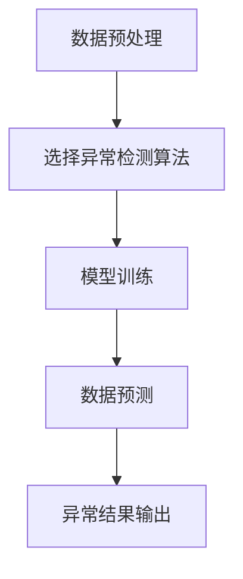
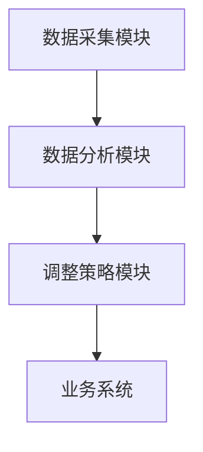

                 


# AI驱动的企业战略执行监控与调整系统

> 关键词：企业战略执行、AI监控、调整系统、算法实现、系统架构

> 摘要：本文详细探讨了如何利用人工智能技术构建企业战略执行监控与调整系统。从系统背景、核心概念、算法原理、系统架构到项目实战，全面分析了该系统的构建过程和实际应用价值。文章通过具体案例分析，展示了如何利用AI技术实现企业战略执行的智能化监控与动态调整，为企业管理者和技术人员提供了实用的参考。

---

# 第一部分: AI驱动的企业战略执行监控与调整系统概述

## 第1章: 问题背景与定义

### 1.1 问题背景

在现代企业中，战略执行的监控与调整是一个复杂而关键的过程。企业制定的战略目标需要通过一系列复杂的业务活动来实现，而这些活动往往受到外部环境、内部资源和执行偏差的影响。传统的战略监控方法依赖于人工分析和定期报告，这种方式效率低下、反应迟缓，且难以捕捉到实时变化的信息。随着人工智能技术的快速发展，利用AI技术实现企业战略执行的智能化监控与调整成为可能。

#### 1.1.1 企业战略执行的挑战

- **信息孤岛**：企业各部门的数据分散在不同的系统中，难以实现高效整合和分析。
- **实时性不足**：传统监控方法通常依赖定期报告，无法实时捕捉战略执行中的问题。
- **复杂性高**：企业战略执行涉及多个业务领域和外部环境，变量复杂，难以全面预测和调整。

#### 1.1.2 AI技术在战略执行中的潜力

- **实时监控**：AI可以通过实时数据分析，快速识别战略执行中的问题。
- **预测与调整**：基于历史数据和实时信息，AI可以预测未来趋势并提出调整建议。
- **自动化处理**：AI能够自动触发调整机制，减少人工干预，提高效率。

### 1.2 系统定义与目标

#### 1.2.1 系统定义

AI驱动的企业战略执行监控与调整系统（AI-SEMAS）是一种基于人工智能技术的企业级系统，旨在通过实时数据分析、智能预测和自动化调整，帮助企业监控战略执行情况并动态优化执行策略。

#### 1.2.2 系统目标

- **实时监控**：实时采集和分析企业战略执行中的关键数据，识别潜在问题。
- **智能预测**：基于历史数据和实时信息，预测战略执行的未来趋势。
- **动态调整**：根据预测结果和实时反馈，自动或辅助制定调整策略。

#### 1.2.3 系统边界与外延

- **边界**：系统聚焦于战略执行的监控与调整，不涉及企业战略的制定过程。
- **外延**：系统可以与企业现有的业务系统（如ERP、CRM等）集成，扩展至企业运营的各个环节。

### 1.3 核心概念与组成

#### 1.3.1 核心概念

- **战略目标**：企业制定的长期发展目标。
- **监控指标**：用于衡量战略执行情况的关键绩效指标。
- **调整机制**：根据监控结果动态优化战略执行的策略。

#### 1.3.2 概念属性特征对比表

| 概念       | 属性               | 特征对比                  |
|------------|--------------------|---------------------------|
| 战略目标   | 时间维度           | 长期性                    |
|            | 范围维度           | 全局性                    |
| 监控指标   | 数据类型           | 数量化                    |
|            | 更新频率           | 实时性                    |
| 调整机制   | 执行方式           | 自动化或半自动化          |
|            | 效果评估           | 可量化                    |

#### 1.3.3 ER实体关系图

```mermaid
erDiagram
    customer[CUSTOMER] {
        cust_id : int
        cust_name : string
        contact_info : string
    }
    order[ORDER] {
        order_id : int
        order_date : date
        total_amount : decimal
    }
    product[PRODUCT] {
        prod_id : int
        prod_name : string
        price : decimal
    }
    CUSTOMER -> ORDER : "places"
    ORDER -> PRODUCT : "contains"
```

---

# 第二部分: 核心概念与原理

## 第2章: AI在战略监控中的作用

### 2.1 AI在战略监控中的作用

#### 2.1.1 数据采集与处理

AI系统需要从企业内部和外部数据源（如ERP系统、市场数据、社交媒体等）采集与战略执行相关的数据，并进行清洗、转换和集成。

#### 2.1.2 数据分析与预测

通过机器学习算法（如回归分析、时间序列分析等），AI系统可以分析历史数据，预测未来趋势，并识别潜在风险。

#### 2.1.3 结果可视化

将分析结果以直观的可视化形式呈现（如图表、仪表盘等），帮助企业管理者快速理解监控结果。

### 2.2 监控指标与异常检测

#### 2.2.1 监控指标体系设计

- **关键绩效指标（KPIs）**：如销售额增长率、市场份额、客户满意度等。
- **实时指标**：如订单处理延迟、生产效率等。

#### 2.2.2 异常检测算法

使用统计方法或机器学习算法（如Isolation Forest、One-Class SVM等）检测监控指标中的异常值。

#### 2.2.3 异常处理流程

- **识别异常**：通过算法检测出异常指标。
- **分析原因**：结合上下文数据，分析异常原因。
- **触发预警**：通过邮件、短信等方式通知相关人员。

### 2.3 反馈与调整机制

#### 2.3.1 反馈机制设计

- **实时反馈**：根据实时数据，系统提供即时反馈。
- **历史反馈**：基于历史数据分析，提供优化建议。

#### 2.3.2 自动化调整策略

- **规则引擎**：根据预设规则，自动触发调整措施。
- **机器学习模型**：基于预测结果，动态调整战略执行策略。

#### 2.3.3 调整效果评估

- **效果指标**：如调整后的KPI变化、成本降低等。
- **持续优化**：根据评估结果，优化调整策略。

---

## 第3章: 异常检测算法

### 3.1 异常检测算法原理

#### 3.1.1 算法流程图



#### 3.1.2 算法实现代码

```python
import numpy as np
from sklearn.ensemble import IsolationForest

# 示例数据集
X = np.random.randn(100, 2)
X[50:] *= 3  # 生成异常点

# 异常检测模型训练
model = IsolationForest(n_estimators=100, random_state=42)
model.fit(X)

# 预测异常点
y_pred = model.predict(X)
print(y_pred)
```

#### 3.1.3 代码解读与分析

- 数据预处理：对数据进行标准化或归一化处理。
- 算法选择：使用Isolation Forest算法进行异常检测。
- 模型训练：训练模型以识别正常数据和异常数据。
- 数据预测：使用训练好的模型预测新的数据点是否为异常。

---

## 第4章: 预测与调整算法

### 4.1 预测模型构建

#### 4.1.1 数据预处理

```python
import pandas as pd
from sklearn.model_selection import train_test_split
from sklearn.preprocessing import StandardScaler

# 加载数据
data = pd.read_csv('strategic_data.csv')

# 分割特征与目标
X = data.drop('target', axis=1)
y = data['target']

# 数据标准化
scaler = StandardScaler()
X_scaled = scaler.fit_transform(X)

# 分割训练集与测试集
X_train, X_test, y_train, y_test = train_test_split(X_scaled, y, test_size=0.2, random_state=42)
```

#### 4.1.2 模型训练

```python
from sklearn.linear_model import LinearRegression
from sklearn.metrics import mean_squared_error

# 模型训练
model = LinearRegression()
model.fit(X_train, y_train)

# 模型预测
y_pred = model.predict(X_test)
print(mean_squared_error(y_test, y_pred))
```

#### 4.1.3 模型评估

- 均方误差（MSE）：衡量模型预测值与真实值之间的差异。
- R²分数：衡量模型解释变量的能力。

---

### 4.2 自动化调整策略

#### 4.2.1 调整规则设计

- 如果预测值与实际值的偏差超过一定阈值，则触发调整机制。
- 根据偏差方向调整相关业务参数。

#### 4.2.2 调整算法实现

```python
def adjust_strategy(predict_error):
    if abs(predict_error) > threshold:
        # 调整业务参数
        adjust_param()
    else:
        # 维持当前策略
        pass
```

---

## 第5章: 系统架构设计

### 5.1 系统功能模块

#### 5.1.1 数据采集模块

- 从企业内部系统（如ERP、CRM）和外部数据源（如市场数据、社交媒体）采集数据。

#### 5.1.2 数据分析模块

- 对采集的数据进行清洗、转换和分析，生成监控结果。

#### 5.1.3 调整策略模块

- 根据监控结果，动态调整企业战略执行策略。

### 5.2 系统架构图



---

## 第6章: 系统接口与交互设计

### 6.1 系统接口设计

#### 6.1.1 API接口定义

- RESTful API接口：提供数据采集、分析结果查询等功能。

#### 6.1.2 接口调用流程

- 客户端通过API调用系统功能。
- 服务端处理请求并返回结果。

### 6.2 系统交互流程

#### 6.2.1 用户交互流程

1. 用户登录系统。
2. 用户选择需要监控的战略目标。
3. 系统展示实时监控数据和分析结果。
4. 用户根据分析结果进行调整。

#### 6.2.2 系统响应流程

1. 系统接收用户请求。
2. 系统处理请求并生成响应。
3. 系统返回结果给用户。

---

## 第7章: 项目实战

### 7.1 环境配置

- 安装必要的Python库：如scikit-learn、pandas、numpy等。
- 配置开发环境：如Jupyter Notebook、PyCharm等。

### 7.2 核心代码实现

#### 7.2.1 数据采集与处理

```python
import pandas as pd

# 从ERP系统采集数据
def fetch_data():
    data = pd.read_csv('erp_data.csv')
    return data

# 数据预处理
def preprocess_data(data):
    data = data.dropna()
    return data
```

#### 7.2.2 监控与调整

```python
from sklearn.ensemble import IsolationForest

def detect_anomalies(data):
    model = IsolationForest(n_estimators=100, random_state=42)
    model.fit(data)
    return model.predict(data)
```

### 7.3 案例分析

#### 7.3.1 案例背景

某制造企业希望利用AI技术监控其销售战略的执行情况。

#### 7.3.2 数据分析与调整

- 数据采集：从ERP系统获取销售数据。
- 异常检测：识别销售额异常的地区。
- 调整策略：针对异常地区调整销售目标。

### 7.4 项目总结

通过AI技术，企业能够实时监控战略执行情况，并根据分析结果动态调整执行策略，显著提高了战略执行效率和效果。

---

## 第8章: 最佳实践与总结

### 8.1 小结

- AI技术能够显著提升企业战略执行的监控与调整效率。
- 系统设计需要结合企业的实际业务需求，确保系统的实用性和可扩展性。

### 8.2 注意事项

- 数据质量是系统运行的基础，需确保数据的准确性和完整性。
- 系统的安全性和隐私保护需要重点关注。

### 8.3 拓展阅读

- 《机器学习实战》
- 《企业架构设计：复杂系统的自适应之道》
- 《数据驱动的决策：从战略到执行》

---

通过以上系统化的构建与实现，AI驱动的企业战略执行监控与调整系统能够有效帮助企业优化战略执行过程，提升企业的竞争力和应变能力。

