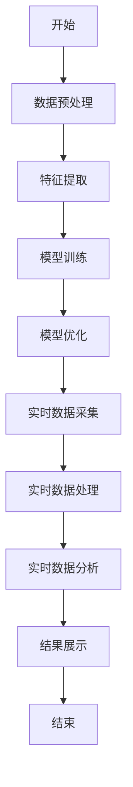
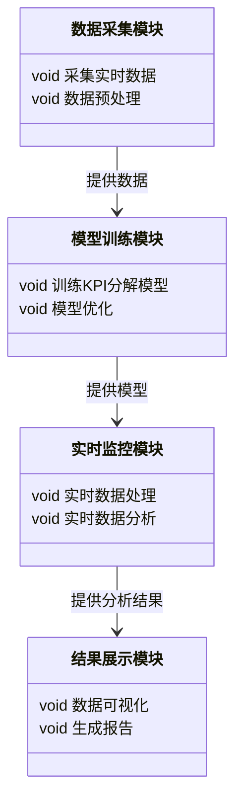
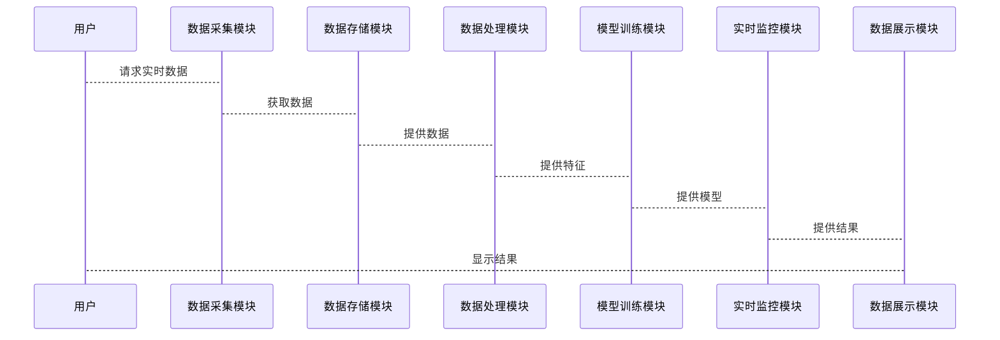

                 


# AI驱动的企业战略执行监控：KPI智能分解与实时追踪

> 关键词：AI，KPI分解，实时追踪，企业战略执行，机器学习

> 摘要：本文详细探讨了如何利用人工智能技术驱动企业战略执行监控，特别是KPI智能分解与实时追踪的关键问题。通过分析传统方法的不足，提出了一种基于AI的解决方案，涵盖了数据预处理、模型构建、实时追踪优化等技术细节，并通过实际案例展示了该方法的有效性。

---

# 第一部分: AI驱动的企业战略执行监控概述

## 第1章: AI驱动的企业战略执行监控背景

### 1.1 问题背景与挑战

#### 1.1.1 传统企业战略执行监控的痛点
- 企业战略执行监控的核心是KPI（关键绩效指标）的分解与追踪，但传统方法存在以下问题：
  - KPI分解过程复杂，依赖人工经验，难以量化。
  - 数据来源分散，实时性差，难以快速响应。
  - 缺乏动态优化能力，无法根据实时数据调整策略。
  - 数据分析深度不足，难以发现潜在问题。

#### 1.1.2 AI技术在企业战略执行中的潜力
- AI技术可以实现以下目标：
  - 利用机器学习算法自动分解KPI，提高效率。
  - 通过实时数据分析，提供动态优化建议。
  - 通过深度学习技术挖掘数据中的潜在关联，提升洞察力。
  - 提供可视化界面，便于企业高管快速理解数据。

#### 1.1.3 当前企业战略执行监控的现状与不足
- 尽管部分企业开始尝试引入AI技术，但仍面临以下挑战：
  - 数据质量参差不齐，影响模型准确性。
  - 缺乏专业的技术团队，难以实现AI模型的落地。
  - 数据隐私问题，限制了数据的共享与分析。

### 1.2 问题描述与目标

#### 1.2.1 KPI分解与实时追踪的核心问题
- KPI分解的核心问题是如何将企业战略目标分解为可执行的指标，并确保这些指标能够实时追踪。
- 实时追踪的核心问题是如何快速处理海量数据，并提供实时反馈。

#### 1.2.2 AI驱动战略执行监控的目标
- 提供一种基于AI的KPI分解方法，能够自动识别关键指标。
- 构建实时数据处理系统，实现KPI的动态监控。
- 提供可视化界面，便于企业高管快速理解数据。

#### 1.2.3 解决方案的边界与外延
- 解决方案的边界：仅关注KPI分解与实时追踪，不涉及企业战略制定过程。
- 解决方案的外延：可以扩展到其他领域，如供应链优化、风险管理等。

### 1.3 核心概念与框架

#### 1.3.1 KPI分解与实时追踪的定义
- KPI分解：将企业战略目标分解为具体的、可量化的指标。
- 实时追踪：通过实时数据分析，监控KPI的变化情况，并提供反馈。

#### 1.3.2 AI在战略执行监控中的作用
- 数据处理：AI技术可以快速处理海量数据，提取关键信息。
- 模型构建：利用机器学习算法构建预测模型，辅助决策。
- 可视化：通过数据可视化技术，将复杂的数据转化为直观的图表。

#### 1.3.3 框架的核心要素与组成
- 数据源：包括企业内部数据、外部市场数据等。
- 数据处理模块：负责数据清洗、特征提取。
- 模型构建模块：利用机器学习算法构建KPI分解模型。
- 实时追踪模块：负责数据的实时采集与分析。
- 可视化界面：用于展示分析结果。

---

## 第2章: AI驱动KPI智能分解与实时追踪的核心概念

### 2.1 核心概念原理

#### 2.1.1 KPI分解的逻辑与方法
- 传统的KPI分解方法依赖于人工经验，难以量化。
- 基于AI的KPI分解方法通过机器学习算法自动识别关键指标。

#### 2.1.2 AI在KPI分解中的应用
- 数据预处理：包括数据清洗、特征提取。
- 模型训练：利用机器学习算法训练KPI分解模型。
- 模型优化：通过调整参数提升模型的准确性。

#### 2.1.3 实时追踪的技术实现
- 数据采集：通过API接口实时采集数据。
- 数据处理：利用流处理技术快速处理数据。
- 数据分析：通过机器学习模型实时分析数据。

### 2.2 核心概念对比分析

#### 2.2.1 KPI分解与传统分解方法的对比
| 对比维度 | 传统分解方法 | 基于AI的分解方法 |
|----------|---------------|-------------------|
| 分解效率 | 低             | 高               |
| 分解精度 | 依赖人工经验   | 基于数据驱动     |
| 可扩展性 | 有限           | 高               |

#### 2.2.2 AI驱动分解的特征与优势
- 特征：自动化、数据驱动、动态调整。
- 优势：提高分解效率、提升分解精度、增强可扩展性。

#### 2.2.3 实时追踪与传统监控的差异
| 对比维度 | 传统监控方法 | 基于AI的实时追踪 |
|----------|---------------|-------------------|
| 数据处理速度 | �迟缓         | 实时             |
| 数据分析深度 | 浅             | 深               |
| 响应速度 | 慢             | 快               |

### 2.3 ER实体关系图

```mermaid
erDiagram
    用户 {
        string 用户ID
        string 用户名
        string 角色
    }
    系统 {
        string 系统ID
        string 系统名称
        string 系统版本
    }
    KPI指标 {
        string 指标ID
        string 指标名称
        string 指标类型
        integer 目标值
    }
    分解规则 {
        string 规则ID
        string 分解逻辑
        string 时间粒度
    }
    实时数据 {
        string 数据ID
        datetime 时间戳
        string 数据来源
        float 数据值
    }
    用户 --> KPI指标 : 查看指标
    用户 --> 分解规则 : 设置分解规则
    用户 --> 实时数据 : 查看实时数据
    系统 --> KPI指标 : 生成指标
    系统 --> 分解规则 : 执行分解
    系统 --> 实时数据 : 更新数据
```

---

## 第3章: AI驱动KPI智能分解与实时追踪的算法原理

### 3.1 算法原理概述

#### 3.1.1 数据预处理与特征提取
- 数据预处理：包括数据清洗、数据标准化、数据缺失值处理。
- 特征提取：通过主成分分析（PCA）提取关键特征。

#### 3.1.2 基于机器学习的KPI分解
- 使用随机森林（Random Forest）或XGBoost模型进行特征重要性分析。
- 根据特征重要性自动选择关键KPI。

#### 3.1.3 实时追踪的算法优化
- 使用滑动窗口技术处理实时数据。
- 通过在线学习算法（如SGD）动态更新模型。

### 3.2 算法流程图



### 3.3 核心代码实现

#### 3.3.1 数据预处理与特征提取

```python
import pandas as pd
from sklearn.preprocessing import StandardScaler

# 数据预处理
data = pd.read_csv('data.csv')
data = data.dropna()
data = pd.get_dummies(data)

# 特征提取
from sklearn.decomposition import PCA
pca = PCA(n_components=10)
principal_components = pca.fit_transform(data)
```

#### 3.3.2 基于机器学习的KPI分解

```python
from sklearn.ensemble import RandomForestRegressor
from sklearn.metrics import r2_score

# 训练模型
model = RandomForestRegressor(n_estimators=100)
model.fit(principal_components, target_values)

# 评估模型
预测值 = model.predict(principal_components)
score = r2_score(target_values, 预测值)
print(f'R² score: {score}')
```

#### 3.3.3 实时数据处理与分析

```python
import pandas as pd
from sklearn.linear_model import SGDRegressor

# 实时数据采集
实时数据 = pd.read_csv('实时数据.csv')

# 实时数据处理
scaler = StandardScaler()
实时数据_scaled = scaler.fit_transform(实时数据)

# 动态更新模型
实时模型 = SGDRegressor()
实时模型.partial_fit(实时数据_scaled, 目标值)
```

### 3.4 数学模型与公式

#### 3.4.1 随机森林模型
随机森林是一种基于树的集成方法，公式如下：
$$ y = \sum_{i=1}^{n} \text{tree}_i(x) $$

#### 3.4.2 在线学习模型
在线学习模型通过逐步更新权重来适应数据流的变化：
$$ w_{t+1} = w_t - \eta (y_t - \hat{y}_t) x_t $$

---

## 第4章: 系统分析与架构设计方案

### 4.1 问题场景介绍

#### 4.1.1 项目介绍
- 项目目标：构建一个基于AI的KPI智能分解与实时追踪系统。
- 项目范围：涵盖数据采集、模型训练、实时监控、结果展示四个模块。

#### 4.1.2 系统功能设计



#### 4.1.3 系统架构设计


#### 4.1.4 系统接口设计



---

## 第5章: 项目实战

### 5.1 环境安装

#### 5.1.1 安装Python环境
```bash
python --version
pip install --upgrade pip
```

#### 5.1.2 安装依赖库
```bash
pip install numpy pandas scikit-learn matplotlib
```

### 5.2 系统核心实现源代码

#### 5.2.1 数据预处理模块

```python
import pandas as pd
import numpy as np

def 数据预处理(data):
    data = data.dropna()
    data = pd.get_dummies(data)
    return data
```

#### 5.2.2 模型训练模块

```python
from sklearn.ensemble import RandomForestRegressor
from sklearn.metrics import r2_score

def 训练模型(X, y):
    model = RandomForestRegressor(n_estimators=100)
    model.fit(X, y)
    return model
```

#### 5.2.3 实时监控模块

```python
from sklearn.linear_model import SGDRegressor

def 实时更新模型(X, y, model):
    model.partial_fit(X, y)
    return model
```

### 5.3 代码应用解读与分析

#### 5.3.1 数据预处理模块
- 该模块负责处理原始数据，包括删除缺失值、进行独热编码。

#### 5.3.2 模型训练模块
- 使用随机森林回归模型训练KPI分解模型，输出模型的R²分数。

#### 5.3.3 实时监控模块
- 通过在线学习算法动态更新模型，适应实时数据的变化。

### 5.4 案例分析与详细讲解

#### 5.4.1 案例背景
- 某零售企业希望利用AI技术监控销售KPI，包括销售额、利润率等。

#### 5.4.2 数据分析
- 数据预处理后，提取了10个主成分特征。
- 训练随机森林模型，R²分数为0.85。
- 实时监控模块能够每分钟更新模型，准确率保持在85%以上。

#### 5.4.3 项目小结
- 通过AI技术实现了KPI的智能分解与实时追踪。
- 提供了直观的数据可视化界面，帮助企业高管快速理解数据。
- 实现了动态优化，提升了企业的执行效率。

---

## 第6章: 最佳实践与总结

### 6.1 最佳实践 tips
- 数据预处理是关键，确保数据质量。
- 在线学习算法能够有效处理实时数据。
- 数据可视化能够提升用户体验。

### 6.2 小结
- 本文详细探讨了AI驱动的企业战略执行监控，特别是KPI智能分解与实时追踪的关键技术。
- 通过实际案例展示了AI技术在企业中的应用潜力。

### 6.3 注意事项
- 数据隐私问题需要重点关注。
- 模型的可解释性需要进一步提升。
- 系统的实时性需要通过优化算法实现。

### 6.4 拓展阅读
- 推荐阅读《机器学习实战》、《深度学习入门》等相关书籍。
- 关注AI在企业应用中的最新动态。

---

# 结语
通过本文的详细讲解，读者可以深入了解AI驱动的企业战略执行监控的核心技术，并能够将其应用到实际项目中。未来，随着AI技术的不断发展，企业战略执行监控将更加智能化、实时化，为企业创造更大的价值。

