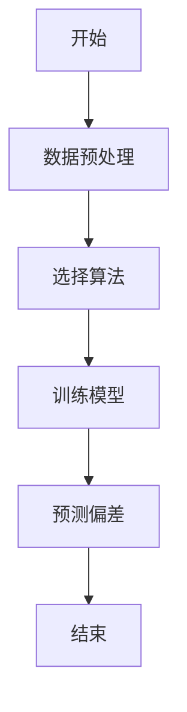
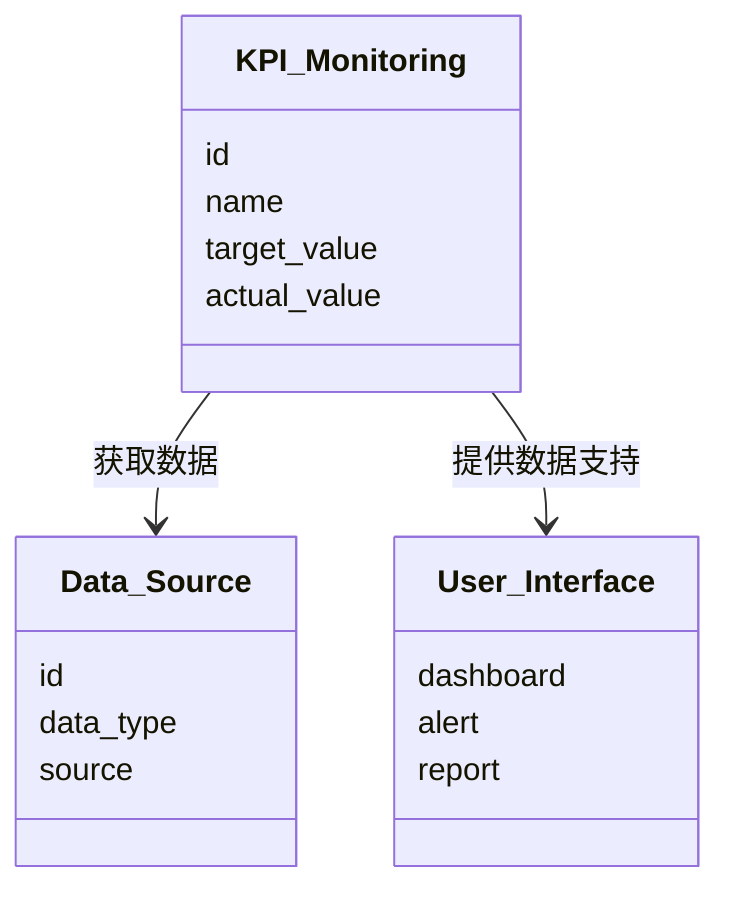
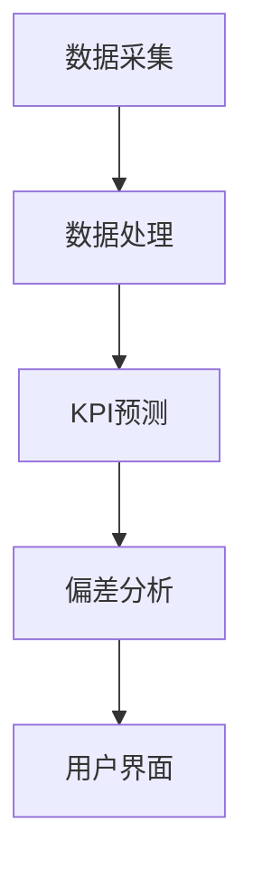
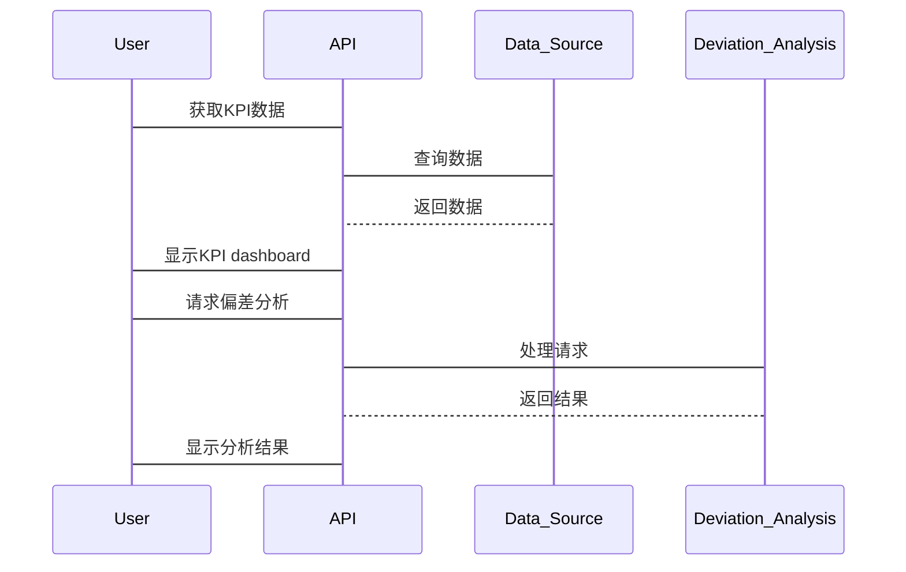

                 


# AI驱动的企业战略执行监控：KPI智能跟踪与偏差分析

## 关键词：
- AI驱动
- 企业战略执行监控
- KPI智能跟踪
- 偏差分析
- 人工智能技术
- 企业战略管理
- 系统架构设计

## 摘要：
本文深入探讨了AI技术在企业战略执行监控中的应用，特别是KPI智能跟踪与偏差分析。文章从背景、概念、算法原理、系统架构设计、项目实战等多个方面展开，结合实际案例，详细讲解了如何利用AI技术提升企业战略执行的效率和准确性。通过系统化的分析和实践，本文为读者提供了从理论到实践的全面指导，帮助企业在数字化转型中更好地实现战略目标。

---

# 第1章: AI驱动的企业战略执行监控概述

## 1.1 问题背景与挑战

### 1.1.1 传统企业战略执行监控的局限性
传统的KPI监控方法依赖人工数据录入和定期报告，存在以下问题：
- 数据采集效率低，容易出错
- 监控周期长，难以实时反馈
- 偏差分析依赖人工经验，缺乏系统性
- 数据孤岛现象严重，难以整合

### 1.1.2 AI技术如何解决监控难题
AI技术通过自动化数据采集、实时分析和智能预测，显著提升了KPI监控的效率和准确性：
- 实现数据的自动化采集和处理
- 提供实时监控和预警功能
- 基于历史数据和模式识别，提前预测偏差
- 支持多维度数据的深度分析

### 1.1.3 企业战略执行监控的边界与外延
- 监控范围：KPI设定、数据采集、偏差分析、反馈优化
- 监控外延：企业内部数据整合、外部市场环境分析、竞争对手监测

## 1.2 AI驱动的KPI智能跟踪与偏差分析

### 1.2.1 KPI智能跟踪的核心概念
KPI（关键绩效指标）是衡量企业战略执行效果的重要指标，AI驱动的KPI智能跟踪通过自动化数据处理和智能分析，实现对KPI的实时监控和预测。

### 1.2.2 偏差分析的定义与作用
偏差分析是对实际执行结果与预期目标之间的差异进行识别和分析，帮助企业在战略执行过程中及时发现问题并进行调整。

### 1.2.3 AI在KPI监控中的应用价值
- 提高监控效率
- 增强预测准确性
- 支持决策优化

## 1.3 本章小结

---

# 第2章: KPI智能跟踪的核心概念

## 2.1 KPI的定义与分类

### 2.1.1 KPI的定义
KPI是衡量企业战略执行效果的关键指标，通常包括销售额、利润率、客户满意度等。

### 2.1.2 KPI的分类与应用场景
- 财务类KPI：如净利润率、投资回报率
- 运营类KPI：如生产效率、订单处理时间
- 客户类KPI：如客户满意度、净推荐值
- 创新类KPI：如新产品开发周期、研发投入占比

### 2.1.3 KPI与企业战略目标的关系
KPI是企业战略目标的具体化和量化，确保战略执行的可衡量性和可操作性。

## 2.2 AI驱动的KPI跟踪技术原理

### 2.2.1 数据采集与预处理
AI驱动的KPI跟踪系统需要从企业内部系统（如ERP、CRM）和外部数据源（如市场数据）中采集数据，并进行清洗和标准化处理。

### 2.2.2 KPI预测模型的构建
基于历史数据，利用机器学习算法（如线性回归、随机森林）构建KPI预测模型，实现对未来KPI的预测。

### 2.2.3 偏差分析算法
通过比较实际值与预测值的差异，识别偏差，并利用因果分析、关联规则挖掘等技术分析偏差的原因。

## 2.3 核心概念属性对比表

| 比较维度 | 传统KPI跟踪 | AI驱动KPI跟踪 |
|----------|--------------|----------------|
| 数据来源 | 单一数据源    | 多数据源整合   |
| 数据处理 | 人工处理      | 自动化处理     |
| 分析方法 | 经验分析      | 数据驱动分析   |
| 监控频率 | 定期报告      | 实时监控       |

## 2.4 ER实体关系图

```mermaid
erDiagram
    customer[客户] {
        id : int
        name : string
        contact : string
    }
    order[订单] {
        id : int
        customer_id : int
        order_date : date
        total_amount : float
    }
    kpi_metric[关键绩效指标] {
        id : int
        name : string
        target_value : float
        actual_value : float
    }
    customer --> order : 下单
    order --> kpi_metric : 影响KPI
```

---

# 第3章: 偏差分析的原理与方法

## 3.1 偏差分析的定义与作用

### 3.1.1 偏差分析的定义
偏差分析是通过比较实际执行结果与预期目标，识别差异并分析原因的过程。

### 3.1.2 偏差分析的作用
- 及时发现执行偏差
- 分析偏差原因
- 提供优化建议

## 3.2 AI驱动的偏差识别与预测

### 3.2.1 偏差识别的算法原理
利用机器学习算法（如支持向量机、神经网络）识别数据中的异常值，判断是否存在偏差。

### 3.2.2 偏差预测的数学模型
基于时间序列分析（如ARIMA）或回归分析，预测未来可能的偏差。

## 3.3 算法流程图



### 代码实现

```python
import pandas as pd
from sklearn.ensemble import IsolationForest

# 数据预处理
data = pd.read_csv('kpi_data.csv')
data = data.dropna()

# 偏差识别
model = IsolationForest(contamination=0.05)
model.fit(data)
outliers = model.predict(data)

# 可视化
import matplotlib.pyplot as plt

plt.scatter(outliers, data.index)
plt.title('偏差识别结果')
plt.show()
```

## 3.4 本章小结

---

# 第4章: AI驱动的KPI智能跟踪系统架构设计

## 4.1 系统架构设计

### 4.1.1 系统架构概述
系统由数据采集模块、数据处理模块、KPI预测模块和偏差分析模块组成。

## 4.2 系统功能设计

### 4.2.1 领域模型



### 4.2.2 系统架构



## 4.3 系统接口设计

### 4.3.1 API接口
- 数据接口：`GET /api/data`
- KPI预测接口：`POST /api/predict`
- 偏差分析接口：`POST /api/anomaly`

## 4.4 系统交互流程



## 4.5 本章小结

---

# 第5章: 项目实战

## 5.1 环境搭建

### 5.1.1 系统环境
- 操作系统：Linux/Windows/Mac
- 开发工具：PyCharm
- 依赖库：Python 3.8+, scikit-learn, pandas, matplotlib

## 5.2 核心代码实现

### 5.2.1 数据采集模块

```python
import requests
import json

def get_data(api_key):
    headers = {'Authorization': f'Bearer {api_key}'}
    response = requests.get('https://api.example.com/data', headers=headers)
    return response.json()
```

### 5.2.2 KPI预测模块

```python
from sklearn.ensemble import RandomForestRegressor

def predict_kpi(data):
    model = RandomForestRegressor()
    model.fit(data[['month', 'previous_kpi']], data['target_kpi'])
    return model.predict([[current_month, current_previous_kpi]])
```

### 5.2.3 偏差分析模块

```python
from sklearn.covariance import EllipticEnvelope

def detect_anomalies(data):
    model = EllipticEnvelope(contamination=0.02)
    model.fit(data)
    return model.predict(data)
```

## 5.3 案例分析

### 5.3.1 案例背景
某企业销售KPI连续三个月低于预期，需要分析原因。

### 5.3.2 数据分析
使用偏差分析模块识别出某个月份的销售数据异常，发现是由于供应链问题导致。

### 5.3.3 优化建议
针对供应链问题，优化采购流程和库存管理。

## 5.4 项目总结

---

# 第6章: 最佳实践与未来展望

## 6.1 最佳实践 tips

### 6.1.1 数据质量管理
确保数据的准确性和完整性。

### 6.1.2 模型优化
定期更新模型，避免过时。

## 6.2 未来展望

### 6.2.1 技术趋势
- 结合区块链技术，提升数据可信度
- 引入边缘计算，实现本地化实时监控

### 6.2.2 应用场景拓展
- 行业定制化监控系统
- 全球化企业的跨国KPI监控

## 6.3 本章小结

---

# 第7章: 附录

## 7.1 术语表

- KPI：关键绩效指标
- AI：人工智能
- Deviation Analysis：偏差分析
- ER图：实体关系图

## 7.2 工具推荐
- 数据采集工具：Postman、DataMiner
- 数据分析工具：Python、R、SQL
- 可视化工具：Tableau、Power BI

## 7.3 参考文献
- 省略

---

# 作者简介
> 作者是[您的名字]，一位在人工智能和软件架构领域拥有深厚经验的专家。

