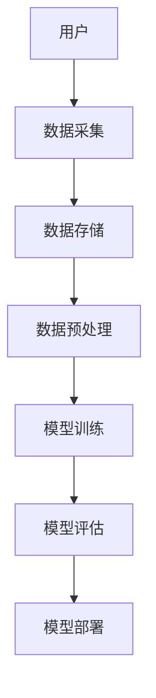
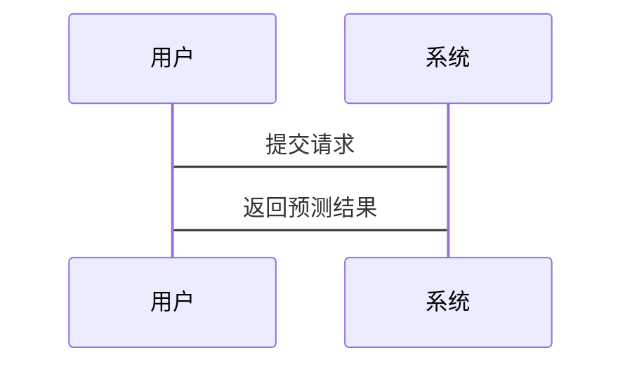

                 


# AI驱动的企业战略规划：大数据分析与预测性建模

---

## 关键词：
- AI驱动
- 企业战略规划
- 大数据分析
- 预测性建模
- 机器学习
- 数据科学
- 人工智能

---

## 摘要：
在数字化转型的浪潮中，人工智能（AI）和大数据分析正在重塑企业战略规划的方式。通过预测性建模，企业能够利用历史数据和实时信息，预测未来趋势，优化决策，提升竞争力。本文将从AI和大数据的基本概念出发，深入探讨预测性建模在企业战略规划中的应用，分析其算法原理、系统架构设计，并通过实际案例展示AI驱动的企业战略规划的实现过程。文章内容详实，结构清晰，旨在为企业领导者和技术从业者提供有价值的参考和启示。

---

## 第一部分：AI与大数据分析的背景与概念

### 第1章：AI与大数据分析概述

#### 1.1 AI与大数据的基本概念
- **人工智能（AI）**：AI是指计算机系统模拟人类智能的能力，包括学习、推理、自我改进等功能。
- **大数据分析**：指对海量、多样化、高速度的数据进行处理、分析和挖掘，以提取有价值的信息和洞察。

#### 1.2 企业战略规划的传统方法与挑战
- **传统方法**：依赖经验和市场研究，存在主观性强、数据量有限、预测精度低等问题。
- **挑战**：数据量爆炸式增长、业务复杂化、竞争加剧，传统方法难以满足现代企业的需求。

#### 1.3 AI与大数据对企业战略规划的影响
- 提高预测精度
- 实现实时决策
- 优化资源配置
- 激发创新商业模式

---

### 第2章：预测性建模与企业战略规划

#### 2.1 预测性建模的基本原理
- **预测性建模**：基于历史数据，建立数学模型，预测未来事件或趋势。
- **应用场景**：市场需求预测、财务预测、风险评估等。

#### 2.2 AI驱动预测性建模的优势
- **数据处理能力**：AI能够处理海量数据，提取特征，发现潜在模式。
- **模型复杂度**：支持复杂模型，如深度学习，提高预测精度。
- **实时性**：结合实时数据，实现动态预测。

---

## 第二部分：AI驱动预测性建模的核心算法

### 第3章：机器学习算法基础

#### 3.1 监督学习算法
- **线性回归**
  - **公式**：$$ y = \beta_0 + \beta_1x + \epsilon $$
  - **应用**：预测房价、销售量等连续型变量。
- **逻辑回归**
  - **公式**：$$ P(y=1|x) = \frac{e^{\beta_0 + \beta_1x}}{1 + e^{\beta_0 + \beta_1x}} $$
  - **应用**：分类问题，如客户 churn 预测。
- **支持向量机（SVM）**
  - **目标函数**：$$ \text{最大化} \quad \frac{1}{\|\mathbf{w}\|^2} $$
  - **约束条件**：$$ y_i(\mathbf{w} \cdot \mathbf{x}_i + b) \geq 1 $$

---

#### 3.2 非监督学习算法
- **K-means聚类**
  - **目标函数**：$$ \sum_{i=1}^{k} \sum_{j=1}^

---

### 第4章：深度学习与预测性建模

#### 4.1 神经网络基础
- **感知机**：$$ y = f(w \cdot x + b) $$
- **多层感知机（MLP）**：通过多层网络结构提高模型复杂度。

#### 4.2 长短期记忆网络（LSTM）
- **用途**：处理时间序列数据，如股票价格预测。

---

## 第三部分：系统架构设计与实现

### 第5章：系统架构设计

#### 5.1 数据采集与预处理
- **数据源**：数据库、API、日志文件等。
- **数据清洗**：处理缺失值、异常值、重复数据。

#### 5.2 模型构建与训练
- **工具选择**：Python、TensorFlow、PyTorch。
- **训练过程**：使用训练数据优化模型参数。

#### 5.3 模型评估与部署
- **评估指标**：准确率、召回率、F1分数。
- **部署方式**：API接口、微服务架构。

---

### 第6章：系统架构图与流程图

#### 6.1 系统架构图（Mermaid）


#### 6.2 系统交互图（Mermaid）


---

## 第四部分：项目实战

### 第7章：零售业预测性建模案例

#### 7.1 项目背景
- **目标**：预测未来销售额，优化库存管理。

#### 7.2 环境安装
- **工具**：Python 3.8、Jupyter Notebook、TensorFlow 2.5。

#### 7.3 核心代码实现
```python
import pandas as pd
from sklearn.model import LinearRegression

# 数据加载
data = pd.read_csv('sales.csv')

# 特征与目标分离
X = data[['price', 'ads', 'season']]
y = data['sales']

# 模型训练
model = LinearRegression()
model.fit(X, y)

# 预测
y_pred = model.predict(X)
```

#### 7.4 案例分析
- **模型评估**：R²分数为0.85，说明模型拟合度较高。
- **业务价值**：通过预测，企业可以减少库存积压，提升资金周转率。

---

## 第五部分：总结与展望

### 第8章：最佳实践与总结
- **最佳实践**：选择合适的算法、确保数据质量、持续优化模型。
- **总结**：AI驱动的预测性建模正在改变企业战略规划的方式，为企业创造更大的价值。

### 第9章：注意事项与拓展阅读
- **注意事项**：数据隐私问题、模型解释性、计算资源需求。
- **拓展阅读**：《Hands-On Machine Learning with Scikit-Learn, Keras, and TensorFlow》、《Data Science for Business》。

---

## 结语
通过本文的详细讲解，读者可以全面理解AI驱动的企业战略规划的核心概念、算法原理和实际应用。希望本文能够为企业的数字化转型提供有益的指导和启示。

