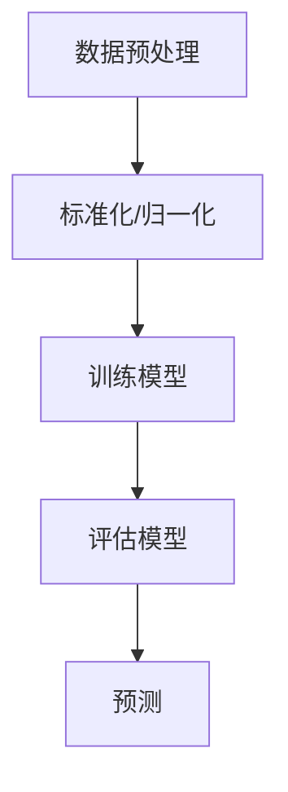
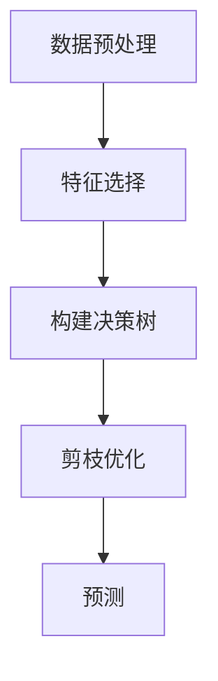
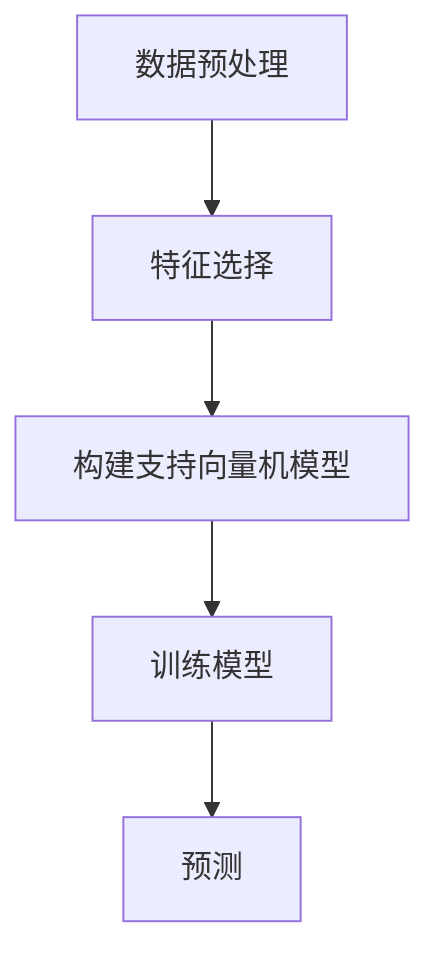
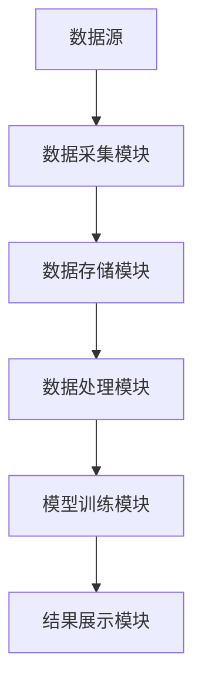

                 


# AI驱动的企业战略规划：大数据分析与预测性建模的融合

## 关键词：
- AI驱动
- 企业战略规划
- 大数据分析
- 预测性建模
- 人工智能
- 系统架构设计

## 摘要：
本文探讨了如何利用人工智能和大数据分析技术来优化企业战略规划。通过结合大数据分析与预测性建模，企业能够更精准地预测市场趋势、识别潜在风险，并制定更具前瞻性的战略决策。文章从基本概念、算法原理、系统架构设计到实际项目实战，全面阐述了AI驱动的企业战略规划的实现过程，为读者提供了理论与实践相结合的深度分析。

---

## 第三章: AI驱动的企业战略规划

### 3.1 预测性建模的核心算法

#### 3.1.1 线性回归
##### 算法原理
线性回归是一种简单而强大的预测性建模方法，主要用于预测连续型变量。其核心思想是通过最小化预测值与实际值之间的平方差之和，找到最佳拟合直线。

##### 算法流程图


##### Python代码实现
```python
import numpy as np
from sklearn.linear_model import LinearRegression

# 示例数据
X = np.array([[1], [2], [3], [4], [5]])
y = np.array([2, 4, 5, 4, 6])

# 训练模型
model = LinearRegression()
model.fit(X, y)

# 预测
new_X = np.array([[6]])
print(model.predict(new_X))  # 输出预测结果
```

#### 3.1.2 决策树
##### 算法原理
决策树是一种基于树结构的预测模型，能够处理分类和回归问题。通过信息_gain来选择特征，构建树的结构，最终得到决策规则。

##### 算法流程图


##### Python代码实现
```python
from sklearn.tree import DecisionTreeRegressor
from sklearn.model_selection import train_test_split

# 示例数据
X = np.array([[1, 2], [3, 4], [5, 6], [7, 8], [9, 10]])
y = np.array([2, 3, 5, 6, 9])

# 训练模型
model = DecisionTreeRegressor()
model.fit(X, y)

# 预测
new_X = np.array([[11, 12]])
print(model.predict(new_X))  # 输出预测结果
```

#### 3.1.3 支持向量机（SVM）
##### 算法原理
支持向量机是一种监督学习算法，适用于分类和回归问题。通过将数据映射到高维空间，并使用核函数进行非线性分割，找到最优超平面。

##### 算法流程图


##### Python代码实现
```python
from sklearn.svm import SVR
from sklearn.model_selection import train_test_split

# 示例数据
X = np.array([[1, 2], [3, 4], [5, 6], [7, 8], [9, 10]])
y = np.array([2, 3, 5, 6, 9])

# 训练模型
model = SVR(kernel='rbf')
model.fit(X, y)

# 预测
new_X = np.array([[11, 12]])
print(model.predict(new_X))  # 输出预测结果
```

### 3.2 基于预测性建模的企业战略规划

#### 3.2.1 预测性建模在市场趋势分析中的应用
- 通过历史销售数据和市场数据，构建预测模型，预测未来市场趋势。
- 示例：利用时间序列数据，预测下一季度的销售额。

#### 3.2.2 风险评估与预警
- 利用大数据分析，识别潜在风险因素，并通过预测模型评估风险的可能性。
- 示例：预测客户流失率，提前制定客户保留策略。

#### 3.2.3 资源优化配置
- 通过预测性建模，优化企业资源分配，提高运营效率。
- 示例：预测生产需求，优化供应链管理。

### 3.3 系统架构设计

#### 3.3.1 系统功能设计
- 数据采集模块：从多个数据源获取数据。
- 数据处理模块：清洗、转换和预处理数据。
- 模型训练模块：构建和优化预测模型。
- 结果展示模块：可视化预测结果，生成报告。

#### 3.3.2 系统架构图


#### 3.3.3 接口设计
- 数据接口：与第三方数据源对接。
- API接口：提供预测结果的查询接口。

### 3.4 项目实战

#### 3.4.1 环境搭建
- 安装必要的库：Python、numpy、pandas、scikit-learn。

#### 3.4.2 数据预处理
- 清洗数据，处理缺失值和异常值。
- 数据标准化或归一化处理。

#### 3.4.3 模型训练与优化
- 选择合适的算法，训练模型。
- 调参优化，提高模型性能。

#### 3.4.4 结果分析与可视化
- 使用可视化工具（如Matplotlib、Seaborn）展示预测结果。
- 分析模型的准确性和可靠性。

---

通过以上步骤，企业可以利用AI和大数据分析技术，构建高效的预测性建模系统，优化战略规划过程，提升决策的科学性和准确性。

