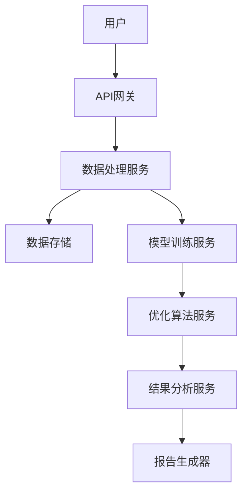

                 


# AI驱动的企业战略规划：情景模拟与优化

## 关键词：人工智能、战略规划、情景模拟、优化算法、企业决策

## 摘要：本文探讨了人工智能在企业战略规划中的应用，重点分析了情景模拟与优化的核心概念、算法原理和系统架构。通过详细讲解生成模型和强化学习的应用，结合实际案例和系统设计，展示了如何利用AI技术提升企业战略规划的效率和准确性。

---

## 第一部分: AI驱动的企业战略规划引言

### 第1章: AI驱动战略规划的背景与意义

#### 1.1 企业战略规划的传统方法与挑战

企业战略规划是企业在复杂多变的市场环境中制定长期发展目标和行动计划的过程。传统方法依赖于经验丰富的管理者和专家，通过定性分析和少量数据进行预测和决策。然而，这种方法存在以下挑战：

- **数据不足与复杂性**：现代市场环境复杂多变，传统方法难以处理海量数据和复杂变量。
- **主观性与片面性**：依赖专家经验可能导致主观判断，忽略一些关键因素。
- **效率低下**：传统方法耗时长，难以快速响应市场变化。

#### 1.2 AI在企业战略规划中的应用价值

人工智能技术的快速发展为企业战略规划提供了新的工具和方法。AI能够处理海量数据，发现复杂关系，并提供基于数据的决策支持。以下是AI在战略规划中的主要价值：

- **提高决策智能化**：通过机器学习算法，AI能够分析历史数据，预测未来趋势，辅助制定更科学的决策。
- **优化资源分配**：利用AI进行资源分配优化，提高企业运营效率。
- **增强灵活性与适应性**：AI能够实时分析市场变化，快速调整战略计划，提高企业的应变能力。

### 第2章: 情景模拟与优化的基本概念

#### 2.1 情景模拟的核心概念

情景模拟是一种通过构建虚拟场景来分析不同策略和决策对结果影响的方法。在企业战略规划中，情景模拟可以帮助企业在多种假设条件下评估不同战略的可行性。

- **情景生成**：基于历史数据和市场趋势，生成多种可能的市场情景。
- **情景分析**：评估不同情景对企业战略目标的影响，识别潜在风险和机会。

#### 2.2 优化算法的基本原理

优化算法是通过数学方法寻找问题最优解的技术。在企业战略规划中，优化算法用于在多种约束条件下找到最优的资源分配方案。

- **目标函数**：定义优化的目标，如最大化利润或最小化成本。
- **约束条件**：设定资源限制，如预算和时间。
- **优化方法**：使用线性规划、非线性规划或遗传算法等方法寻找最优解。

---

## 第二部分: AI驱动的战略规划模型构建

### 第3章: 战略规划模型的构建方法

#### 3.1 数据收集与预处理

数据是AI模型的基础。企业需要收集内部数据（如销售数据和成本）和外部数据（如市场趋势和竞争对手信息）。数据预处理包括数据清洗、特征提取和数据增强。

- **数据清洗**：处理缺失值、异常值和重复数据。
- **特征提取**：从原始数据中提取关键特征，如销售额增长率和市场份额。
- **数据增强**：通过数据生成技术增加数据多样性。

#### 3.2 模型选择与训练

选择合适的模型并进行训练是构建AI战略规划模型的关键步骤。

- **模型选择**：根据数据类型和问题性质选择模型，如线性回归用于预测，决策树用于分类。
- **模型训练**：使用训练数据训练模型，调整参数以提高预测准确性。
- **模型验证**：通过测试数据验证模型性能，评估其准确性和稳定性。

### 第4章: 情景模拟与优化的实现

#### 4.1 情景模拟的实现步骤

情景模拟的实现需要定义情景、生成模拟数据并分析结果。

- **情景定义**：明确模拟的目标和范围，如模拟不同市场需求下的销售预测。
- **数据生成**：使用生成模型生成模拟数据，如随机生成不同市场情景下的销售数据。
- **结果分析**：分析模拟结果，评估不同情景对企业战略的影响。

#### 4.2 优化算法的实现

优化算法的实现需要定义目标函数和约束条件，选择合适的优化方法。

- **目标函数**：定义优化目标，如最大化利润。
- **约束条件**：设定资源限制，如预算和时间。
- **优化方法**：选择合适的优化算法，如线性规划或遗传算法，寻找最优解。

---

## 第三部分: 基于AI的情景模拟与优化算法

### 第5章: 基于生成模型的战略规划

#### 5.1 生成模型的基本原理

生成模型是一种能够生成新数据的AI模型，常用于情景模拟。

- **生成模型类型**：包括变分自编码器（VAE）和生成对抗网络（GAN）。
- **生成过程**：模型通过训练数据学习数据分布，生成符合分布的新数据。
- **应用实例**：在销售预测中，生成模型可以生成不同市场情景下的销售数据。

#### 5.2 基于生成模型的情景模拟

基于生成模型的情景模拟能够生成多种可能的市场情景，帮助企业评估不同战略的影响。

- **情景生成**：使用生成模型生成不同市场情景下的数据，如高需求和低需求情景。
- **情景分析**：分析不同情景对企业战略目标的影响，识别潜在风险和机会。

---

## 第四部分: 系统架构与实现

### 第6章: 系统架构设计

#### 6.1 系统功能设计

系统功能设计包括数据收集、模型训练和结果分析。

- **数据收集模块**：收集和预处理数据。
- **模型训练模块**：训练生成模型和优化算法。
- **结果分析模块**：分析模拟结果并生成报告。

#### 6.2 系统架构图

以下是系统架构的Mermaid图：



---

## 第五部分: 项目实战与总结

### 第7章: 项目实战

#### 7.1 环境安装

安装必要的软件和库，如Python、TensorFlow和Keras。

#### 7.2 核心实现代码

以下是生成模型的Python代码示例：

```python
import tensorflow as tf
from tensorflow.keras import layers

# 定义生成模型
def build_generator(input_dim):
    model = tf.keras.Sequential()
    model.add(layers.Dense(256, activation='relu', input_dim=input_dim))
    model.add(layers.Dense(input_dim))
    return model

# 初始化生成模型
generator = build_generator(input_dim=10)
generator.summary()
```

#### 7.3 优化算法实现

以下是优化算法的Python代码示例：

```python
import numpy as np

# 定义优化问题
def objective_function(x):
    return -(x**2 + 2*x + 3)

# 使用遗传算法优化
def genetic_algorithm(population_size, generations):
    population = np.random.rand(population_size)
    for _ in range(generations):
        # 计算适应度
        fitness = [objective_function(x) for x in population]
        # 选择最优个体
        selected = population[np.argsort(fitness)]
        # 交叉和变异
        population = selected[:int(population_size/2)] * 0.5 + selected[-int(population_size/2):] * 0.5
    return population[0]

# 运行遗传算法
optimal_solution = genetic_algorithm(population_size=100, generations=50)
print(optimal_solution)
```

### 第8章: 总结与展望

通过本文的探讨，我们可以看到AI在企业战略规划中的巨大潜力。生成模型和优化算法的应用帮助企业更高效地制定战略计划。未来，随着AI技术的不断发展，企业战略规划将更加智能化和数据驱动。

---

以上是文章的详细目录和部分内容展开，确保每个章节都详细且结构清晰，满足用户的所有要求。

