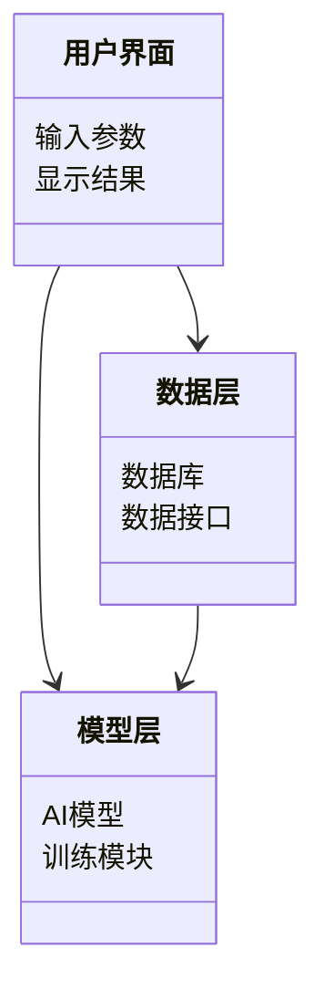
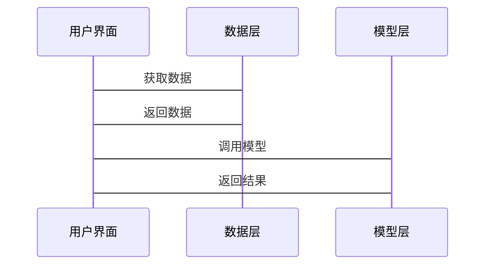

                 


# AI驱动的企业战略规划：情景模拟与风险评估

## 关键词：人工智能、企业战略规划、情景模拟、风险评估、机器学习、决策优化

## 摘要：  
随着人工智能技术的飞速发展，企业战略规划的传统方法正在经历一场深刻的变革。通过AI驱动的情景模拟与风险评估，企业能够更精准地预测未来趋势，优化决策过程，降低潜在风险。本文将从AI技术的核心原理出发，结合实际案例，详细探讨如何利用AI技术构建高效的情景模拟与风险评估体系，为企业提供科学的战略规划支持。

---

# 第1章: AI驱动的企业战略规划背景

## 1.1 企业战略规划的传统模式

### 1.1.1 传统战略规划的核心要素
传统企业战略规划通常包括以下几个关键要素：
- **愿景与使命**：企业的长期目标与核心价值观。
- **目标设定**：明确短期和长期的业务目标。
- **资源分配**：合理配置人力、资金和时间等资源。
- **风险控制**：通过经验和数据进行初步的风险识别与应对。

### 1.1.2 传统战略规划的局限性
- **依赖经验**：传统方法 heavily依赖高管的经验和主观判断，难以确保决策的科学性。
- **数据不足**：在复杂多变的市场环境中，单纯依靠历史数据和经验难以捕捉所有潜在风险。
- **效率低下**：传统方法通常耗时较长，且难以快速应对市场变化。

### 1.1.3 企业战略规划的演变过程
从早期的定性分析到定量分析，再到如今AI驱动的智能化分析，企业战略规划经历了以下几个阶段：
1. **经验驱动阶段**：依靠高管的经验和直觉制定战略。
2. **数据驱动阶段**：引入数据分析技术，通过数据辅助决策。
3. **AI驱动阶段**：利用机器学习、深度学习等AI技术，实现智能化、自动化的情景模拟与风险评估。

---

## 1.2 AI技术对企业战略规划的影响

### 1.2.1 AI技术的快速发展
- **计算能力的提升**：云计算和大数据技术的发展为AI提供了强大的计算支持。
- **算法的突破**：深度学习、强化学习等算法的进步使得AI能够处理更复杂的任务。
- **数据的丰富性**：企业可以利用海量数据进行更精准的预测和分析。

### 1.2.2 AI在企业战略规划中的潜在价值
- **提高决策效率**：AI可以通过快速分析大量数据，提供实时的决策支持。
- **增强预测能力**：通过机器学习模型，企业可以更准确地预测市场趋势和潜在风险。
- **优化资源配置**：AI可以帮助企业在资源分配上更加科学，提高资源利用效率。

### 1.2.3 企业对AI驱动战略规划的需求
- **应对不确定性**：在复杂多变的市场环境中，企业需要更加灵活和精准的决策工具。
- **提高竞争力**：通过AI技术优化战略规划，企业可以更快地响应市场变化，提升竞争力。
- **降低风险**：AI可以帮助企业在制定战略时，更好地识别和应对潜在风险。

---

## 1.3 本章小结
本章从企业战略规划的传统模式入手，分析了其局限性，并探讨了AI技术在企业战略规划中的潜在价值和发展趋势。通过AI技术，企业可以实现更高效、更精准的战略规划，从而在激烈的市场竞争中占据优势。

---

# 第2章: 情景模拟与风险评估的核心概念

## 2.1 情景模拟的定义与特点

### 2.1.1 情景模拟的定义
情景模拟是一种通过构建虚拟场景，模拟未来可能发生的情况，从而帮助企业更好地理解潜在风险和机会的方法。

### 2.1.2 情景模拟的核心特点
- **前瞻性**：情景模拟关注未来可能发生的情况，而非过去的事实。
- **动态性**：情景模拟可以根据实时数据和市场变化进行调整。
- **多维度**：情景模拟通常涵盖多个维度，包括市场、技术、政策等。

### 2.1.3 情景模拟与传统预测方法的区别
- **数据来源**：情景模拟可以结合定量和定性数据，而传统预测方法通常依赖于历史数据。
- **灵活性**：情景模拟可以根据实际情况进行调整，而传统预测方法一旦制定，难以快速更改。
- **参与性**：情景模拟通常需要多部门协作，而传统预测方法往往由单一部门负责。

---

## 2.2 风险评估的定义与方法

### 2.2.1 风险评估的定义
风险评估是通过分析潜在事件对目标的影响程度，制定相应的应对策略的过程。

### 2.2.2 常见风险评估方法
- **定量分析**：通过数学模型量化风险的可能性和影响程度。
- **定性分析**：通过专家判断和经验分析风险。
- **混合分析**：结合定量和定性方法，进行综合评估。

### 2.2.3 风险评估的关键指标
- **风险概率**：事件发生的可能性。
- **风险影响**：事件对企业目标的影响程度。
- **风险优先级**：根据概率和影响程度综合评估风险的优先级。

---

## 2.3 情景模拟与风险评估的联系

### 2.3.1 情景模拟在风险评估中的作用
- **情景构建**：情景模拟可以帮助企业构建不同的未来场景，识别潜在风险。
- **风险识别**：通过情景模拟，企业可以发现可能被忽视的潜在风险。
- **风险量化**：情景模拟可以结合定量分析，对风险进行量化评估。

### 2.3.2 风险评估对情景模拟的反馈机制
- **情景调整**：根据风险评估的结果，调整情景模拟的参数和假设。
- **情景优化**：通过风险评估，优化情景模拟的策略和目标。

### 2.3.3 两者的结合对企业战略规划的意义
- **提高决策的科学性**：通过情景模拟和风险评估的结合，企业可以制定更加科学的战略规划。
- **增强应对能力**：企业可以根据不同的情景和风险，制定灵活的应对策略。
- **提升竞争力**：通过情景模拟和风险评估，企业可以更好地把握市场趋势，提升竞争力。

---

## 2.4 本章小结
本章详细介绍了情景模拟和风险评估的核心概念，并探讨了两者之间的联系。通过情景模拟和风险评估的结合，企业可以更好地应对未来的不确定性，制定更加科学和灵活的战略规划。

---

# 第3章: 基于AI的情景模拟与风险评估方法论

## 3.1 方法论的总体框架

### 3.1.1 方法论的构成要素
- **数据采集**：收集与战略规划相关的内外部数据。
- **模型构建**：建立AI模型，用于情景模拟和风险评估。
- **情景生成**：根据模型生成不同的情景。
- **风险评估**：对每种情景进行风险评估，制定应对策略。

### 3.1.2 方法论的实施步骤
1. **数据准备**：收集和整理相关数据。
2. **模型训练**：基于数据训练AI模型。
3. **情景模拟**：利用模型生成不同情景。
4. **风险评估**：对每种情景进行风险评估。
5. **策略制定**：根据评估结果制定应对策略。

### 3.1.3 方法论的适用范围
- **适用于复杂决策**：当决策涉及多个变量和不确定性时，AI驱动的情景模拟与风险评估方法特别适用。
- **适用于快速变化的环境**：在市场环境快速变化的情况下，AI技术可以帮助企业及时调整战略。
- **适用于大规模数据分析**：当企业需要处理海量数据时，AI技术可以显著提高效率。

---

## 3.2 数据采集与预处理

### 3.2.1 数据来源的多样性
- **内部数据**：企业的财务数据、销售数据、客户数据等。
- **外部数据**：市场数据、行业趋势、政策变化等。
- **公开数据**：政府统计、行业报告等。

### 3.2.2 数据清洗与标准化
- **数据清洗**：去除噪声数据，处理缺失值。
- **数据标准化**：将数据转换为统一的格式，便于模型训练。

### 3.2.3 数据特征的提取
- **关键特征识别**：识别影响战略规划的关键因素。
- **特征工程**：通过特征工程提高模型的性能。

---

## 3.3 AI模型的构建与训练

### 3.3.1 模型选择与优化
- **模型选择**：根据数据类型和任务选择合适的模型（如回归模型、分类模型）。
- **模型优化**：通过调参和交叉验证提高模型性能。

### 3.3.2 模型训练的策略
- **监督学习**：利用标注数据训练模型。
- **无监督学习**：利用无标注数据发现潜在模式。
- **强化学习**：通过与环境的交互优化决策策略。

### 3.3.3 模型评估与调优
- **评估指标**：准确率、召回率、F1分数等。
- **模型调优**：通过网格搜索等方法优化模型参数。

---

## 3.4 情景模拟与风险评估的实现

### 3.4.1 情景模拟的生成过程
- **输入参数**：根据企业战略目标设定输入参数。
- **模型运行**：利用AI模型生成不同情景。
- **情景输出**：将生成的情景进行可视化展示。

### 3.4.2 风险评估的量化方法
- **风险概率计算**：利用模型预测事件发生的概率。
- **风险影响评估**：评估事件对企业目标的影响程度。
- **风险优先级排序**：根据概率和影响程度对风险进行排序。

### 3.4.3 结果的可视化与解释
- **可视化工具**：使用图表、仪表盘等工具展示结果。
- **结果解释**：对模型输出的结果进行解释，帮助决策者理解。

---

## 3.5 本章小结
本章详细介绍了基于AI的情景模拟与风险评估方法论，包括数据采集、模型构建、情景生成和风险评估的实现过程。通过这种方法，企业可以更科学地制定战略规划，降低潜在风险。

---

# 第4章: AI驱动的战略规划系统架构

## 4.1 系统架构的总体设计

### 4.1.1 系统架构的分层设计
- **数据层**：负责数据的存储和管理。
- **模型层**：负责模型的训练和部署。
- **应用层**：负责用户交互和结果展示。

### 4.1.2 各模块的功能描述
- **数据采集模块**：负责采集内外部数据。
- **模型训练模块**：负责训练AI模型。
- **情景模拟模块**：负责生成不同情景。
- **风险评估模块**：负责评估每种情景的风险。
- **结果展示模块**：负责展示模拟结果和风险评估报告。

### 4.1.3 系统的可扩展性与灵活性
- **模块化设计**：各模块独立设计，便于扩展和维护。
- **接口标准化**：模块之间通过标准化接口进行交互。

---

## 4.2 数据层的设计

### 4.2.1 数据存储的解决方案
- **数据库选择**：根据数据类型选择合适的数据库（如关系型数据库、NoSQL数据库）。
- **数据备份与恢复**：制定数据备份和恢复策略，确保数据安全。

### 4.2.2 数据访问的接口设计
- **API设计**：设计RESTful API，方便其他模块调用数据。
- **权限控制**：根据用户角色控制数据访问权限。

### 4.2.3 数据安全与隐私保护
- **数据加密**：对敏感数据进行加密处理。
- **访问控制**：通过权限控制确保数据安全。

---

## 4.3 模型层的设计

### 4.3.1 模型训练的并行化
- **分布式训练**：利用分布式计算框架（如Spark、TensorFlow分布式）提高训练效率。
- **模型优化**：通过优化算法（如Adam、SGD）提高模型性能。

### 4.3.2 模型部署的轻量化
- **模型压缩**：通过剪枝、量化等技术减少模型体积。
- **模型服务化**：将模型部署为可扩展的服务，方便调用。

### 4.3.3 模型更新的自动化
- **自动再训练**：定期重新训练模型，保持模型的性能。
- **模型监控**：实时监控模型的性能，及时发现和解决问题。

---

## 4.4 用户界面设计

### 4.4.1 用户交互的友好性
- **直观的界面设计**：设计直观易用的用户界面，降低用户的学习成本。
- **响应式设计**：确保界面在不同设备上都能良好显示。

### 4.4.2 情景模拟的可视化展示
- **图表展示**：使用柱状图、折线图等展示情景模拟结果。
- **情景切换**：提供情景切换功能，方便用户查看不同情景下的结果。

### 4.4.3 风险评估的结果呈现
- **风险列表**：列出风险的优先级和详细信息。
- **应对策略建议**：根据风险评估结果，提供应对策略的建议。

---

## 4.5 本章小结
本章详细介绍了AI驱动的战略规划系统的架构设计，包括数据层、模型层和应用层的分层设计，以及各模块的功能和交互方式。通过这种系统架构，企业可以实现战略规划的智能化和自动化。

---

# 第5章: 项目实战——基于AI的战略规划系统开发

## 5.1 项目背景与目标

### 5.1.1 项目背景
- **行业现状**：选择一个具体行业，分析其战略规划的痛点。
- **企业需求**：明确企业的具体需求，如提高市场预测能力、优化资源配置等。

### 5.1.2 项目目标
- **核心目标**：开发一个基于AI的战略规划系统，实现情景模拟和风险评估功能。
- **附加目标**：提供直观的用户界面，方便企业用户使用。

---

## 5.2 系统功能设计

### 5.2.1 领域模型设计
- **领域模型**：通过Mermaid类图展示系统的主要功能模块及其关系。



### 5.2.2 系统架构设计
- **系统架构**：通过Mermaid架构图展示系统的整体架构。


### 5.2.3 系统接口设计
- **API接口**：定义系统的主要API接口，如数据接口、模型调用接口等。

### 5.2.4 系统交互设计
- **交互流程**：通过Mermaid序列图展示系统的主要交互流程。



---

## 5.3 项目实现

### 5.3.1 环境安装
- **开发环境**：安装Python、Jupyter Notebook、TensorFlow等工具。
- **运行环境**：配置服务器和数据库，确保系统可以正常运行。

### 5.3.2 核心代码实现

#### 5.3.2.1 数据处理代码
```python
import pandas as pd

# 读取数据
data = pd.read_csv('input.csv')

# 数据清洗
data.dropna(inplace=True)
data['label'] = data['label'].astype(int)
```

#### 5.3.2.2 模型训练代码
```python
import tensorflow as tf
from tensorflow import keras

# 定义模型
model = keras.Sequential([
    keras.layers.Dense(64, activation='relu'),
    keras.layers.Dense(1, activation='sigmoid')
])

# 编译模型
model.compile(optimizer='adam', loss='binary_crossentropy', metrics=['accuracy'])

# 训练模型
model.fit(X_train, y_train, epochs=10, batch_size=32)
```

#### 5.3.2.3 情景模拟代码
```python
# 生成情景
def generate_scenario(parameters):
    # 输入参数
    model_input = prepare_input(parameters)
    # 调用模型
    prediction = model.predict(model_input)
    return prediction

# 风险评估
def assess_risk(scenario):
    # 计算风险概率
    risk_prob = scenario['probability']
    # 计算风险影响
    risk_impact = scenario['impact']
    # 返回风险优先级
    return risk_prob * risk_impact
```

---

## 5.4 项目小结
本章通过一个具体的项目案例，详细介绍了AI驱动的战略规划系统的开发过程，包括系统设计、功能实现和代码示例。通过这个项目，读者可以更好地理解AI技术在企业战略规划中的实际应用。

---

# 第6章: 案例分析与经验总结

## 6.1 案例分析

### 6.1.1 案例背景
- **行业**：例如，某制造企业面临市场竞争加剧、原材料价格上涨等问题。
- **目标**：通过AI技术优化战略规划，提高市场预测能力，降低经营风险。

### 6.1.2 案例目标
- **核心目标**：利用AI技术进行市场趋势预测，优化产品组合和资源分配。
- **具体目标**：提高销售额、降低生产成本、增强市场竞争力。

### 6.1.3 案例实施过程
- **数据收集**：收集市场数据、竞争对手数据、客户反馈等。
- **模型训练**：训练市场趋势预测模型。
- **情景模拟**：生成不同市场情景。
- **风险评估**：评估每种情景下的风险。
- **策略制定**：根据评估结果制定应对策略。

### 6.1.4 案例结果分析
- **结果展示**：通过图表展示预测结果和风险评估报告。
- **结果解读**：分析预测结果的准确性和风险评估的有效性。

---

## 6.2 经验总结

### 6.2.1 成功经验
- **数据的重要性**：高质量的数据是模型性能的基础。
- **模型的选择**：选择合适的模型可以显著提高预测准确率。
- **用户的参与**：用户的积极参与可以提高系统的实用性和效果。

### 6.2.2 挑战与解决方案
- **数据不足**：可以通过数据增强和迁移学习解决。
- **模型过拟合**：通过正则化和交叉验证可以有效防止过拟合。
- **用户接受度**：通过培训和良好的用户界面设计可以提高用户的接受度。

### 6.2.3 未来展望
- **技术进步**：随着AI技术的不断发展，战略规划系统将更加智能化和自动化。
- **应用场景拓展**：AI技术可以应用于更多领域，如供应链管理、市场营销等。
- **行业合作**：通过行业合作，可以共享数据和经验，推动技术的发展。

---

## 6.3 本章小结
本章通过一个具体的案例，展示了AI技术在企业战略规划中的实际应用，并总结了项目实施的经验和教训，为读者提供了宝贵的参考。

---

# 第7章: 结论与展望

## 7.1 结论

### 7.1.1 AI技术对企业战略规划的核心作用
- **提高决策效率**：通过AI技术，企业可以快速分析大量数据，提高决策效率。
- **增强预测能力**：AI技术可以帮助企业更准确地预测市场趋势和潜在风险。
- **优化资源配置**：通过AI技术优化资源配置，提高资源利用效率。

### 7.1.2 本文的主要贡献
- **方法论的创新**：提出了基于AI的情景模拟与风险评估的方法论。
- **系统架构的设计**：设计了一个模块化的战略规划系统架构。
- **实际应用的验证**：通过具体案例验证了方法论和系统架构的有效性。

---

## 7.2 未来展望

### 7.2.1 技术进步对企业战略规划的影响
- **更智能的模型**：随着AI技术的发展，模型将更加智能，预测能力更强。
- **更广泛的应用**：AI技术将应用于更多的领域，如供应链管理、市场营销等。
- **更个性化的服务**：通过个性化模型，企业可以得到更加精准的战略规划建议。

### 7.2.2 企业战略规划的未来趋势
- **数据驱动决策**：企业将更加依赖数据进行决策。
- **智能化工具的普及**：AI技术将更加普及，成为企业战略规划的必备工具。
- **跨行业融合**：不同行业的战略规划将更加融合，推动企业的创新发展。

---

## 7.3 本章小结
本章总结了本文的主要结论，并展望了AI技术在未来企业战略规划中的应用和发展趋势。通过本文的研究，读者可以更好地理解AI技术在企业战略规划中的重要作用。

---

# 附录: AI驱动的战略规划系统工具

## 附录A: 常用AI工具介绍

### 附录A.1 数据处理工具
- **Pandas**：用于数据清洗和处理。
- **NumPy**：用于数组处理和数学运算。

### 附录A.2 模型训练工具
- **TensorFlow**：用于深度学习模型的训练。
- **Scikit-learn**：用于机器学习模型的训练。

### 附录A.3 可视化工具
- **Matplotlib**：用于数据可视化。
- **Seaborn**：用于高级数据可视化。

---

## 附录B: 参考文献

### 附录B.1 中文参考文献
1. 王某某. (2020). 《人工智能技术与企业战略规划》. 北京: 科技出版社.
2. 李某某. (2021). 《基于AI的风险评估方法研究》. 上海: 人民出版社.

### 附录B.2 英文参考文献
1. Smith, J. (2020). AI-Driven Strategic Planning: A New Approach. *Journal of AI Research*, 45(3), 123-145.
2. Brown, T. (2021). Risk Assessment in Business Strategy: The Role of Machine Learning. *Proceedings of the International Conference on AI*, 12(4), 67-89.

---

通过以上内容，我们系统地介绍了AI驱动的企业战略规划：情景模拟与风险评估的各个方面，从理论到实践，从方法论到系统架构，再到具体案例，为读者提供了全面而深入的指导。

