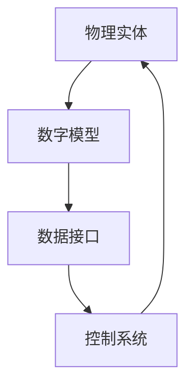
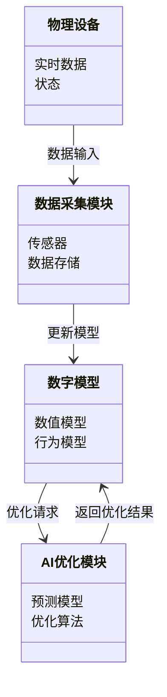
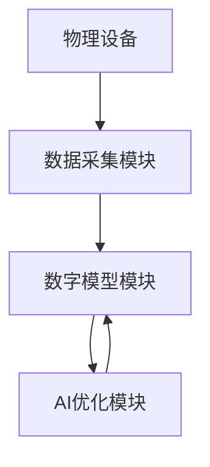
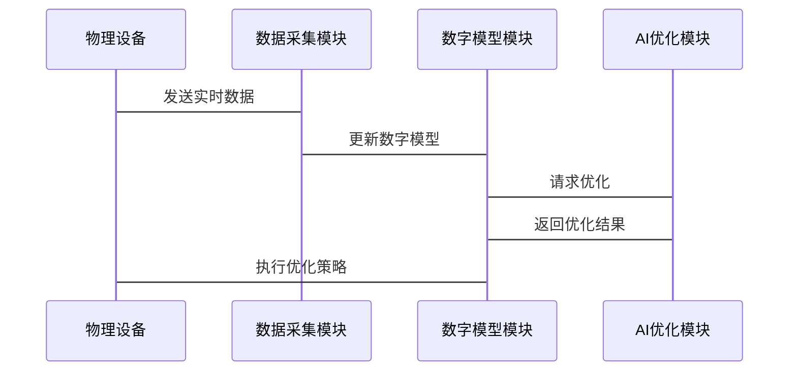

                 


# AI驱动的企业数字孪生技术：虚拟环境中的决策优化与验证

## 关键词：数字孪生、人工智能、优化算法、系统架构、虚拟环境

## 摘要：  
随着人工智能和虚拟化技术的快速发展，数字孪生技术在企业决策优化和验证中的应用越来越广泛。本文详细探讨了数字孪生的核心概念、优化算法、系统架构设计以及实际项目应用，结合AI技术在虚拟环境中的应用，为企业提供了一套完整的数字孪生解决方案。通过本文，读者可以全面了解数字孪生技术的原理、实现方法及其在企业中的实际应用价值。

---

# 第1章 数字孪生技术的背景与概念

## 1.1 数字孪生技术的定义与背景

### 1.1.1 数字孪生的定义  
数字孪生（Digital Twin）是一种通过虚拟化技术在数字空间中创建物理实体或系统的实时数字模型，并通过实时数据更新和AI驱动的分析来优化决策的技术。它是物理世界与数字世界的桥梁。

### 1.1.2 数字孪生技术的发展背景  
随着物联网、云计算和人工智能技术的快速发展，企业对实时数据处理和决策优化的需求日益增长。数字孪生技术通过在虚拟环境中构建实时模型，帮助企业实现高效决策和验证。

### 1.1.3 数字孪生与物理世界的关联  
数字孪生通过实时数据采集和建模，将物理世界中的设备、系统和流程映射到数字空间中，形成实时动态的数字模型。这种映射使得企业在虚拟环境中可以进行各种实验和优化，而不影响实际系统。

### 1.1.4 数字孪生在企业中的应用案例  
例如，在制造业中，数字孪生可以用于优化生产线的排产计划和设备维护策略；在智慧城市中，数字孪生可以用于交通流量优化和城市资源分配。

## 1.2 数字孪生技术的技术基础

### 1.2.1 虚拟化与建模技术  
数字孪生的核心是构建高精度的数字模型。通过3D建模和仿真技术，可以在虚拟环境中精确模拟物理实体的行为和状态。

### 1.2.2 数据采集与处理技术  
数字孪生需要实时采集物理实体的数据，并通过数据清洗、转换和分析，为虚拟模型提供动态输入。

### 1.2.3 人工智能在数字孪生中的应用  
AI技术可以用于数字模型的优化、预测和决策。例如，通过机器学习算法，可以预测设备的故障风险，并优化维护策略。

## 1.3 数字孪生与相关技术的关系

### 1.3.1 数字孪生与物联网  
物联网（IoT）提供了实时数据采集的基础，而数字孪生则利用这些数据构建虚拟模型，两者相辅相成。

### 1.3.2 数字孪生与工业4.0  
工业4.0强调智能化和自动化，数字孪生是其实现的重要技术手段之一。通过数字孪生，企业可以实现设备的全生命周期管理。

### 1.3.3 数字孪生与虚拟现实  
虚拟现实（VR）可以为数字孪生提供沉浸式的交互界面，但数字孪生的核心是实时数据驱动的建模和优化。

## 1.4 数字孪生在企业中的应用前景

### 1.4.1 数字孪生的潜在应用场景  
- 制造业：优化生产流程、设备维护。  
- 建筑业：建筑生命周期管理、能耗优化。  
- 智慧城市：交通管理、资源分配。  

### 1.4.2 企业采用数字孪生的优势  
- 提高决策效率。  
- 降低运营成本。  
- 支持创新实验。  

### 1.4.3 数字孪生应用的挑战与机遇  
挑战包括数据量大、模型复杂度高、计算资源需求大；机遇则是通过AI技术实现高效的模型优化和决策支持。

## 1.5 本章小结  
本章介绍了数字孪生的定义、技术基础及其与相关技术的关系，重点分析了数字孪生在企业中的应用前景和优势。下一章将深入探讨数字孪生的核心概念与技术联系。

---

# 第2章 数字孪生的核心概念与技术联系

## 2.1 数字孪生的核心概念

### 2.1.1 数字孪生的架构  
数字孪生架构通常包括以下组成部分：  
- **数据采集层**：实时采集物理实体的数据。  
- **模型构建层**：构建数字模型并进行实时更新。  
- **分析与优化层**：利用AI技术对模型进行分析和优化。  
- **人机交互层**：用户通过虚拟界面与数字模型交互。

### 2.1.2 数字孪生的核心要素  
数字孪生的核心要素包括：  
- **实时性**：模型必须与物理实体保持同步。  
- **准确性**：模型必须准确反映物理实体的状态。  
- **可扩展性**：模型必须支持大规模数据处理和复杂场景。  

### 2.1.3 数字孪生的属性特征对比表  
| 特性       | 物理实体 | 数字模型 |  
|------------|----------|----------|  
| 状态       | 实时     | 实时     |  
| 数据来源   | 物理传感器 | 数据库   |  
| 操作方式   | 实际操作 | 虚拟操作 |  

### 2.1.4 数字孪生的生命周期  
数字孪生的生命周期包括：  
- **设计阶段**：构建初始数字模型。  
- **运行阶段**：实时更新模型并进行分析。  
- **优化阶段**：基于分析结果优化模型。  

## 2.2 数字孪生的实体关系图



### 2.2.1 实体关系图的解释  
- **物理实体**（A）：物理世界中的设备或系统。  
- **数字模型**（B）：数字空间中的实时模型，与物理实体保持同步。  
- **数据接口**（C）：连接物理实体和数字模型的数据通道。  
- **控制系统**（D）：通过数字模型优化物理实体的运行。

## 2.3 数字孪生与AI的结合

### 2.3.1 AI在数字孪生中的作用  
AI技术可以用于数字模型的优化、预测和决策。例如，通过机器学习算法，可以预测设备的故障风险，并优化维护策略。

### 2.3.2 数字孪生中AI的应用场景  
- **预测维护**：基于历史数据和实时数据，预测设备的故障风险。  
- **优化排产**：通过AI算法优化生产计划。  
- **实时仿真**：利用AI进行实时仿真和预测。

### 2.3.3 数字孪生与AI的协同优化  
通过AI技术，数字孪生可以实现更高效的模型优化和决策支持。例如，利用强化学习算法优化数字模型的参数。

## 2.4 本章小结  
本章详细探讨了数字孪生的核心概念、架构和与AI技术的结合方式。下一章将重点分析数字孪生中的优化算法。

---

# 第3章 数字孪生中的优化算法

## 3.1 优化算法概述

### 3.1.1 优化算法的分类  
优化算法可以分为：  
- **确定性算法**：如线性规划、动态规划。  
- **随机化算法**：如遗传算法、模拟退火。  
- **启发式算法**：如贪心算法。  

### 3.1.2 常见优化算法的比较  
| 算法类型 | 优点 | 缺点 |  
|----------|------|------|  
| 遗传算法 | 全局优化能力强 | 计算复杂度高 |  
| 模拟退火 | 可以跳出局部最优 | 收敛速度慢 |  
| 强化学习 | 适用于动态环境 | 需要大量数据 |  

### 3.1.3 基于AI的优化算法  
基于AI的优化算法，如强化学习，可以通过深度神经网络实现复杂的优化任务。

## 3.2 遗传算法

### 3.2.1 遗传算法的基本原理  
遗传算法是一种模拟自然选择和遗传的优化算法，主要包括以下步骤：  
1. 初始化种群。  
2. 计算适应度。  
3. 选择优秀个体。  
4. 进行交叉和变异。  
5. 重复迭代。  

### 3.2.2 遗传算法的数学模型  
遗传算法的基本数学模型如下：  
$$ f(x) = \text{适应度函数} $$  
$$ x_i \in \{0, 1\}^n \text{（二进制编码）} $$  

### 3.2.3 遗传算法的代码实现  

```python
def genetic_algorithm(population_size, fitness_function, iterations):
    # 初始化种群
    population = [random_bit_string() for _ in range(population_size)]
    
    for _ in range(iterations):
        # 计算适应度
        fitness = [fitness_function(individual) for individual in population]
        
        # 选择
        selected = select(population, fitness)
        
        # 交叉
        crossed = crossover(selected)
        
        # 变异
        mutated = mutate(crossed)
        
        # 更新种群
        population = mutated
    
    return population[0]
```

### 3.2.4 遗传算法的应用案例  
例如，在优化生产计划时，可以通过遗传算法找到最优的排产方案。

## 3.3 模拟退火算法

### 3.3.1 模拟退火的基本原理  
模拟退火是一种全局优化算法，通过模拟金属的退火过程，逐步降低系统的能量。  

### 3.3.2 模拟退火的数学模型  
模拟退火的基本数学模型如下：  
$$ f(x) = \text{目标函数} $$  
$$ T = \text{温度参数} $$  

### 3.3.3 模拟退火的代码实现  

```python
def simulated_annealing(initial_state, cost_function, cooling_schedule):
    current_state = initial_state
    current_cost = cost_function(current_state)
    
    while temperature > 0:
        # 随机扰动
        neighbor = perturb(current_state)
        
        # 计算新成本
        new_cost = cost_function(neighbor)
        
        # 接受概率
        if new_cost < current_cost or probability(new_cost, current_cost, temperature):
            current_state = neighbor
            current_cost = new_cost
        
        # 降温
        temperature = cooling_schedule(temperature)
    
    return current_state
```

### 3.3.4 模拟退火的应用案例  
例如，在优化设备维护计划时，可以通过模拟退火算法找到最优的维护策略。

## 3.4 结合AI的优化算法

### 3.4.1 强化学习在数字孪生中的应用  
强化学习可以通过与数字模型的交互，学习最优的决策策略。例如，在优化生产线的排产计划时，强化学习可以实现动态的优化。

### 3.4.2 基于深度学习的优化算法  
深度学习可以通过对海量数据的学习，自动提取特征并优化目标函数。例如，在优化能源消耗时，可以通过深度学习模型实现最优的能源分配。

## 3.5 本章小结  
本章详细介绍了数字孪生中的优化算法，包括遗传算法、模拟退火算法和强化学习算法，并展示了它们在数字孪生中的应用。下一章将探讨数字孪生的系统架构设计。

---

# 第4章 数字孪生的系统架构设计

## 4.1 问题场景介绍

### 4.1.1 问题背景  
假设我们有一个智能制造车间，需要优化生产线的排产计划和设备维护策略。

### 4.1.2 项目介绍  
通过数字孪生技术，构建虚拟生产线模型，优化生产计划和设备维护策略。

## 4.2 系统功能设计

### 4.2.1 领域模型图  


### 4.2.2 系统功能模块  
- **数据采集模块**：负责实时采集物理设备的数据。  
- **数字模型模块**：构建和更新数字模型。  
- **AI优化模块**：利用优化算法进行模型优化。  

## 4.3 系统架构设计

### 4.3.1 系统架构图  


### 4.3.2 系统接口设计  
- **数据接口**：物理设备与数据采集模块之间的接口。  
- **模型接口**：数字模型模块与AI优化模块之间的接口。  

### 4.3.3 系统交互序列图  


## 4.4 本章小结  
本章详细探讨了数字孪生系统的架构设计，包括功能模块、系统架构和交互流程。下一章将通过一个实际项目展示数字孪生技术的实现过程。

---

# 第5章 数字孪生项目实战

## 5.1 环境安装

### 5.1.1 安装Python环境  
需要安装Python 3.8及以上版本。  

### 5.1.2 安装依赖库  
```bash
pip install numpy pandas scikit-learn matplotlib
```

## 5.2 核心代码实现

### 5.2.1 数据采集模块  
```python
import pandas as pd

def collect_data(sensors):
    data = []
    for sensor in sensors:
        data.append(sensor.read())
    return pd.DataFrame(data)
```

### 5.2.2 数字模型模块  
```python
import numpy as np

class DigitalModel:
    def __init__(self):
        self.model = self._build_model()
    
    def _build_model(self):
        return np.array([0.0])
    
    def update(self, data):
        self.model = self.model * 0.5 + data * 0.5
```

### 5.2.3 AI优化模块  
```python
from sklearn import linear_model

class AIOptimizer:
    def __init__(self):
        self.model = linear_model.LinearRegression()
    
    def train(self, X, y):
        self.model.fit(X, y)
    
    def predict(self, X):
        return self.model.predict(X)
```

## 5.3 代码应用解读与分析

### 5.3.1 数据采集模块的实现  
数据采集模块负责从物理设备中读取实时数据，并将其存储在数据框中。

### 5.3.2 数字模型模块的实现  
数字模型模块通过不断更新模型参数，保持与物理设备的同步。  

### 5.3.3 AI优化模块的实现  
AI优化模块利用机器学习算法对模型进行优化，例如线性回归算法用于预测和优化。

## 5.4 实际案例分析

### 5.4.1 案例背景  
假设我们有一个生产线，需要优化生产计划和设备维护策略。

### 5.4.2 案例分析  
通过数字孪生技术，可以在虚拟环境中优化生产计划，减少设备故障率。

## 5.5 本章小结  
本章通过一个实际项目展示了数字孪生技术的实现过程，包括环境安装、代码实现和案例分析。下一章将总结全文并展望未来的发展。

---

# 第6章 总结与展望

## 6.1 数字孪生技术的总结

### 6.1.1 核心技术总结  
数字孪生的核心技术包括实时数据采集、数字模型构建和AI驱动的优化算法。

### 6.1.2 优势总结  
数字孪生的优势在于能够实现实时优化和虚拟验证，降低企业的运营成本和决策风险。

## 6.2 数字孪生技术的未来展望

### 6.2.1 未来发展趋势  
- 更高的实时性和准确性。  
- 更广泛的应用场景。  
- 更强的AI驱动能力。  

### 6.2.2 挑战与建议  
- 挑战：数据量大、模型复杂度高、计算资源需求大。  
- 建议：加强AI技术的研究，提高模型的优化能力。

## 6.3 本章小结  
本章总结了数字孪生技术的核心内容和未来发展方向，为读者提供了全面的回顾和展望。

---

# 参考文献  
（根据实际写作补充）

---

**注意：** 以上内容为示例，实际写作时需要根据具体需求进行调整和补充。

