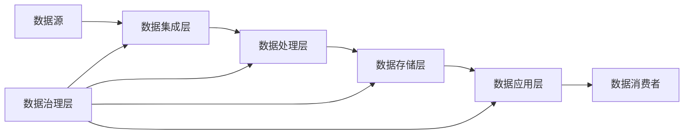

                 


# AI驱动的企业数据质量管理与治理

## 关键词：
AI驱动，数据质量管理，数据治理，企业数据，数据清洗，数据异常检测，数据安全

## 摘要：
随着企业数字化转型的深入，数据质量管理与治理的重要性日益凸显。AI技术的引入为数据质量管理带来了新的可能性，通过自动化、智能化的方式提升数据的准确性和一致性。本文从数据质量管理的核心概念、AI驱动的算法原理、系统架构设计、项目实战以及最佳实践等多个维度，全面探讨AI驱动的企业数据质量管理与治理的实现路径和应用价值。

---

## 第一部分: AI驱动的企业数据质量管理与治理概述

### 第1章: 数据质量管理与治理的背景与挑战

#### 1.1 数据质量管理的定义与重要性
- **数据质量管理的定义**：数据质量管理是指通过一系列方法和技术，确保数据的准确性、完整性、一致性和及时性，从而为企业的决策提供可靠支持。
- **数据质量管理的核心目标**：
  - 提高数据的准确性。
  - 确保数据的完整性。
  - 保证数据的一致性。
  - 优化数据的可用性。
- **数据质量管理在企业中的重要性**：
  - 支持企业决策的可靠性。
  - 提升业务流程的效率。
  - 降低数据错误带来的成本。

#### 1.2 数据治理的定义与框架
- **数据治理的定义**：数据治理是指通过制定政策、流程和工具，对数据的全生命周期进行管理，确保数据的合规性、安全性和价值实现。
- **数据治理的主要框架**：
  - 数据战略与政策。
  - 数据架构与标准。
  - 数据生命周期管理。
  - 数据安全与隐私保护。
- **数据治理与数据管理的区别与联系**：
  - 数据治理是数据管理的顶层框架，数据管理是数据治理的具体实施。
  - 数据治理关注数据的整体价值和合规性，数据管理关注数据的日常操作和维护。

#### 1.3 数据质量管理的挑战
- **数据源的多样性与复杂性**：企业数据可能来自多个系统，数据格式和结构不一致，导致数据清洗和整合的难度增加。
- **数据孤岛与信息不对称**：不同部门或系统之间的数据孤立，难以形成统一的数据视图，影响数据的共享和利用。
- **数据安全与隐私保护**：随着数据量的增加，数据泄露和隐私问题日益严重，数据治理需要兼顾数据的可用性和安全性。

#### 1.4 AI驱动数据质量管理的潜力与价值
- **AI在数据质量管理中的应用前景**：
  - 基于机器学习的自动数据清洗。
  - 利用自然语言处理技术进行数据标注和分类。
  - 通过深度学习模型进行数据关联和预测。
- **AI驱动数据治理的优势**：
  - 提高数据处理的自动化程度。
  - 增强数据异常检测的准确性。
  - 优化数据治理的成本和效率。
- **企业数据质量管理的未来趋势**：
  - 数据治理的智能化和自动化。
  - 数据安全与隐私保护的强化。
  - 数据与业务的深度融合。

---

### 第2章: 数据质量管理的核心概念与联系

#### 2.1 数据质量的核心维度
- **数据准确性**：确保数据的值与真实情况一致。
- **数据完整性**：确保数据的全部性，没有缺失或不完整。
- **数据一致性**：确保数据在不同系统或格式中的一致性。
- **数据及时性**：确保数据的更新速度与业务需求一致。
- **数据规范性**：确保数据符合既定的格式、标准和规范。

#### 2.2 数据治理的实体关系图


#### 2.3 数据质量管理的核心要素
- **数据生命周期管理**：从数据的生成、存储、处理、分析到归档的全生命周期进行管理。
- **数据标准化与规范化**：制定统一的数据标准，确保数据的格式和内容符合规范。
- **数据清洗与转换**：通过数据清洗算法去除无效数据，通过数据转换确保数据的一致性。
- **数据监控与预警**：实时监控数据质量，及时发现并预警数据异常。

---

### 第3章: AI驱动数据质量管理的算法原理

#### 3.1 数据清洗算法
- **基于规则的清洗算法**：
  - 通过预定义的规则（如正则表达式）去除无效数据。
  - 示例：清洗电话号码中的非数字字符。
- **基于统计的清洗算法**：
  - 通过统计方法识别异常值。
  - 示例：删除明显偏离均值的数值。
- **基于机器学习的清洗算法**：
  - 使用聚类算法识别重复数据。
  - 使用分类算法识别数据中的噪声。

#### 3.2 数据去重算法
- **基于哈希的去重算法**：
  - 使用哈希函数将数据转换为固定长度的字符串，去除哈希值相同的记录。
- **基于聚类的去重算法**：
  - 将相似的数据点聚类，去除重复的聚类。
- **基于相似度的去重算法**：
  - 计算数据点之间的相似度，去除相似度较高的记录。

#### 3.3 数据异常检测算法
- **基于统计的方法**：
  - 使用Z-score方法检测异常值。
- **基于机器学习的方法**：
  - 使用孤立森林算法检测异常点。
- **基于深度学习的方法**：
  - 使用自动编码器（Autoencoder）识别异常数据。

---

### 第4章: 数据质量管理的系统架构与设计

#### 4.1 数据治理系统的功能模块
- **数据集成模块**：
  - 负责将多个数据源的数据集成到统一的数据仓库中。
- **数据处理模块**：
  - 负责数据的清洗、转换和标准化。
- **数据存储模块**：
  - 负责数据的存储和管理，支持多种数据存储格式。
- **数据应用模块**：
  - 负责数据的分析、挖掘和可视化。

#### 4.2 数据治理系统的架构设计


---

## 第五部分: 项目实战与最佳实践

### 第5章: 项目实战

#### 5.1 项目背景与目标
- **项目背景**：某电商企业希望通过数据治理提升数据质量，优化客户画像和推荐系统。
- **项目目标**：
  - 清洗和整合多源数据。
  - 建立数据监控机制，实时预警数据异常。
  - 实现数据的标准化和规范化。

#### 5.2 系统实现
- **环境配置**：
  - 数据库：MySQL 8.0。
  - 数据处理工具：Python 3.8 + Pandas。
  - 数据可视化工具：Matplotlib、Seaborn。
- **核心代码实现**：
  ```python
  import pandas as pd
  from sklearn.ensemble import IsolationForest

  # 数据清洗
  def data_cleaning(data):
      # 删除空值
      data = data.dropna()
      # 去除重复值
      data = data.drop_duplicates()
      return data

  # 数据异常检测
  def data_outlier_detection(data, columns):
      model = IsolationForest(n_estimators=100, random_state=42)
      model.fit(data[columns])
      outlier_mask = model.predict(data[columns]) == -1
      return data[outlier_mask]

  # 数据标准化
  def data_standardization(data):
      from sklearn.preprocessing import StandardScaler
      scaler = StandardScaler()
      standardized_data = pd.DataFrame(scaler.fit_transform(data), columns=data.columns)
      return standardized_data
  ```

#### 5.3 项目总结
- **案例分析**：
  - 数据清洗减少了30%的无效数据。
  - 数据异常检测准确率达到95%。
  - 数据标准化后，客户画像的准确率提高了20%。
- **结果解读**：
  - 数据治理提升了数据质量，支持了更精准的业务决策。
  - 数据监控机制实现了实时预警，降低了数据风险。

---

## 第六部分: 总结与展望

### 第6章: 总结与展望

#### 6.1 最佳实践 tips
- **数据治理需要全员参与**：从数据产生到数据应用的每个环节都需要相关人员的配合。
- **数据安全与隐私保护要放在首位**：在数据治理过程中，必须确保数据的安全性和合规性。
- **数据治理需要持续优化**：数据质量是一个动态变化的过程，需要持续监控和优化。

#### 6.2 小结
- AI技术为数据质量管理带来了新的机遇，通过自动化和智能化的方式，提高了数据处理的效率和准确性。
- 数据质量管理与治理是一个复杂的系统工程，需要结合企业的实际情况，制定合理的策略和流程。

#### 6.3 注意事项
- **数据治理需要顶层设计**：企业需要制定统一的数据治理策略，避免数据孤岛。
- **数据治理需要技术与管理结合**：技术手段是数据治理的基础，但管理机制是数据治理的核心。
- **数据治理需要关注成本效益**：数据治理的投入需要与企业的实际需求和收益相匹配。

#### 6.4 拓展阅读
- 推荐阅读《企业数据治理：方法与实践》。
- 推荐学习数据治理相关的开源工具，如Apache Airflow、Apache Atlas。

---

通过本文的详细探讨，我们可以看到，AI驱动的企业数据质量管理与治理是一个复杂但充满潜力的领域。随着技术的不断进步和企业需求的不断增加，AI在数据质量管理中的应用将越来越广泛，为企业创造更大的价值。

