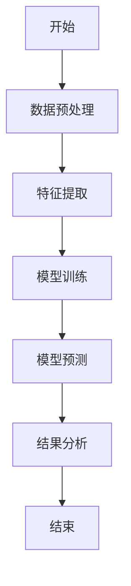
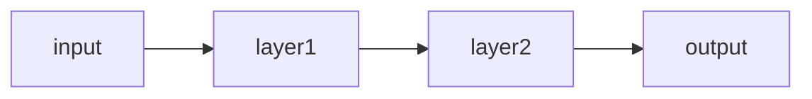

                 

# AI驱动的企业知识产权战略：专利组合优化与布局的智能化

## 关键词：
- 人工智能
- 企业知识产权
- 专利组合优化
- 专利布局
- 智能化

## 摘要：
随着人工智能技术的快速发展，企业知识产权管理迎来了新的机遇与挑战。本文章详细探讨了如何利用AI技术优化专利组合，并通过智能化的专利布局提升企业的核心竞争力。从专利组合优化的核心概念到AI驱动的布局策略，再到具体的算法原理和系统架构设计，本文为企业提供了全面的指导和实践方案，帮助企业更好地应对知识产权管理的复杂性和高效性需求。

---

## 第一部分: AI驱动的企业知识产权战略概述

### 第1章: 企业知识产权战略与AI的结合

#### 1.1 企业知识产权管理的现状与挑战

企业知识产权管理是保护企业创新成果、提升竞争力的重要手段。然而，传统的知识产权管理方式存在以下挑战：

- **数据量庞大**：企业每天产生的专利数据海量，人工整理和分析效率低下。
- **分析深度不足**：传统方法难以深入挖掘专利之间的关联性，导致布局不够精准。
- **成本高昂**：专利检索、分析和申请过程耗时长、成本高，且容易出错。

AI技术的引入为解决这些问题提供了新的可能。通过自然语言处理（NLP）、机器学习和深度学习等技术，企业可以更高效地进行专利检索、分类、分析和布局优化。

#### 1.2 AI在知识产权管理中的应用前景

AI技术在知识产权管理中的应用前景广阔，主要体现在以下几个方面：

- **专利检索与分类**：利用NLP技术，AI可以快速从海量专利数据库中检索相关技术，并自动进行分类，提高效率。
- **专利分析与评估**：通过机器学习模型，AI可以评估专利的价值、技术趋势和竞争对手的动态，为企业制定科学的专利策略提供依据。
- **风险评估与预警**：AI能够实时监控专利的法律状态和潜在风险，帮助企业及时调整策略，避免法律纠纷。

#### 1.3 本章小结

AI技术的应用不仅提高了企业知识产权管理的效率，还显著提升了管理的深度和精准度。企业应当积极拥抱AI技术，将其融入知识产权战略中，以获取更大的竞争优势。

---

## 第二部分: 专利组合优化的核心概念与方法

### 第2章: 专利组合优化的核心概念与方法

#### 2.1 专利组合优化的定义与目标

专利组合优化是指通过科学的方法和技术手段，对企业的专利资产进行合理配置和优化，以实现企业战略目标。其核心目标包括：

- **最大化专利价值**：通过优化专利布局，提升专利的市场价值和法律保护力度。
- **降低管理成本**：利用AI技术减少人工干预，降低专利管理的成本。
- **提升竞争力**：通过精准的专利布局，增强企业在市场竞争中的技术优势。

#### 2.2 专利组合优化的核心要素

专利组合优化涉及多个核心要素，包括：

- **技术领域分布**：专利应覆盖企业的核心技术领域，确保技术优势。
- **专利申请地域**：根据市场分布和法律环境，选择合适的申请地域。
- **专利权属关系**：明确专利的权属关系，避免法律纠纷。

#### 2.3 专利组合优化的数学模型

为了实现专利组合优化，可以建立数学模型。以下是一个简单的线性规划模型示例：

$$
\text{最大化：} \quad \sum_{i=1}^{n} v_i x_i
$$

$$
\text{约束条件：} \quad \sum_{i=1}^{n} c_i x_i \leq C
$$

其中，\( v_i \) 是专利 \( i \) 的价值，\( c_i \) 是专利 \( i \) 的成本，\( C \) 是预算上限，\( x_i \) 是是否选择专利 \( i \) 的决策变量（0或1）。

#### 2.4 本章小结

专利组合优化是企业知识产权管理的关键环节，AI技术的应用可以显著提升优化的效率和效果。企业需要结合自身特点选择合适的优化策略和算法。

---

## 第三部分: AI驱动的专利布局智能化

### 第3章: AI驱动的专利布局智能化

#### 3.1 专利布局的定义与重要性

专利布局是指企业在不同技术领域和地域上对专利进行合理分配的过程。其重要性体现在：

- **技术覆盖**：确保企业在关键技术和重要领域的专利布局，巩固技术优势。
- **风险控制**：通过合理的地域布局，降低专利无效或被无效的风险。

#### 3.2 AI在专利布局中的应用

AI在专利布局中的应用主要体现在以下几个方面：

- **专利检索与分析**：利用AI进行高效的专利检索，并分析专利的技术领域和法律状态。
- **专利申请策略优化**：基于AI的分析结果，制定最优的专利申请策略。
- **风险评估与预警**：实时监控专利的有效性和潜在风险，提供预警信息。

#### 3.3 基于AI的专利布局优化算法

以下是一个基于机器学习的专利布局优化算法的流程图：

#### 3.4 本章小结

AI技术的应用使得专利布局更加智能化和精准化。企业可以通过AI技术优化专利布局，降低管理成本，提升专利的整体价值。

---

## 第四部分: 专利组合优化的算法原理

### 第4章: 专利组合优化的算法原理

#### 4.1 专利组合优化的算法框架

专利组合优化的算法框架通常包括以下几个步骤：

1. **确定目标函数**：根据企业目标，确定优化的目标（如最大化专利价值）。
2. **确定约束条件**：设定优化的约束条件（如预算限制）。
3. **选择优化算法**：根据问题特点选择合适的算法（如遗传算法）。

#### 4.2 基于机器学习的专利组合优化

基于机器学习的专利组合优化算法可以通过以下步骤实现：

1. 数据采集与预处理：收集专利数据并进行清洗。
2. 特征提取：提取专利的关键词、技术领域等特征。
3. 模型训练：训练分类或回归模型。
4. 优化决策：基于模型结果进行专利组合优化。

#### 4.3 基于深度学习的专利组合优化

基于深度学习的专利组合优化可以通过神经网络模型实现。以下是一个简单的神经网络结构示意图：

---

## 第五部分: 专利布局的系统架构设计

### 第5章: 专利布局的系统架构设计

#### 5.1 系统功能设计

专利布局系统的功能模块包括：

- **数据采集模块**：采集专利数据。
- **数据分析模块**：对专利数据进行分析和分类。
- **优化模块**：基于AI算法进行专利布局优化。

#### 5.2 系统架构设计

系统的架构设计可以采用分层架构，包括数据层、业务逻辑层和应用层。

#### 5.3 系统接口设计

系统接口设计需要考虑数据输入、模型调用和结果输出等环节。

---

## 总结

通过以上详细的内容，我们可以看到，AI技术在企业知识产权管理中的应用前景广阔，能够显著提升专利组合优化和布局的智能化水平。企业应当积极引入AI技术，优化知识产权管理流程，提升核心竞争力。

