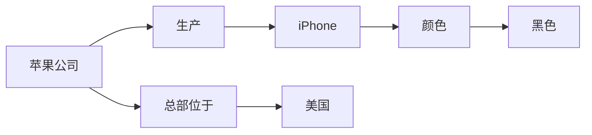
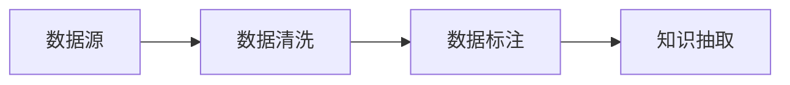
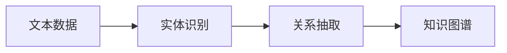

                 


# AI驱动的企业知识图谱：动态更新与智能推理机制

## 关键词：
- 知识图谱
- AI驱动
- 动态更新
- 智能推理
- 企业应用
- 图数据库
- 知识管理

## 摘要：
知识图谱作为一种强大的企业知识管理工具，正逐渐成为企业智能化转型的重要支撑。本文将深入探讨AI驱动的知识图谱，重点分析其动态更新与智能推理机制。从知识图谱的构建方法到动态更新的技术实现，再到智能推理算法的应用，我们将详细解析其在企业中的实际应用场景，并通过案例分析展示其为企业带来的价值。本文旨在为企业技术决策者和开发人员提供一份全面的技术指南，帮助他们更好地理解和应用知识图谱技术。

---

# 第1章: 知识图谱的背景与概念

## 1.1 知识图谱的定义与背景

### 1.1.1 知识图谱的定义
知识图谱是一种以图结构表示知识的技术，通过实体（概念、对象）及其之间的关系，构建语义网络。它能够将分散的数据组织成可计算的形式，支持智能化的应用场景。

**核心要素：**
- 实体（Entity）：知识图谱的基本组成单位，如“苹果公司”、“iPhone”等。
- 关系（Relation）：实体之间的联系，如“苹果公司生产iPhone”。
- 属性（Attribute）：描述实体的特征，如“iPhone的颜色是黑色”。

**与传统数据库的区别：**
| 特性 | 知识图谱 | 传统数据库 |
|------|----------|------------|
| 数据结构 | 图结构 | 行列结构 |
| 查询方式 | 图遍历 | 基于条件查询 |
| 表达能力 | 强语义关联 | 弱语义关联 |

### 1.1.2 知识图谱的演变历程
知识图谱起源于语义网络的概念，经历了从静态知识库到动态知识图谱的演变。其发展历程如下：
1. **早期阶段**：基于规则的知识表示（如专家系统）。
2. **发展阶段**：语义网络的引入，推动知识图谱的语义化。
3. **成熟阶段**：大数据时代的知识抽取与图数据库的结合。
4. **现代阶段**：AI驱动的动态更新与智能推理。

### 1.1.3 知识图谱的核心要素与属性
知识图谱的核心要素包括：
- **实体**：具有独立存在意义的概念或对象。
- **关系**：实体之间的联系，可以是二元关系或多元关系。
- **属性**：描述实体的特征或状态。

**核心属性：**
- **可扩展性**：支持新增实体和关系。
- **动态性**：支持实时更新和变化检测。
- **语义丰富性**：通过关系和属性构建复杂的语义网络。

**实体关系示意图：**


## 1.2 知识图谱与相关技术的对比

### 1.2.1 知识图谱与传统数据库的区别
传统数据库主要用于存储结构化数据，而知识图谱是一种语义网络，强调实体之间的语义关联。以下从多个维度进行对比：

| 特性 | 知识图谱 | 传统数据库 |
|------|----------|------------|
| 数据结构 | 图结构 | 行列结构 |
| 查询方式 | 图遍历 | 基于条件查询 |
| 表达能力 | 强语义关联 | 弱语义关联 |
| 可视化 | 图形化 | 表格化 |

### 1.2.2 知识图谱与语义网络的联系
语义网络是知识图谱的前身，两者都基于图结构，但知识图谱引入了更复杂的语义关系和动态更新机制。

**联系：**
- 语义网络是知识图谱的基础。
- 知识图谱在语义网络的基础上，增加了动态更新和智能推理能力。

### 1.2.3 知识图谱与图数据库的异同
图数据库是一种支持图结构数据存储和查询的技术，而知识图谱是基于图数据库构建的知识库。

**异同：**
| 特性 | 知识图谱 | 图数据库 |
|------|----------|----------|
| 功能 | 数据建模、动态更新、智能推理 | 数据存储、查询优化 |
| 应用场景 | 智能问答、推荐系统 | 社交网络、金融风控 |

## 1.3 知识图谱在企业中的应用价值

### 1.3.1 企业知识管理的需求
企业在知识管理中面临以下挑战：
- 数据孤岛：各部门数据分散，难以共享。
- 知识更新缓慢：传统知识库难以实时更新。
- 知识利用率低：缺乏智能化的检索和推理能力。

### 1.3.2 知识图谱在企业中的应用场景
知识图谱在企业中的应用场景包括：
- **CRM优化**：通过知识图谱分析客户关系，提供个性化服务。
- **供应链管理**：优化供应商关系，实时监控供应链动态。
- **企业知识库构建**：整合企业内外部知识，支持决策。

### 1.3.3 知识图谱对企业智能化转型的推动作用
知识图谱通过动态更新和智能推理，帮助企业实现知识的高效利用和实时应用。例如，通过知识图谱可以实现智能问答、自动化决策和实时监控。

---

# 第2章: 知识图谱的构建方法

## 2.1 知识图谱的构建流程

### 2.1.1 数据采集与预处理
数据采集是知识图谱构建的第一步，主要包括以下步骤：
1. **数据源选择**：确定数据来源，如企业内部数据、公开数据集。
2. **数据清洗**：去除噪声数据，确保数据质量。
3. **数据标注**：对数据进行标注，便于后续处理。

**数据预处理流程示意图：**


### 2.1.2 知识抽取与融合
知识抽取是从数据中提取实体、关系和属性的过程。常用的方法包括：
- **基于规则的抽取**：通过正则表达式提取特定模式的数据。
- **基于机器学习的抽取**：利用深度学习模型（如CRF）进行命名实体识别。

知识融合是将多个数据源中的知识整合到一个统一的知识图谱中，解决数据冗余和冲突问题。

### 2.1.3 知识表示与存储
知识表示是将抽取的知识以图结构的形式存储。常用的知识表示方法包括：
- **RDF（Resource Description Framework）**：通过三元组（主语-谓词-宾语）表示知识。
- **RDFS（RDF Schema）**：扩展RDF，支持类和属性的层次结构。

知识图谱的存储可以使用图数据库，如Neo4j、Apache Jena等。

## 2.2 知识图谱的本体建模

### 2.2.1 本体建模的基本概念
本体建模是构建知识图谱的重要步骤，通过定义实体、属性和关系的层次结构，确保知识表示的一致性和规范性。

**本体建模的核心要素：**
- **概念（Concept）**：表示实体的类别，如“公司”、“产品”。
- **属性（Attribute）**：描述概念的特征，如“名称”、“成立时间”。
- **关系（Relation）**：描述概念之间的联系，如“生产”、“属于”。

### 2.2.2 实体识别与关系抽取
实体识别是通过自然语言处理技术，从文本中提取实体。关系抽取则是识别实体之间的关系。

**实体识别与关系抽取示意图：**


### 2.2.3 知识图谱的规范化处理
规范化处理包括：
- **实体对齐**：将不同数据源中的实体统一表示。
- **属性标准化**：统一属性的命名和语义。

## 2.3 知识图谱的动态更新机制

### 2.3.1 动态更新的需求与挑战
知识图谱的动态更新需求主要来自：
- 数据源的实时变化。
- 企业业务的动态调整。

动态更新的挑战包括：
- 数据变更的检测。
- 知识图谱的版本控制。

### 2.3.2 基于规则的动态更新方法
基于规则的动态更新方法通过预定义的规则检测数据变化，并触发更新操作。例如：
- **时间戳检查**：比较数据的时间戳，判断数据是否需要更新。
- **事件驱动**：当特定事件发生（如订单完成）时，触发知识图谱的更新。

### 2.3.3 基于机器学习的动态更新方法
基于机器学习的动态更新方法利用模型预测数据变化，实现自动化的更新。例如：
- **异常检测**：通过异常检测算法发现数据中的异常变化。
- **增量式更新**：仅更新发生变化的部分，减少计算量。

---

# 第3章: 知识图谱的动态更新与维护

## 3.1 动态知识图谱的更新机制

### 3.1.1 数据源的实时监测
动态知识图谱需要实时监测数据源的变化。例如：
- **数据库变化检测**：通过触发机制检测数据库中的数据变化。
- **API接口监控**：通过调用API获取实时数据。

### 3.1.2 知识变化的检测方法
知识变化的检测方法包括：
- **增量式检测**：比较前后数据，找出变化部分。
- **基于规则的检测**：根据预定义的规则判断数据是否发生变化。

### 3.1.3 知识更新的传播与扩散
知识更新的传播与扩散可以通过以下方式实现：
- **局部更新**：仅更新发生变化的部分。
- **全局更新**：更新整个知识图谱。

## 3.2 知识图谱的版本控制

### 3.2.1 版本控制的必要性
知识图谱的版本控制可以解决以下问题：
- 数据变更的追溯。
- 数据冲突的解决。

### 3.2.2 版本控制的实现方法
版本控制的实现方法包括：
- **基于时间戳的版本控制**：每个版本记录数据变化的时间。
- **基于快照的版本控制**：定期备份知识图谱的状态。

### 3.2.3 历史数据的管理与恢复
历史数据的管理包括：
- **版本存档**：保存每个版本的知识图谱。
- **数据恢复**：根据版本号恢复特定版本的知识图谱。

## 3.3 知识图谱的增量式更新

### 3.3.1 增量式更新的基本原理
增量式更新仅处理发生变化的部分，减少计算量和存储空间的消耗。

### 3.3.2 基于事件驱动的增量更新
基于事件驱动的增量更新通过订阅数据变化的事件，触发更新操作。例如：
- **数据库触发器**：当数据发生变化时，触发更新操作。
- **消息队列**：将变化事件加入消息队列，异步处理。

### 3.3.3 基于规则驱动的增量更新
基于规则驱动的增量更新通过预定义的规则判断数据是否需要更新。例如：
- **阈值规则**：当某个指标超过阈值时，触发更新。
- **时间规则**：定期检查数据，判断是否需要更新。

---

# 第4章: 知识图谱的智能推理机制

## 4.1 智能推理的基本概念

### 4.1.1 推理的定义与分类
推理是根据已知知识推导出新的知识的过程。常见的推理类型包括：
- **正向推理**：从已知事实推导出结论。
- **反向推理**：从目标推导出支持目标的事实。
- **归纳推理**：从具体实例推导出一般规则。
- **演绎推理**：从一般规则推导出具体实例。

### 4.1.2 知识图谱推理的目标与任务
知识图谱推理的目标是通过已有的知识，推导出新的知识或关系。常见的任务包括：
- **属性补全**：填充缺失的属性值。
- **关系推理**：发现新的关系。
- **实体分类**：根据属性和关系对实体进行分类。

### 4.1.3 推理算法的性能评估
推理算法的性能评估指标包括：
- **准确率**：推导结果的正确性。
- **召回率**：推导结果的完整性。
- **计算效率**：算法的运行时间。

## 4.2 基于规则的推理方法

### 4.2.1 基于规则的推理原理
基于规则的推理方法通过预定义的规则进行推理。例如：
- **规则定义**：如果A具备属性P，且P的值为X，那么A属于类别C。
- **规则匹配**：在知识图谱中匹配规则，推导出新的知识。

### 4.2.2 基于规则的推理实现
基于规则的推理实现步骤如下：
1. **规则库构建**：定义推理规则。
2. **规则匹配**：在知识图谱中匹配规则的前件。
3. **结果推导**：根据匹配结果，推导出结论。

### 4.2.3 基于规则的推理优缺点
**优点：**
- 简单易懂，易于实现。
- 可解释性强。

**缺点：**
- 规则覆盖率低，难以处理复杂场景。
- 规则维护成本高。

## 4.3 基于机器学习的推理方法

### 4.3.1 基于机器学习的推理原理
基于机器学习的推理方法通过训练模型进行推理。常见的模型包括：
- **基于规则的模型**：将规则嵌入到模型中，指导推理过程。
- **基于图神经网络的模型**：利用图结构数据进行推理。

### 4.3.2 基于机器学习的推理实现
基于机器学习的推理实现步骤如下：
1. **数据准备**：收集训练数据，包括输入和期望输出。
2. **模型训练**：训练推理模型。
3. **推理推理**：使用训练好的模型进行推理。

### 4.3.3 基于机器学习的推理优缺点
**优点：**
- 能够处理复杂场景，推理能力强。
- 可扩展性好。

**缺点：**
- 模型复杂，难以解释。
- 训练数据依赖性强。

## 4.4 混合推理方法

### 4.4.1 混合推理的定义
混合推理方法结合了基于规则和基于机器学习的推理方法，优势互补。

### 4.4.2 混合推理的实现
混合推理的实现步骤如下：
1. **规则过滤**：通过规则排除不可能的情况。
2. **机器学习推理**：在过滤后的数据上进行深度推理。

### 4.4.3 混合推理的优势
- **准确性**：结合规则和机器学习的优点，提高推理准确性。
- **可解释性**：部分规则可解释，提高推理的透明度。

---

# 第5章: 知识图谱在企业中的应用

## 5.1 知识图谱在企业中的应用场景

### 5.1.1 企业知识管理
知识图谱可以整合企业内外部知识，支持企业决策。例如：
- **知识共享**：通过知识图谱实现知识的共享和复用。
- **知识检索**：通过智能问答系统，快速检索所需知识。

### 5.1.2 供应链管理
知识图谱可以优化供应链管理，提高效率。例如：
- **供应商关系管理**：通过知识图谱分析供应商的关系，优化供应链。
- **风险预警**：通过知识图谱监控供应链中的风险因素。

### 5.1.3 智能客服
知识图谱可以提升智能客服的能力，例如：
- **智能问答**：通过知识图谱实现智能问答。
- **知识关联**：通过知识图谱关联相关知识，提供更准确的解答。

## 5.2 知识图谱的企业应用案例

### 5.2.1 某企业的知识图谱应用
以某企业为例，介绍知识图谱在企业中的具体应用。例如：
- **CRM优化**：通过知识图谱分析客户关系，提供个性化服务。
- **供应链优化**：通过知识图谱优化供应链管理，降低运营成本。

## 5.3 知识图谱对企业智能化转型的推动

### 5.3.1 知识图谱在企业智能化转型中的作用
知识图谱通过动态更新和智能推理，帮助企业实现知识的高效利用和实时应用，推动智能化转型。

### 5.3.2 未来发展趋势
- **智能化**：结合AI技术，进一步提升知识图谱的智能化水平。
- **实时化**：实现知识图谱的实时更新和推理。
- **场景化**：针对不同场景，优化知识图谱的应用。

---

# 第6章: 项目实战——构建企业知识图谱

## 6.1 环境配置

### 6.1.1 系统需求
- **硬件需求**：建议配置8GB及以上内存，支持多线程计算。
- **软件需求**：安装Python、Jupyter Notebook、图数据库（如Neo4j）。

### 6.1.2 安装依赖库
```bash
pip install neo4j requests networkx
```

## 6.2 知识图谱的核心实现

### 6.2.1 数据采集与预处理
```python
import requests

def fetch_data(url):
    response = requests.get(url)
    return response.json()

data = fetch_data('https://example.com/api')
```

### 6.2.2 知识抽取与建模
```python
from networkx import Graph

def build_knowledge_graph(data):
    graph = Graph()
    for entity in data['entities']:
        graph.add_node(entity['name'])
        for relation in entity['relations']:
            graph.add_edge(entity['name'], relation['target'])
    return graph

knowledge_graph = build_knowledge_graph(data)
```

### 6.2.3 动态更新实现
```python
def update_knowledge_graph(data, graph):
    for entity in data['entities']:
        if entity['updated']:
            graph.add_node(entity['name'])
            for relation in entity['relations']:
                graph.add_edge(entity['name'], relation['target'])
    return graph

updated_graph = update_knowledge_graph(updated_data, knowledge_graph)
```

### 6.2.4 智能推理实现
```python
def infer_relationships(graph):
    for node in graph.nodes():
        neighbors = graph.neighbors(node)
        for neighbor in neighbors:
            if not graph.has_edge(node, 'related'):
                graph.add_edge(node, 'related')
    return graph

inferred_graph = infer_relationships(knowledge_graph)
```

## 6.3 项目总结与优化

### 6.3.1 项目总结
通过本项目，我们实现了企业知识图谱的构建，包括数据采集、知识抽取、动态更新和智能推理。通过实际案例分析，验证了知识图谱在企业中的应用价值。

### 6.3.2 项目优化
- **性能优化**：通过优化算法和数据结构，提升知识图谱的构建和推理效率。
- **功能扩展**：增加更多智能推理算法，提升知识图谱的智能化水平。

---

# 第7章: 总结与展望

## 7.1 总结
本文详细探讨了AI驱动的企业知识图谱，重点分析了动态更新与智能推理机制。通过理论与实践相结合的方式，深入解析了知识图谱在企业中的应用场景和实现方法。

## 7.2 未来展望
知识图谱的应用前景广阔，未来的发展方向包括：
- **智能化**：结合AI技术，进一步提升知识图谱的智能化水平。
- **实时化**：实现知识图谱的实时更新和推理。
- **场景化**：针对不同场景，优化知识图谱的应用。

---

通过本文的系统讲解，读者可以全面了解AI驱动的知识图谱，掌握动态更新与智能推理的实现方法，并将其应用于企业实践中。希望本文能为企业技术决策者和开发人员提供有价值的参考，助力企业的智能化转型。

