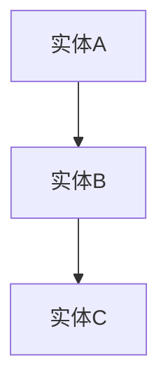
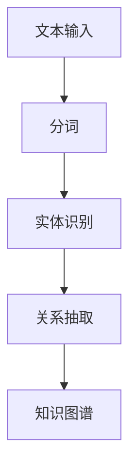
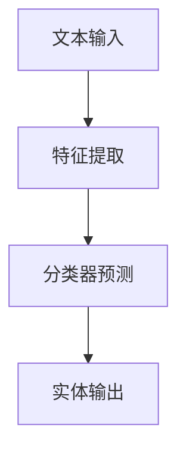
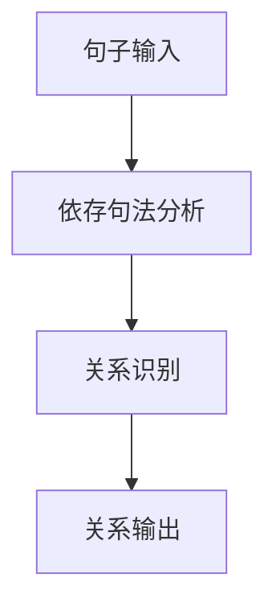
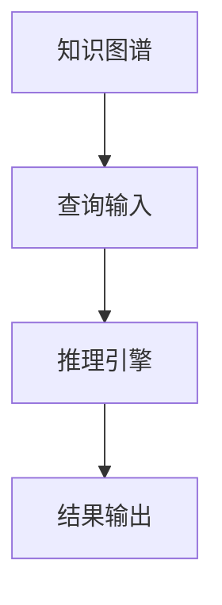
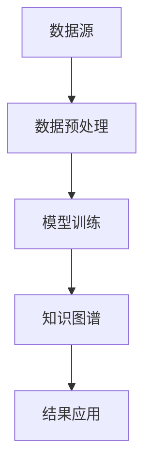

                 


# AI驱动的企业知识挖掘：从非结构化数据中提取价值

---

## 关键词：
AI驱动，企业知识挖掘，非结构化数据，知识图谱，大模型，实体识别

---

## 摘要：
随着企业数据的爆炸式增长，非结构化数据（如文本、图像和音频）占据了数据总量的绝大部分。然而，这些数据的潜在价值往往未被充分挖掘。本文将深入探讨如何利用人工智能技术从非结构化数据中提取知识，构建企业知识图谱，并通过大模型进行推理和应用。文章从背景、概念、算法、系统设计到项目实战，全面解析企业知识挖掘的全过程，为企业数据驱动决策提供有力支持。

---

## 第1章: 企业知识挖掘的背景与挑战

### 1.1 非结构化数据的定义与特点
非结构化数据是指未遵循固定格式或结构的数据，例如文本、图像、音频和视频。其特点包括：

- **多样性**：数据类型多样，难以统一处理。
- **模糊性**：信息表达不够明确，需要上下文理解。
- **关联性**：数据之间可能存在隐含关系。

### 1.2 企业知识挖掘的定义与目标
知识挖掘是从非结构化数据中提取隐含知识的过程，旨在将数据转化为可利用的信息资产。其目标包括：

- **数据清洗**：去除噪声，提取有用信息。
- **知识构建**：构建知识图谱，便于后续分析。
- **价值挖掘**：通过推理发现潜在商机或优化决策。

### 1.3 AI驱动知识挖掘的核心优势
AI技术，尤其是大模型，能够处理复杂语义，提取深层知识。例如，大模型通过上下文理解，可以准确识别实体关系，构建更精确的知识图谱。

---

## 第2章: 知识挖掘的核心概念与联系

### 2.1 知识表示与知识图谱
知识图谱是将实体及其关系以图结构表示的模型。通过构建知识图谱，企业可以更好地理解数据之间的关联。

**ER实体关系图**：


### 2.2 知识抽取与融合
知识抽取是通过NLP技术从文本中提取实体、关系和属性。知识融合则是将多个来源的知识整合到一个统一的知识图谱中。

**知识抽取流程图**：


---

## 第3章: 知识挖掘的算法原理与实现

### 3.1 命名实体识别（NER）
NER通过模式匹配和机器学习算法从文本中提取命名实体。

**NER算法流程图**：


**Python代码示例**：
```python
import spacy
nlp = spacy.load("en_core_web_sm")
text = "Apple was founded by Steve Jobs in 1976"
doc = nlp(text)
for ent in doc.ents:
    print(f"Entity: {ent.text}, Label: {ent.label_}")
```

### 3.2 关系抽取
关系抽取通过分析句子结构，识别实体之间的关系。

**关系抽取流程图**：


**Python代码示例**：
```python
from spacy import displacy
doc = nlp("Steve Jobs founded Apple in 1976.")
displacy.render(doc, style="dep")
```

### 3.3 知识推理
知识推理基于知识图谱进行逻辑推理，发现新的知识。

**知识推理流程图**：


---

## 第4章: 系统分析与架构设计

### 4.1 项目背景
假设我们为一家电商公司设计知识挖掘系统，目标是通过分析客户评论，构建产品知识图谱。

### 4.2 系统功能设计
系统功能模块包括：
1. **数据采集**：从数据库获取评论数据。
2. **数据预处理**：清洗和分词。
3. **模型训练**：训练NER和关系抽取模型。
4. **知识构建**：构建知识图谱。
5. **结果应用**：生成产品推荐。

**系统架构图**：


---

## 第5章: 项目实战

### 5.1 环境安装
安装必要的库：
```bash
pip install spacy transformers
python -m spacy download en_core_web_sm
```

### 5.2 核心代码实现
**NER实现**：
```python
import spacy

nlp = spacy.load("en_core_web_sm")
text = "The iPhone 13 has a great camera."
doc = nlp(text)
for ent in doc.ents:
    print(f"Entity: {ent.text}, Label: {ent.label_}")
```

**关系抽取实现**：
```python
from spacy import displacy

doc = nlp("The iPhone 13 is made by Apple.")
displacy.render(doc, style="ent")
```

### 5.3 案例分析
通过处理客户评论，提取产品名称和品牌，构建知识图谱，进而生成产品推荐。

---

## 第6章: 最佳实践与小结

### 6.1 最佳实践
1. **数据清洗**：确保数据质量，减少噪声。
2. **模型调优**：使用交叉验证优化模型参数。
3. **结果验证**：通过人工检查验证模型输出。

### 6.2 小结
企业知识挖掘是数据驱动决策的关键步骤，通过AI技术从非结构化数据中提取知识，构建知识图谱，能够显著提升企业的竞争力。

---

## 参考资料
1. spaCy官方文档
2. Hugging Face Transformers库
3. 知识图谱构建相关文献

---

通过以上步骤，您可以系统地从非结构化数据中提取知识，构建企业知识图谱，并利用大模型进行推理和应用。希望这篇文章能为您提供清晰的指导和启发！

