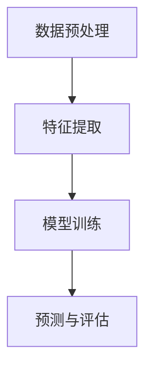
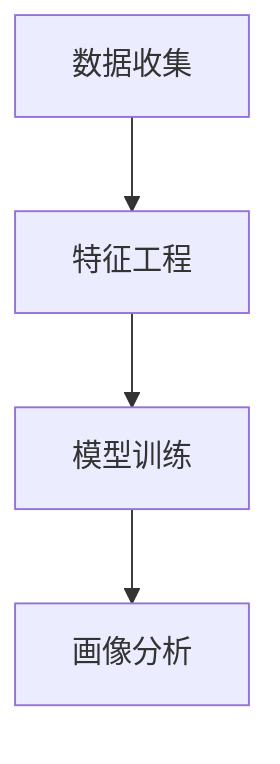
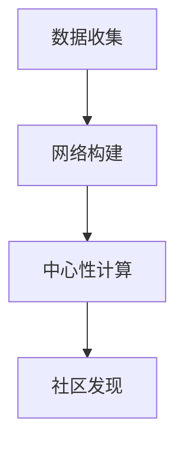
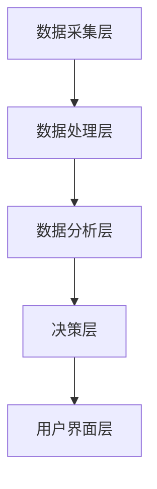
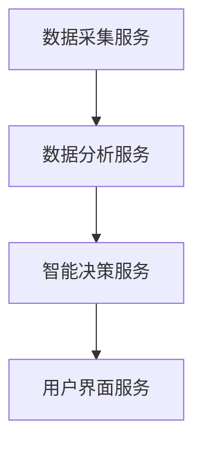
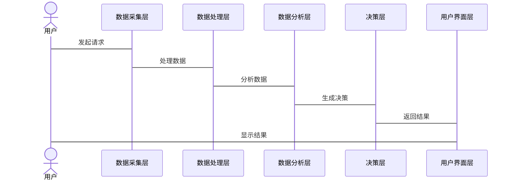

                 


# AI驱动的企业社交媒体管理：策略与实践

## 关键词：
AI技术、社交媒体管理、企业策略、机器学习、数据分析、智能决策

## 摘要：
随着人工智能技术的迅速发展，AI在企业社交媒体管理中的应用越来越广泛。本文将从背景、核心概念、算法原理、系统架构、项目实战等多个方面，详细阐述AI驱动的企业社交媒体管理的策略与实践。通过分析情感分析、用户画像构建等算法，结合实际案例，探讨如何利用AI技术优化社交媒体管理，为企业提供高效、智能的解决方案。

---

# 第一部分: AI驱动的企业社交媒体管理概述

## 第1章: 社会媒体管理的现状与挑战

### 1.1 社会媒体管理的定义与背景

#### 1.1.1 社会媒体管理的定义
社会媒体管理是指对企业在社交媒体平台上的内容、互动和数据进行规划、执行、监控和优化的过程，旨在提升品牌影响力、客户互动性和市场洞察力。

#### 1.1.2 社会媒体管理的发展历程
- 早期阶段：手动发布内容，依赖人工监控。
- 数字化阶段：引入简单工具进行内容发布和数据分析。
- 智能化阶段：AI技术的应用，实现自动化和智能化管理。

#### 1.1.3 当前社会媒体管理的主要挑战
- 数据量庞大：社交媒体数据呈指数级增长，难以处理。
- 信息复杂性：内容形式多样，情感分析难度大。
- 竞争加剧：企业需要更精准的策略来脱颖而出。

### 1.2 人工智能在社会媒体管理中的作用

#### 1.2.1 人工智能技术的快速发展
- NLP技术的进步：情感分析、实体识别等技术的成熟。
- 机器学习模型的优化：深度学习模型在复杂任务中的表现优异。

#### 1.2.2 人工智能在社会媒体管理中的应用潜力
- 自动化内容生成：AI可以根据目标受众生成个性化内容。
- 情感分析：实时监控用户情绪，优化品牌声誉。
- 用户行为预测：基于历史数据预测用户行为，制定精准营销策略。

#### 1.2.3 企业采用AI驱动社会媒体管理的必要性
- 提高效率：自动化处理大量数据，节省时间和成本。
- 增强精准度：通过AI分析，实现更精准的用户定位和内容投放。
- 数据驱动决策：利用AI生成的数据洞察，优化营销策略。

---

## 第2章: AI驱动社会媒体管理的核心概念

### 2.1 AI驱动社会媒体管理的定义

#### 2.1.1 核心概念的定义
AI驱动的社会媒体管理是指利用人工智能技术（如自然语言处理、机器学习）对社交媒体数据进行分析、理解和决策的过程，以实现自动化和智能化的社会媒体管理。

#### 2.1.2 核心概念的属性特征对比表

| 属性 | 传统社会媒体管理 | AI驱动社会媒体管理 |
|------|----------------|-------------------|
| 数据处理 | 手动或简单工具 | 自动化处理，大数据支持 |
| 分析能力 | 简单统计分析 | 深度学习分析，精准预测 |
| 决策方式 | 人工经验主导 | 数据驱动决策，智能推荐 |

#### 2.1.3 ER实体关系图
```mermaid
erDiagram
    actor 顾客
    actor 管理员
    actor 广告商
    database 社交媒体数据
    database 用户数据
    database 内容数据
    object 情感分析结果
    object 用户画像
    object 营销策略
    顾客 --> 社交媒体数据 : 发布内容
    管理员 --> 社交媒体数据 : 监控数据
    广告商 --> 内容数据 : 投放广告
    社交媒体数据 --> 情感分析结果 : 分析情感
    用户数据 --> 用户画像 : 构建画像
    情感分析结果 --> 营销策略 : 优化策略
```

### 2.2 AI驱动社会媒体管理的关键技术

#### 2.2.1 自然语言处理技术
- **定义**：NLP技术用于理解和生成人类语言，是AI驱动社会媒体管理的核心技术之一。
- **应用**：情感分析、内容分类、实体识别等。

#### 2.2.2 机器学习算法
- **定义**：机器学习算法通过数据训练模型，实现预测和分类任务。
- **应用**：用户画像构建、行为预测、内容推荐等。

#### 2.2.3 数据挖掘技术
- **定义**：数据挖掘技术用于从大量数据中提取有价值的信息。
- **应用**：发现用户行为模式、识别市场趋势等。

### 2.3 AI驱动社会媒体管理的实现原理

#### 2.3.1 数据采集与预处理
- **数据来源**：社交媒体平台（如Twitter、Facebook）、企业内部数据、第三方数据源。
- **预处理步骤**：清洗数据、去除噪声、格式转换等。

#### 2.3.2 模型训练与优化
- **训练数据**：使用标注数据训练模型，如情感分析数据集。
- **优化方法**：交叉验证、超参数调优等。

#### 2.3.3 结果输出与反馈
- **输出形式**：生成报告、触发预警、推荐策略等。
- **反馈机制**：根据结果优化模型和策略。

---

## 第3章: AI驱动社会媒体管理的算法原理

### 3.1 主流算法介绍

#### 3.1.1 情感分析算法
- **定义**：情感分析用于判断文本的情感倾向（正面、负面、中性）。
- **算法流程**：
  1. 数据预处理：去除停用词、分词。
  2. 特征提取：提取文本特征（如TF-IDF）。
  3. 模型训练：使用SVM或神经网络进行分类。
  4. 预测与评估：计算准确率、F1分数。

  ```mermaid
  graph TD
      A[数据预处理] --> B[特征提取]
      B --> C[模型训练]
      C --> D[预测与评估]
  ```

- **代码示例**：
  ```python
  from sklearn.svm import SVC
  from sklearn.feature_extraction.text import TfidfVectorizer
  from sklearn.metrics import accuracy_score

  # 数据预处理与特征提取
  vectorizer = TfidfVectorizer()
  X = vectorizer.fit_transform(texts)
  y = labels

  # 模型训练
  model = SVC()
  model.fit(X, y)

  # 预测与评估
  test_texts = ["I love this product!", "This is terrible."]
  test_X = vectorizer.transform(test_texts)
  predictions = model.predict(test_X)
  print("Accuracy:", accuracy_score(test_labels, predictions))
  ```

- **数学模型**：情感分析常用的SVM模型可以表示为：
  $$ \text{argmax}_{y} (w \cdot x + b) $$

#### 3.1.2 用户画像构建算法
- **定义**：用户画像是基于用户行为和特征构建的用户模型，用于精准营销。
- **算法流程**：
  1. 数据收集：收集用户在社交媒体上的行为数据。
  2. 特征工程：提取关键特征（如年龄、性别、兴趣）。
  3. 模型训练：使用聚类算法（如K-means）或推荐算法（如协同过滤）构建画像。
  4. 画像分析：根据画像制定个性化策略。

  ```mermaid
  graph TD
      A[数据收集] --> B[特征工程]
      B --> C[模型训练]
      C --> D[画像分析]
  ```

- **代码示例**：
  ```python
  from sklearn.cluster import KMeans
  from sklearn.preprocessing import StandardScaler

  # 数据预处理
  scaler = StandardScaler()
  X_scaled = scaler.fit_transform(features)

  # 聚类模型训练
  model = KMeans(n_clusters=3)
  model.fit(X_scaled)

  # 获取聚类结果
  clusters = model.predict(X_scaled)
  ```

- **数学模型**：K-means算法的目标函数为：
  $$ \arg\min_{k} \sum_{i=1}^{k} \sum_{j \in C_i} (x_j - \mu_i)^2 $$

#### 3.1.3 社交网络分析算法
- **定义**：社交网络分析用于识别关键节点和网络结构，帮助发现影响力大的用户。
- **算法流程**：
  1. 数据收集：获取用户关系数据。
  2. 网络构建：构建图结构（如邻接矩阵）。
  3. 中心性计算：计算节点的中心性指标（如度中心性、介数中心性）。
  4. 社区发现：使用社区发现算法（如Louvain算法）识别社区结构。

  ```mermaid
  graph TD
      A[数据收集] --> B[网络构建]
      B --> C[中心性计算]
      C --> D[社区发现]
  ```

- **代码示例**：
  ```python
  import networkx as nx
  from community import community_louvain

  # 构建图结构
  G = nx.Graph()
  G.add_edges_from(edges)

  # 社区发现
  partition = community_louvain(G)
  ```

- **数学模型**：Louvain算法的目标函数为：
  $$ Q = \sum_{i<j} (w_{ij} - \frac{d_i d_j}{2m}) ) $$

### 3.2 算法流程图

#### 3.2.1 情感分析算法流程图


#### 3.2.2 用户画像构建流程图


#### 3.2.3 社交网络分析流程图


---

## 第4章: AI驱动社会媒体管理的系统架构

### 4.1 系统功能设计

#### 4.1.1 数据采集模块
- **功能**：实时采集社交媒体上的文本、图片、视频等数据。
- **输入**：社交媒体API接口。
- **输出**：结构化数据存储。

#### 4.1.2 数据分析模块
- **功能**：对采集的数据进行清洗、分析和建模。
- **输入**：结构化数据。
- **输出**：分析结果（如情感分析报告）。

#### 4.1.3 智能决策模块
- **功能**：根据分析结果生成营销策略和行动计划。
- **输入**：分析结果。
- **输出**：优化策略和执行计划。

### 4.2 系统架构设计

#### 4.2.1 分层架构设计


#### 4.2.2 微服务架构设计


#### 4.2.3 可扩展性设计
- **负载均衡**：使用反向代理分发请求。
- **分布式存储**：使用云存储解决方案。
- **弹性计算**：根据需求自动调整计算资源。

### 4.3 系统接口设计

#### 4.3.1 API接口
- **输入接口**：社交媒体数据API。
- **输出接口**：分析结果API。

#### 4.3.2 数据格式
- **输入格式**：JSON格式数据。
- **输出格式**：JSON格式报告。

### 4.4 系统交互流程图

#### 4.4.1 用户发起请求


---

## 第5章: AI驱动社会媒体管理的项目实战

### 5.1 项目背景与目标

#### 5.1.1 项目背景
- 某企业希望通过AI技术优化社交媒体营销策略，提升品牌影响力和客户参与度。

#### 5.1.2 项目目标
- 实现情感分析、用户画像构建和精准广告投放功能。

### 5.2 项目实施

#### 5.2.1 环境安装
- **工具安装**：安装Python、Jupyter Notebook、Pandas、Scikit-learn、NetworkX等。
- **数据源**：获取社交媒体数据，清洗数据并存储。

#### 5.2.2 核心代码实现

##### 5.2.2.1 情感分析模块
```python
import pandas as pd
from sklearn.model_selection import train_test_split
from sklearn.feature_extraction.text import TfidfVectorizer
from sklearn.svm import SVC

# 数据预处理
data = pd.read_csv('social_media_data.csv')
X = data['text']
y = data['sentiment']

# 特征提取
vectorizer = TfidfVectorizer()
X_vec = vectorizer.fit_transform(X)

# 模型训练
X_train, X_test, y_train, y_test = train_test_split(X_vec, y, test_size=0.2)
model = SVC()
model.fit(X_train, y_train)

# 预测与评估
y_pred = model.predict(X_test)
print("Accuracy:", accuracy_score(y_test, y_pred))
```

##### 5.2.2.2 用户画像构建模块
```python
from sklearn.cluster import KMeans
from sklearn.preprocessing import StandardScaler

# 数据预处理
features = data[['age', 'gender', 'interests']]
scaler = StandardScaler()
X_scaled = scaler.fit_transform(features)

# 模型训练
model = KMeans(n_clusters=3)
model.fit(X_scaled)

# 获取聚类结果
clusters = model.predict(X_scaled)
```

##### 5.2.2.3 社交网络分析模块
```python
import networkx as nx
from community import community_louvain

# 构建图结构
edges = data[['user1', 'user2']]
G = nx.Graph()
G.add_edges_from(edges)

# 社区发现
partition = community_louvain(G)
```

#### 5.2.3 案例分析与总结

##### 5.2.3.1 情感分析案例
- **输入**：用户评论数据。
- **输出**：情感分析结果，帮助企业优化品牌声誉。

##### 5.2.3.2 用户画像案例
- **输入**：用户行为数据。
- **输出**：用户画像，支持精准营销策略。

##### 5.2.3.3 社交网络分析案例
- **输入**：用户关系数据。
- **输出**：关键节点和社区结构，识别意见领袖。

#### 5.2.4 项目总结
- **优势**：提高了数据处理效率，实现了精准营销。
- **挑战**：数据隐私问题、模型调优难度大。
- **改进建议**：引入更复杂的模型（如深度学习模型）提升分析精度。

---

## 第6章: AI驱动社会媒体管理的最佳实践

### 6.1 小结
本文详细阐述了AI驱动的社会媒体管理的背景、核心概念、算法原理、系统架构和项目实战。通过具体案例，展示了如何利用AI技术优化企业的社交媒体管理。

### 6.2 注意事项
- **数据隐私**：确保数据处理符合相关法律法规。
- **模型优化**：持续监控和优化模型性能。
- **用户反馈**：定期收集用户反馈，调整策略。

### 6.3 未来研究方向
- **深度学习应用**：探索深度学习模型在社交媒体管理中的应用。
- **多模态分析**：结合文本、图像等多种数据进行分析。
- **实时处理**：提升系统的实时处理能力，满足动态需求。

---

通过以上步骤的详细分析和实践，企业可以更好地利用AI技术优化社交媒体管理，提升品牌影响力和客户满意度。

