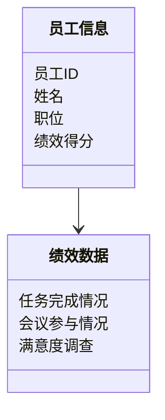
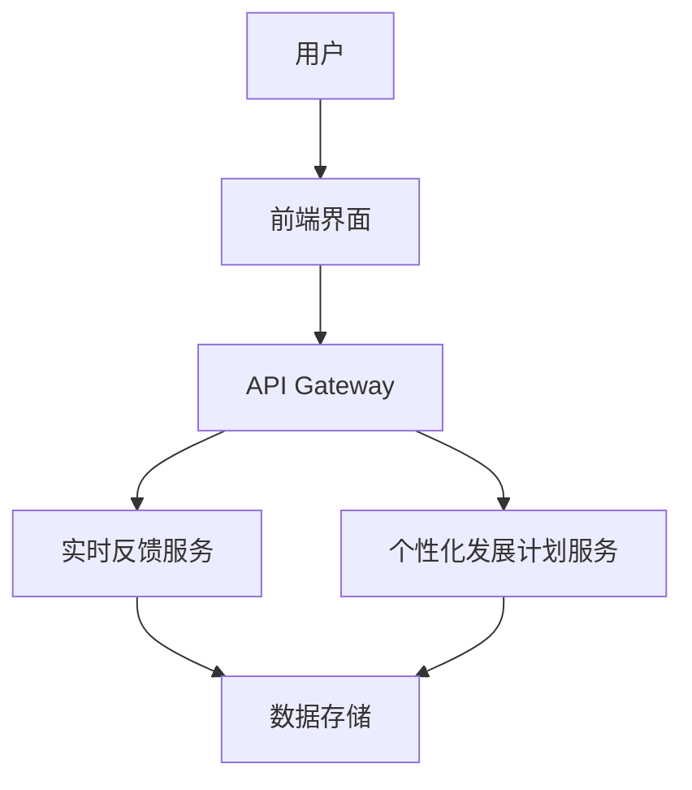

                 


# AI驱动的企业绩效管理：实时反馈与个性化发展计划制定

## 关键词：AI驱动、企业绩效管理、实时反馈、个性化发展计划、人工智能技术、数据分析

## 摘要：  
本文探讨了如何利用人工智能技术优化企业绩效管理，特别是实时反馈与个性化发展计划的制定。通过分析AI技术在绩效管理中的应用，本文详细讲解了实时反馈机制的构建、个性化发展计划的制定，以及相关算法的原理与实现。文章还提供了系统架构设计和项目实战案例，帮助读者全面理解AI驱动的企业绩效管理。

---

# 第一部分: AI驱动的企业绩效管理背景

## 第1章: AI驱动的企业绩效管理背景

### 1.1 企业绩效管理的数字化转型

#### 1.1.1 传统企业绩效管理的挑战

传统的企业绩效管理主要依赖人工记录和评估，存在以下问题：  
1. 数据采集效率低，难以实时反馈。  
2. 评估结果主观性强，缺乏客观依据。  
3. 个性化发展计划难以快速制定。  

#### 1.1.2 AI技术在绩效管理中的应用潜力

人工智能技术可以通过以下方式优化企业绩效管理：  
1. 利用机器学习算法分析大量数据，提供实时反馈。  
2. 基于员工行为数据，制定个性化的发展计划。  
3. 提高评估的客观性和准确性。  

#### 1.1.3 数字化时代的企业绩效管理新趋势

在数字化时代，企业绩效管理正朝着以下方向发展：  
1. **实时化**：通过AI技术实现绩效数据的实时采集与分析。  
2. **个性化**：基于员工特点制定个性化的发展计划。  
3. **智能化**：利用AI算法优化绩效评估和反馈流程。  

---

## 第2章: 实时反馈机制的构建

### 2.1 数据采集与处理

#### 2.1.1 绩效数据的多源采集

AI驱动的绩效管理需要采集多源数据，包括：  
- 员工的工作表现数据（如任务完成情况）。  
- 员工的行为数据（如会议参与情况）。  
- 员工的反馈数据（如满意度调查）。  

#### 2.1.2 数据清洗与预处理

数据清洗是确保数据质量的重要步骤：  
1. 去除重复数据。  
2. 处理缺失值。  
3. 标准化数据格式。  

#### 2.1.3 数据存储与管理

数据存储需要考虑以下方面：  
- 数据库设计：使用关系型数据库存储结构化数据。  
- 数据安全：确保员工数据的隐私和安全。  

---

### 2.2 反馈模型的构建

#### 2.2.1 基于AI的实时反馈算法

实时反馈算法的核心是基于机器学习的预测模型。例如，可以使用线性回归模型预测员工的绩效表现：  

$$ y = \beta_0 + \beta_1x_1 + \beta_2x_2 + \dots + \beta_nx_n $$  

其中，$y$ 是预测的绩效得分，$x_i$ 是输入特征，$\beta_i$ 是模型参数。  

#### 2.2.2 模型训练与优化

模型训练需要以下步骤：  
1. 数据分割：将数据集分为训练集和测试集。  
2. 模型训练：使用训练数据优化模型参数。  
3. 模型评估：使用测试数据评估模型性能。  

---

### 2.3 个性化反馈策略

#### 2.3.1 基于员工行为的反馈优化

个性化反馈需要考虑员工的行为特征：  
1. 行为分析：识别员工的工作习惯和偏好。  
2. 反馈策略：根据员工特点调整反馈内容和方式。  

---

## 第3章: 个性化发展计划的制定

### 3.1 员工能力评估

#### 3.1.1 绩效数据分析与评估

通过数据分析，识别员工的技能差距：  
1. 绩效数据分析：计算员工的绩效得分分布。  
2. 技能差距识别：对比员工绩效与岗位要求。  

#### 3.1.2 个性化发展目标的设定

基于员工数据，制定个性化的发展目标：  
1. 明确短期目标：如提升某项技能。  
2. 设定长期目标：如晋升到高级岗位。  

---

### 3.2 发展计划的动态调整

#### 3.2.1 基于反馈的计划优化

根据实时反馈，动态调整发展计划：  
1. 定期评估计划执行效果。  
2. 根据反馈结果优化计划。  

#### 3.2.2 AI驱动的计划自适应机制

AI算法可以根据反馈结果自动调整计划：  
1. 使用强化学习优化计划策略。  
2. 实时监控计划执行情况。  

---

### 3.3 计划实施的保障措施

#### 3.3.1 员工参与度提升策略

1. 提供透明的反馈机制。  
2. 建立员工自我评估体系。  

#### 3.3.2 管理者的角色与责任

1. 管理者需要指导员工执行计划。  
2. 管理者需要监督计划的执行效果。  

---

## 第4章: AI算法原理与数学模型

### 4.1 AI算法在绩效管理中的应用

#### 4.1.1 算法选择

常用的算法包括：  
- 线性回归（Linear Regression）。  
- 支持向量机（SVM）。  
- 神经网络（Neural Networks）。  

#### 4.1.2 算法实现

以线性回归为例，算法实现步骤如下：  
1. 数据预处理：标准化特征。  
2. 模型训练：使用最小二乘法优化参数。  
3. 模型评估：计算均方误差（MSE）。  

---

## 第5章: 系统架构设计

### 5.1 系统功能设计

#### 5.1.1 领域模型

领域模型设计如图：  


#### 5.1.2 系统架构

系统架构设计如图：  


---

## 第6章: 项目实战

### 6.1 环境安装

需要安装以下工具：  
- Python 3.8+  
- TensorFlow 2.0+  
- Pandas 1.0+  

### 6.2 核心代码实现

以下是一个实时反馈算法的实现示例：  

```python
import pandas as pd
import numpy as np
from sklearn.linear_model import LinearRegression
from sklearn.metrics import mean_squared_error

# 数据加载
data = pd.read_csv('performance_data.csv')

# 数据分割
X = data[['任务完成情况', '会议参与情况']]
y = data['绩效得分']

# 模型训练
model = LinearRegression()
model.fit(X, y)

# 模型预测
y_pred = model.predict(X)

# 模型评估
mse = mean_squared_error(y, y_pred)
print(f'均方误差：{mse}')
```

---

## 第7章: 总结与展望

### 7.1 最佳实践 tips

1. 在数据采集阶段，确保数据的多样性和完整性。  
2. 在模型训练阶段，选择合适的算法并进行充分的调参。  

### 7.2 小结

通过AI技术，企业可以实现绩效管理的实时反馈与个性化发展计划的制定，从而提升员工绩效和企业整体效率。

### 7.3 注意事项

1. 数据隐私保护是关键。  
2. 模型的可解释性需要重视。  

### 7.4 拓展阅读

推荐阅读以下书籍：  
1. 《机器学习实战》  
2. 《企业绩效管理》  

---

通过以上内容，我们可以看到AI技术在企业绩效管理中的巨大潜力，实时反馈与个性化发展计划的制定将成为未来绩效管理的重要趋势。

