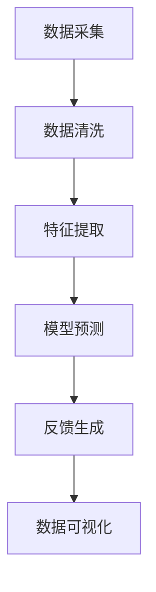

                 


# AI驱动的企业绩效管理：目标设定与实时跟踪

---

## 关键词：
- AI驱动
- 企业绩效管理
- 目标设定
- 实时跟踪
- 机器学习
- 数据分析

---

## 摘要：
本文探讨了AI在企业绩效管理中的应用，重点分析了目标设定与实时跟踪的实现原理和方法。通过结合机器学习和实时数据分析技术，企业能够更高效地制定和调整目标，实时监控绩效表现。文章从背景介绍、核心概念、算法原理、系统架构到项目实战，全面解析了AI驱动的企业绩效管理的实现过程，为企业管理者和技术开发者提供了理论与实践相结合的深度解析。

---

## 第一部分: AI驱动的企业绩效管理概述

### 第1章: 企业绩效管理的基本概念

#### 1.1 企业绩效管理的定义与作用
企业绩效管理（Enterprise Performance Management, EPM）是一种系统化的管理方法，通过设定目标、监控执行、评估结果，帮助企业实现战略目标和持续改进。其作用包括：
- **战略对齐**：确保部门目标与企业战略一致。
- **绩效提升**：通过数据驱动的方法优化业务表现。
- **决策支持**：提供实时数据支持管理决策。

#### 1.2 AI驱动的必要性
传统绩效管理依赖人工经验，存在效率低、主观性强等问题。AI的引入能够：
- **自动化数据处理**：快速收集和分析大量数据。
- **智能化决策支持**：通过机器学习模型提供优化建议。
- **实时反馈**：动态调整目标，提升管理灵活性。

#### 1.3 目标设定与实时跟踪的重要性
目标设定是绩效管理的核心，而实时跟踪则是确保目标达成的关键。AI技术能够通过历史数据预测目标，并实时调整跟踪策略，确保绩效管理的高效性和准确性。

---

### 第2章: AI驱动的绩效管理发展背景

#### 2.1 AI技术对企业管理的影响
- **数据驱动决策**：AI能够从大量数据中提取有价值的信息，辅助管理者制定科学决策。
- **自动化与智能化**：AI技术能够自动化处理日常事务，释放人力资源，提升管理效率。
- **个性化与精准管理**：AI可以根据员工或部门的特性，制定个性化的绩效目标和管理策略。

#### 2.2 数字化转型的推动
企业绩效管理的数字化转型离不开AI技术的支持。通过数字化工具，企业可以实现绩效数据的实时采集、分析和反馈，从而提升管理的精准性和响应速度。

#### 2.3 AI驱动的绩效管理的挑战
- **数据质量**：数据的准确性直接影响AI模型的效果。
- **技术复杂性**：AI算法的实现需要专业的技术团队支持。
- **隐私与合规性**：绩效数据可能涉及员工隐私，需要确保数据的合规使用。

---

## 第二部分: AI驱动的目标设定与实时跟踪的实现原理

### 第3章: AI驱动的目标设定算法

#### 3.1 基于机器学习的目标设定方法
- **历史数据分析**：通过分析历史绩效数据，预测未来目标。
- **特征工程**：提取影响目标的关键特征，如市场趋势、资源投入等。
- **模型训练**：使用回归或分类模型，预测目标的实现可能性。

#### 3.2 目标设定的优化算法
- **遗传算法**：通过不断迭代优化目标，找到最优解。
- **强化学习**：通过试错和奖励机制，动态调整目标设定策略。

#### 3.3 算法实现示例
以下是基于线性回归的目标设定算法示例：

```python
import pandas as pd
from sklearn.linear_model import LinearRegression

# 数据加载
data = pd.read_csv('performance_data.csv')

# 特征与目标分离
X = data[['revenue', 'expenses']]
y = data['target']

# 模型训练
model = LinearRegression()
model.fit(X, y)

# 预测新目标
new_data = pd.DataFrame({'revenue': [1000000], 'expenses': [500000]})
predicted_target = model.predict(new_data)
print(predicted_target)
```

---

### 第4章: 实时跟踪的AI技术实现

#### 4.1 数据采集与处理
- **数据源**：包括企业内部系统（如ERP、CRM）和外部数据源（如市场数据）。
- **数据清洗**：去除无效数据，填充缺失值，处理异常值。

#### 4.2 实时数据分析与反馈
- **流数据处理**：使用流处理技术，实时分析数据并生成反馈。
- **反馈机制**：通过数据可视化和报警系统，实时提醒管理者关注关键指标。

#### 4.3 实时跟踪的流程图



---

### 第5章: 系统架构与技术实现

#### 5.1 系统架构设计
- **分层架构**：包括数据层、业务逻辑层和用户界面层。
- **组件设计**：数据采集模块、数据处理模块、模型预测模块、反馈模块。

#### 5.2 系统交互流程
- **用户登录**：管理员登录系统。
- **目标设定**：输入目标参数，系统生成预测目标。
- **实时监控**：查看实时数据，接收系统反馈。

#### 5.3 系统接口设计
- **API接口**：提供RESTful API，供其他系统调用。
- **数据接口**：与企业系统对接，获取和更新数据。

---

## 第三部分: 项目实战

### 第6章: 项目环境与核心代码实现

#### 6.1 项目环境
- **开发工具**：Python、Jupyter Notebook。
- **库依赖**：Pandas、Scikit-learn、Flask。

#### 6.2 核心代码实现
以下是实时跟踪的代码实现：

```python
import pandas as pd
from flask import Flask, jsonify
from sklearn.ensemble import RandomForestRegressor

# 初始化Flask应用
app = Flask(__name__)

# 加载模型
model = RandomForestRegressor()
model.load('performance_model.pkl')

@app.route('/predict', methods=['POST'])
def predict():
    data = request.get_json()
    df = pd.DataFrame([data])
    prediction = model.predict(df)
    return jsonify({'prediction': prediction.tolist()})

if __name__ == '__main__':
    app.run(debug=True)
```

---

### 第7章: 案例分析与总结

#### 7.1 案例分析
通过一个制造业企业的案例，展示AI驱动的绩效管理在目标设定和实时跟踪中的应用效果。

#### 7.2 总结与展望
总结本文的核心内容，展望未来AI在绩效管理中的发展趋势。

---

## 结语

AI驱动的企业绩效管理正在改变传统的管理方式，通过目标设定与实时跟踪的智能化实现，企业能够更高效地提升绩效表现。本文从理论到实践，详细探讨了AI在这一领域的应用，为企业管理者和技术开发者提供了有益的参考。

