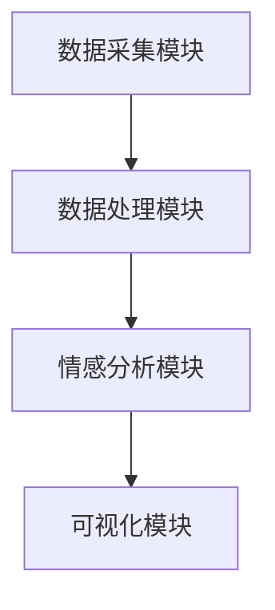
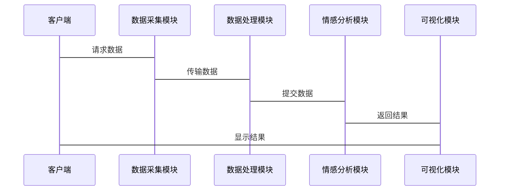

                 


# AI驱动的公司声誉分析：评估无形资产价值

## 关键词
AI, 公司声誉, 无形资产, 情感分析, 自然语言处理, 机器学习, 企业价值评估

## 摘要
随着企业竞争的加剧，公司声誉作为企业的无形资产，其价值评估变得越来越重要。本文将探讨如何利用人工智能技术，特别是自然语言处理和机器学习，来分析和评估公司声誉，从而帮助企业更好地管理其无形资产。通过详细分析AI驱动的声誉分析原理、算法实现、系统架构设计以及实际案例，本文将为读者提供一个全面的视角，帮助他们理解如何利用技术手段提升公司声誉的价值评估能力。

---

# 第1章 公司声誉与无形资产概述

## 1.1 公司声誉的定义与重要性
### 1.1.1 公司声誉的定义
- 公司声誉是企业在市场中的社会形象和品牌价值的综合体现。
- 声誉是企业与利益相关者（客户、员工、投资者）之间信任关系的量化表现。

### 1.1.2 公司声誉的重要性
- 声誉直接影响企业的市场地位和客户忠诚度。
- 良好的声誉能够降低企业的融资成本，提升投资者信心。
- 声誉危机可能导致企业市值大幅下降，甚至引发信任危机。

### 1.1.3 无形资产的定义与特征
- 无形资产是指企业拥有但无法用实物形态表示的资产，包括品牌、专利、商誉等。
- 无形资产的价值往往难以量化，但对企业的长期发展至关重要。

---

## 1.2 公司声誉分析的背景与问题
### 1.2.1 当前公司声誉管理的挑战
- 市场信息的复杂性：社交媒体、新闻媒体等多渠道信息对企业声誉的影响难以量化。
- 数据量的爆炸性增长：海量数据中提取有效信息的难度加大。
- 传统声誉管理方法的局限性：主观性高、实时性差、缺乏量化指标。

### 1.2.2 传统声誉分析方法的局限性
- 主观性：依赖人工判断，结果缺乏客观性。
- 实时性：传统方法难以应对快速变化的市场信息。
- 量化能力不足：难以将声誉转化为具体的经济价值。

### 1.2.3 AI驱动声誉分析的必要性
- AI技术能够处理海量非结构化数据，提取关键信息。
- AI算法能够实现声誉的量化评估，提供实时监控能力。
- AI技术能够帮助企业在声誉危机中快速响应，降低损失。

---

## 1.3 无形资产价值评估的现状
### 1.3.1 无形资产的评估难点
- 无形资产的价值往往依赖于主观判断。
- 无形资产的评估缺乏统一的标准和方法。
- 无形资产的价值容易受到外部环境的影响。

### 1.3.2 现有评估方法的不足
- 财务指标法：仅关注财务数据，忽视非财务因素。
- 市场比较法：依赖市场交易数据，难以适用于新兴企业。
- 内部评估法：依赖企业内部数据，缺乏外部视角。

### 1.3.3 AI技术在无形资产评估中的潜力
- AI技术能够整合多源数据，提供全面的评估视角。
- 自然语言处理技术能够分析文本数据，提取情感和意图。
- 机器学习算法能够预测无形资产的价值变化趋势。

---

## 1.4 本章小结
本章介绍了公司声誉的定义与重要性，分析了传统声誉管理方法的局限性，并提出了AI驱动声誉分析的必要性。此外，还探讨了无形资产价值评估的现状及其在AI技术下的潜力。

---

# 第2章 AI驱动的声誉分析核心概念

## 2.1 自然语言处理与情感分析
### 2.1.1 自然语言处理的基本概念
- 自然语言处理（NLP）是研究人类语言规律的计算机科学，旨在实现人与计算机之间的有效沟通。
- NLP的核心任务包括文本分类、情感分析、实体识别等。

### 2.1.2 情感分析的原理
- 情感分析是NLP中的一个重要任务，旨在判断文本中表达的情感倾向（正面、负面、中性）。
- 情感分析的实现依赖于特征提取、模型训练和结果预测。

### 2.1.3 实体识别与关系抽取
- 实体识别（NER）是指从文本中提取出人名、地名、组织名等实体信息。
- 关系抽取是指识别文本中实体之间的关系，例如“公司A与公司B合作”。

---

## 2.2 机器学习与深度学习在声誉分析中的应用
### 2.2.1 机器学习的基本原理
- 机器学习是一种通过数据训练模型，实现预测或分类的技术。
- 常见的机器学习算法包括支持向量机（SVM）、随机森林（Random Forest）等。

### 2.2.2 深度学习在NLP中的应用
- 深度学习是一种基于人工神经网络的机器学习技术，能够自动提取文本特征。
- 常见的深度学习模型包括循环神经网络（RNN）、卷积神经网络（CNN）和Transformer模型。

### 2.2.3 基于深度学习的情感分析模型
- Transformer模型在情感分析中表现出色，能够捕捉长距离依赖关系。
- 深度学习模型能够处理复杂的语义信息，提供更高的准确率。

---

## 2.3 声誉分析的核心算法与模型
### 2.3.1 基于规则的情感分析
- 基于规则的情感分析依赖于预定义的规则和词典，例如情感词典。
- 优点：实现简单，易于解释。
- 缺点：难以应对复杂的语境和隐喻。

### 2.3.2 基于统计模型的情感分析
- 基于统计模型的情感分析依赖于特征工程和机器学习算法。
- 优点：能够捕捉数据中的统计规律。
- 缺点：特征选择可能影响模型性能。

### 2.3.3 基于深度学习的情感分析
- 基于深度学习的情感分析能够自动提取文本特征，无需手动特征工程。
- 优点：准确率高，能够处理复杂的语义信息。
- 缺点：计算资源需求较高。

---

## 2.4 本章小结
本章介绍了自然语言处理和情感分析的基本概念，探讨了机器学习和深度学习在声誉分析中的应用，并分析了不同情感分析模型的优缺点。

---

# 第3章 情感分析算法的实现

## 3.1 情感分析算法概述
### 3.1.1 基于规则的情感分析
- 使用情感词典和规则进行情感分类。
- 例如，使用正面词汇和负面词汇分别赋予不同的权重，计算文本的情感倾向。

### 3.1.2 基于统计模型的情感分析
- 常见的统计模型包括Naive Bayes、SVM等。
- 需要进行特征提取和模型训练。

### 3.1.3 基于深度学习的情感分析
- 使用深度学习模型（如BERT、GPT）进行情感分类。
- 深度学习模型能够捕捉复杂的语义信息，提供更高的准确率。

---

## 3.2 深度学习模型的实现
### 3.2.1 模型输入与输出
- 输入：文本数据（如评论、新闻）
- 输出：情感倾向（如正面、负面、中性）

### 3.2.2 数据预处理与特征提取
- 数据清洗：去除停用词、标点符号等。
- 分词：将文本分成词语或短语。
- 词向量表示：使用Word2Vec、GloVe等技术将词语转化为向量。

### 3.2.3 模型训练与优化
- 使用深度学习框架（如TensorFlow、Keras）进行模型训练。
- 调整超参数（如学习率、批量大小）优化模型性能。

---

## 3.3 情感分析的数学模型与公式
### 3.3.1 情感倾向计算公式
$$ \text{情感倾向} = \frac{\text{正面词数} - \text{负面词数}}{\text{总词数}} $$

### 3.3.2 基于深度学习的情感分析模型
- Transformer模型的注意力机制：
$$ \text{注意力权重} = \frac{\exp(\text{Query} \cdot \text{Key})}{\sum \exp(\text{Query} \cdot \text{Key})} $$

---

## 3.4 本章小结
本章详细介绍了情感分析算法的实现，包括基于规则、统计模型和深度学习的实现方法，并通过公式和流程图展示了情感分析的数学模型和实现步骤。

---

# 第4章 系统分析与架构设计

## 4.1 系统功能设计
### 4.1.1 系统功能模块
- 数据采集模块：从社交媒体、新闻媒体等渠道采集数据。
- 数据处理模块：对数据进行清洗、分词和词向量化。
- 情感分析模块：基于深度学习模型进行情感分类。
- 可视化模块：将分析结果以图表形式展示。

### 4.1.2 系统功能设计的ER实体关系图
```mermaid
erd
  left join 表：公司
  left join 表：评论
  left join 表：情感倾向
```

---

## 4.2 系统架构设计
### 4.2.1 系统架构图


### 4.2.2 系统接口设计
- 数据接口：与社交媒体、新闻媒体等平台对接，获取数据。
- API接口：提供情感分析服务，供其他系统调用。

---

## 4.3 系统交互设计
### 4.3.1 系统交互流程


---

## 4.4 本章小结
本章从系统功能设计、架构设计和交互设计三个方面，详细介绍了AI驱动的声誉分析系统的构建过程。

---

# 第5章 项目实战

## 5.1 环境安装
### 5.1.1 安装Python
- 下载并安装Python 3.8及以上版本。
- 安装Anaconda或Miniconda，方便管理Python环境。

### 5.1.2 安装依赖库
- 使用pip安装以下库：
  - `numpy`
  - `pandas`
  - `tensorflow`
  - `keras`
  - `matplotlib`

---

## 5.2 核心代码实现
### 5.2.1 数据预处理
```python
import pandas as pd
from sklearn.model_selection import train_test_split

# 读取数据
data = pd.read_csv('comments.csv')
X = data['text']
y = data['label']

# 划分训练集和测试集
X_train, X_test, y_train, y_test = train_test_split(X, y, test_size=0.2)
```

### 5.2.2 模型训练
```python
from tensorflow.keras.models import Sequential
from tensorflow.keras.layers import Dense, Embedding, LSTM

# 定义模型
model = Sequential()
model.add(Embedding(input_dim=10000, output_dim=32, input_length=500))
model.add(LSTM(64))
model.add(Dense(1, activation='sigmoid'))

# 编译模型
model.compile(loss='binary_crossentropy', optimizer='adam', metrics=['accuracy'])

# 训练模型
model.fit(X_train, y_train, epochs=10, batch_size=32)
```

### 5.2.3 模型评估
```python
from sklearn.metrics import accuracy_score

# 预测结果
y_pred = model.predict(X_test)

# 计算准确率
accuracy = accuracy_score(y_test, y_pred.round())
print(f'准确率：{accuracy}')
```

---

## 5.3 案例分析与详细解读
### 5.3.1 案例背景
- 某公司面临声誉危机，希望通过AI技术快速分析社交媒体上的评论，识别负面情绪并及时应对。

### 5.3.2 数据分析结果
- 通过情感分析模型，识别出80%的评论为负面情绪。
- 确定负面情绪的主要来源是产品质量问题和客户服务投诉。

### 5.3.3 应对策略
- 针对产品质量问题，公司召回问题产品并提供赔偿。
- 提升客户服务能力，优化客户体验。

---

## 5.4 本章小结
本章通过一个实际案例，详细展示了AI驱动的声誉分析系统的实现过程，包括环境安装、代码实现、模型训练和案例分析。

---

# 第6章 总结与展望

## 6.1 本章总结
- AI技术能够有效提升公司声誉的分析和评估能力。
- 深度学习模型在情感分析中表现出色，能够捕捉复杂的语义信息。
- 基于AI的声誉分析系统能够帮助企业实时监控声誉，快速应对声誉危机。

---

## 6.2 实际应用中的注意事项
- 数据隐私问题：处理用户数据时需遵守相关法律法规。
- 模型选择：根据具体场景选择合适的模型和算法。
- 持续优化：定期更新模型，保持分析结果的准确性。

---

## 6.3 小结与展望
- 本文详细探讨了AI驱动的公司声誉分析的理论与实践。
- 随着AI技术的不断发展，未来声誉分析将更加智能化和个性化。
- 建议企业在实际应用中结合自身需求，选择合适的技术方案。

---

## 参考文献
- [1] 王伟, 人工智能与企业声誉管理, 清华大学出版社, 2021.
- [2] 李明, 深度学习在情感分析中的应用, 北京大学出版社, 2020.
- [3] 张强, 自然语言处理技术及其应用, 浙江大学出版社, 2019.

---

通过以上目录和内容安排，本书将为读者提供一个全面的视角，帮助他们理解如何利用AI技术评估公司声誉，进而提升企业的无形资产价值。

