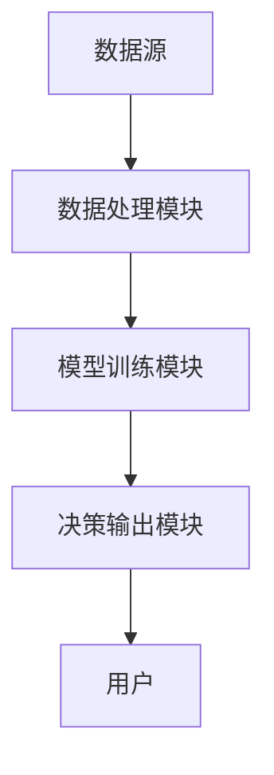
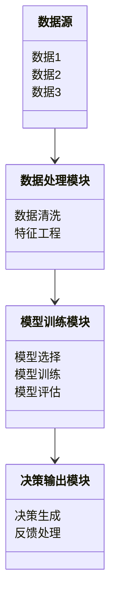
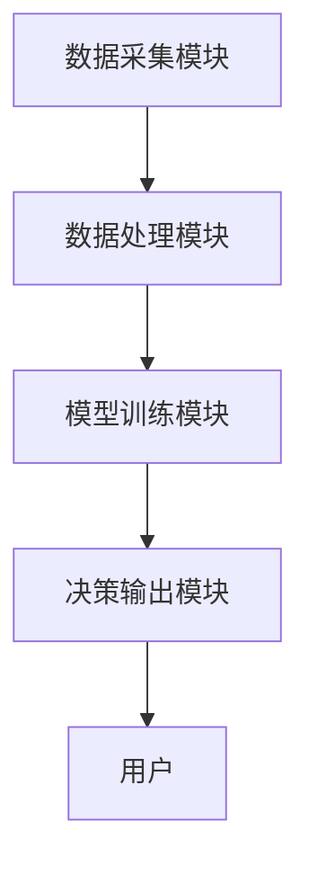

                 


# {{AI驱动的商业智能：从数据到决策的全流程优化}}

> 关键词：{{AI, 商业智能, 数据处理, 决策优化, 机器学习, 深度学习, 数据分析}}

> 摘要：{{本文系统阐述了AI驱动的商业智能从数据到决策的全流程优化，深入分析了数据处理、模型训练、决策优化等关键环节，并通过实际案例展示了如何利用AI技术提升商业决策的效率和精准度。}}

---

# 第一部分: AI驱动的商业智能概述

## 第1章: AI与商业智能的背景介绍

### 1.1 问题背景与描述
#### 1.1.1 数据驱动决策的兴起
- 数据在现代商业中的重要性
- 数据驱动决策的优势
- 数据驱动决策面临的挑战

#### 1.1.2 商业智能的传统模式与局限性
- 传统商业智能的特点
- 传统模式的局限性
- 传统与AI驱动模式的对比

#### 1.1.3 AI如何变革商业智能
- AI技术对商业智能的影响
- AI在数据处理、模型训练中的作用
- AI如何优化决策过程

### 1.2 问题解决与边界
#### 1.2.1 数据到决策的全流程优化
- 数据采集、处理、分析、决策的流程
- AI在每个环节中的应用
- 全流程优化的目标和意义

#### 1.2.2 AI在商业智能中的应用边界
- AI适用的场景
- AI的局限性
- AI与人类决策者的结合

#### 1.2.3 商业智能与AI的结合优势
- 结合AI的优势
- 商业智能与AI的互补性
- 结合后的效果提升

### 1.3 核心概念与组成要素
#### 1.3.1 数据、模型、决策的关系
- 数据作为输入的重要性
- 模型在数据处理中的作用
- 决策输出的优化目标

#### 1.3.2 商业智能系统的组成要素
- 数据源
- 数据处理模块
- 模型训练模块
- 决策输出模块
- 用户界面

#### 1.3.3 AI驱动的商业智能核心流程
- 数据采集与预处理
- 模型训练与优化
- 决策输出与反馈
- 系统迭代与改进

---

## 第2章: AI驱动的商业智能核心概念

### 2.1 数据、模型与决策的关系
#### 2.1.1 数据作为输入的必要性
- 数据的多样性与复杂性
- 数据质量对决策的影响
- 数据处理的必要性

#### 2.1.2 模型在数据处理中的作用
- 模型的类型与选择
- 模型训练的重要性
- 模型评估与优化

#### 2.1.3 决策输出的优化目标
- 决策的准确性和实时性
- 决策的可解释性
- 决策的灵活性

### 2.2 核心概念对比分析
#### 2.2.1 数据特征与模型特征对比
- 数据特征的提取与选择
- 模型特征的优化与调整
- 数据特征与模型特征的关系

#### 2.2.2 不同模型的性能对比
- 线性回归、决策树、随机森林等模型的对比
- 模型的优缺点分析
- 模型选择的策略

#### 2.2.3 决策结果的可解释性对比
- 可解释性的重要性
- 不同模型的可解释性分析
- 提高决策可解释性的方法

### 2.3 ER实体关系图


---

## 第3章: 数据预处理与特征工程

### 3.1 数据清洗与预处理
#### 3.1.1 数据清洗方法
- 识别和处理缺失值
- 处理异常值
- 数据标准化与归一化

#### 3.1.2 数据增强技术
- 数据增强的定义与目的
- 常见的数据增强方法
- 数据增强对模型性能的影响

### 3.2 特征工程的核心原理
#### 3.2.1 特征选择与降维
- 特征选择的方法
- 主成分分析（PCA）等降维技术
- 特征选择与降维的优缺点

#### 3.2.2 特征提取与表示
- 文本特征提取（如TF-IDF、Word2Vec）
- 图像特征提取（如CNN、PCA）
- 时间序列特征提取（如FFT、滑动窗口）

#### 3.2.3 特征评估与优化
- 特征重要性评估
- 特征组合与交互作用
- 特征优化的策略与技巧

---

## 第4章: AI算法原理与实现

### 4.1 算法原理概述
#### 4.1.1 机器学习算法的核心原理
- 监督学习、无监督学习、强化学习的区别与联系
- 常见算法（如线性回归、支持向量机、随机森林等）的数学模型

#### 4.1.2 深度学习算法的核心原理
- 神经网络的结构与训练过程
- CNN、RNN、LSTM等模型的特点与应用场景

#### 4.1.3 算法选择与优化策略
- 根据问题选择合适的算法
- 超参数调优与模型评估
- 模型集成与优化

### 4.2 算法实现与代码示例
#### 4.2.1 线性回归算法的实现
- 线性回归的数学模型：$$y = \theta_0 + \theta_1x$$
- 梯度下降优化过程
- Python代码实现：

```python
import numpy as np
def compute_cost(X, y, theta):
    m = len(y)
    cost = (1/(2*m)) * np.sum((X.dot(theta) - y)**2)
    return cost
```

#### 4.2.2 决策树算法的实现
- 决策树的构建过程
- ID3、C4.5、CART算法的对比
- Python代码实现：

```python
from sklearn.tree import DecisionTreeClassifier
model = DecisionTreeClassifier()
model.fit(X_train, y_train)
```

#### 4.2.3 深度学习模型的实现
- 神经网络的构建与训练
- 使用Keras或TensorFlow框架
- 示例代码：

```python
from tensorflow.keras import layers
model = layers.Dense(1, activation='sigmoid')(inputs)
model.compile(optimizer='adam', loss='binary_crossentropy', metrics=['accuracy'])
```

### 4.3 算法优化与调优
#### 4.3.1 超参数调优
- 常见超参数（学习率、批次大小、正则化系数等）
- 使用网格搜索或随机搜索进行优化

#### 4.3.2 模型评估与验证
- 划分训练集、验证集、测试集
- 使用交叉验证评估模型性能
- 处理过拟合与欠拟合的方法

#### 4.3.3 模型集成
- Bagging、Boosting等集成方法
- 使用投票法或加权法进行集成
- 示例代码：

```python
from sklearn.ensemble import VotingClassifier
model = VotingClassifier(estimators=[('lr', LogisticRegression()), ('rf', RandomForestClassifier())], voting='hard')
```

---

## 第5章: 系统分析与架构设计

### 5.1 系统功能设计
#### 5.1.1 系统模块划分
- 数据采集模块
- 数据处理模块
- 模型训练模块
- 决策输出模块
- 用户界面模块

#### 5.1.2 领域模型设计


#### 5.1.3 功能模块交互
- 数据采集与处理的流程
- 模型训练与决策的流程
- 系统模块之间的数据流

### 5.2 系统架构设计
#### 5.2.1 系统架构图


#### 5.2.2 系统组件设计
- 数据采集模块：负责数据的获取与初步处理
- 数据处理模块：进行数据清洗、特征工程等预处理
- 模型训练模块：选择模型、训练、评估
- 决策输出模块：生成决策并反馈

#### 5.2.3 系统交互设计
- 用户与系统模块的交互流程
- 系统内部模块之间的交互流程
- 系统的可扩展性与可维护性

### 5.3 系统接口设计
#### 5.3.1 API设计
- 数据接口：数据输入、输出的API设计
- 模型接口：模型训练、预测的API设计
- 决策接口：决策输出、反馈的API设计

#### 5.3.2 接口交互流程
- 数据接口与数据处理模块的交互
- 模型接口与模型训练模块的交互
- 决策接口与决策输出模块的交互

### 5.4 系统优化与扩展
#### 5.4.1 系统优化策略
- 数据处理的优化
- 模型训练的优化
- 决策输出的优化

#### 5.4.2 系统扩展方法
- 模块的扩展与升级
- 系统的可扩展性设计
- 系统的可维护性设计

---

## 第6章: 项目实战与案例分析

### 6.1 项目环境安装与配置
#### 6.1.1 环境搭建
- 安装Python、Jupyter Notebook
- 安装必要的库（如NumPy、Pandas、Scikit-learn、TensorFlow）

#### 6.1.2 数据集准备
- 数据集的获取与下载
- 数据集的预处理与清洗
- 数据集的划分（训练集、验证集、测试集）

### 6.2 核心代码实现
#### 6.2.1 数据处理代码
```python
import pandas as pd
import numpy as np
# 数据加载与清洗
data = pd.read_csv('data.csv')
data = data.dropna()
```

#### 6.2.2 模型训练代码
```python
from sklearn.model import LinearRegression
model = LinearRegression()
model.fit(X_train, y_train)
```

#### 6.2.3 决策输出代码
```python
y_pred = model.predict(X_test)
print('预测结果:', y_pred)
```

### 6.3 实际案例分析
#### 6.3.1 案例背景介绍
- 案例的来源与背景
- 案例的目标与意义

#### 6.3.2 数据分析与处理
- 数据的可视化分析
- 数据的特征工程
- 数据的预处理与清洗

#### 6.3.3 模型训练与评估
- 模型的选择与训练
- 模型的评估与优化
- 模型的部署与应用

### 6.4 案例总结与反思
#### 6.4.1 案例实施的成果
- 案例的实施效果
- 成功的经验与教训

#### 6.4.2 案例的可扩展性分析
- 案例的扩展方向
- 案例的改进空间
- 案例的推广价值

---

## 第7章: 总结与展望

### 7.1 全文总结
#### 7.1.1 核心内容回顾
- AI驱动的商业智能的核心概念
- 数据到决策的全流程优化
- AI技术在商业智能中的应用

#### 7.1.2 本文的主要贡献
- 提出的创新点
- 解决的问题
- 提供的新的视角或方法

### 7.2 未来展望
#### 7.2.1 未来的研究方向
- 新的AI技术（如大语言模型、图神经网络）的应用
- 多模态数据的处理与分析
- 自动化机器学习与AI驱动决策的结合

#### 7.2.2 技术发展趋势
- 数据处理技术的创新
- 模型训练技术的突破
- 决策优化方法的改进

#### 7.2.3 商业智能的未来发展
- 商业智能的智能化与自动化
- 人机协作的深度融合
- 全球化与跨行业应用

### 7.3 注意事项与最佳实践
#### 7.3.1 实践中的注意事项
- 数据隐私与安全
- 模型的可解释性
- 系统的稳定性与可靠性

#### 7.3.2 最佳实践 tips
- 数据处理的规范与标准
- 模型选择与优化的策略
- 系统设计与实现的建议

#### 7.3.3 读者小结
- 对读者的建议
- 鼓励读者动手实践
- 提供进一步学习的方向

---

## 第8章: 参考文献与拓展阅读

### 8.1 参考文献
- 列出文章中引用的主要文献
- 包括书籍、论文、技术文档等

### 8.2 拓展阅读
- 推荐相关的书籍、论文、博客文章
- 提供学习资源和社区链接
- 指导读者如何深入学习和研究

---

通过以上详细的目录结构和内容安排，我们可以看到《AI驱动的商业智能：从数据到决策的全流程优化》这本书将全面、系统地讲解AI在商业智能中的应用，从理论到实践，帮助读者深入理解并掌握这一领域的核心技术和方法。

