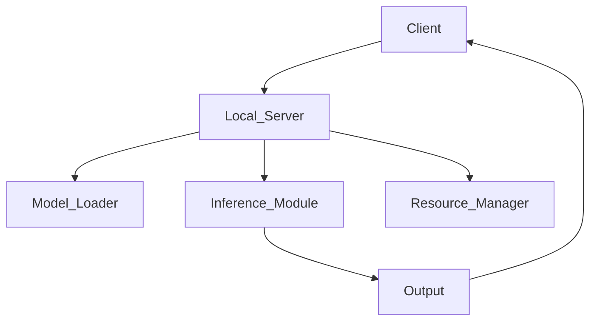

                 


# API调用还是本地部署？LLM使用策略对比

---

## 关键词：
- 大语言模型（LLM）
- API调用
- 本地部署
- 成本分析
- 性能对比
- 安全性

---

## 摘要：
随着大语言模型（LLM）的广泛应用，选择API调用还是本地部署成为了开发者和企业在实际应用中面临的重要决策。本文将从成本、性能、安全性等多个维度，对比分析API调用和本地部署的优缺点，并通过具体的技术细节和案例，帮助读者理解两种策略的核心差异，从而做出更合适的选择。文章还深入探讨了API网关和模型压缩算法的实现原理，并结合实际项目，给出了系统架构设计和实战指导。

---

# 第1章: 引言

## 1.1 什么是LLM？
### 1.1.1 大语言模型的定义
大语言模型（Large Language Model, LLM）是一种基于深度学习的自然语言处理模型，通常使用Transformer架构，能够处理和生成自然语言文本。LLM的核心在于其巨大的参数量和强大的上下文理解能力，使其在文本生成、机器翻译、问答系统等领域表现出色。

### 1.1.2 LLM的主要特点
- **大规模训练数据**：通常使用互联网上的海量文本数据进行训练。
- **多任务能力**：一个模型可以适应多种NLP任务，如文本生成、问答、摘要等。
- **上下文理解**：通过Transformer的自注意力机制，模型能够理解文本的上下文关系。
- **可扩展性**：通过并行计算和模型优化，LLM可以不断进化，性能持续提升。

### 1.1.3 LLM的应用场景
- **文本生成**：自动化内容创作、营销文案生成。
- **问答系统**：智能客服、知识库问答。
- **机器翻译**：跨语言沟通工具。
- **代码生成与补全**：开发者工具、自动化编码助手。
- **数据分析与洞察**：从文本数据中提取关键信息。

## 1.2 LLM的两种使用方式
### 1.2.1 API调用的定义
API调用是一种通过网络接口访问第三方提供的LLM服务的方式。用户通过调用API接口，将请求发送到远程服务器，由服务器返回处理结果。这种方式无需本地部署模型，适合快速集成和按需使用。

### 1.2.2 本地部署的定义
本地部署是指将LLM模型直接运行在本地服务器或个人设备上。这种方式需要本地安装模型，并配置相应的计算资源（如GPU）来支持模型的推理过程。本地部署适合对性能要求高、对数据隐私有严格要求的场景。

### 1.2.3 两种方式的对比
- **API调用**：便捷性高，资源占用低，但依赖网络，成本可能较高，且受制于供应商的限制。
- **本地部署**：性能更强，数据控制更严格，但需要较高的硬件投入和维护成本。

---

# 第2章: API调用的优缺点

## 2.1 API调用的成本分析
### 2.1.1 计算资源的外包
API调用将计算资源外包给第三方服务提供商，无需自行购买和维护硬件设备。这种方式适合预算有限的企业或个人开发者。

### 2.1.2 API调用的费用结构
API调用通常采用按次数收费的模式，即每次调用支付一定的费用。这种收费模式灵活，适合小规模或间歇性使用的场景。

### 2.1.3 API调用的性能瓶颈
由于依赖第三方服务器，API调用的延迟较高，尤其是在网络条件不佳的情况下，性能可能会受到显著影响。

## 2.2 API调用的性能对比
### 2.2.1 延迟分析
API调用的延迟主要由网络传输时间和服务器响应时间决定。在网络条件良好的情况下，延迟通常在几百毫秒以内，但仍然高于本地部署的性能。

### 2.2.2 并发能力
大多数API服务提供商限制了每个用户的并发请求数量，这可能导致在高并发场景下性能下降。

### 2.2.3 带宽需求
频繁的API调用会消耗大量的网络带宽，尤其是在处理大模型请求时，带宽成本可能显著增加。

## 2.3 API调用的安全性
### 2.3.1 数据隐私问题
通过API调用，数据会发送到第三方服务器，这可能导致数据泄露或被滥用。

### 2.3.2 API供应商的可靠性
依赖第三方供应商意味着一旦供应商的服务出现问题，可能会影响整个系统的运行。

### 2.3.3 安全漏洞的风险
API接口可能存在未修复的安全漏洞，攻击者可能利用这些漏洞进行恶意攻击。

---

# 第3章: 本地部署的优缺点

## 3.1 本地部署的成本分析
### 3.1.1 资源投入
本地部署需要购买高性能的计算设备（如GPU服务器）和存储设备，初期投入较高。

### 3.1.2 维护成本
本地部署需要定期维护服务器、更新软件和处理硬件故障，增加了运维成本。

### 3.1.3 初期投资
与API调用相比，本地部署的初期投资较大，尤其是对于中小型企业来说，资金压力可能较为明显。

## 3.2 本地部署的性能对比
### 3.2.1 延迟优化
本地部署能够显著降低延迟，尤其是在模型推理速度和响应时间方面。

### 3.2.2 并发处理能力
本地部署的服务器可以根据需求进行扩展，支持更高的并发请求。

### 3.2.3 网络依赖性
本地部署的性能不受网络条件的影响，延迟更低，但需要考虑本地硬件的性能瓶颈。

## 3.3 本地部署的安全性
### 3.3.1 数据控制
本地部署能够更好地控制数据，确保数据不被外部供应商访问，降低了数据泄露的风险。

### 3.3.2 系统稳定性
本地部署的系统稳定性更高，受外部服务中断的影响较小。

### 3.3.3 安全策略的定制化
本地部署可以根据具体需求定制安全策略，提升系统的安全性。

---

# 第4章: API调用与本地部署的核心概念对比

## 4.1 对比分析表格

| 对比维度         | API调用                          | 本地部署                        |
|------------------|----------------------------------|----------------------------------|
| **成本**         | 按次收费，初期投入低             | 初期投入高，运维成本高           |
| **性能**         | 延迟较高，受限于网络             | 延迟低，性能更优                 |
| **安全性**       | 数据控制能力弱，依赖第三方        | 数据控制能力强，安全性更高       |
| **扩展性**       | 易扩展，适合小规模使用           | 扩展性受限，适合大规模部署       |
| **维护复杂性**    | 维护简单，依赖第三方              | 维护复杂，需要专业团队           |
| **资源利用率**    | 资源利用率低，浪费较多            | 资源利用率高，浪费较少            |

---

## 4.2 ER实体关系图

```mermaid
er
  actor: 用户
  api_gateway: API网关
  model_server: 模型服务器
  local_server: 本地服务器

  actor --> api_gateway: 发起请求
  api_gateway --> model_server: 转发请求
  model_server --> api_gateway: 返回结果
  api_gateway --> actor: 返回结果

  local_server <---> actor: 发起请求和返回结果
```

---

# 第5章: API调用的算法实现

## 5.1 API网关的实现原理
### 5.1.1 请求路由
API网关根据请求路径和参数，将请求转发到对应的后端服务。

### 5.1.2 负载均衡
API网关通过轮询或权重分配的方式，将请求分发到多个后端服务，以提高系统的吞吐量和可靠性。

### 5.1.3 访问控制
API网关可以通过API密钥、JWT令牌等方式，对API的访问进行身份验证和权限控制。

---

## 5.2 模型压缩算法
### 5.2.1 线性变换压缩
通过矩阵乘法对模型参数进行压缩，减少参数量的同时保持模型性能。

$$
Y = W \cdot X + b
$$

其中，$X$ 是输入，$W$ 是权重矩阵，$b$ 是偏置项。

### 5.2.2 量化压缩
将模型参数的数值精度从浮点数降低到低位整数，如8位整数或16位整数。

### 5.2.3 模型蒸馏
通过小模型模仿大模型的输出，降低模型的计算需求。

---

## 5.3 实战代码
```python
import requests

def call_api(text):
    headers = {
        "Content-Type": "application/json",
        "Authorization": "Bearer API_KEY"
    }
    payload = {
        "input": text
    }
    response = requests.post("https://api.example.com/v1/predict", json=payload, headers=headers)
    return response.json()

# 示例调用
print(call_api("这是一个测试"))
```

---

# 第6章: 本地部署的系统架构设计

## 6.1 本地服务器的系统架构
### 6.1.1 系统组成
- **模型加载模块**：负责加载预训练的LLM模型。
- **推理模块**：负责处理输入文本，生成输出结果。
- **资源管理模块**：监控GPU、CPU的使用情况，优化资源分配。

### 6.1.2 系统交互流程
1. 用户通过本地客户端提交请求。
2. 请求被发送到本地服务器。
3. 本地服务器加载模型，进行推理。
4. 处理结果返回给客户端。

---

## 6.2 系统架构图



---

## 6.3 系统接口设计
### 6.3.1 输入接口
- **输入格式**：JSON格式文本。
- **输入参数**：text、model_name、temperature。

### 6.3.2 输出接口
- **输出格式**：JSON格式文本。
- **输出参数**：response, status_code, error_msg。

---

## 6.4 项目实战

### 6.4.1 环境安装
```bash
pip install transformers torch
```

### 6.4.2 核心代码实现
```python
import torch
from transformers import AutoTokenizer, AutoModelForCausalLM

# 加载模型
model_name = "gpt2"
tokenizer = AutoTokenizer.from_pretrained(model_name)
model = AutoModelForCausalLM.from_pretrained(model_name)

# 推理过程
def generate_text(prompt):
    inputs = tokenizer.encode(prompt, return_tensors="pt")
    outputs = model.generate(inputs, max_length=50, temperature=0.7)
    return tokenizer.decode(outputs[0], skip_special_tokens=True)

# 示例调用
print(generate_text("这是一个测试"))
```

### 6.4.3 案例分析
- **案例背景**：本地部署一个GPT-2模型，用于内部客服系统的智能问答。
- **系统设计**：使用本地服务器接收客服请求，通过模型生成回复。
- **性能优化**：通过并行计算和缓存机制，提升模型推理速度。

---

# 第7章: 最佳实践与总结

## 7.1 最佳实践
### 7.1.1 API调用的最佳实践
- **选择可靠的API供应商**：确保API服务的稳定性和数据安全性。
- **优化API调用频率**：通过限流和队列管理，减少超时风险。
- **监控API性能**：实时监控API的响应时间和错误率，及时发现和解决问题。

### 7.1.2 本地部署的最佳实践
- **硬件优化**：选择适合的GPU和存储设备，确保模型运行流畅。
- **模型优化**：通过模型压缩和蒸馏技术，降低计算资源消耗。
- **安全加固**：定期进行安全漏洞扫描，加强数据加密和访问控制。

## 7.2 总结
API调用和本地部署各有优缺点，选择哪种方式取决于具体的应用场景、预算和需求。对于小规模应用和快速验证，API调用是更优的选择；而对于大规模应用和对数据隐私要求高的场景，本地部署更具优势。随着技术的不断进步，未来的LLM使用策略可能会更加灵活多样。

---

## 7.3 注意事项
- **数据隐私**：无论选择哪种方式，数据隐私始终是需要重点关注的问题。
- **性能监控**：定期监控系统的性能指标，及时优化和调整部署策略。
- **技术更新**：关注LLM技术的最新发展，灵活调整部署方式。

---

## 7.4 拓展阅读
- **API网关**：深入理解API网关的功能和实现原理。
- **模型压缩技术**：学习更多模型压缩算法，优化本地部署的性能。
- **分布式计算**：探索分布式计算技术，提升本地部署的扩展性。

---

通过本文的详细对比和分析，读者可以更好地理解API调用和本地部署的优缺点，并根据实际需求选择合适的策略，充分发挥大语言模型的优势，为实际应用提供更高效、更安全的解决方案。

