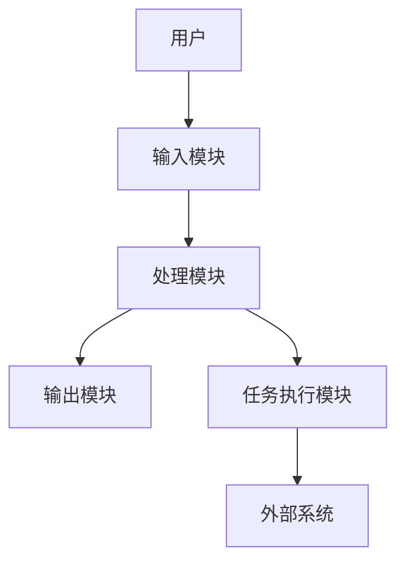
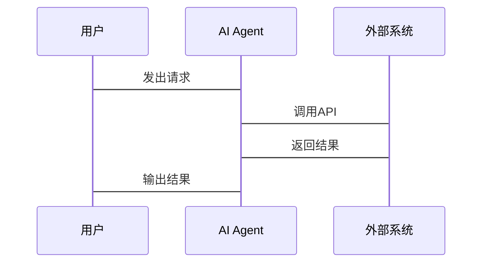

                 


# BERT模型在AI Agent中的应用与微调

## 关键词：BERT模型，AI Agent，自然语言处理，微调，人工智能

## 摘要：
本文深入探讨BERT模型在AI Agent中的应用与微调方法，分析BERT模型的核心原理及其在AI Agent中的具体应用场景，结合实际案例详细讲解如何通过微调BERT模型来提升AI Agent的性能。文章内容涵盖BERT模型的基本原理、AI Agent的系统架构、BERT模型在AI Agent中的应用案例、系统设计与实现等内容，旨在为读者提供全面的技术指导。

---

# 第一部分: BERT模型在AI Agent中的应用与微调基础

# 第1章: BERT模型与AI Agent概述

## 1.1 BERT模型的基本概念

### 1.1.1 什么是BERT模型
BERT（Bidirectional Encoder Representations from Transformers）是由Google提出的基于Transformer的深度语言模型。它通过预训练的方式，能够捕获文本中的上下文关系，从而在多种自然语言处理任务中表现出色。

### 1.1.2 BERT模型的核心特点
- **双向编码**：BERT采用双向Transformer结构，能够同时考虑上下文的信息。
- **预训练+微调**：BERT通过大规模的无监督预训练，然后通过微调适应具体任务。
- **通用性强**：BERT在多种任务上表现出色，包括文本分类、问答系统、实体识别等。

### 1.1.3 BERT模型的应用场景
- **自然语言理解**：如问答系统、对话系统。
- **文本生成**：如文本摘要、机器翻译。
- **情感分析**：分析文本情感倾向。

## 1.2 AI Agent的基本概念

### 1.2.1 什么是AI Agent
AI Agent（人工智能代理）是一种能够感知环境、自主决策并执行任务的智能实体。它可以是一个软件程序，也可以是一个物理设备，通过与用户或环境交互完成特定任务。

### 1.2.2 AI Agent的核心功能
- **感知**：通过传感器或输入接口获取信息。
- **决策**：基于感知信息做出决策。
- **执行**：通过执行器或输出接口执行决策。

### 1.2.3 AI Agent的应用领域
- **智能助手**：如Siri、Alexa。
- **智能客服**：自动处理客户咨询。
- **机器人**：工业机器人、服务机器人。

## 1.3 BERT模型在AI Agent中的应用

### 1.3.1 BERT模型在自然语言处理中的优势
- **上下文理解**：BERT能够准确理解文本的上下文关系。
- **任务通用性**：通过微调，BERT可以适应多种自然语言处理任务。

### 1.3.2 AI Agent中自然语言处理的重要性
- **用户交互**：AI Agent需要通过自然语言与用户交互。
- **任务处理**：AI Agent需要理解用户的意图并执行相关任务。

### 1.3.3 BERT模型在AI Agent中的应用前景
- **提升交互体验**：通过BERT模型，AI Agent可以更自然地与用户交互。
- **增强任务处理能力**：BERT模型能够帮助AI Agent更好地理解任务需求。

## 1.4 本章小结
本章介绍了BERT模型和AI Agent的基本概念，分析了BERT模型在AI Agent中的应用价值和前景。接下来将详细探讨BERT模型的核心原理。

---

# 第2章: BERT模型的核心原理

## 2.1 BERT模型的架构

### 2.1.1 Transformer架构
Transformer由编码器和解码器组成，BERT使用编码器堆叠，通过自注意力机制捕获文本的全局信息。

### 2.1.2 BERT模型的层叠结构
BERT由多个Transformer层堆叠而成，每一层包括多头自注意力和前馈神经网络。

### 2.1.3 BERT模型的参数规模
- **Base版本**：1.1B参数。
- **Large版本**：3.3B参数。

## 2.2 BERT模型的预训练过程

### 2.2.1 Masked Language Model
- **目标**：预测被遮蔽的单词。
- **实现**：在输入序列中随机遮蔽部分单词，通过自注意力机制预测被遮蔽的单词。

### 2.2.2 Next Sentence Prediction
- **目标**：判断两个句子的顺序关系。
- **实现**：在输入序列中加入特殊标记，判断两个句子的关系。

### 2.2.3 BERT模型的训练目标
- **Masked LM**：$P(w_i|w_{i'}), i' \neq i$
- **Next Sentence Prediction**：$P(w_i|w_{i'})$

## 2.3 BERT模型的微调过程

### 2.3.1 微调的基本概念
微调是将预训练好的BERT模型在特定任务上进行进一步训练。

### 2.3.2 微调的实现方法
- **任务适配**：针对具体任务设计输入格式。
- **模型调整**：在预训练的基础上，调整模型参数。

### 2.3.3 微调的注意事项
- **数据量**：微调需要足够的数据支持。
- **任务相关性**：微调任务应与预训练任务相关。

## 2.4 本章小结
本章详细介绍了BERT模型的架构和预训练过程，分析了微调的基本概念和实现方法。接下来将探讨AI Agent的核心原理。

---

# 第3章: AI Agent的核心原理

## 3.1 AI Agent的感知层

### 3.1.1 自然语言理解
AI Agent需要通过自然语言理解用户输入。

### 3.1.2 信息抽取
从文本中提取关键信息，如实体、事件等。

### 3.1.3 知识图谱构建
构建知识图谱，帮助AI Agent更好地理解信息。

## 3.2 AI Agent的决策层

### 3.2.1 意图识别
识别用户的意图，如查询、预订等。

### 3.2.2 问题解答
基于知识库或外部资源，回答用户的问题。

### 3.2.3 行为规划
根据用户意图，制定执行计划。

## 3.3 AI Agent的执行层

### 3.3.1 动作生成
根据决策层的规划，生成具体动作。

### 3.3.2 系统调用
通过API调用外部系统，执行具体任务。

### 3.3.3 

## 3.4 本章小结
本章介绍了AI Agent的核心原理，包括感知层、决策层和执行层。接下来将探讨BERT模型在AI Agent中的具体应用。

---

# 第4章: BERT模型在AI Agent中的应用

## 4.1 对话系统中的应用

### 4.1.1 对话系统的实现
- **输入**：用户输入的自然语言。
- **处理**：通过BERT模型理解用户意图。
- **输出**：生成自然语言回复。

### 4.1.2 对话系统的优化
- **上下文理解**：通过BERT模型捕捉对话历史信息。
- **回复生成**：通过微调BERT模型生成更自然的回复。

## 4.2 任务型AI Agent中的应用

### 4.2.1 任务型AI Agent的实现
- **输入**：用户输入的任务需求。
- **处理**：通过BERT模型理解任务需求。
- **输出**：生成任务执行步骤。

### 4.2.2 任务型AI Agent的优化
- **任务分解**：将复杂任务分解为简单步骤。
- **执行监控**：监控任务执行过程。

## 4.3 本章小结
本章详细探讨了BERT模型在对话系统和任务型AI Agent中的应用，分析了如何通过微调BERT模型提升AI Agent的性能。接下来将探讨如何设计和实现一个基于BERT的AI Agent系统。

---

# 第5章: 系统设计与实现

## 5.1 系统架构设计

### 5.1.1 系统功能设计
- **用户交互**：接收用户输入，输出结果。
- **任务处理**：解析任务需求，生成执行计划。
- **系统调用**：通过API调用外部系统。

### 5.1.2 系统架构图


## 5.2 系统实现细节

### 5.2.1 环境搭建
- **安装依赖**：如Python、TensorFlow、BERT模型库。
- **配置环境**：如设置GPU加速。

### 5.2.2 代码实现
```python
import tensorflow as tf
from transformers import BertTokenizer, TFBertModel

# 加载预训练模型
tokenizer = BertTokenizer.from_pretrained('bert-base-chinese')
model = TFBertModel.from_pretrained('bert-base-chinese')

# 定义微调任务
input_ids = tf.keras.Input(shape=(128,), dtype='int32')
attention_mask = tf.keras.Input(shape=(128,), dtype='int32')
outputs = model(input_ids, attention_mask=attention_mask)
 pooled_output = outputs.last_hidden_state[:, 0, :]
dense = tf.keras.layers.Dense(2, activation='softmax')(pooled_output)

model = tf.keras.Model(inputs=[input_ids, attention_mask], outputs=dense)
model.compile(optimizer='adam', loss='sparse_categorical_crossentropy', metrics=['accuracy'])
```

### 5.2.3 系统交互图


## 5.3 本章小结
本章详细介绍了基于BERT的AI Agent系统的架构设计和实现细节，包括环境搭建、代码实现和系统交互流程。接下来将通过实际案例进一步分析BERT模型在AI Agent中的应用。

---

# 第6章: 项目实战

## 6.1 实战项目介绍

### 6.1.1 项目目标
构建一个基于BERT的智能客服AI Agent，能够处理用户的咨询。

### 6.1.2 项目需求
- **用户咨询**：用户输入问题。
- **问题分类**：将问题分类到预设类别。
- **回答生成**：生成回答并返回用户。

## 6.2 代码实现与分析

### 6.2.1 数据预处理
```python
import pandas as pd
from sklearn.model_selection import train_test_split

# 加载数据
data = pd.read_csv('questions.csv')
train_data, test_data = train_test_split(data, test_size=0.2)
```

### 6.2.2 模型微调与训练
```python
from transformers import BertForSequenceClassification, BertTokenizer
from torch.utils.data import Dataset, DataLoader

# 定义数据集
class QuestionDataset(Dataset):
    def __init__(self, tokenizer, data, label2id):
        self.tokenizer = tokenizer
        self.data = data
        self.label2id = label2id
    
    def __len__(self):
        return len(self.data)
    
    def __getitem__(self, idx):
        text = self.data.iloc[idx]['text']
        label = self.data.iloc[idx]['label']
        encoding = self.tokenizer.encode_plus(
            text, 
            add_special_tokens=True,
            return_token_type_ids=False,
            padding='max_length',
            truncation=True,
            max_length=128,
            return_attention_mask=True,
            return_tensors='pt'
        )
        return {
            'input_ids': encoding['input_ids'].flatten(),
            'attention_mask': encoding['attention_mask'].flatten(),
            'labels': torch.tensor(label, dtype=torch.long)
        }

# 初始化模型和数据加载器
tokenizer = BertTokenizer.from_pretrained('bert-base-chinese')
model = BertForSequenceClassification.from_pretrained('bert-base-chinese', num_labels=len(label2id))
dataset = QuestionDataset(tokenizer, train_data, label2id)
dataloader = DataLoader(dataset, batch_size=16, shuffle=True, num_workers=4)

# 定义训练函数
def train_step(batch, model, optimizer, criterion):
    input_ids = batch['input_ids'].to(device)
    attention_mask = batch['attention_mask'].to(device)
    labels = batch['labels'].to(device)
    outputs = model(input_ids, attention_mask=attention_mask)
    loss = criterion(outputs.logits, labels)
    loss.backward()
    optimizer.step()
    optimizer.zero_grad()
    return loss.item()

# 开始训练
device = torch.device('cuda' if torch.cuda.is_available() else 'cpu')
model = model.to(device)
optimizer = torch.optim.AdamW(model.parameters(), lr=2e-5)
criterion = nn.CrossEntropyLoss()
num_epochs = 3

for epoch in range(num_epochs):
    model.train()
    for batch in dataloader:
        loss = train_step(batch, model, optimizer, criterion)
        print(f'Epoch {epoch+1}/{num_epochs}, Loss: {loss:.4f}', end='\r')
```

### 6.2.3 模型评估
```python
from sklearn.metrics import accuracy_score, precision_score, recall_score, f1_score

def evaluate_model(model, dataloader, device, label2id):
    model.eval()
    all_preds = []
    all_labels = []
    for batch in dataloader:
        input_ids = batch['input_ids'].to(device)
        attention_mask = batch['attention_mask'].to(device)
        labels = batch['labels'].to(device)
        with torch.no_grad():
            outputs = model(input_ids, attention_mask=attention_mask)
        predictions = torch.argmax(outputs.logits, dim=1).cpu().numpy()
        all_preds.extend(predictions)
        all_labels.extend(labels.cpu().numpy())
    accuracy = accuracy_score(all_labels, all_preds)
    precision = precision_score(all_labels, all_preds, average='macro')
    recall = recall_score(all_labels, all_preds, average='macro')
    f1 = f1_score(all_labels, all_preds, average='macro')
    print(f'Accuracy: {accuracy:.4f}')
    print(f'Precision: {precision:.4f}')
    print(f'Recall: {recall:.4f}')
    print(f'F1: {f1:.4f}')

evaluate_model(model, test_dataloader, device, label2id)
```

## 6.3 实际案例分析

### 6.3.1 案例背景
构建一个智能客服系统，用于回答用户的技术支持问题。

### 6.3.2 系统实现
- **用户输入**：用户输入技术支持问题。
- **问题分类**：系统将问题分类到预设类别。
- **回答生成**：系统生成回答并返回用户。

### 6.3.3 系统优化
- **意图识别**：通过BERT模型准确识别用户意图。
- **知识库优化**：构建和优化知识库，提高回答准确性。

## 6.4 本章小结
本章通过一个实际项目展示了如何使用BERT模型构建一个智能客服AI Agent，详细讲解了代码实现和系统优化方法。接下来将总结全书内容，并给出最佳实践建议。

---

# 第7章: 总结与展望

## 7.1 全书总结
本文深入探讨了BERT模型在AI Agent中的应用与微调方法，详细分析了BERT模型的核心原理和AI Agent的系统架构，通过实际案例展示了如何通过微调BERT模型提升AI Agent的性能。

## 7.2 最佳实践

### 7.2.1 数据预处理
- 确保数据质量，进行清洗和标注。
- 合理划分训练集和测试集。

### 7.2.2 模型微调
- 根据任务需求，合理选择微调策略。
- 注意模型过拟合和欠拟合问题。

### 7.2.3 系统优化
- 优化系统架构，提高处理效率。
- 定期更新知识库，保持系统准确性。

## 7.3 未来展望
- **多模态AI Agent**：结合视觉、听觉等多种模态信息，提升AI Agent的交互能力。
- **自适应学习**：通过自适应学习，提升AI Agent的自主学习能力。
- **边缘计算**：将AI Agent部署到边缘设备，提升响应速度。

## 7.4 本章小结
本文总结了全书内容，提出了最佳实践建议，并展望了未来的发展方向。

---

# 参考文献
1. 周志华. 机器学习: 理论与算法. 清华大学出版社, 2016.
2. Vaswani, A., et al. "Attention is all you need." arXiv preprint arXiv:1706.03798, 2017.
3. Devlin, J., et al. "BERT: Pre-training of deep bidirectional transformers for natural language processing." arXiv preprint arXiv:1810.0469, 2018.

---

# 结束语
感谢您的阅读！如果需要进一步探讨或获取更多资料，欢迎随时联系！

