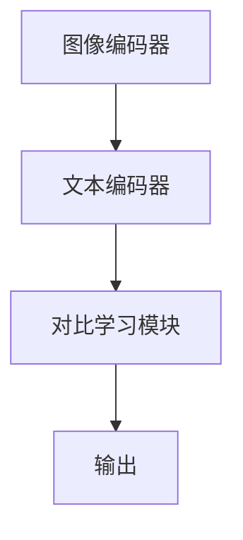
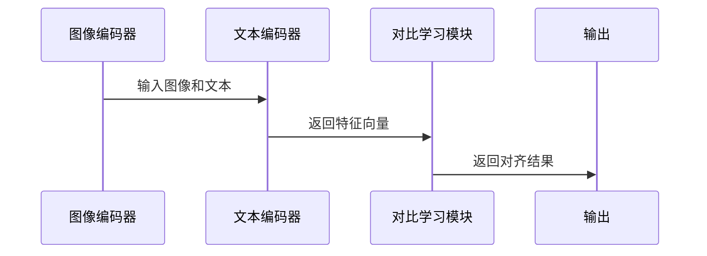

                 


# CLIP模型：实现AI Agent的跨模态理解

> **关键词**：CLIP模型，跨模态理解，AI Agent，图像编码器，文本编码器，对比学习，多模态对齐

> **摘要**：CLIP模型是一种基于跨模态理解的AI模型，它通过连接图像和文本，为AI Agent提供了强大的多模态交互能力。本文将详细解析CLIP模型的核心概念、算法原理、系统架构以及实际应用，帮助读者深入理解其技术本质和应用场景。

---

## 第1章: CLIP模型的背景与核心概念

### 1.1 CLIP模型的背景与问题背景

#### 1.1.1 多模态AI的发展背景

在人工智能领域，多模态AI的发展一直是研究热点。传统的AI模型通常专注于单一模态（如图像或文本），而现实世界中的信息往往是多模态的。例如，一张图片可能需要结合上下文文本来理解其含义，或者一段文本可能需要结合相关图像来增强理解。这种跨模态的理解能力对于AI Agent来说至关重要，因为它能够帮助智能体更好地感知和交互复杂的现实环境。

#### 1.1.2 跨模态理解的核心问题

跨模态理解的核心问题在于如何有效地连接和对齐不同模态的数据。例如，如何将图像中的视觉特征与文本中的语义特征对齐，使得模型能够理解图像和文本之间的语义关联。此外，跨模态理解还需要处理模态之间的异质性（heterogeneity），即不同模态的数据形式和语义空间可能完全不同。

#### 1.1.3 CLIP模型的提出与目标

CLIP（Contrastive Language–Image Pretraining）模型由OpenAI团队提出，旨在通过对比学习的方式，实现图像和文本之间的跨模态对齐。CLIP的核心目标是让模型在预训练阶段学会理解图像和文本之间的语义关系，从而在下游任务中能够灵活地处理多模态数据。

### 1.2 CLIP模型的核心概念

#### 1.2.1 跨模态理解的定义与特点

跨模态理解是指模型能够同时处理和理解多种不同形式的数据（如图像、文本、语音等），并能够在不同模态之间建立语义联系。CLIP模型的核心特点在于其通过对比学习的方式，实现了图像和文本之间的高效对齐。

#### 1.2.2 CLIP模型的基本原理

CLIP模型的基本原理是通过对比学习，将图像和文本映射到同一个嵌入空间，并在该空间中进行语义对齐。具体来说，CLIP模型由一个图像编码器和一个文本编码器组成，分别将图像和文本映射到向量空间，然后通过对比损失函数来优化这些向量的语义对齐。

#### 1.2.3 CLIP模型的边界与外延

CLIP模型的边界在于其专注于图像和文本之间的跨模态理解，而外延则包括其他多模态任务，如图像生成、文本摘要等。CLIP模型的外延应用广泛，可以与其他AI技术（如计算机视觉、自然语言处理）结合，形成更强大的AI系统。

---

## 第2章: CLIP模型的核心概念与联系

### 2.1 CLIP模型的原理

#### 2.1.1 图像编码器的结构

CLIP模型的图像编码器通常基于视觉Transformer（ViT）架构，将图像分割成 patches，并通过自注意力机制提取图像的全局特征。图像编码器的作用是将图像映射到一个固定的向量空间。

#### 2.1.2 文本编码器的结构

CLIP模型的文本编码器基于Transformer架构，将文本序列映射到一个固定的向量空间。文本编码器的主要任务是将文本的语义信息编码到向量中。

#### 2.1.3 跨模态对齐的实现方法

CLIP模型通过对比学习的方式，将图像和文本的向量进行对齐。具体来说，CLIP模型会同时输入一对图像和文本，计算它们之间的余弦相似度，并通过对比损失函数优化向量的语义对齐。

### 2.2 CLIP模型的核心概念对比

#### 2.2.1 CLIP与其它跨模态模型的对比

CLIP模型与其它跨模态模型（如BERT、DETR）相比，其核心区别在于CLIP采用对比学习的方式，专注于图像和文本之间的跨模态对齐。

#### 2.2.2 模型性能对比分析

CLIP模型在多项跨模态任务（如图像分类、文本检索）中表现出色，但其性能也受到数据质量和训练策略的影响。

#### 2.2.3 模型应用场景对比

CLIP模型适用于需要跨模态理解的场景，如图像描述生成、多模态对话系统等。

---

## 第3章: CLIP模型的算法原理

### 3.1 CLIP模型的训练过程

#### 3.1.1 图像编码器的训练

图像编码器的训练目标是将图像映射到一个向量空间，使得该向量能够反映图像的语义信息。训练过程中，图像编码器会通过自注意力机制提取图像的全局特征。

#### 3.1.2 文本编码器的训练

文本编码器的训练目标是将文本映射到向量空间，使得该向量能够反映文本的语义信息。训练过程中，文本编码器会通过自注意力机制提取文本的全局特征。

#### 3.1.3 跨模态对齐的训练策略

CLIP模型采用对比学习的方式，将图像和文本的向量进行对齐。具体来说，CLIP模型会计算图像向量和文本向量之间的余弦相似度，并通过对比损失函数优化向量的语义对齐。

### 3.2 CLIP模型的数学模型与公式

#### 3.2.1 图像编码器的数学表达

图像编码器的输出是一个向量 $v_i$，表示图像的特征向量。

$$ v_i = f_{\text{image}}(x_i) $$

其中，$x_i$ 是输入图像。

#### 3.2.2 文本编码器的数学表达

文本编码器的输出是一个向量 $v_t$，表示文本的特征向量。

$$ v_t = f_{\text{text}}(x_t) $$

其中，$x_t$ 是输入文本。

#### 3.2.3 跨模态对齐的损失函数

CLIP模型采用对比损失函数来优化图像和文本向量的语义对齐。

$$ \mathcal{L} = -\frac{1}{N} \sum_{i=1}^{N} \log \frac{\exp(v_i^T v_t / \tau)}{\sum_{j=1}^{N} \exp(v_j^T v_t / \tau)}} $$

其中，$\tau$ 是温度参数，$N$ 是样本数量。

---

## 第4章: CLIP模型的系统分析与架构设计

### 4.1 系统应用场景分析

#### 4.1.1 跨模态理解的典型场景

CLIP模型适用于多种跨模态理解场景，如图像描述生成、多模态对话系统等。

#### 4.1.2 CLIP模型的系统功能需求

系统需要支持图像和文本的输入，能够进行跨模态理解，并返回语义对齐的结果。

#### 4.1.3 系统性能指标分析

系统性能指标包括处理速度、准确率、内存消耗等。

### 4.2 系统架构设计

#### 4.2.1 系统功能模块划分

系统功能模块包括图像编码器、文本编码器、对比学习模块等。

#### 4.2.2 系统架构图



#### 4.2.3 系统接口设计

系统接口包括图像输入接口、文本输入接口、特征向量输出接口等。

#### 4.2.4 系统交互流程



---

## 第5章: CLIP模型的项目实战

### 5.1 环境安装与配置

#### 5.1.1 开发环境搭建

安装Python、PyTorch、Transformers等库。

#### 5.1.2 依赖库安装

使用 pip 安装必要的依赖库。

#### 5.1.3 数据集准备

准备图像和文本配对数据集。

### 5.2 核心代码实现

#### 5.2.1 图像编码器的实现

```python
def image_encoder(x):
    # 图像编码器的实现
    return v_i
```

#### 5.2.2 文本编码器的实现

```python
def text_encoder(x):
    # 文本编码器的实现
    return v_t
```

#### 5.2.3 跨模态对齐的实现

```python
def contrastive_loss(v_i, v_t, tau=1.0):
    # 对比损失函数的实现
    return loss
```

### 5.3 案例分析与详细解读

#### 5.3.1 实际案例分析

分析一个实际案例，展示CLIP模型的应用效果。

#### 5.3.2 代码实现细节

详细解读代码实现中的关键部分，如对比损失函数的实现。

---

## 第6章: 最佳实践、小结与展望

### 6.1 最佳实践 tips

- 在实际应用中，建议根据具体任务调整模型参数。
- 数据质量对模型性能有重要影响，需注意数据预处理。

### 6.2 小结

本文详细介绍了CLIP模型的核心概念、算法原理、系统架构以及实际应用，帮助读者深入理解CLIP模型的技术本质和应用场景。

### 6.3 注意事项

- 模型的性能受数据质量和训练策略的影响，需谨慎选择。
- 在实际应用中，需注意模型的计算效率和内存消耗。

### 6.4 拓展阅读

- 阅读CLIP模型的原始论文，深入了解其数学细节。
- 关注多模态AI领域的最新研究进展。

---

通过以上内容，我们全面解析了CLIP模型的技术原理和应用场景，为AI Agent的跨模态理解提供了理论和实践的基础。

