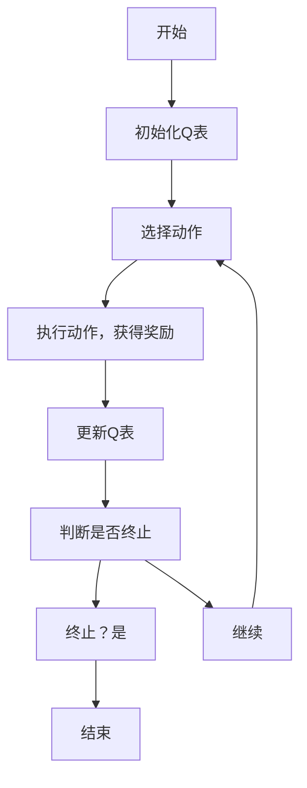
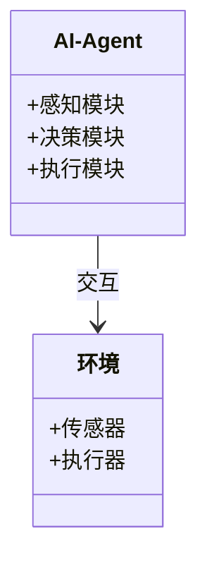
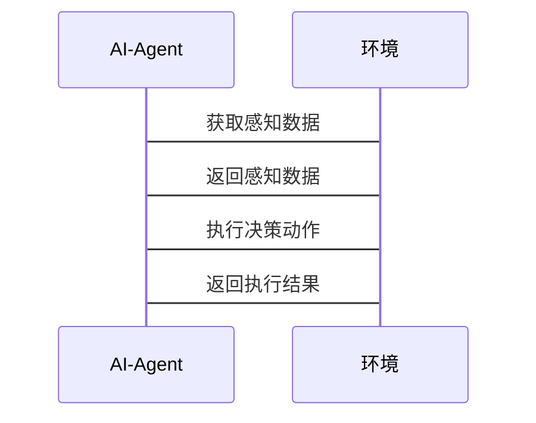

                 


# 5G+AI：探索高速网络下的AI Agent新应用

## 关键词：
5G网络、AI Agent、智能体、边缘计算、强化学习、实时应用

## 摘要：
随着5G网络的普及，高速、低延迟的网络环境为AI Agent的应用提供了新的可能性。本文将深入探讨AI Agent的核心概念、算法原理、系统架构，并结合实际项目案例，分析5G网络如何赋能AI Agent，使其在智能交通、工业自动化等领域发挥更大作用。通过详细的技术分析和实战案例，本文旨在为读者提供全面的视角，了解5G+AI Agent的最新进展和未来趋势。

---

## 第一部分：背景概述

### 第1章：5G与AI Agent的结合

#### 1.1 5G技术的基本概念
5G技术作为新一代移动通信技术，相比4G具有更高的带宽、更低的延迟和更强的连接能力。这些特性使得5G网络能够支持更复杂的实时应用，如虚拟现实、自动驾驶和智能物联网设备。

#### 1.2 AI Agent的定义与特点
AI Agent是一种智能体，能够感知环境、自主决策并采取行动以实现特定目标。AI Agent的核心特点包括自主性、反应性、目标导向和社交能力。

#### 1.3 5G与AI Agent的结合
5G网络的高速和低延迟特性为AI Agent提供了实时数据处理和快速响应的能力。这种结合使得AI Agent能够在更广泛的场景中应用，如智能交通管理、工业自动化和智能客服等领域。

---

## 第二部分：AI Agent的核心概念

### 第2章：AI Agent的感知与决策

#### 2.1 感知模块
感知模块是AI Agent与环境交互的第一步，负责收集环境数据并进行初步处理。常见的感知技术包括传感器数据解析和API调用。

#### 2.2 决策模块
决策模块基于感知数据，利用算法做出最优决策。强化学习是一种常用算法，通过状态、动作和奖励的三元组来优化决策策略。

#### 2.3 执行模块
执行模块负责将决策转化为实际行动，通常通过调用API或控制物理设备来实现。

---

## 第三部分：5G网络对AI Agent的影响

### 第3章：5G网络的特性与AI Agent的需求

#### 3.1 5G网络的低延迟与高带宽
低延迟确保了AI Agent能够实时处理数据，高带宽支持了大量数据的快速传输，这对复杂场景下的AI Agent至关重要。

#### 3.2 5G网络的切片技术
网络切片允许在5G网络中为不同的应用场景分配专用资源，确保AI Agent在特定场景下的性能需求。

#### 3.3 5G网络的边缘计算
边缘计算将数据处理能力推向网络边缘，减少了数据传输延迟，提升了AI Agent的实时响应能力。

---

## 第四部分：算法原理讲解

### 第4章：强化学习在AI Agent中的应用

#### 4.1 强化学习的基本原理
强化学习通过智能体与环境的交互，学习最优策略。状态、动作和奖励构成了强化学习的基本框架。

#### 4.2 Q-learning算法的数学模型
Q-learning算法通过更新Q值表来学习最优策略，数学模型如下：

$$ Q(s, a) = Q(s, a) + \alpha (r + \gamma \max Q(s', a') - Q(s, a)) $$

其中，$\alpha$是学习率，$\gamma$是折扣因子。

#### 4.3 强化学习的流程图
使用mermaid绘制Q-learning算法的流程图：



---

## 第五部分：系统分析与架构设计方案

### 第5章：AI Agent的系统架构

#### 5.1 系统功能设计
AI Agent的功能模块包括感知、决策和执行模块，以及数据处理和通信模块。

#### 5.2 系统架构设计
使用mermaid绘制系统架构图：



#### 5.3 系统接口设计
系统接口设计包括感知模块与环境的接口、决策模块与执行模块的接口，以及通信模块与其他系统的接口。

#### 5.4 系统交互流程图
使用mermaid绘制系统交互序列图：



---

## 第六部分：项目实战

### 第6章：基于5G的智能交通AI Agent开发

#### 6.1 环境安装与配置
开发环境包括安装Python、TensorFlow和5G通信库。

#### 6.2 核心代码实现
以下是AI Agent的核心代码示例：

```python
import numpy as np
from collections import deque

class AI-Agent:
    def __init__(self, state_space, action_space):
        self.state_space = state_space
        self.action_space = action_space
        self.q_table = deque()

    def perceive(self, state):
        # 处理感知数据
        return state

    def decide(self, state):
        # 使用强化学习算法做出决策
        return action

    def act(self, action):
        # 执行动作
        pass
```

#### 6.3 代码解读与分析
该代码实现了AI Agent的基本结构，包括感知、决策和执行模块。使用强化学习算法进行决策，确保在5G网络环境下能够实时响应。

#### 6.4 实际案例分析
以智能交通为例，AI Agent可以在5G网络下实时调整交通信号灯，优化交通流量。

---

## 第七部分：总结与展望

### 第7章：总结与未来展望

#### 7.1 项目总结
本文详细探讨了5G网络对AI Agent的影响，分析了其在智能交通等领域的应用潜力。

#### 7.2 未来展望
随着5G网络的普及和AI技术的进步，AI Agent将在更多领域发挥重要作用，如边缘计算、多模态交互和可持续性发展。

---

## 参考文献

1. 5G网络技术手册
2. 强化学习算法原理
3. AI Agent设计与实现

---

通过以上内容，读者可以全面了解5G网络如何赋能AI Agent，并在实际项目中应用相关技术。希望这篇文章能为AI Agent的研究和应用提供有价值的参考。

