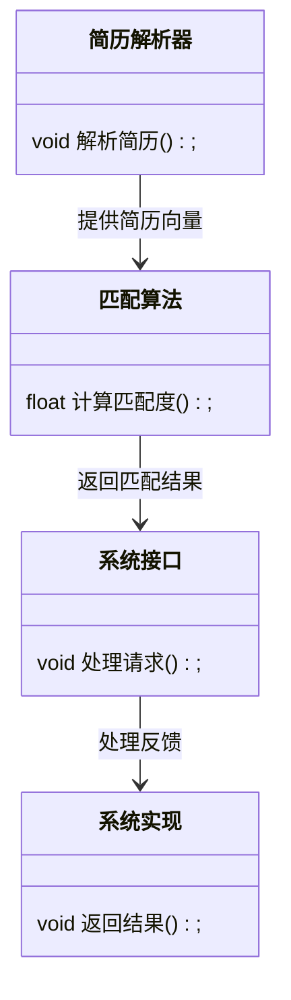

                 


# HR AI Agent：简历筛选与人才匹配

> 关键词：AI, 人力资源管理, 简历筛选, 人才匹配, 自然语言处理, 机器学习, 系统架构

> 摘要：本文深入探讨了HR AI Agent在简历筛选与人才匹配中的应用，结合自然语言处理和机器学习技术，详细分析了其技术原理、系统架构和实际案例，旨在为HR从业者和技术人员提供理论与实践相结合的指导。

---

# 第一部分: HR AI Agent 的背景与概念

# 第1章: HR AI Agent 的背景与概念

## 1.1 AI 在人力资源管理中的应用现状

### 1.1.1 传统招聘流程的痛点

- 招聘效率低：手动筛选简历耗时耗力，尤其在高并发需求下效率低下。
- 人才匹配不精准：传统筛选依赖人工经验，主观性强，难以量化匹配度。
- 成本高昂：招聘周期长，企业用人成本增加。

### 1.1.2 AI 技术在招聘中的应用趋势

- 自动化简历筛选：通过NLP技术提取简历信息，自动分类。
- 智能推荐：基于机器学习算法，精准匹配候选人与职位需求。
- 职位描述生成：AI辅助生成更吸引人的职位描述，优化招聘效果。

### 1.1.3 HR AI Agent 的概念与定义

- **定义**：HR AI Agent 是一种结合自然语言处理（NLP）和机器学习技术，用于自动化简历筛选和人才匹配的智能系统。
- **核心功能**：
  - 自动化简历解析与结构化处理。
  - 基于简历和职位描述的智能匹配算法。
  - 提供可视化结果和反馈优化建议。

## 1.2 简历筛选与人才匹配的核心问题

### 1.2.1 简历筛选的难点与挑战

- **简历格式多样性**：简历格式不统一，信息提取困难。
- **信息不完整或模糊**：部分简历信息缺失或表述不清晰。
- **主观性问题**：不同HR对简历的解读可能不同，导致匹配结果不稳定。

### 1.2.2 人才匹配的数学模型与算法

- **问题描述**：将候选人简历与职位需求进行量化匹配，找到最符合要求的候选人。
- **匹配模型**：
  - 基于向量的简历表示。
  - 基于余弦相似度的匹配算法。
  - 基于聚类的简历分组算法。

### 1.2.3 HR AI Agent 的目标与边界

- **目标**：提高招聘效率，降低用人成本，提升人才匹配精准度。
- **边界**：专注于简历筛选和人才匹配，不涉及录用决策和薪资谈判。

## 1.3 HR AI Agent 的核心功能与应用场景

### 1.3.1 自动化简历筛选功能

- **简历解析**：自动提取简历中的关键信息（如教育背景、工作经历、技能等）。
- **简历分类**：根据职位需求对简历进行分类，筛选出符合要求的简历。

### 1.3.2 智能人才匹配算法

- **简历与职位匹配**：通过算法计算简历与职位需求的匹配度，生成推荐列表。
- **动态调整**：根据反馈优化匹配算法，提高推荐精准度。

### 1.3.3 多场景应用案例分析

- **案例1**：科技公司技术岗位招聘。
- **案例2**：零售行业服务岗位招聘。
- **案例3**：教育行业教师岗位招聘。

## 1.4 本章小结

本章从AI在人力资源管理中的应用现状出发，详细介绍了HR AI Agent的概念、功能和应用场景。通过分析传统招聘流程的痛点，引出了HR AI Agent的必要性和优势。

---

# 第二部分: HR AI Agent 的技术基础

# 第2章: 自然语言处理与简历解析

## 2.1 自然语言处理技术在简历解析中的应用

### 2.1.1 NLP 的基本概念与技术

- **自然语言处理（NLP）**：研究如何让计算机理解和生成人类语言的技术。
- **主要技术**：
  - 分词（Tokenization）：将文本分割成单词或短语。
  - 词性标注（Part-of-Speech Tagging）：识别单词的词性。
  - 命名实体识别（Named Entity Recognition）：识别文本中的专有名词。

### 2.1.2 简历文本的特征提取

- **特征提取目标**：从简历文本中提取关键信息，如教育背景、工作经验、技能等。
- **常用特征**：
  - 教育背景：学校名称、专业、学历。
  - 工作经历：公司名称、职位、工作时间。
  - 技能：技术栈、语言能力等。

### 2.1.3 基于 NLP 的简历结构化处理

- **流程**：
  1. 文本预处理：去除停用词、分词、去噪声。
  2. 特征提取：识别关键实体。
  3. 结构化存储：将提取的信息存储为结构化数据。

## 2.2 简历解析的实现流程

### 2.2.1 数据预处理

- **去重**：去除重复简历。
- **清洗**：清理格式混乱的简历文本。
- **分词**：将简历文本分割成有意义的片段。

### 2.2.2 文本分词与实体识别

- **分词示例**：将“北京大学计算机科学与技术专业”分割为“北京大学”、“计算机科学与技术”、“专业”。
- **实体识别**：识别“北京大学”为机构名，“计算机科学与技术”为专业名。

### 2.2.3 简历结构化存储

- **数据库设计**：
  - 表结构：简历ID、教育背景、工作经验、技能、其他信息。
  - 示例：
    ```
    简历ID: 123
    教育背景: 北京大学 计算机科学与技术 本科
    工作经验: ABC公司 软件开发工程师 2020-2022
    技能: Python, Java, SQL
    ```

## 2.3 简历解析的案例分析

### 2.3.1 简历字段提取的实现

- **代码示例**：
  ```python
  import spacy
  nlp = spacy.load("en_core_web_sm")
  text = "Bachelor of Science in Computer Science from Peking University"
  doc = nlp(text)
  for token in doc:
      print(token.text, token.pos_, token.dep_)
  ```

### 2.3.2 简历相似度计算

- **算法**：基于余弦相似度。
- **公式**：
  $$\text{余弦相似度} = \frac{\vec{A} \cdot \vec{B}}{|\vec{A}| |\vec{B}|}$$

### 2.3.3 简历解析的优化与改进

- **优化方向**：
  - 提高模型的准确率。
  - 增加对不同语言简历的支持。

## 2.4 本章小结

本章详细介绍了自然语言处理技术在简历解析中的应用，包括文本预处理、特征提取和结构化存储。通过案例分析，展示了如何利用NLP技术实现简历的自动化解析。

---

# 第三部分: HR AI Agent 的算法实现

# 第3章: 基于机器学习的简历匹配算法

## 3.1 简历匹配的核心算法

### 3.1.1 基于向量的简历表示

- **向量表示**：将简历文本转化为高维向量。
- **方法**：
  - 词袋模型（Bag of Words）。
  - 词嵌入（Word Embedding，如Word2Vec、GloVe）。

### 3.1.2 基于余弦相似度的匹配算法

- **原理**：计算两个向量之间的余弦相似度，作为简历匹配的依据。
- **公式**：
  $$\text{余弦相似度} = \frac{\vec{A} \cdot \vec{B}}{|\vec{A}| |\vec{B}|}$$

### 3.1.3 基于聚类的简历分组算法

- **聚类方法**：
  - K-means聚类。
  - 层次聚类（Hierarchical Clustering）。

## 3.2 算法实现的数学模型

### 3.2.1 简历匹配的数学模型

- **模型输入**：简历向量和职位描述向量。
- **模型输出**：匹配度分数。

### 3.2.2 优化方法

- **正则化**：防止过拟合。
  $$\text{损失函数} = \text{交叉熵损失} + \lambda \|\theta\|^2$$

## 3.3 算法实现的代码示例

### 3.3.1 简历匹配算法实现

```python
import numpy as np

def cosine_similarity(a, b):
    return np.dot(a, b) / (np.linalg.norm(a) * np.linalg.norm(b))

# 示例简历向量
resume_vector = np.array([0.5, 0.3, 0.2])
job_vector = np.array([0.6, 0.4, 0.1])

similarity = cosine_similarity(resume_vector, job_vector)
print(f"匹配度：{similarity}")
```

### 3.3.2 基于聚类的简历分组

```python
from sklearn.cluster import KMeans

# 示例简历向量集合
resume_vectors = np.array([
    [0.5, 0.3, 0.2],
    [0.6, 0.4, 0.1],
    [0.7, 0.2, 0.3],
    [0.4, 0.5, 0.2]
])

# 聚类实现
kmeans = KMeans(n_clusters=2).fit(resume_vectors)
clusters = kmeans.labels_
print(f"聚类结果：{clusters}")
```

## 3.4 本章小结

本章详细讲解了基于机器学习的简历匹配算法，包括向量表示、余弦相似度计算和聚类算法的实现。通过代码示例，展示了如何将这些算法应用于实际场景中。

---

# 第四部分: HR AI Agent 的系统分析

# 第4章: 系统分析与架构设计

## 4.1 问题场景介绍

- **目标**：设计一个高效的简历筛选与人才匹配系统。
- **用户角色**：HR、招聘人员、候选人。

## 4.2 项目介绍

- **项目名称**：HR AI Agent 系统。
- **主要功能**：
  - 简历解析。
  - 人才匹配。
  - 结果可视化。

## 4.3 系统功能设计

### 4.3.1 领域模型（Mermaid 类图）



### 4.3.2 系统架构设计（Mermaid 架构图）

```mermaid
aws
    provider_cluster(Cluster1, 2 Instances) {
        app1: HR AI Agent 应用程序
        app2: 数据存储服务
    }
    db_instance(Cluster2, 1 Instance) {
        service: MySQL 数据库
    }
    loadBalancer: Application Load Balancer
    autoscaling: Auto Scaling 组
    route53: DNS 解析
    ```

### 4.3.3 系统接口设计

- **输入接口**：接收简历文本和职位描述。
- **输出接口**：返回匹配结果和建议。

### 4.3.4 系统交互流程（Mermaid 序列图）

```mermaid
sequenceDiagram
    participant 用户
    participant HR AI Agent
    participant 数据库
    用户->HR AI Agent: 提交简历和职位描述
    HR AI Agent->数据库: 查询匹配算法
    HR AI Agent->数据库: 获取简历向量
    HR AI Agent->用户: 返回匹配结果
```

## 4.4 本章小结

本章从系统设计的角度，详细分析了HR AI Agent的架构和功能模块。通过Mermaid图展示了系统的整体架构和交互流程，为后续的实现提供了清晰的指导。

---

# 第五部分: HR AI Agent 的项目实战

# 第5章: 项目实战

## 5.1 环境安装与配置

- **开发环境**：
  - Python 3.8+
  - Jupyter Notebook
- **依赖库安装**：
  - `pip install spacy`
  - `pip install scikit-learn`

## 5.2 数据准备与清洗

- **数据来源**：
  - 线上招聘平台数据。
  - 内部简历库。
- **数据清洗**：
  - 去除重复数据。
  - 填充缺失值。

## 5.3 算法训练与优化

### 5.3.1 模型训练

```python
from sklearn.feature_extraction.text import TfidfVectorizer
from sklearn.metrics.pairwise import cosine_similarity

# 示例数据
resumes = [
    "Bachelor of Computer Science, 5 years of experience in Python development.",
    "Master of Software Engineering, 3 years of Java experience."
]

vectorizer = TfidfVectorizer()
vectors = vectorizer.fit_transform(resumes)

# 计算余弦相似度
similarity_matrix = cosine_similarity(vectors)
print(similarity_matrix)
```

### 5.3.2 模型优化

- **超参数调优**：
  - 调整聚类数（K-means）。
  - 优化正则化系数。

## 5.4 系统实现与测试

### 5.4.1 系统实现

```python
class HR_Agent:
    def __init__(self):
        self.vectorizer = TfidfVectorizer()

    def process_resume(self, resume_text):
        # 文本预处理
        vectors = self.vectorizer.fit_transform([resume_text])
        return vectors

    def match_job(self, resume_vector, job_vector):
        # 计算匹配度
        similarity = cosine_similarity(resume_vector, job_vector)
        return similarity[0][0]
```

### 5.4.2 系统测试

- **测试用例**：
  - 测试匹配度计算。
  - 测试聚类功能。

## 5.5 项目小结

本章通过实际项目案例，详细讲解了HR AI Agent的环境搭建、数据准备、算法实现和系统测试。通过代码示例和测试用例，展示了如何将理论应用于实践。

---

# 第六部分: HR AI Agent 的最佳实践

# 第6章: 最佳实践

## 6.1 关键点总结

- **数据质量**：高质量的数据是模型准确性的基础。
- **模型调优**：持续优化算法参数，提高匹配精度。
- **算法选择**：根据实际需求选择合适的算法。

## 6.2 小结

- **回顾**：从背景到实现，全面总结HR AI Agent的核心内容。
- **注意事项**：
  - 数据隐私保护。
  - 算法解释性。
  - 系统可扩展性。

## 6.3 未来展望

- **结合知识图谱**：构建行业知识图谱，提升匹配精准度。
- **强化学习应用**：引入强化学习，动态优化匹配策略。
- **多模态数据处理**：结合简历中的图片、视频等多模态信息。

## 6.4 拓展阅读

- 推荐书籍：《自然语言处理实战》、《机器学习实战》。
- 推荐工具：spaCy、scikit-learn、TensorFlow。

---

# 第七部分: 总结与展望

## 7.1 总结

本文从理论到实践，全面探讨了HR AI Agent在简历筛选与人才匹配中的应用。通过自然语言处理和机器学习技术，展示了如何提高招聘效率和精准度。

## 7.2 展望

随着AI技术的不断发展，HR AI Agent将更加智能化和个性化。未来，结合知识图谱和强化学习，HR AI Agent将为企业提供更精准的人才匹配服务。

---

# 附录

## 附录 A: 算法代码汇总

- 余弦相似度计算：
  ```python
  def cosine_similarity(a, b):
      return np.dot(a, b) / (np.linalg.norm(a) * np.linalg.norm(b))
  ```

- K-means聚类：
  ```python
  from sklearn.cluster import KMeans
  ```

---

感谢您的阅读！如需进一步探讨，请随时联系。

