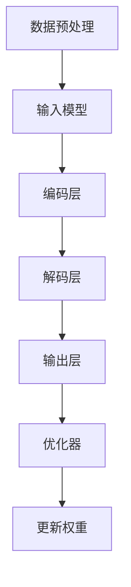
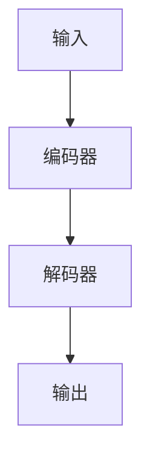
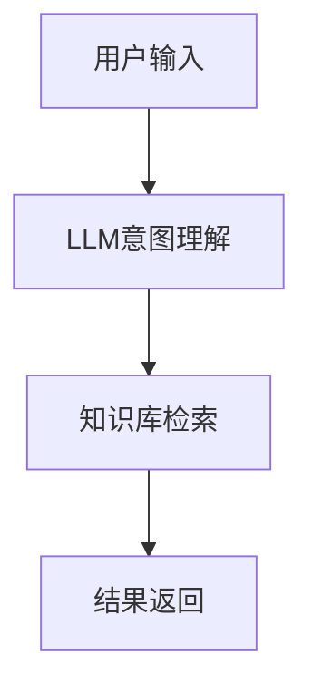

                 


# LLM大模型在AI Agent开发中的核心作用

> **关键词**：LLM大模型、AI Agent、自然语言处理、生成式AI、智能代理  
>
> **摘要**：本文探讨了LLM大模型在AI Agent开发中的核心作用，从基础概念、核心技术到实际应用，全面分析了LLM如何赋能AI Agent的能力提升。通过详细的技术解析和实际案例，展示了LLM在感知、决策、执行模块中的应用，并提供了开发实践中的最佳实践和未来展望。

---

## 引言

随着人工智能技术的飞速发展，LLM（Large Language Model）大模型逐渐成为AI Agent开发的核心驱动力。AI Agent，即智能代理，是一种能够根据环境信息和用户需求，自主决策并执行任务的智能系统。而LLM大模型，通过其强大的自然语言处理能力，为AI Agent提供了卓越的语义理解和生成能力。本文将从基础概念、核心技术、体系结构、实际应用和开发实践五个方面，深入探讨LLM在AI Agent开发中的核心作用。

---

## 第一部分：LLM大模型基础

### 1.1 LLM大模型的定义与特点

#### 1.1.1 什么是LLM大模型？
LLM大模型是一种基于深度学习的自然语言处理模型，通过大量语料库的预训练，具备理解、生成和推理语言的能力。其核心在于通过神经网络结构，捕捉语言中的语义信息和上下文关系。

#### 1.1.2 LLM大模型的核心特点
- **大规模数据训练**：LLM通常基于海量语料库进行预训练，具备广泛的知识覆盖。
- **上下文理解**：能够处理长上下文，理解复杂的语言结构。
- **多任务能力**：支持多种NLP任务，如文本生成、问答系统、机器翻译等。

#### 1.1.3 LLM与传统AI模型的区别
| 特性       | LLM大模型                          | 传统AI模型                          |
|------------|------------------------------------|-------------------------------------|
| 数据需求   | 需要大量标注数据和未标注数据       | 通常需要大量标注数据               |
| 任务能力   | 支持多任务，如生成、理解、推理     | 专注于单一任务或小范围任务         |
| 模型复杂度 | 模型参数量大，计算资源消耗高         | 模型参数量较小，计算资源消耗较低     |

---

### 1.2 LLM大模型的应用场景

#### 1.2.1 自然语言处理
LLM能够理解复杂的语言结构，执行如文本分类、情感分析等任务。

#### 1.2.2 生成式AI
通过生成文本，LLM可以用于内容创作、对话生成等场景。

#### 1.2.3 个性化推荐
LLM结合用户行为数据，提供个性化的推荐服务。

---

## 第二部分：LLM大模型的核心技术

### 2.1 LLM大模型的训练方法

#### 2.1.1 监督学习
通过标注数据训练模型，使模型能够预测正确的输出。

#### 2.1.2 无监督学习
利用未标注数据，通过自监督学习方法（如掩词任务）训练模型。

#### 2.1.3 强化学习
通过奖励机制优化模型的生成结果，使模型输出更符合预期。

#### 2.1.4 深度学习算法
- **神经网络**：模型通过多层神经网络提取特征。
- **注意力机制**：在生成任务中，注意力机制帮助模型关注重要信息。

**图2-1：LLM大模型的训练流程图**



---

### 2.2 LLM大模型的结构与算法

#### 2.2.1 Transformer架构

**图2-2：Transformer架构**



**公式：**

- **编码器**：$X = \text{Input}$
- **解码器**：$Y = \text{Output}$

---

## 第三部分：AI Agent的体系结构

### 3.1 AI Agent的基本概念

#### 3.1.1 代理的类型
- **简单反射型**：基于简单的规则执行任务。
- **基于模型的反应型**：基于环境模型做出决策。
- **基于效用的**：通过效用函数优化决策。

#### 3.1.2 代理的功能
- **感知**：接收环境信息。
- **决策**：基于感知信息做出决策。
- **执行**：执行决策动作。

---

### 3.2 LLM在AI Agent中的应用

#### 3.2.1 感知模块中的LLM
- **意图理解**：通过LLM分析用户的输入，识别用户的意图。
- **信息抽取**：从文本中提取关键信息，如时间、地点、人物等。

#### 3.2.2 决策模块中的LLM
- **对话生成**：基于上下文生成自然的对话回应。
- **任务规划**：根据用户需求生成任务执行步骤。

#### 3.2.3 执行模块中的LLM
- **任务执行**：通过LLM生成执行指令，驱动外部系统完成任务。

---

## 第四部分：实际案例与分析

### 4.1 企业级AI Agent应用

#### 4.1.1 案例背景
某企业希望开发一个内部知识管理AI Agent，帮助员工快速检索公司文档。

#### 4.1.2 实现过程
- **感知**：用户输入问题，LLM理解意图。
- **决策**：生成检索关键词，匹配公司知识库。
- **执行**：返回相关文档。

**图4-1：企业级AI Agent流程图**



### 4.2 智能助手中的LLM应用

#### 4.2.1 案例背景
开发一个智能助手，提供对话服务和任务执行功能。

#### 4.2.2 实现过程
- **对话生成**：基于用户输入生成自然语言回复。
- **任务执行**：根据用户指令执行预设任务。

---

## 第五部分：开发实践

### 5.1 开发工具与框架

#### 5.1.1主流开发工具
- **Hugging Face**：提供丰富的预训练模型和开发工具。
- **OpenAI**：提供API接口，方便集成。

#### 5.1.2 开发流程
- **环境安装**：安装必要的库，如`transformers`、`tensorflow`。
- **模型加载**：加载预训练模型或微调模型。
- **接口设计**：设计与AI Agent交互的API。
- **功能实现**：实现感知、决策、执行模块。

### 5.2 代码实现与解读

#### 5.2.1 环境安装

```bash
pip install transformers torch
```

#### 5.2.2 感知模块代码

```python
from transformers import AutoTokenizer, AutoModelForCausalLM
import torch

tokenizer = AutoTokenizer.from_pretrained('gpt2')
model = AutoModelForCausalLM.from_pretrained('gpt2')

def generate_response(prompt):
    inputs = tokenizer.encode(prompt, return_tensors='pt')
    outputs = model.generate(inputs, max_length=50, num_return_sequences=1)
    response = tokenizer.decode(outputs[0], skip_special_tokens=True)
    return response
```

---

## 第六部分：总结与展望

### 6.1 核心总结

- LLM大模型为AI Agent提供了强大的语言理解和生成能力。
- 在感知、决策、执行模块中，LLM显著提升了AI Agent的智能化水平。
- 开发工具和框架的不断进步，降低了LLM的使用门槛。

### 6.2 未来展望

- **模型优化**：更高效、更小的模型将被开发，以降低计算成本。
- **多模态融合**：结合视觉、听觉等多模态信息，提升AI Agent的感知能力。
- **人机协作**：LLM将推动AI Agent与人类更自然地协作。

---

## 参考文献

- [1] Vaswani, A., et al. "Attention Is All You Need." arXiv preprint arXiv:1706.03798, 2017.
- [2] Radford, A., et al. "Language models are few-shot learners." arXiv preprint arXiv:1909.02795, 2019.
- [3] Brown, T., et al. "A tale of neural text generation." arXiv preprint arXiv:1906.08378, 2019.

---

通过本文的系统分析，读者可以全面理解LLM大模型在AI Agent开发中的核心作用，并掌握实际开发中的关键技术和最佳实践。

