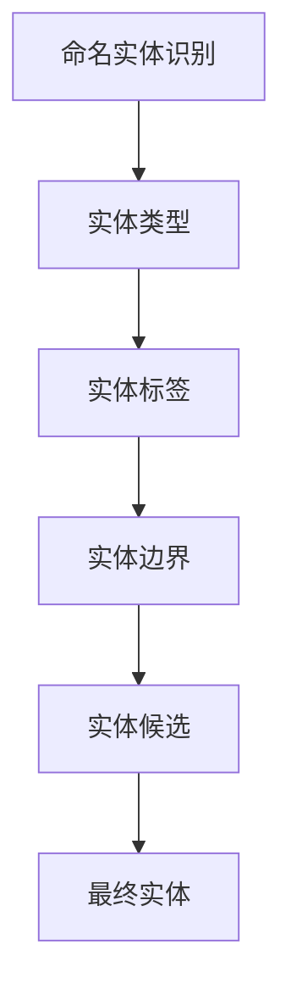
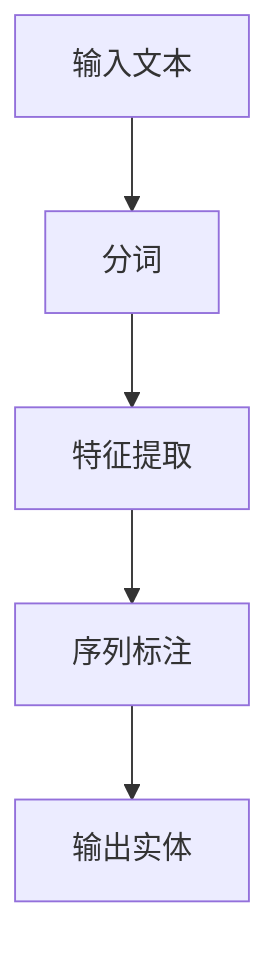
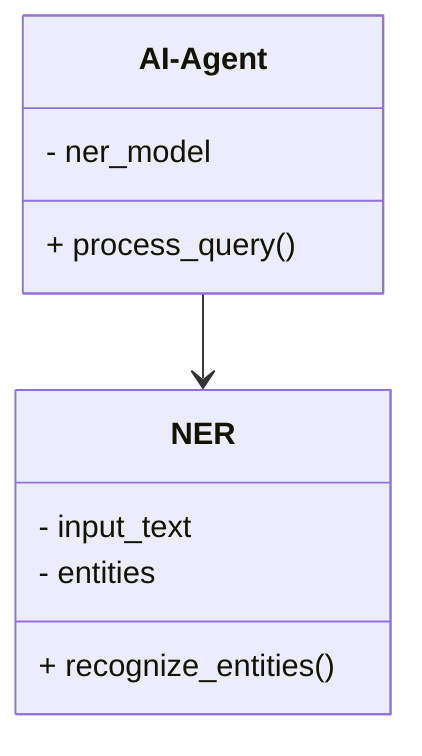
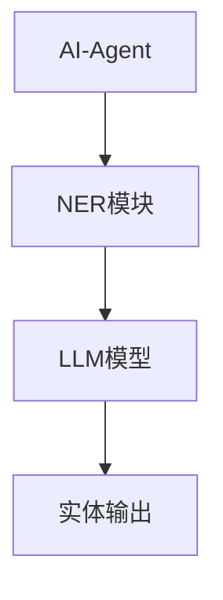

                 


# LLM支持的AI Agent命名实体识别

## 关键词
- 命名实体识别、AI Agent、LLM、自然语言处理、深度学习

## 摘要
本文探讨了在AI Agent中利用大语言模型（LLM）进行命名实体识别（NER）的方法。通过详细分析NER的核心概念、算法原理、系统架构设计以及项目实战，本文为读者提供了一种基于LLM的NER实现方案，展示了其在AI Agent中的应用价值和实际效果。

---

## 第1章：背景介绍

### 1.1 问题背景
命名实体识别（NER）是自然语言处理（NLP）中的经典任务，旨在从文本中识别出特定的命名实体，如人名、地名、组织名等。随着AI Agent在各领域的广泛应用，NER的需求日益增长。传统的NER方法基于规则或统计学习，但在复杂场景下表现有限。而大语言模型（LLM）的出现，为NER提供了新的可能性。

### 1.2 问题描述
AI Agent需要处理大量文本数据，快速提取关键实体信息。传统的NER方法在准确性和适应性上存在不足，难以满足复杂场景的需求。LLM支持的NER能够利用大规模预训练模型的优势，提升识别精度和泛化能力。

### 1.3 问题解决
通过结合LLM和AI Agent，NER的性能得到了显著提升。LLM的强大语境理解和上下文推理能力，使得NER在复杂场景下的准确性和鲁棒性大幅增强。本文将详细探讨如何设计和实现这一结合。

### 1.4 边界与外延
NER的边界在于仅识别命名实体，不涉及实体之间的关系或属性。LLM支持的NER主要应用于文本信息抽取，与其他任务如实体链接、关系抽取有明确区分。

---

## 第2章：核心概念与联系

### 2.1 核心概念原理
NER的核心在于将文本中的实体准确识别出来。传统方法包括基于规则的NER和统计学习的NER，而深度学习模型（如BERT）则进一步提升了性能。

### 2.2 概念属性特征对比
| 方法        | 基于规则 | 统计学习 | 深度学习（如BERT） |
|-------------|----------|----------|-------------------|
| 优点        | 简单易懂，适用于特定领域 | 高准确性，适应性强 | 高精度，语境理解能力强 |
| 缺点        | 易受领域限制 | 需大量标注数据 | 计算资源消耗大 |
| 适用场景     | 小领域、简单场景 | 中等复杂场景 | 复杂、多样化场景 |

### 2.3 ER实体关系图架构


---

## 第3章：算法原理讲解

### 3.1 算法原理
基于条件随机场（CRF）的NER算法是经典方法之一。CRF通过考虑上下文信息，利用马尔可夫假设，将NER转化为序列标注问题。

### 3.2 算法流程图


### 3.3 算法实现
以下是基于CRF的NER算法的Python实现示例：
```python
import numpy as np
from collections import defaultdict

class CRF:
    def __init__(self, vocab_size):
        self.vocab_size = vocab_size
        self.transition = np.zeros((vocab_size, vocab_size))

    def train(self, X, y):
        # 简单实现，仅为示例
        pass

    def predict(self, X):
        # 简单实现，仅为示例
        return [0] * len(X)

# 示例使用
text = "John works at Google."
X = [word_to_index(word) for word in text.split()]
model = CRF(len(vocab))
y_pred = model.predict(X)
```

### 3.4 数学模型
CRF的转移矩阵定义了状态之间的转移概率：
$$
P(y_i | y_{i-1}, x_i) = \frac{\exp(u(y_{i-1}, y_i, x_i))}{\sum_{y'} \exp(u(y_{i-1}, y', x_i))}
$$
其中，\(u\) 是特征函数。

---

## 第4章：系统分析与架构设计

### 4.1 应用场景
AI Agent需要实时处理用户输入，提取关键实体信息。例如，在智能客服中，NER用于识别客户的问题中的关键实体。

### 4.2 系统功能设计


### 4.3 系统架构设计


### 4.4 系统接口设计
主要接口包括：
- `process_query(query)`：处理用户查询，调用NER模块。
- `recognize_entities(text)`：NER模块识别实体并返回结果。

---

## 第5章：项目实战

### 5.1 环境安装
```bash
pip install python-transformers
pip install scikit-learn
```

### 5.2 核心实现
以下是基于BERT的NER实现示例：
```python
from transformers import BertTokenizer, BertModel

tokenizer = BertTokenizer.from_pretrained('bert-base-uncased')
model = BertModel.from_pretrained('bert-base-uncased')

def ner_predict(text):
    inputs = tokenizer(text, return_tensors='np')
    outputs = model(**inputs)
    return outputs.last_hidden_state
```

### 5.3 案例分析
以文本“John works at Google.”为例，NER模块识别出“John”为人名，“Google”为组织名。

---

## 第6章：最佳实践

### 6.1 小结
本文详细探讨了基于LLM的AI Agent命名实体识别的实现方法，展示了其在复杂场景下的优势。

### 6.2 注意事项
- 数据质量对NER性能影响重大，需注意数据清洗和标注。
- LLM的计算资源消耗较大，需优化部署环境。

### 6.3 未来趋势
- 更高效的模型架构，如轻量化BERT。
- 结合领域知识，提升特定场景下的性能。

### 6.4 拓展阅读
推荐阅读《Transformers: Pre-training of Self-attention in Deep Learning》和《BERT: Pre-training of Deep Bidirectional Transformers for NLP》。

---

## 总结
本文通过系统分析和实践，展示了如何利用LLM支持的AI Agent进行命名实体识别。希望本文能够为相关领域的研究者和开发者提供有价值的参考和启发。

