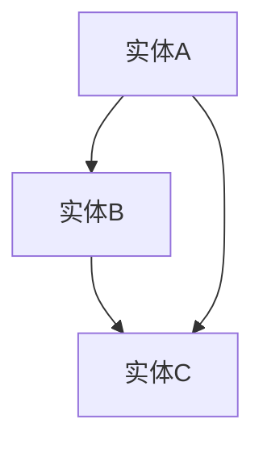
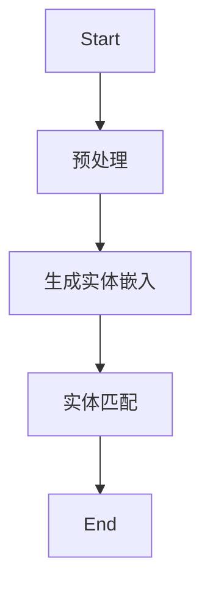
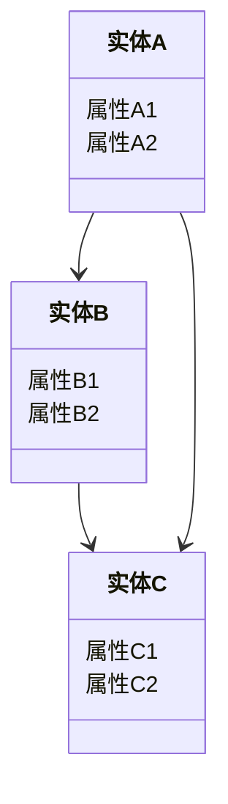
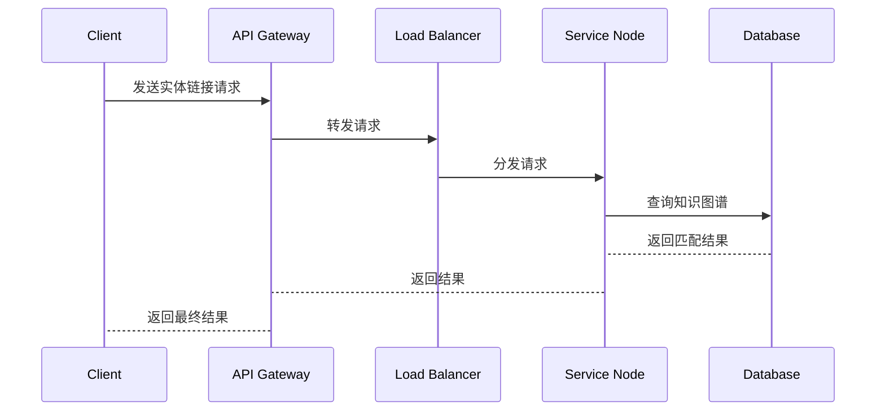

                 


# LLM支持的AI Agent实体链接技术

## 关键词：
- LLM（大语言模型）
- AI Agent（人工智能代理）
- 实体链接技术
- 实体识别
- 知识图谱

## 摘要：
本文详细探讨了LLM支持的AI Agent实体链接技术的核心原理、实现方法及其应用场景。通过分析实体链接技术的背景、核心概念、算法原理、系统架构以及实际项目案例，本文旨在为读者提供一个全面的技术视角，帮助他们理解如何利用LLM增强AI Agent的实体识别与链接能力，从而实现更智能、更高效的交互和应用。

---

## 第一部分：背景与核心概念

### 第1章：实体链接技术概述

#### 1.1 问题背景
- **1.1.1 实体链接技术的定义**
  实体链接技术是一种将文本中的实体（如人名、地名、组织名等）与知识图谱中的实体进行匹配和关联的技术，旨在为文本中的实体赋予语义含义。

- **1.1.2 实体链接技术的应用场景**
  - 自然语言处理（NLP）任务中的实体识别与链接。
  - 智能问答系统中的实体理解和推理。
  - 知识图谱构建与完善。

- **1.1.3 实体链接技术的核心问题**
  - 如何准确识别文本中的实体。
  - 如何高效匹配实体与知识图谱中的节点。
  - 如何处理实体的歧义性和多样性。

#### 1.2 问题描述
- **1.2.1 实体识别与链接的挑战**
  - 实体的多样性和上下文依赖性。
  - 实体的模糊性和歧义性。
  - 实体链接的实时性和高效性。

- **1.2.2 LLM在实体链接中的作用**
  - LLM可以通过上下文理解实体的语义。
  - LLM可以生成实体的嵌入表示，用于匹配和关联。

- **1.2.3 实体链接的边界与外延**
  - 实体链接的边界：文本中的实体识别与知识图谱中的实体匹配。
  - 实体链接的外延：实体关系的推理与扩展。

#### 1.3 问题解决与核心要素
- **1.3.1 实体链接的基本流程**
  1. 实体识别：从文本中提取候选实体。
  2. 实体嵌入生成：将实体转换为向量表示。
  3. 实体匹配：将候选实体与知识图谱中的实体进行匹配。

- **1.3.2 实体链接的核心要素**
  - 实体识别的准确性。
  - 实体嵌入的语义表示能力。
  - 实体匹配的效率与精度。

- **1.3.3 实体链接的实现框架**
  - 基于规则的实体链接框架。
  - 基于统计的实体链接框架。
  - 基于LLM的实体链接框架。

---

## 第二部分：核心概念与原理

### 第2章：实体链接技术的核心概念

#### 2.1 实体链接技术的原理
- **2.1.1 实体识别的原理**
  - 基于词典匹配：利用预先定义的实体词典进行匹配。
  - 基于模式匹配：利用正则表达式进行匹配。
  - 基于上下文理解：利用NLP模型（如BERT）进行实体识别。

- **2.1.2 实体链接的原理**
  - 实体嵌入生成：将实体转换为向量表示。
  - 实体匹配：基于向量相似度或知识图谱中的语义关系进行匹配。

- **2.1.3 LLM在实体链接中的作用机制**
  - LLM通过上下文生成实体的语义表示。
  - LLM通过微调或提示工程技术增强实体链接的精度。

#### 2.2 实体链接技术的特征对比
- **2.2.1 基于规则的特征**
  - 依赖预先定义的规则。
  - 实现简单，但灵活性差。

- **2.2.2 基于统计的特征**
  - 依赖大规模数据的统计分析。
  - 实现复杂，但灵活性和准确性较高。

- **2.2.3 基于LLM的特征**
  - 依赖LLM的语义理解和生成能力。
  - 实现高效，但需要依赖预训练模型。

| 特征对比 | 基于规则 | 基于统计 | 基于LLM |
|----------|----------|----------|----------|
| 实现复杂度 | 低       | 高       | 中       |
| 灵活性    | 低       | 高       | 高       |
| 准确性    | 中       | 高       | 高       |
| 计算资源需求 | 低       | 高       | 高       |

#### 2.3 实体关系的ER图架构


---

## 第三部分：算法原理与实现

### 第3章：实体链接算法的原理

#### 3.1 实体链接算法的流程


#### 3.2 实体嵌入生成
- **3.2.1 基于词嵌入的实体表示**
  - 使用Word2Vec生成实体的词向量。

- **3.2.2 基于句嵌入的实体表示**
  - 使用BERT生成实体的句向量。

- **3.2.3 基于LLM的实体表示**
  - 使用LLM生成实体的语义向量。

#### 3.3 实体匹配算法
- **3.3.1 基于余弦相似度的匹配**
  ```python
  def cosine_similarity(a, b):
      return np.dot(a, b) / (np.linalg.norm(a) * np.linalg.norm(b))
  ```

- **3.3.2 基于知识图谱的匹配**
  - 基于知识图谱中的语义关系进行匹配。

- **3.3.3 基于LLM的匹配**
  - 使用LLM生成实体的语义相似度评分。

$$\text{余弦相似度} = \frac{\mathbf{a} \cdot \mathbf{b}}{|\mathbf{a}| |\mathbf{b}|}$$

---

## 第四部分：系统分析与架构设计

### 第4章：系统功能设计

#### 4.1 问题场景介绍
- **4.1.1 电商推荐系统**
  - 实体链接用于推荐系统的个性化服务。

- **4.1.2 智能问答系统**
  - 实体链接用于智能问答中的实体理解和推理。

#### 4.2 领域模型设计


#### 4.3 系统架构设计
```mermaid
graph LR
    Client --> API Gateway
    API Gateway --> Load Balancer
    Load Balancer --> Service Node
    Service Node --> Database
```

#### 4.4 系统交互设计


---

## 第五部分：项目实战

### 第5章：系统实现

#### 5.1 环境安装
- **Python 3.8及以上版本**
- **安装依赖**
  ```bash
  pip install numpy
  pip install transformers
  pip install matplotlib
  ```

#### 5.2 核心实现
- **实体识别模块**
  ```python
  from transformers import pipeline

  nlp = pipeline("ner")
  result = nlp("This is a test sentence.")
  ```

- **实体嵌入生成模块**
  ```python
  import numpy as np

  def generate_embedding(text):
      # 假设使用BERT模型生成嵌入
      pass
  ```

- **实体匹配模块**
  ```python
  def match_entities(embedding1, embedding2):
      return np.dot(embedding1, embedding2) / (np.linalg.norm(embedding1) * np.linalg.norm(embedding2))
  ```

#### 5.3 案例分析
- **电商推荐系统案例**
  - 输入：用户查询“红色连衣裙”。
  - 输出：推荐相关商品。

- **智能问答系统案例**
  - 输入：用户询问“谁是张三？”。
  - 输出：匹配知识图谱中的“张三”实体并返回相关信息。

#### 5.4 项目小结
- 项目实现的关键点。
- 项目中的常见问题及解决方案。
- 项目优化的建议。

---

## 第六部分：最佳实践与总结

### 第6章：总结与展望

#### 6.1 最佳实践
- **模型选择**
  - 根据具体任务选择合适的实体链接模型。

- **数据预处理**
  - 数据清洗与标注对实体链接的精度至关重要。

- **性能优化**
  - 使用缓存机制优化实体匹配的效率。

#### 6.2 项目小结
- 项目的核心目标。
- 项目实现的关键技术。
- 项目中的收获与感悟。

#### 6.3 注意事项
- 数据隐私与安全问题。
- 实体链接的准确性和实时性问题。
- 系统的可扩展性和可维护性。

#### 6.4 拓展阅读
- 推荐相关技术书籍和论文。
- 提供进一步学习的资源和方向。

---

## 附录：代码示例与工具推荐

- **代码示例**
  ```python
  import numpy as np
  from transformers import pipeline

  nlp = pipeline("ner")
  result = nlp("This is a test sentence.")

  def cosine_similarity(a, b):
      return np.dot(a, b) / (np.linalg.norm(a) * np.linalg.norm(b))

  embedding1 = np.random.randn(100)
  embedding2 = np.random.randn(100)
  similarity = cosine_similarity(embedding1, embedding2)
  ```

- **工具推荐**
  - Hugging Face Transformers
  - PyTorch
  - SpaCy

---

通过以上大纲和内容，本文为读者提供了一个系统性、全面性的技术视角，帮助他们深入理解LLM支持的AI Agent实体链接技术的核心原理和实际应用。

