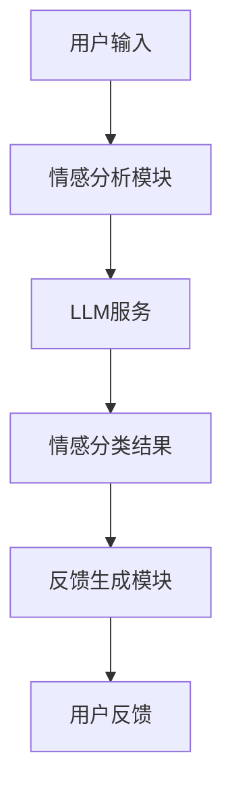
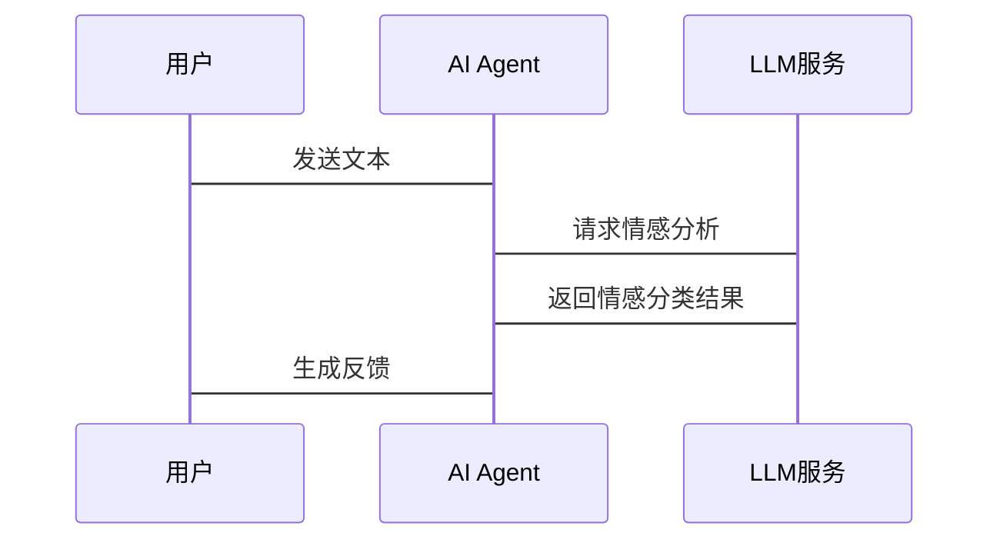

                 


# LLM支持的AI Agent情感分析优化

> 关键词：LLM，AI Agent，情感分析，优化，自然语言处理

> 摘要：本文探讨了如何利用大语言模型（LLM）优化AI Agent的情感分析能力，分析了LLM在情感分析中的应用优势，详细讲解了情感分析与AI Agent的核心概念、优化算法原理、系统架构设计，并通过实战案例展示了如何实现优化。

---

# 第一部分: LLM支持的AI Agent情感分析优化背景介绍

## 第1章: 情感分析与AI Agent概述

### 1.1 情感分析的背景与问题背景
#### 1.1.1 情感分析的基本概念
情感分析是自然语言处理（NLP）中的一个核心任务，旨在识别和分类文本中的情感倾向。常见的情感类别包括正面、负面和中性。情感分析广泛应用于社交媒体监控、产品 reviews 分析、客户反馈处理等领域。

#### 1.1.2 AI Agent在情感分析中的应用背景
AI Agent（智能体）是一种能够感知环境、自主决策并执行任务的智能系统。在情感分析中，AI Agent 可以帮助用户实时分析文本情感，提供个性化反馈或推荐。随着AI Agent的应用场景不断扩展，对情感分析的准确性、实时性和上下文理解能力提出了更高要求。

#### 1.1.3 当前情感分析的挑战与问题描述
传统情感分析方法在处理复杂语境和情感细微差别时存在局限性。例如，基于词袋模型的方法容易忽略词语之间的关系，而深度学习模型虽然性能较好，但需要大量标注数据且计算成本较高。此外，情感分析结果的可解释性也是一个重要挑战。

### 1.2 AI Agent的核心概念与组成
#### 1.2.1 AI Agent的定义与特点
AI Agent 是一个智能实体，能够通过感知环境、推理和学习来完成特定任务。AI Agent 的特点包括自主性、反应性、主动性、社会性和知识性。

#### 1.2.2 情感分析在AI Agent中的作用
情感分析是AI Agent理解用户意图、优化交互体验的关键技术。通过情感分析，AI Agent可以更好地理解用户的情绪状态，从而提供更贴心的服务。

#### 1.2.3 LLM与AI Agent的结合
大语言模型（LLM）是一种基于Transformer架构的大型神经网络模型，具有强大的自然语言理解和生成能力。将LLM与AI Agent结合，可以显著提升情感分析的准确性和灵活性。

---

## 第2章: LLM在情感分析中的应用

### 2.1 LLM的基本原理
#### 2.1.1 大语言模型的定义与特点
大语言模型通过监督学习和无监督学习训练而成，具有强大的语义理解和生成能力。LLM的核心优势在于其庞大的参数规模和对上下文的深刻理解。

#### 2.1.2 LLM在自然语言处理中的优势
LLM在情感分析中的优势包括：
- **上下文理解**：能够捕捉文本中的情感细微差别。
- **零样本学习**：无需额外训练数据即可处理新任务。
- **生成能力**：能够生成自然语言文本，辅助情感分类。

### 2.2 LLM支持的AI Agent情感分析的优势
#### 2.2.1 提高情感分析的准确性
LLM通过全局上下文理解，能够更准确地识别情感倾向。例如，在社交媒体评论中，LLM可以识别隐含的情感信息。

#### 2.2.2 增强情感分析的上下文理解能力
传统方法通常基于局部特征，而LLM可以利用全局上下文信息，从而更准确地分析情感。

### 2.3 当前LLM支持的AI Agent情感分析的挑战
#### 2.3.1 数据隐私问题
AI Agent处理大量用户数据，如何保护数据隐私是一个重要挑战。

#### 2.3.2 计算资源需求
LLM的运行需要大量计算资源，这可能限制其在资源受限环境中的应用。

---

## 第3章: 情感分析与AI Agent的核心概念联系

### 3.1 情感分析的核心概念
#### 3.1.1 情感分析的分类
情感分析可以分为以下几种类型：
- **二分类任务**：正面或负面。
- **多分类任务**：正面、中性或负面。
- **情感强度分析**：评估情感的强度。

#### 3.1.2 情感分析的关键技术
关键技术包括特征提取、机器学习算法（如SVM、随机森林）和深度学习模型（如LSTM、BERT）。

### 3.2 AI Agent的核心概念
#### 3.2.1 AI Agent的功能模块
AI Agent通常包含感知模块、推理模块和执行模块。感知模块负责接收输入，推理模块负责分析和决策，执行模块负责输出结果。

#### 3.2.2 AI Agent的决策机制
AI Agent的决策机制包括基于规则的决策、基于知识的决策和基于学习的决策。

### 3.3 LLM与AI Agent的情感分析联系
#### 3.3.1 LLM如何增强AI Agent的情感分析能力
通过LLM，AI Agent可以更准确地理解用户输入的情感，并生成更自然的反馈。

#### 3.3.2 LLM与AI Agent情感分析的协同优化
通过协同优化，可以提升AI Agent的情感分析准确性和响应速度。

---

# 第二部分: 情感分析优化算法原理

## 第4章: 情感分析的算法原理

### 4.1 传统情感分析算法
#### 4.1.1 基于词袋模型的情感分析
词袋模型通过统计文本中情感词的频率来判断情感倾向。例如，正面词出现次数越多，情感越趋向正面。

#### 4.1.2 基于词嵌入的情感分析
词嵌入（如Word2Vec、GloVe）通过将词语表示为向量，捕捉词语之间的语义关系。

### 4.2 基于LLM的情感分析算法
#### 4.2.1 基于LLM的生成式情感分析
LLM可以通过生成文本来辅助情感分类。例如，生成包含情感倾向的句子，并通过分类模型判断情感。

#### 4.2.2 基于LLM的判别式情感分析
LLM可以直接用于情感分类任务，通过微调模型参数，提升情感分析的准确率。

---

## 第5章: AI Agent情感分析的优化算法

### 5.1 数据增强算法
#### 5.1.1 数据增强的基本原理
数据增强通过生成多样化的训练数据，提升模型的泛化能力。例如，可以通过同义词替换、句式变换等方式增强数据。

#### 5.1.2 基于LLM的数据增强方法
利用LLM生成多样化的训练样本，例如，给定一个正面评论，LLM可以生成多个类似正面评论的句子。

### 5.2 模型微调算法
#### 5.2.1 模型微调的基本原理
模型微调是通过在特定任务上对预训练模型进行微调，提升模型在目标任务上的性能。

#### 5.2.2 基于LLM的模型微调方法
通过微调LLM参数，使其适应情感分析任务。例如，可以使用情感标注数据对LLM进行微调。

---

## 第6章: 情感分析优化的数学模型与公式

### 6.1 传统情感分析的数学模型
#### 6.1.1 词袋模型的数学公式
词袋模型将文本表示为一个向量，向量的每个元素表示对应词汇的出现次数：
$$
x_i = \{0, 1\}, i \in \{1, 2, ..., n\}
$$

#### 6.1.2 词嵌入模型的数学公式
词嵌入模型将每个词表示为一个低维向量，例如：
$$
E(w) \in \mathbb{R}^d
$$
其中，$d$ 是嵌入维度。

### 6.2 基于LLM的情感分析模型
#### 6.2.1 LLM的情感分析模型
LLM通过自注意力机制捕捉文本的全局信息，情感分类结果由模型输出层的分类器决定。

---

# 第三部分: 情感分析优化的系统设计与实现

## 第7章: 系统分析与架构设计

### 7.1 问题场景介绍
AI Agent需要实时处理用户输入，快速分析情感倾向，并生成相应反馈。为了实现这一目标，需要设计高效的系统架构。

### 7.2 系统功能设计
#### 7.2.1 领域模型设计
领域模型包括用户输入、情感分析模块和反馈生成模块。

#### 7.2.2 系统架构设计
系统架构包括前端交互界面、后端处理模块和LLM服务模块。

### 7.3 系统架构设计图


### 7.4 系统接口设计
系统接口包括：
- 用户输入接口
- 情感分析接口
- 反馈生成接口

### 7.5 系统交互流程图


---

## 第8章: 项目实战

### 8.1 环境安装
需要安装以下工具：
- Python 3.8+
- Hugging Face Transformers库
- FastAPI框架

### 8.2 核心实现代码
以下是基于Python的实现代码：
```python
from transformers import pipeline

# 初始化LLM情感分析管道
sentiment_pipeline = pipeline("sentiment-analysis")

def analyze_sentiment(text):
    result = sentiment_pipeline(text)
    return result[0]["label"]

# 示例用法
text = "This product is amazing!"
print(analyze_sentiment(text))  # 输出: 'POSITIVE'
```

### 8.3 案例分析
通过实际案例分析，展示如何利用LLM优化AI Agent的情感分析能力。例如，在社交媒体监控场景中，AI Agent可以实时分析用户评论的情感，生成相应的反馈。

### 8.4 最佳实践
- 数据增强可以显著提升模型性能。
- 模型微调需要根据具体任务调整参数。
- 优化系统架构可以提升处理效率。

---

## 第9章: 总结与展望

### 9.1 总结
本文详细探讨了如何利用LLM优化AI Agent的情感分析能力，分析了传统方法的局限性和LLM的优势，提出了基于数据增强和模型微调的优化方法。

### 9.2 展望
未来的研究方向包括：
- 提升LLM的情感分析准确率。
- 优化AI Agent的实时处理能力。
- 解决数据隐私和计算资源需求问题。

---

通过本文的分析，读者可以全面理解LLM支持的AI Agent情感分析优化的核心内容和技术实现。希望本文能为相关领域的研究和实践提供有价值的参考。

