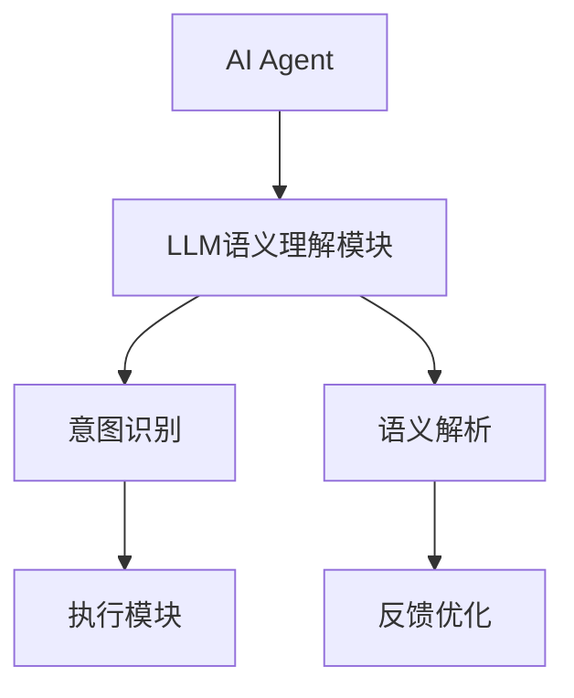
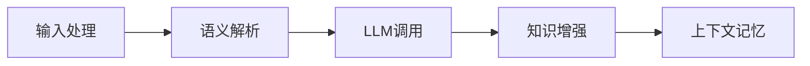
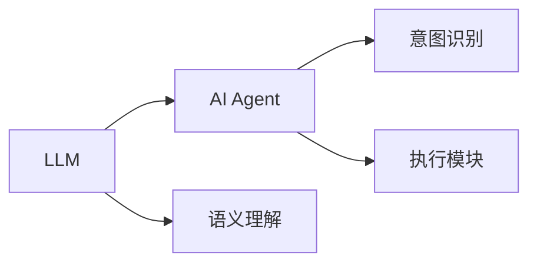
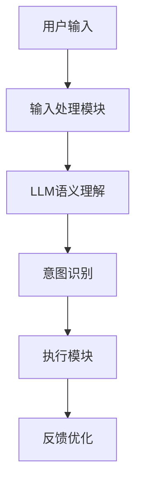
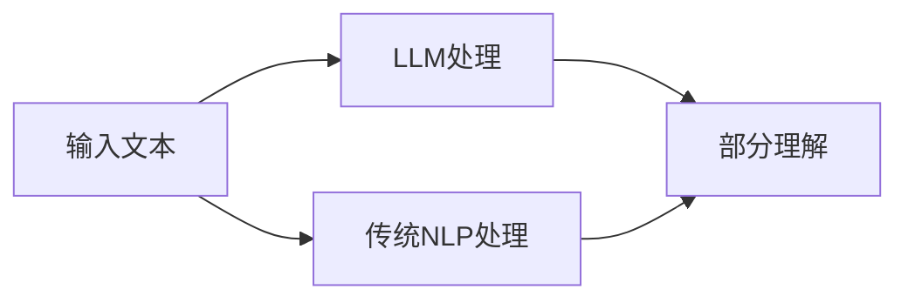
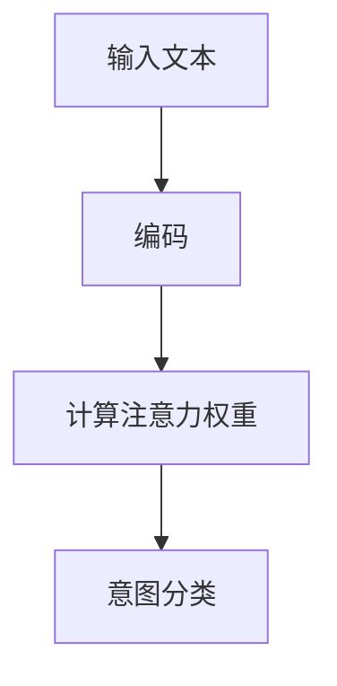
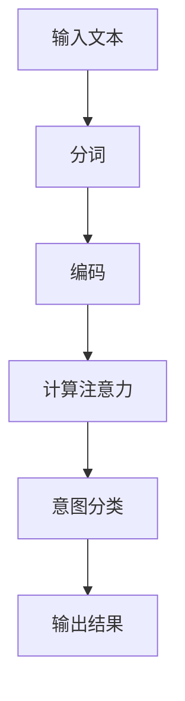
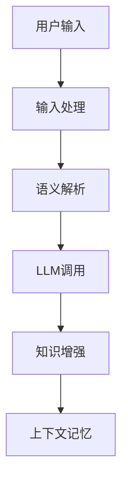
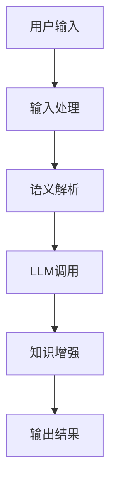

                 


# LLM支持的AI Agent语义理解优化

## 关键词：
- LLM（大语言模型）
- AI Agent（人工智能代理）
- 语义理解
- 优化
- 自然语言处理
- 对话系统
- 知识图谱

## 摘要：
随着大语言模型（LLM）的快速发展，AI Agent的语义理解能力得到了显著提升。本文将从背景介绍、核心概念、算法原理、系统架构、项目实战等多方面详细探讨如何优化AI Agent的语义理解能力。通过对比分析、算法流程图、系统架构图以及实际案例的深入剖析，帮助读者全面理解并掌握LLM支持的AI Agent语义理解优化的核心技术与实践方法。

---

# 第1章: LLM支持的AI Agent语义理解优化概述

## 1.1 问题背景与问题描述

### 1.1.1 当前AI Agent语义理解的挑战
AI Agent（人工智能代理）是一种能够感知环境、执行任务并提供智能服务的系统。然而，传统的AI Agent在语义理解方面存在以下问题：
- **语义理解的深度不足**：传统方法依赖于关键词匹配或规则引擎，难以理解上下文和隐含意图。
- **泛化能力有限**：面对复杂或未见过的语境，AI Agent往往无法准确理解用户需求。
- **知识更新滞后**：知识库的构建和更新成本较高，难以应对快速变化的信息环境。

### 1.1.2 LLM在语义理解中的优势
大语言模型（LLM）通过海量数据的预训练，具备以下优势：
- **强大的上下文理解能力**：LLM能够捕捉文本中的语义关系，理解上下文和隐含意图。
- **自适应学习能力**：通过微调或提示工程技术，LLM可以快速适应不同领域或任务。
- **实时知识更新**：LLM基于最新的训练数据，能够提供更准确的知识回答。

### 1.1.3 优化目标与意义
优化AI Agent的语义理解能力，旨在：
- 提升用户交互的准确性和满意度。
- 扩展AI Agent的应用场景，使其能够处理更复杂的任务。
- 降低开发和维护成本，通过优化语义理解模块，减少对大量规则或知识库的依赖。

---

## 1.2 核心概念与问题解决

### 1.2.1 LLM与AI Agent的定义与关系
- **大语言模型（LLM）**：基于Transformer架构的大规模神经网络模型，通过预训练掌握了语言的生成和理解能力。
- **AI Agent**：能够感知环境、执行任务并提供智能服务的系统，通常由感知模块、推理模块和执行模块组成。

LLM与AI Agent的关系：
- LLM作为AI Agent的核心语义理解模块，负责解析用户输入、生成响应。
- AI Agent通过调用LLM API，结合上下文和任务目标，实现更智能的交互。

### 1.2.2 语义理解优化的核心问题
- 如何通过LLM优化AI Agent的意图识别和语义解析能力。
- 如何在多轮对话中保持语境一致性，避免信息丢失。
- 如何结合领域知识，提升特定场景下的语义理解精度。

### 1.2.3 解决方案与技术路径
- **LLM微调**：针对特定领域或任务，对LLM进行微调以提升语义理解能力。
- **知识图谱集成**：将领域知识图谱与LLM结合，增强语义理解的准确性和可解释性。
- **对话历史记忆**：通过记录对话历史，保持上下文一致性，提升多轮对话的语义理解能力。

---

## 1.3 核心概念的边界与外延

### 1.3.1 LLM的边界与适用场景
- **边界**：LLM擅长处理文本生成、问答、翻译等任务，但在处理复杂逻辑推理或实时数据处理方面存在局限。
- **适用场景**：自然语言理解、对话生成、内容创作等。

### 1.3.2 AI Agent的边界与应用范围
- **边界**：AI Agent依赖于语义理解和执行模块的能力，无法独立完成复杂物理世界操作。
- **应用范围**：智能客服、智能助手、推荐系统、智能监控等。

### 1.3.3 语义理解优化的边界与限制
- **边界**：语义理解优化需要结合领域知识和上下文信息，无法在完全无监督的环境中自动优化。
- **限制**：LLM的计算成本较高，优化需要权衡性能和资源消耗。

---

## 1.4 核心概念结构与要素组成

### 1.4.1 LLM支持的AI Agent架构


### 1.4.2 语义理解优化的模块组成
- **输入处理模块**：接收用户输入并进行预处理。
- **语义解析模块**：利用LLM进行意图识别和语义解析。
- **知识增强模块**：结合知识图谱优化语义理解。
- **上下文记忆模块**：记录对话历史，保持语境一致性。

### 1.4.3 核心要素的相互关系


---

## 1.5 本章小结
本章从背景、核心概念和优化目标等方面介绍了LLM支持的AI Agent语义理解优化的基本情况。通过对比分析和架构图的展示，明确了LLM与AI Agent的关系，以及语义理解优化的核心问题和解决方案。

---

# 第2章: LLM支持的AI Agent语义理解优化的核心概念与联系

## 2.1 LLM与AI Agent的核心概念对比

### 2.1.1 对比分析表格
| 对比维度 | LLM | AI Agent |
|----------|-----|----------|
| 核心功能 | 语言生成与理解 | 感知、推理、执行 |
| 依赖条件 | 大规模数据训练 | 语义理解、知识库、执行模块 |
| 应用场景 | NLP任务 | 智能服务 |

### 2.1.2 实体关系图


---

## 2.2 LLM与AI Agent的协同工作原理

### 2.2.1 协同流程


---

## 2.3 LLM与传统NLP模型的对比分析

### 2.3.1 对比分析表格
| 对比维度 | LLM | 传统NLP模型 |
|----------|-----|-------------|
| 模型规模 | 大规模参数 | 小规模参数 |
| 上下文理解 | 强大 | 有限 |
| 可训练性 | 易通过微调优化 | 需重新训练 |

### 2.3.2 对比流程图


---

## 2.4 本章小结
本章通过对比分析和流程图展示，详细阐述了LLM与AI Agent的核心概念、协同工作原理以及与传统NLP模型的差异，为后续章节的优化策略奠定了基础。

---

# 第3章: LLM支持的AI Agent语义理解优化算法原理

## 3.1 大语言模型的训练机制

### 3.1.1 Transformer架构
- **自注意力机制**：通过计算输入序列中每个词与其他词的相关性，生成位置编码。
- **多层Transformer**：通过堆叠多个Transformer层，提升模型的表达能力。

### 3.1.2 语言模型的数学表示
$$ P(w_1, w_2, ..., w_n) = \prod_{i=1}^{n} P(w_i | w_1, ..., w_{i-1}) $$

---

## 3.2 语义理解优化的核心算法

### 3.2.1 基于注意力机制的意图识别
- **注意力权重计算**：
$$ \alpha_i = \text{softmax}(\frac{QK^T}{\sqrt{d}}) $$
- **意图识别流程**：


---

## 3.3 算法流程图与代码实现

### 3.3.1 算法流程图


### 3.3.2 Python代码实现
```python
import torch
import torch.nn as nn

class LLM(nn.Module):
    def __init__(self, vocab_size, embedding_dim, hidden_dim):
        super(LLM, self).__init__()
        self.embedding = nn.Embedding(vocab_size, embedding_dim)
        self.transformer = nn.Transformer(hidden_dim, hidden_dim)
        self.intent_classifier = nn.Linear(hidden_dim, num_intents)

    def forward(self, input_ids):
        embedded = self.embedding(input_ids)
        encoded = self.transformer(embedded)
        intent_logits = self.intent_classifier(encoded.mean(dim=1))
        return intent_logits

model = LLM(vocab_size=10000, embedding_dim=512, hidden_dim=512)
output = model(input_ids)
```

---

## 3.4 数学模型与公式推导

### 3.4.1 多层感知机模型
$$ y = \sigma(Wx + b) $$
其中，$x$ 是输入向量，$W$ 是权重矩阵，$b$ 是偏置向量，$\sigma$ 是激活函数。

### 3.4.2 Transformer结构
$$ \text{Attention}(Q, K, V) = \text{softmax}\left(\frac{QK^T}{\sqrt{d}}\right)V $$

---

## 3.5 实际应用案例分析

### 3.5.1 案例背景
- **任务**：智能客服对话系统
- **数据集**：客服对话历史

### 3.5.2 案例分析
通过LLM优化对话系统的语义理解能力，提升用户意图识别的准确率。

---

## 3.6 本章小结
本章详细讲解了LLM支持的AI Agent语义理解优化的核心算法原理，包括大语言模型的训练机制、意图识别算法、注意力机制以及具体实现案例。

---

# 第4章: LLM支持的AI Agent语义理解优化系统分析与架构设计

## 4.1 问题场景介绍

### 4.1.1 系统功能需求
- 用户输入处理
- 多轮对话管理
- 意图识别与语义解析

### 4.1.2 系统性能需求
- 响应时间<1秒
- 准确率>90%

---

## 4.2 项目介绍与系统功能设计

### 4.2.1 系统功能模块
- 输入处理模块
- 语义解析模块
- 知识增强模块
- 上下文记忆模块

### 4.2.2 功能流程图


---

## 4.3 系统架构设计

### 4.3.1 系统架构图


### 4.3.2 接口设计
- 输入接口：用户输入文本
- 输出接口：意图分类结果
- 调用接口：LLM API

---

## 4.4 系统交互流程图

### 4.4.1 交互流程


---

## 4.5 本章小结
本章通过系统分析与架构设计，详细阐述了LLM支持的AI Agent语义理解优化的系统实现方案，包括功能模块、架构设计和交互流程。

---

# 第5章: LLM支持的AI Agent语义理解优化项目实战

## 5.1 环境搭建与代码实现

### 5.1.1 环境安装
- 安装Python
- 安装PyTorch和Hugging Face库

### 5.1.2 核心代码实现
```python
from transformers import AutoModelForMaskedLM, AutoTokenizer

model_name = "bert-base-uncased"
model = AutoModelForMaskedLM.from_pretrained(model_name)
tokenizer = AutoTokenizer.from_pretrained(model_name)
```

---

## 5.2 系统功能实现

### 5.2.1 功能解读
- **意图识别**：通过LLM识别用户的意图。
- **语义解析**：结合上下文理解用户需求。
- **知识增强**：利用知识图谱优化语义理解。

### 5.2.2 功能实现流程


---

## 5.3 实际案例分析与优化

### 5.3.1 案例背景
- **任务**：智能客服对话系统
- **数据集**：客服对话历史

### 5.3.2 案例分析
通过LLM优化对话系统的语义理解能力，提升用户意图识别的准确率。

---

## 5.4 项目总结与优化建议

### 5.4.1 项目总结
- 成功实现了基于LLM的AI Agent语义理解优化。
- 提升了系统的意图识别准确率和用户体验。

### 5.4.2 优化建议
- 持续优化LLM微调策略。
- 引入领域知识图谱增强语义理解能力。

---

## 5.5 本章小结
本章通过实际项目案例，详细讲解了LLM支持的AI Agent语义理解优化的实现过程，包括环境搭建、代码实现和案例分析。

---

# 第6章: 总结与展望

## 6.1 本篇总结
- 全面介绍了LLM支持的AI Agent语义理解优化的核心技术。
- 通过对比分析、算法推导和项目实战，详细阐述了优化策略。

## 6.2 未来展望
- **更高效的语言模型**：如GPT-4和PaLM，将提升语义理解能力。
- **多模态优化**：结合视觉、听觉等多模态信息，提升语义理解能力。
- **实时知识更新**：通过动态知识图谱优化语义理解。

---

## 6.3 最佳实践 tips

### 6.3.1 开发建议
- 选择合适的LLM模型，结合领域知识优化语义理解。
- 记录对话历史，保持上下文一致性。

### 6.3.2 注意事项
- 注意计算成本，合理选择模型规模。
- 确保数据隐私和合规性。

---

## 6.4 拓展阅读
- 推荐书籍：《深度学习》、《Transformer实战》
- 推荐论文：《Attention Is All You Need》

---

## 6.5 本章小结
本章总结了全书的核心内容，并展望了未来的发展方向，同时提供了最佳实践建议和拓展阅读资源。

---

# 结语
通过本文的详细阐述，读者可以全面理解LLM支持的AI Agent语义理解优化的核心技术与实践方法。从背景介绍到算法原理，再到系统设计和项目实战，每一步都详细展开，帮助读者掌握优化策略并应用于实际场景中。

---

**关键词**：LLM，AI Agent，语义理解，优化，自然语言处理，对话系统，知识图谱

**摘要**：本文全面探讨了LLM支持的AI Agent语义理解优化的核心技术，包括背景介绍、核心概念、算法原理、系统架构和项目实战。通过对比分析、流程图展示和实际案例剖析，帮助读者掌握优化策略并应用于实际场景中。

