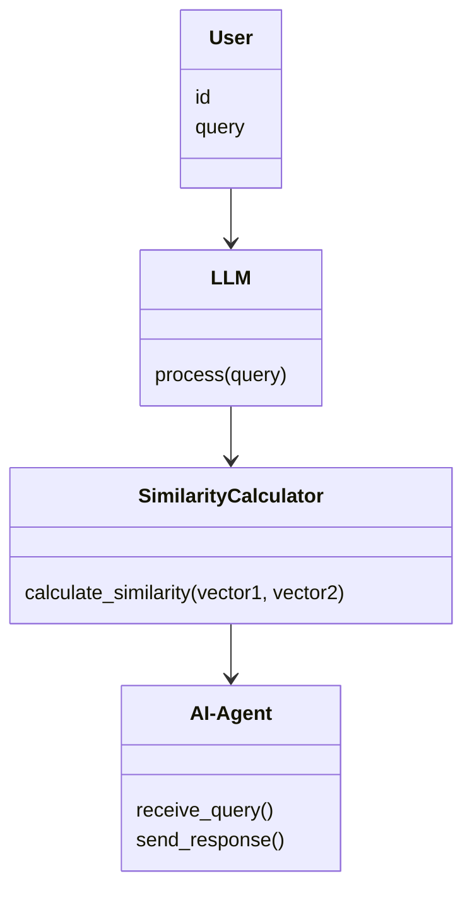
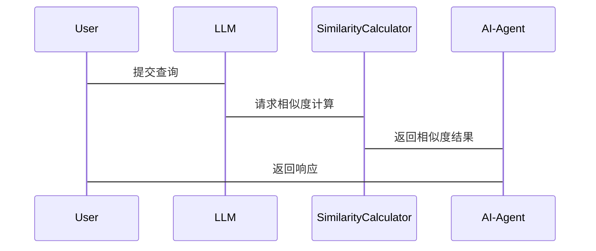

                 


# LLM支持的AI Agent语义相似度计算

> 关键词：LLM、AI Agent、语义相似度计算、自然语言处理、算法实现

> 摘要：本文深入探讨了LLM（大语言模型）在AI Agent语义相似度计算中的应用，从核心概念、算法原理到系统架构和项目实战，全面解析了如何通过语义相似度计算提升AI Agent的语义理解能力。文章结合具体代码实现和实际案例，详细介绍了多种相似度计算算法，并通过系统架构设计展示了如何将这些算法应用于实际场景，帮助读者全面掌握LLM支持的AI Agent语义相似度计算的核心技术和实践方法。

---

# 第1章: 问题背景与核心概念

## 1.1 问题背景介绍

### 1.1.1 语义相似度计算的定义
语义相似度计算是指通过自然语言处理技术，衡量两个文本片段在语义上的相似程度。其核心目标是理解文本的语义内容，而非仅仅依赖于词面匹配。在AI Agent中，语义相似度计算是实现智能交互、信息检索和决策支持的关键技术。

### 1.1.2 LLM在AI Agent中的作用
大语言模型（LLM）通过深度学习技术，能够理解和生成自然语言文本，为AI Agent提供了强大的语义理解能力。LLM可以用于语义相似度计算，帮助AI Agent更好地理解用户意图、匹配相关信息。

### 1.1.3 语义相似度计算的重要性
在AI Agent的应用场景中，语义相似度计算能够提升信息检索的准确性和相关性，优化用户体验。例如，在对话系统中，通过语义相似度计算可以匹配最相关的上下文信息；在智能推荐系统中，可以基于语义相似度推荐相关内容。

## 1.2 核心概念与问题描述

### 1.2.1 AI Agent的定义与功能
AI Agent是一种智能代理，能够感知环境、理解用户需求，并通过执行任务来满足用户需求。AI Agent的功能包括信息检索、决策支持、任务执行等。

### 1.2.2 语义相似度计算的目标
语义相似度计算的目标是将文本片段映射到一个语义空间中，并通过计算其相似性来衡量文本之间的语义关系。在AI Agent中，语义相似度计算用于匹配用户查询与系统知识库中的相关内容。

### 1.2.3 LLM在语义理解中的优势
LLM通过大规模预训练，能够捕捉文本的深层语义信息，具有强大的上下文理解和生成能力。相比传统NLP模型，LLM在语义相似度计算中表现更优，能够处理复杂的语义关系。

## 1.3 问题解决与边界定义

### 1.3.1 语义相似度计算的边界
语义相似度计算的边界包括文本长度、语义相关性、上下文依赖性等。需要注意的是，语义相似度计算并不能完全替代语义理解，它只是一个量化语义相似性的工具。

### 1.3.2 相似度计算的适用场景
语义相似度计算适用于以下场景：
1. 信息检索：匹配用户查询与数据库中的相关内容。
2. 对话系统：理解和生成与上下文相关的对话内容。
3. 内容推荐：基于语义相似性推荐相关内容。

### 1.3.3 相似度计算的限制与挑战
语义相似度计算的挑战包括：
1. 文本的歧义性：同一文本可能有多种语义解释。
2. 上下文依赖性：语义理解需要依赖上下文信息。
3. 数据质量和规模：语料库的质量和规模影响模型的性能。

## 1.4 核心要素与概念结构

### 1.4.1 语义相似度计算的核心要素
语义相似度计算的核心要素包括：
1. 文本表示：将文本映射为向量表示。
2. 相似度度量：计算向量之间的相似性。
3. 上下文理解：基于上下文信息调整相似度计算。

### 1.4.2 LLM与AI Agent的关系
LLM为AI Agent提供语义理解能力，AI Agent通过LLM进行语义相似度计算，从而实现智能交互和任务执行。

### 1.4.3 语义相似度计算的数学模型
语义相似度计算的数学模型包括向量空间模型、概率模型和深度学习模型等。

---

# 第2章: 核心概念与联系

## 2.1 语义相似度计算的原理

### 2.1.1 语义相似度计算的原理概述
语义相似度计算通过将文本映射到语义空间，计算向量之间的相似性。常用的相似度计算方法包括余弦相似度、欧氏距离、BM25等。

### 2.1.2 LLM在语义理解中的作用
LLM通过预训练掌握了大量语义信息，能够生成与输入文本语义相似的文本，从而帮助AI Agent进行语义相似度计算。

### 2.1.3 相似度计算的核心步骤
语义相似度计算的核心步骤包括：
1. 文本预处理：分词、去除停用词等。
2. 文本表示：将文本转换为向量表示。
3. 相似度计算：计算向量之间的相似性。

## 2.2 核心概念对比分析

### 2.2.1 语义相似度与语义相关性的对比
语义相似度衡量两个文本的语义接近程度，而语义相关性衡量两个文本的相关性。两者的区别在于，相似度更注重语义内容的相似性，而相关性更注重主题一致性。

### 2.2.2 LLM与传统NLP模型的对比
LLM通过大规模预训练掌握了丰富的语义信息，具有更强的上下文理解和生成能力。传统NLP模型依赖于特定任务的特征工程，语义理解能力较弱。

### 2.2.3 AI Agent与传统搜索算法的对比
AI Agent结合了语义理解能力，能够根据用户需求智能地进行信息检索和决策。传统搜索算法主要基于关键词匹配，无法理解用户意图。

## 2.3 ER实体关系图架构


---

# 第3章: 算法原理与实现

## 3.1 相似度计算算法原理

### 3.1.1 余弦相似度原理
余弦相似度通过计算两个向量在单位球面上的夹角来衡量相似性。公式为：
$$ \cos\theta = \frac{\vec{a} \cdot \vec{b}}{|\vec{a}| |\vec{b}|} $$

### 3.1.2 BM25算法原理
BM25是一种基于概率的检索模型，公式为：
$$ BM25Score = \log(1 + \frac{|\text{文档中词出现的次数}}{\text{平均词出现次数}}) \times \log( \frac{\text{总文档数} + 1}{\text{词出现的文档数} + 1} ) $$

### 3.1.3 Word2Vec模型原理
Word2Vec通过词嵌入技术，将词语映射到低维连续向量空间中。常用模型包括CBOW和Skip-Gram。

## 3.2 算法实现与代码示例

### 3.2.1 余弦相似度计算代码
```python
import numpy as np

def cosine_similarity(vec1, vec2):
    return np.dot(vec1, vec2) / (np.linalg.norm(vec1) * np.linalg.norm(vec2))
```

### 3.2.2 BM25算法实现
```python
def bm25_score(doc, query, k=15, b=0.75):
    # BM-25 implementation
    pass
```

### 3.2.3 Word2Vec模型训练
```python
from gensim.models import Word2Vec
model = Word2Vec(sentences, vector_size=100, window=5, min_count=1, workers=4)
```

## 3.3 数学模型与公式推导

### 3.3.1 余弦相似度的数学推导
余弦相似度的计算基于向量的内积和模长：
$$ \cos\theta = \frac{\vec{a} \cdot \vec{b}}{|\vec{a}| |\vec{b}|} $$

### 3.3.2 BM25的公式解读
BM25公式中的各部分分别计算了词语在文档中的频率和在整个语料库中的分布情况。

### 3.3.3 Word2Vec的训练过程
Word2Vec通过反向传播算法，优化词嵌入向量，使得词语的向量表示能够保留其语义信息。

---

# 第4章: 系统分析与架构设计

## 4.1 系统功能设计

### 4.1.1 领域模型设计


### 4.1.2 系统架构设计


### 4.1.3 系统交互设计


## 4.2 系统架构与实现

### 4.2.1 系统架构图


### 4.2.2 系统功能模块
系统功能模块包括用户查询模块、LLM处理模块、相似度计算模块和AI Agent决策模块。

### 4.2.3 接口设计与交互
系统接口设计包括用户查询接口、LLM处理接口、相似度计算接口和AI Agent响应接口。

---

# 第5章: 项目实战与案例分析

## 5.1 项目实战

### 5.1.1 环境安装
安装必要的Python库，如numpy、scipy、gensim等。

### 5.1.2 核心代码实现
实现语义相似度计算的代码，包括文本预处理、向量化和相似度计算。

### 5.1.3 代码解读与分析
详细解读代码实现，分析每部分的功能和作用。

## 5.2 案例分析

### 5.2.1 案例背景
介绍案例的背景和目标，例如在对话系统中实现语义相似度计算。

### 5.2.2 数据准备
准备训练数据，包括用户查询和相关的历史对话记录。

### 5.2.3 模型训练
使用LLM进行模型训练，优化语义相似度计算的准确性和效率。

### 5.2.4 结果分析
分析模型的性能，优化相似度计算的参数和方法。

## 5.3 实际案例分析

### 5.3.1 案例一：对话系统中的语义相似度计算
分析对话系统中如何利用语义相似度计算匹配用户查询与历史对话记录。

### 5.3.2 案例二：智能推荐系统中的应用
分析智能推荐系统中如何利用语义相似度计算推荐相关内容。

### 5.3.3 案例三：信息检索中的应用
分析信息检索系统中如何利用语义相似度计算提高检索精度。

---

# 第6章: 最佳实践与小结

## 6.1 最佳实践

### 6.1.1 小结
总结全文的主要内容和核心观点。

### 6.1.2 注意事项
在实际应用中，需要注意数据质量、模型选择和相似度计算的准确性。

### 6.1.3 拓展阅读
推荐相关的书籍和论文，供读者进一步学习和研究。

---

# 结语

通过本文的详细分析和讲解，读者可以全面掌握LLM支持的AI Agent语义相似度计算的核心技术和实践方法。从背景介绍到算法实现，从系统设计到项目实战，本文为读者提供了一个完整的知识框架，帮助读者在实际应用中更好地理解和应用语义相似度计算技术。

