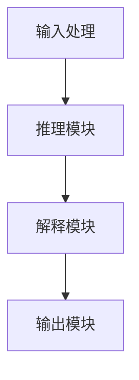

                 


# LLM的可解释性：理解AI Agent的决策过程

## 关键词：LLM、可解释性、AI Agent、决策过程、深度学习、自然语言处理、模型透明度

## 摘要：本文深入探讨了LLM（大语言模型）的可解释性问题，分析了AI Agent的决策过程，从技术背景、核心概念、算法原理到系统架构，结合实际案例，详细阐述了如何实现和评估模型的可解释性。通过理论与实践结合，为读者提供了全面的理解和应用指导。

---

# 引言

随着LLM技术的快速发展，AI Agent在各个领域的应用日益广泛。然而，模型的可解释性问题却成为限制其广泛应用的主要障碍。本文将从技术背景、核心概念、算法原理、系统架构到项目实战，全面解析LLM的可解释性，帮助读者深入理解AI Agent的决策过程。

---

## 第一部分：背景介绍

### 第1章：LLM可解释性概述

#### 1.1 问题背景
- **1.1.1 LLM的崛起与挑战**  
  大语言模型（LLM）如GPT-3、PaLM等在自然语言处理领域取得了显著成果，但其复杂性也带来了可解释性问题。

- **1.1.2 可解释性的重要性**  
  可解释性是用户信任模型的关键，特别是在医疗、金融等领域，错误的决策可能导致严重后果。

- **1.1.3 当前LLM应用中的问题**  
  当前LLM在实际应用中常因缺乏透明性而难以被用户信任，尤其是在需要明确决策依据的场景。

#### 1.2 问题描述
- **1.2.1 LLM决策过程的复杂性**  
  LLM通过复杂的神经网络进行推理，导致决策过程难以追踪。

- **1.2.2 用户对决策过程的理解需求**  
  用户需要了解AI的决策依据，以便验证结果的合理性。

- **1.2.3 可解释性在实际应用中的必要性**  
  可解释性是模型在实际应用中获得用户信任的前提。

#### 1.3 问题解决
- **1.3.1 提供可解释性的方法**  
  包括模型解释技术（如LIME、SHAP）和可解释模型（如决策树）的结合。

- **1.3.2 可解释性对模型性能的影响**  
  在保证性能的同时，提升模型的可解释性是一个平衡问题。

- **1.3.3 用户对可解释性的需求**  
  用户不仅需要结果，还需要了解结果背后的推理过程。

#### 1.4 边界与外延
- **1.4.1 可解释性的范围界定**  
  可解释性关注模型决策过程的透明度，而非模型的准确性。

- **1.4.2 相关概念的区分**  
  区分可解释性与模型的可调试性、可验证性等其他属性。

- **1.4.3 可解释性与其他模型属性的关系**  
  可解释性是模型性能和用户信任的重要组成部分。

#### 1.5 核心概念与组成
- **1.5.1 LLM的基本组成**  
  包括输入层、编码层、解码层和输出层。

- **1.5.2 可解释性的核心要素**  
  包括模型的透明度、可追溯性、可验证性。

- **1.5.3 决策过程的关键环节**  
  包括输入处理、特征提取、推理过程和结果输出。

---

## 第二部分：核心概念与联系

### 第2章：LLM可解释性原理

#### 2.1 核心概念原理
- **2.1.1 LLM的训练与推理机制**  
  LLM通过监督学习和强化学习进行训练，推理过程基于概率分布。

- **2.1.2 可解释性的定义与度量**  
  可解释性是模型决策过程的可理解性和可追溯性。

- **2.1.3 决策过程的透明化方法**  
  通过分解模型输出，分析每一步的推理逻辑。

#### 2.2 概念属性特征对比
- **2.2.1 不同可解释性方法的特征对比**  
  对比LIME、SHAP和Rule-based方法的优缺点。

- **2.2.2 各种解释方法的优缺点**  
  LIME适合解释单个预测，SHAP适合整体模型解释。

- **2.2.3 特征对比表格**  
  | 方法 | 优点 | 缺点 |
  |------|------|------|
  | LIME | 易用性高 | 解释性不稳定 |
  | SHAP | 解释性强 | 计算复杂 |
  | Rule-based | 易理解 | 精度较低 |

#### 2.3 ER实体关系图
- **2.3.1 实体关系图展示**  
  使用Mermaid图展示LLM、AI Agent、决策过程之间的关系。

```mermaid
erDiagram
    actor 用户
    actor 开发者
    actor 管理员
    actor 数据源
    class 模型
    class 决策过程
    class 解释结果
    class 特征
    用户 --> 模型 : 提供输入
    模型 --> 决策过程 : 执行推理
    决策过程 --> 解释结果 : 提供解释
    特征 --> 模型 : 提供特征
    开发者 --> 模型 : 训练模型
    管理员 --> 模型 : 管理模型
    数据源 --> 模型 : 提供数据
```

---

## 第三部分：算法原理讲解

### 第3章：LLM的可解释性算法

#### 3.1 算法原理
- **3.1.1 LLM的训练过程**  
  使用Transformer架构，通过自注意力机制进行上下文理解。

- **3.1.2 解释性算法的实现**  
  使用SHAP值计算每个特征对输出的贡献。

- **3.1.3 可解释性模型的构建**  
  通过可解释的模型（如线性回归）近似LLM的决策过程。

#### 3.2 算法实现
- **3.2.1 使用SHAP解释模型**  
  ```python
  import shap
  from transformers import pipeline

  # 加载预训练模型
  model = pipeline('text-classification', model='bert-base-cased')

  # 生成SHAP解释
  explainer = shap.Explainer(model)
  prediction = model("这是一个测试句子。")
  explanation = explainer("这是一个测试句子。")
  explanation.show()
  ```

- **3.2.2 解释结果的可视化**  
  使用SHAP的可视化工具展示特征的重要性。

#### 3.3 数学模型
- **3.3.1 可解释性模型的数学表示**  
  假设模型输出为$y = \beta_0 + \beta_1x_1 + \beta_2x_2 + ... + \beta_nx_n$。

- **3.3.2 SHAP值的计算公式**  
  $$ SHAP_{i,j} = f_{i}(x) - f_{i}(x_{j}) $$

---

## 第四部分：系统分析与架构设计

### 第4章：系统架构与设计

#### 4.1 系统功能设计
- **4.1.1 功能模块划分**  
  包括输入处理模块、推理模块、解释模块和输出模块。

- **4.1.2 功能流程图**  
  使用Mermaid流程图展示功能流程。



#### 4.2 系统架构设计
- **4.2.1 分层架构设计**  
  包括数据层、计算层、解释层和用户层。

- **4.2.2 系统架构图**  
  使用Mermaid图展示系统架构。


---

## 第五部分：项目实战

### 第5章：项目实现与案例分析

#### 5.1 环境安装
- **5.1.1 安装Python环境**  
  使用Anaconda安装Python 3.8以上版本。

- **5.1.2 安装依赖库**  
  安装shap、transformers等库。

#### 5.2 代码实现
- **5.2.1 加载模型**  
  ```python
  from transformers import pipeline
  model = pipeline('text-classification', model='bert-base-cased')
  ```

- **5.2.2 解释结果**  
  ```python
  explainer = shap.Explainer(model)
  prediction = model("这是一个测试句子。")
  explanation = explainer("这是一个测试句子。")
  explanation.show()
  ```

#### 5.3 案例分析
- **5.3.1 案例背景**  
  某医疗应用中，模型诊断结果需要可解释性支持。

- **5.3.2 解释过程**  
  使用SHAP分析每个症状对诊断结果的贡献。

#### 5.4 项目总结
- **5.4.1 项目收获**  
  掌握了可解释性算法的实现和应用。

- **5.4.2 经验教训**  
  可解释性与模型性能之间需要平衡。

---

## 第六部分：最佳实践与小结

### 第6章：总结与建议

#### 6.1 总结
- **6.1.1 全文总结**  
  可解释性是LLM应用中的关键问题，本文从多个方面进行了深入探讨。

- **6.1.2 核心内容回顾**  
  介绍了可解释性的实现方法、算法原理和系统设计。

#### 6.2 最佳实践
- **6.2.1 开发建议**  
  在模型开发中优先考虑可解释性。

- **6.2.2 用户建议**  
  用户应结合上下文理解模型解释。

#### 6.3 展望
- **6.3.1 未来发展方向**  
  研究更高效的可解释性方法。

- **6.3.2 新技术探索**  
  探索结合可解释性的新模型架构。

---

## 参考文献
- Goodfellow, I., Bengio, Y., & Courville, A. (2016). Deep Learning.
- LIME: https://github.com/marcotcr/lime
- SHAP: https://github.com/slundier/shap

---

通过以上结构和内容，本文系统地探讨了LLM的可解释性问题，结合理论分析和实际案例，为读者提供了全面的指导。希望本文能帮助技术从业者更好地理解和应用LLM的可解释性。

