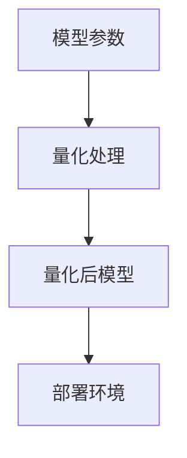
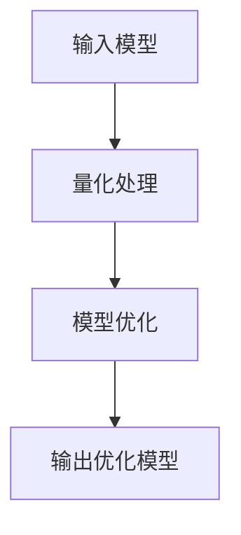
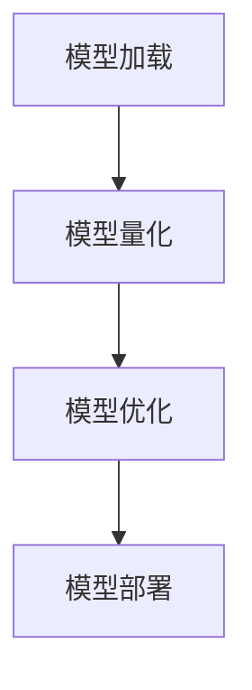

                 


# LLM的量化技术：优化AI Agent的部署效率

> **关键词**：大语言模型、量化技术、模型压缩、AI Agent、部署效率  
> **摘要**：随着大语言模型（LLM）的广泛应用，优化AI Agent的部署效率成为一个重要课题。本文深入探讨了LLM的量化技术，从背景、原理到实战，全面解析了如何通过量化技术优化AI Agent的部署效率。通过系统架构设计和具体案例分析，展示了量化技术在实际应用中的巨大潜力。

---

## 第一部分：背景介绍

### 第1章：LLM与量化技术概述

#### 1.1 LLM的基本概念
- **1.1.1 大语言模型的定义与特点**
  - 大语言模型（Large Language Model，LLM）是指参数量在亿级以上的深度学习模型，如GPT系列、BERT系列等。
  - LLM的特点包括：参数规模大、训练数据量大、模型复杂度高、计算资源消耗大。
- **1.1.2 量化技术的背景与意义**
  - 量化技术是一种通过减少模型参数的位数（如从32位浮点数降低到8位整数）来减少模型体积、降低计算复杂度的技术。
  - 量化技术的意义在于优化模型的部署效率，降低硬件资源消耗，同时保持模型性能。
- **1.1.3 LLM在AI Agent中的作用**
  - AI Agent需要实时响应用户请求，依赖高效的模型推理能力。
  - LLM通过强大的语义理解和生成能力，为AI Agent提供了智能化的交互体验。

#### 1.2 量化技术的核心概念
- **1.2.1 模型压缩的核心概念**
  - 模型压缩是通过删除冗余参数或简化模型结构来减少模型体积的技术。
  - 模型压缩的目标是在保持模型性能的前提下，显著降低模型的存储和计算需求。
- **1.2.2 量化技术的实现原理**
  - 量化技术通过将模型参数从高精度（如32位浮点数）转换为低精度（如8位整数）来减少参数的存储空间和计算复杂度。
  - 量化技术通常包括两步：训练量化模型和部署量化模型。
- **1.2.3 量化对模型性能的影响**
  - 量化技术可能会引入一定的精度损失，但通过合理的量化策略和后训练优化，可以将性能损失降到最低。

#### 1.3 量化技术的重要性
- **1.3.1 优化AI Agent部署效率的意义**
  - 量化技术可以显著降低AI Agent的部署成本，包括计算资源和存储资源。
  - 量化技术能够提升AI Agent的推理速度，满足实时交互的需求。
- **1.3.2 量化技术在资源受限环境中的应用**
  - 在边缘计算环境中，量化技术可以显著降低硬件资源需求。
  - 在移动端应用中，量化技术能够提升应用的运行效率和用户体验。
- **1.3.3 量化技术的边界与外延**
  - 量化技术的边界在于模型的性能极限和应用场景的特定需求。
  - 量化技术的外延包括与其他优化技术（如模型剪枝、知识蒸馏）的结合应用。

---

### 第2章：量化技术的核心概念与联系

#### 2.1 量化技术的核心原理
- **2.1.1 模型压缩的实现方法**
  - 模型剪枝：通过去除模型中的冗余参数（如权重为零的参数）来减少模型体积。
  - 参数量化：将模型参数从高精度表示转换为低精度表示。
  - 知识蒸馏：通过教师模型指导学生模型的学习，降低学生模型的复杂度。
- **2.1.2 量化技术的数学模型**
  - 量化过程可以表示为：将连续的高精度参数映射到离散的低精度表示。
  - 量化误差可以通过以下公式表示：
  $$\text{量化误差} = \frac{\text{最大值} - \text{最小值}}{2^{\text{bit}} - 1}$$
- **2.1.3 量化技术与模型结构优化的联系**
  - 量化技术通常与模型剪枝、网络架构搜索（NAS）等技术结合使用，以进一步优化模型性能。

#### 2.2 核心概念对比分析
- **2.2.1 不同量化方法的特征对比**
| 量化方法 | 量化精度 | 量化范围 | 优点 | 缺点 |
|----------|----------|----------|------|------|
| 4位整数量化 | 4位整数 | 全局量化 | 参数体积小，计算速度快 | 可能引入较大误差 |
| 8位浮点量化 | 8位浮点 | 全局量化 | 参数体积小，计算速度快 | 误差小于4位整数量化 |
| 混合精度量化 | 混合精度 | 局部量化 | 误差小，性能损失低 | 实现复杂度高 |
- **2.2.2 量化精度与模型性能的关系**
  - 量化精度越高，模型性能越接近原始模型，但参数体积和计算复杂度也越高。
  - 量化精度越低，模型性能可能下降，但参数体积和计算复杂度显著降低。
- **2.2.3 量化技术与其他优化方法的联系**
  - 量化技术可以与模型剪枝结合，进一步减少模型体积。
  - 量化技术可以与知识蒸馏结合，优化学生模型的性能。

#### 2.3 实体关系图与流程图
- **2.3.1 量化技术的ER实体关系图**


---

### 第3章：量化技术的算法原理

#### 3.1 模型压缩算法
- **3.1.1 模型剪枝的实现流程**
  - 输入原始模型。
  - 计算每个参数的重要性（如参数的梯度绝对值、参数的贡献度）。
  - 删除重要性最低的参数。
  - 对剪枝后的模型进行微调，恢复部分性能损失。
- **3.1.2 参数量化的方法**
  - 对每个参数进行量化处理，如将32位浮点数转换为8位整数。
  - 在量化过程中，通常需要对参数进行归一化处理，以适应不同的动态范围。
- **3.1.3 知识蒸馏技术的原理**
  - 使用一个高性能的大模型（教师模型）指导一个低性能的小模型（学生模型）学习。
  - 知识蒸馏通常通过软目标标签和蒸馏损失函数来实现。

#### 3.2 量化算法的数学模型
- **3.2.1 模型压缩的数学公式**
  - 压缩比计算公式：
  $$\text{压缩比} = \frac{\text{原始参数数量}}{\text{压缩后参数数量}}$$
- **3.2.2 量化精度的影响公式**
  $$\text{量化误差} = \frac{\text{最大值} - \text{最小值}}{2^{\text{bit}} - 1}$$
- **3.2.3 量化算法的流程图**


---

### 第4章：量化技术的系统架构设计

#### 4.1 系统功能设计
- **4.1.1 系统功能模块**
  - 模型加载模块：负责加载原始模型和量化后的模型。
  - 模型量化模块：负责对模型参数进行量化处理。
  - 模型优化模块：负责对量化后的模型进行微调和优化。
  - 模型部署模块：负责将优化后的模型部署到目标环境中。
- **4.1.2 系统功能流程**
  - 系统启动后，首先加载原始模型。
  - 模型量化模块对模型参数进行量化处理。
  - 模型优化模块对量化后的模型进行微调，恢复部分性能损失。
  - 最终，模型部署模块将优化后的模型部署到目标环境中。

#### 4.2 系统架构设计
- **4.2.1 系统架构图**


---

## 第二部分：项目实战

### 第5章：量化技术的实际应用

#### 5.1 项目背景与目标
- 项目背景：选择一个开源的大语言模型（如GPT-2）进行量化处理。
- 项目目标：通过量化技术优化模型的部署效率，降低硬件资源消耗，同时保持模型性能。

#### 5.2 项目环境配置
- **硬件环境**：CPU或GPU（推荐使用GPU以加速训练）。
- **软件环境**：Python 3.8及以上版本，TensorFlow或PyTorch框架。

#### 5.3 核心代码实现
- **量化代码示例（使用PyTorch）**
```python
import torch

def quantize_model(model, weight_bit=8, activation_bit=8):
    # 对模型参数进行量化
    for name, param in model.named_parameters():
        if 'weight' in name:
            # 对权重参数进行量化
            max_val = param.max().item()
            min_val = param.min().item()
            quantized_weight = torch.quantize_linear(param, weight_bit)
            # 将量化后的权重参数重新赋值
            model._parameters[name] = quantized_weight
        elif 'bias' in name:
            # 对偏置参数进行量化
            quantized_bias = torch.quantize_linear(param, weight_bit)
            model._parameters[name] = quantized_bias

    # 对激活函数进行量化
    for name, module in model.named_modules():
        if isinstance(module, torch.nn.ReLU):
            module = torch.nn.ReLU(inplace=True)
            module.activation_bit = activation_bit
```

#### 5.4 项目测试与优化
- **量化模型性能测试**
  - 使用量化后的模型进行推理，记录推理时间、模型体积等指标。
  - 比较量化前后模型的性能差异，分析量化技术的有效性。
- **量化模型优化**
  - 对量化后的模型进行微调，进一步优化模型性能。
  - 调整量化参数（如量化位数）以找到性能与资源消耗的最佳平衡点。

#### 5.5 项目总结
- **量化技术的实际效果**
  - 量化技术能够显著降低模型的存储和计算需求，同时保持较高的模型性能。
  - 量化技术在边缘计算和移动端应用中具有重要的应用价值。
- **项目经验与教训**
  - 量化技术的实现需要结合具体的应用场景和硬件条件。
  - 模型量化后的性能优化需要进行多次实验和调整。

---

## 第三部分：总结与展望

### 第6章：总结与展望

#### 6.1 核心知识点总结
- 量化技术是一种有效的模型优化方法，能够在保持模型性能的前提下显著降低模型的存储和计算需求。
- 量化技术可以与模型剪枝、知识蒸馏等技术结合使用，进一步优化模型性能。
- 在实际应用中，需要根据具体场景选择合适的量化策略和优化方法。

#### 6.2 未来展望
- **量化技术的进一步发展**
  - 研究更高效的量化方法，如混合精度量化、动态量化等。
  - 探索量化技术与其他优化技术的结合，如量化与模型蒸馏的结合。
- **量化技术的广泛应用**
  - 在边缘计算、移动端应用中，量化技术将得到更广泛的应用。
  - 在分布式计算环境中，量化技术将帮助降低计算资源消耗，提升计算效率。

---

## 第四部分：最佳实践与注意事项

### 第7章：最佳实践

#### 7.1 最佳实践Tips
- 在量化模型前，先对模型进行性能分析，找出模型的瓶颈。
- 根据具体场景选择合适的量化策略，如在资源受限的环境中优先选择低精度量化。
- 在量化模型后，进行多次微调和优化，以提升模型性能。

#### 7.2 注意事项
- 量化技术可能会引入一定的性能损失，需要在性能和资源消耗之间找到最佳平衡点。
- 在实际应用中，需要考虑模型的兼容性和可扩展性，确保量化后的模型能够顺利运行在目标环境中。
- 定期更新和优化量化策略，以应对新的应用场景和技术挑战。

---

通过以上内容，我们系统地探讨了LLM的量化技术及其在优化AI Agent部署效率中的应用。从理论到实践，从算法到系统设计，本文为读者提供了全面的视角和深入的分析，帮助读者更好地理解和应用量化技术。希望本文能为AI Agent的优化部署提供有价值的参考和指导。

