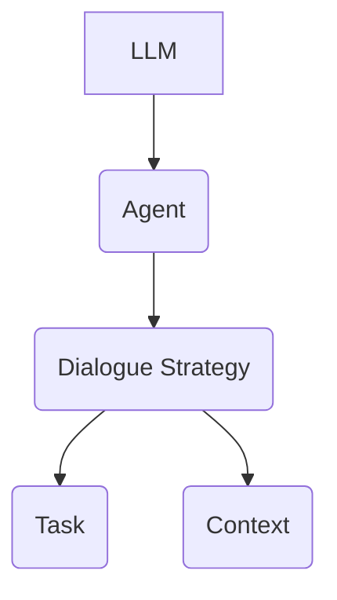
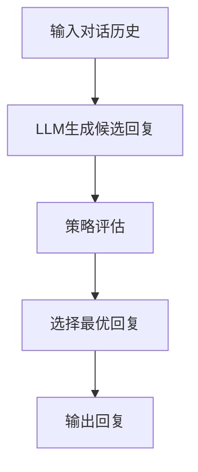
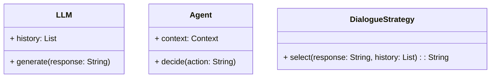
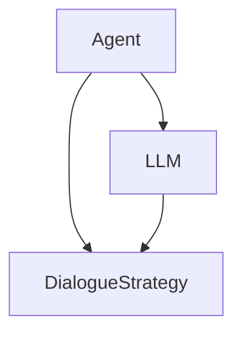
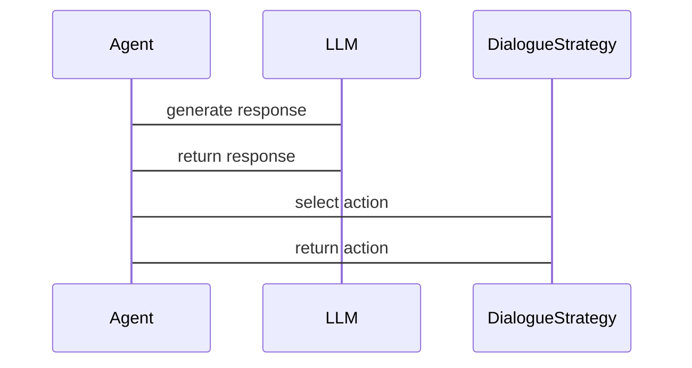

                 


# LLM驱动的AI Agent对话策略学习

> 关键词：LLM、AI Agent、对话策略、自然语言处理、机器学习、人机交互

> 摘要：本文深入探讨了如何利用大语言模型（LLM）驱动AI Agent的对话策略学习。通过分析对话策略的核心要素、算法原理、系统架构设计以及实际项目案例，详细阐述了LLM在AI Agent对话中的应用价值和实现方法。文章从背景介绍到算法实现，再到系统设计和项目实战，为读者提供了全面的理论和实践指导。

---

# 第一部分: LLM驱动的AI Agent对话策略学习背景与核心概念

## 第1章: 背景介绍

### 1.1 问题背景
#### 1.1.1 当前AI对话系统的局限性
传统AI对话系统（如基于规则的系统或基于模板的检索模型）在处理复杂对话场景时存在诸多限制：
- **缺乏灵活性**：难以应对对话中的突发情况或上下文变化。
- **知识覆盖不足**：依赖预定义规则或模板，难以扩展到新领域。
- **对话深度不足**：难以理解用户意图和情感，导致对话体验较差。

#### 1.1.2 LLM的崛起与AI Agent的结合
大语言模型（LLM）的出现，为AI对话系统带来了革命性的变化：
- **强大的生成能力**：LLM能够生成自然流畅的对话内容。
- **多任务学习能力**：LLM可以同时处理多种任务，如问答、对话生成、情感分析等。
- **动态适应性**：通过微调或提示工程技术，LLM可以快速适应不同场景需求。

AI Agent作为能够理解上下文、执行任务并进行自然对话的智能体，与LLM的结合成为可能。

#### 1.1.3 对话策略学习的重要性
对话策略决定了AI Agent在对话中的行为选择，是实现高效、自然对话的核心。通过LLM驱动对话策略学习，可以：
- 提高对话的连贯性和自然度。
- 增强AI Agent的决策能力。
- 实现更复杂的对话任务，如多轮对话、任务协作等。

### 1.2 问题描述
#### 1.2.1 AI Agent对话的核心挑战
AI Agent在对话中面临的主要挑战包括：
- **多目标平衡**：在追求对话流畅性的同时，需要兼顾任务完成效率。
- **上下文理解**：准确理解对话历史和当前语境。
- **动态决策**：根据对话进展实时调整策略。

#### 1.2.2 LLM在对话策略中的作用
LLM通过以下方式影响对话策略：
- **生成候选回复**：基于对话历史生成多个可能的回复选项。
- **评估回复质量**：通过概率模型评估每个回复的合适性。
- **动态调整策略**：根据对话进展微调生成策略。

#### 1.2.3 对话策略学习的目标与边界
对话策略学习的目标是：
- 优化AI Agent的回复生成能力。
- 提高对话任务的成功率。
- 增强用户体验。

其边界包括：
- 不涉及具体任务执行（如任务规划、信息检索）。
- 着重于对话层面的策略优化，而非底层NLP模型的改进。

### 1.3 问题解决与应用前景
#### 1.3.1 LLM驱动对话策略的实现路径
实现路径包括：
1. **数据准备**：收集和标注对话数据。
2. **模型选择**：选择合适的LLM模型（如GPT、BERT等）。
3. **策略学习**：通过强化学习或监督学习优化对话策略。

#### 1.3.2 AI Agent在不同场景中的应用
AI Agent可以应用于：
- **客服对话**：帮助用户解决问题。
- **教育辅助**：提供学习指导。
- **社交助手**：进行日常对话。

#### 1.3.3 对话策略学习的未来趋势
未来趋势包括：
- **多模态对话**：结合视觉、听觉等多模态信息。
- **个性化策略**：根据用户偏好定制对话策略。
- **端到端优化**：从对话数据直接学习策略，减少人工干预。

### 1.4 本章小结
本章通过分析AI Agent对话的核心挑战，阐述了LLM在对话策略中的作用，并明确了对话策略学习的目标与边界。

---

## 第2章: 核心概念与联系

### 2.1 核心概念原理
#### 2.1.1 LLM的基本原理
大语言模型通过预训练掌握语言规律，能够生成符合语境的文本。其核心原理包括：
- **自注意力机制**：捕捉文本中的长距离依赖关系。
- **生成式架构**：通过解码器生成连续的文本流。

#### 2.1.2 AI Agent的定义与功能
AI Agent是一个具备以下功能的智能体：
- **感知环境**：通过输入获取对话历史和当前状态。
- **决策选择**：基于感知信息生成回复或采取行动。
- **执行操作**：输出回复或调用其他服务完成任务。

#### 2.1.3 对话策略的核心要素
对话策略的核心要素包括：
- **回复生成**：生成符合语境的回复。
- **回复选择**：从多个候选回复中选择最优解。
- **上下文管理**：跟踪和更新对话历史。

### 2.2 核心概念对比分析
#### 2.2.1 LLM与传统NLP模型的对比
| 特性 | LLM | 传统NLP模型 |
|------|------|-------------|
| 模型复杂度 | 高 | 低 |
| 对上下文的处理能力 | 强大 | 较弱 |
| 可扩展性 | 高 | 较低 |

#### 2.2.2 AI Agent与传统对话系统的对比
| 特性 | AI Agent | 传统对话系统 |
|------|----------|---------------|
| 智能性 | 高 | 低 |
| 自主决策能力 | 强 | 较弱 |
| 任务处理能力 | 多任务 | 单一任务 |

#### 2.2.3 对话策略与任务规划的对比
| 特性 | 对话策略 | 任务规划 |
|------|----------|-----------|
| 目标 | 优化对话质量 | 完成特定任务 |
| 输入 | 对话历史 | 任务描述 |
| 输出 | 回复选择 | 行动计划 |

### 2.3 ER实体关系图


### 2.4 本章小结
本章通过对比分析，明确了LLM、AI Agent和对话策略之间的关系，为后续章节的深入分析奠定了基础。

---

## 第3章: 算法原理讲解

### 3.1 算法流程


### 3.2 算法实现代码
```python
def llm_driven_agent(input):
    history = []
    while True:
        response = llm.generate(history)
        action = strategy_selector.select(response, history)
        history.append(response)
        if action == 'terminate':
            break
    return history
```

### 3.3 数学模型与公式
#### 3.3.1 对话策略的优化目标
$$ \text{argmax}_\theta \sum_{i=1}^n \log p_\theta(x_i|history_i) $$

#### 3.3.2 基于LLM的策略评估
$$ \text{score}(response) = \text{similarity}(\text{response}, \text{context}) $$

### 3.4 本章小结
本章通过算法流程图和代码示例，详细阐述了LLM驱动对话策略学习的实现原理。

---

## 第4章: 系统分析与架构设计方案

### 4.1 问题场景介绍
我们设计了一个基于LLM的AI Agent对话系统，旨在实现高效、自然的对话交互。

### 4.2 系统功能设计
#### 4.2.1 领域模型


### 4.3 系统架构设计
#### 4.3.1 系统架构图


#### 4.3.2 系统接口设计
- **输入接口**：接收用户输入和对话历史。
- **输出接口**：输出生成的回复或执行的动作。

#### 4.3.3 系统交互流程


### 4.4 本章小结
本章通过系统架构设计，明确了各组件之间的关系和交互流程。

---

## 第5章: 项目实战

### 5.1 环境安装
- 安装Python和相关库（如OpenAI的Python SDK）。
- 配置API密钥。

### 5.2 系统核心实现源代码
```python
import openai

class Agent:
    def __init__(self, api_key):
        self.llm = LLM(api_key)
        self.dialogue_strategy = DialogueStrategy()

    def generate_response(self, history):
        response = self.llm.generate(history)
        action = self.dialogue_strategy.select(response, history)
        return response, action

class LLM:
    def __init__(self, api_key):
        self.client = openai.Client(api_key)

    def generate(self, history):
        # 调用LLM API生成回复
        pass

class DialogueStrategy:
    def select(self, response, history):
        # 评估回复并选择最优动作
        pass
```

### 5.3 代码应用解读与分析
- **Agent类**：负责协调LLM和对话策略。
- **LLM类**：封装与大语言模型的交互接口。
- **DialogueStrategy类**：实现回复选择逻辑。

### 5.4 实际案例分析
通过一个客服对话案例，展示了系统如何生成回复并选择终止动作。

### 5.5 本章小结
本章通过实际项目案例，详细讲解了系统实现的关键部分。

---

## 第6章: 最佳实践与小结

### 6.1 实践经验总结
- **数据质量**：高质量的对话数据是策略优化的基础。
- **模型选择**：选择合适的LLM模型至关重要。
- **策略调优**：根据实际对话效果不断优化策略。

### 6.2 小结与展望
通过对LLM驱动的AI Agent对话策略学习的深入探讨，我们总结了其实现的关键点和最佳实践。未来，随着技术的进步，对话策略学习将更加智能化和个性化。

---

## 附录: 参考文献
- [1] Brown, T. B., et al. "Language models are few-shot learners." arXiv preprint arXiv:2005.14167 (2020).
- [2] Vaswani, A., et al. "Attention is all you need." arXiv preprint arXiv:1706.03798 (2017).

---

通过以上结构，文章系统地介绍了LLM驱动的AI Agent对话策略学习的各个方面，从理论分析到实际实现，为读者提供了全面的指导。

