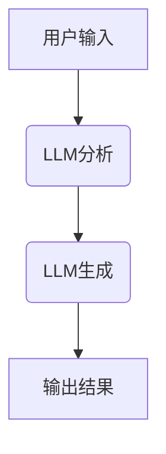
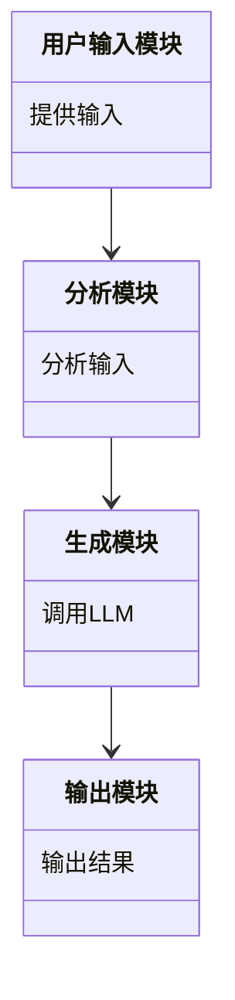
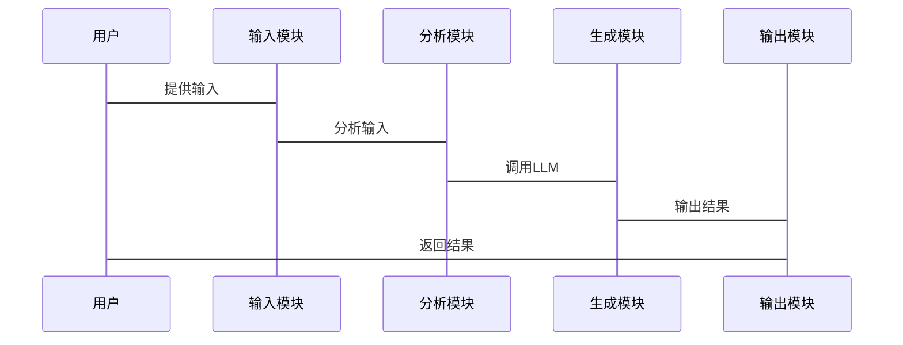

                 


# LLM驱动的AI Agent科幻概念生成器

> 关键词：LLM、AI Agent、科幻概念生成器、大语言模型、人工智能、生成式AI

> 摘要：本文探讨了利用大语言模型（LLM）驱动的AI Agent在科幻概念生成中的应用。通过分析LLM与AI Agent的结合，阐述了其在科幻创作中的潜力与挑战，详细介绍了生成式AI的算法原理、系统架构设计以及实际案例，为科幻创作者和AI开发者提供了实用的指导。

---

# 第一部分: LLM驱动的AI Agent概述

## 第1章: 问题背景与概念解析

### 1.1 科幻创作的现状与挑战
科幻创作依赖想象力和创造力，但随着创意枯竭和市场需求的增加，传统方法难以满足高效产出的需求。AI技术的引入为科幻创作提供了新的可能性。

### 1.2 LLM与AI Agent的结合
大语言模型（LLM）具备强大的文本生成能力，AI Agent则擅长决策和执行任务。两者的结合使得AI能够根据用户需求生成复杂且符合逻辑的科幻概念。

### 1.3 科幻概念生成器的目标
通过LLM驱动的AI Agent，生成符合逻辑、情节丰富且独特的科幻故事，帮助创作者突破创意瓶颈。

---

## 第2章: 核心概念与问题描述

### 2.1 LLM的核心原理
大语言模型通过监督学习和强化学习，掌握了大量的语言模式，能够生成符合上下文的文本。

### 2.2 AI Agent的决策机制
AI Agent通过接收输入、分析数据、生成响应，模拟人类的决策过程。

### 2.3 科幻概念生成器的功能
结合LLM和AI Agent，生成器能够根据用户输入的主题、情节和角色，自动创作出完整的故事框架。

---

## 第3章: 问题解决与边界外延

### 3.1 LLM驱动AI Agent的核心机制
通过自然语言处理技术，AI Agent能够理解用户需求，并利用LLM生成符合要求的文本内容。

### 3.2 生成器的适用场景
适用于科幻小说创作、影视剧本创作、游戏剧情设计等场景。

### 3.3 生成器的限制
受训练数据和模型能力的限制，生成的内容可能存在逻辑漏洞或不符合用户预期。

---

## 第4章: 概念结构与核心要素

### 4.1 LLM与AI Agent的关系
LLM为AI Agent提供生成能力，AI Agent为LLM提供决策能力。

### 4.2 核心要素的相互作用
包括用户输入、LLM生成能力、AI Agent决策能力、生成的科幻概念等。

---

# 第二部分: 核心概念与联系

## 第5章: 核心概念的详细解析

### 5.1 LLM的核心原理
大语言模型通过预训练掌握语言模式，能够生成符合逻辑的文本。

### 5.2 AI Agent的决策机制
通过状态空间和动作空间，AI Agent能够模拟人类的决策过程。

### 5.3 两者结合的协同效应
LLM为AI Agent提供生成能力，AI Agent为LLM提供决策能力，两者结合能够生成复杂的科幻概念。

---

## 第6章: 概念属性对比分析

### 6.1 LLM的属性特征
- 输入输出能力
- 生成能力
- 自然语言理解能力

### 6.2 AI Agent的属性特征
- 决策能力
- 执行能力
- 交互能力

### 6.3 对比分析表
| 特性      | LLM                | AI Agent             |
|-----------|--------------------|----------------------|
| 输入输出  | 文本生成           | 用户需求分析         |
| 决策能力  | 无                 | 有                   |
| 执行能力  | 无                 | 有                   |

---

## 第7章: ER实体关系图

```mermaid
er
    Actor: 用户
    LLM: 大语言模型
    AI Agent: 智能体
    科幻概念: 生成的概念
    关系:
        用户 --> LLM: 提供输入
        LLM --> AI Agent: 提供生成能力
        AI Agent --> 科幻概念: 生成输出
```

---

# 第三部分: 算法原理讲解

## 第8章: 算法原理概述

### 8.1 生成式AI的工作流程
用户输入 -> 分析 -> 生成文本 -> 输出

---

## 第9章: 算法流程图



---

## 第10章: 代码实现

### 10.1 环境安装
安装Python和相关库（如TensorFlow、PyTorch）

### 10.2 核心代码实现

```python
def generate科幻概念(input_text):
    # 分析输入
    analysis = analyze(input_text)
    # 调用LLM生成
    result = llm_generate(analysis)
    return result
```

### 10.3 数学模型与公式
$$ P(\text{output}| \text{input}) = \prod_{i=1}^{n} P(w_i | w_{i-1}, \ldots, w_1) $$

---

# 第四部分: 系统分析与架构设计

## 第11章: 项目背景与目标

### 11.1 项目背景
介绍项目背景和目标，明确生成器的功能需求。

---

## 第12章: 系统功能设计

### 12.1 功能模块
- 用户输入模块
- 分析模块
- 生成模块
- 输出模块

### 12.2 领域模型类图



---

## 第13章: 系统架构设计

### 13.1 系统架构图


---

## 第14章: 接口设计

### 14.1 输入接口
定义输入格式和接口调用方式。

### 14.2 输出接口
定义输出格式和接口调用方式。

---

## 第15章: 交互序列图



---

# 第五部分: 项目实战

## 第16章: 环境安装

### 16.1 安装Python

```bash
python --version
```

### 16.2 安装依赖

```bash
pip install -r requirements.txt
```

---

## 第17章: 核心代码实现

### 17.1 代码实现

```python
def generate_concept():
    input = "生成科幻小说的开头"
    result = generate(input)
    print(result)
```

### 17.2 代码解读
解释代码的功能和实现逻辑。

---

## 第18章: 案例分析

### 18.1 案例背景
介绍案例的背景和目标。

### 18.2 案例实现
展示代码实现的具体步骤和结果。

---

## 第19章: 项目小结

总结项目实现的过程和成果，指出存在的问题和改进方向。

---

# 第六部分: 最佳实践与总结

## 第20章: 最佳实践

### 20.1 小结
总结文章的主要内容和结论。

### 20.2 注意事项
提醒读者在使用生成器时需要注意的事项。

### 20.3 拓展阅读
推荐相关的阅读资料和学习资源。

---

## 第21章: 结语

感谢读者的阅读，鼓励读者探索和实践。

---

# 附录

## 附录A: 参考文献

列出文章中引用的文献和资料。

---

## 附录B: 工具与库

列出文章中使用到的工具和库。

---

## 附录C: 术语表

解释文章中出现的专业术语。

---

以上是完整的目录结构和文章内容，涵盖了从背景介绍到实际应用的各个方面，适合技术博客文章的撰写。

