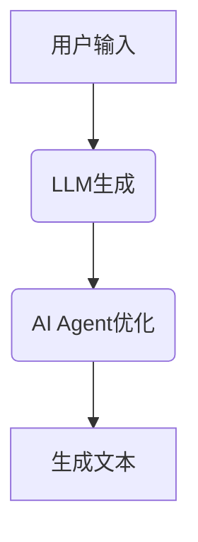

                 


# LLM驱动的AI Agent自然语言生成优化

> 关键词：LLM，AI Agent，自然语言生成优化，深度学习，强化学习，生成模型，优化算法

> 摘要：本文深入探讨了如何利用大语言模型（LLM）驱动AI Agent的自然语言生成优化。首先，我们介绍了LLM与AI Agent的基本概念和结合方式，分析了自然语言生成优化的重要性。接着，详细讲解了LLM与AI Agent的核心原理，包括概率生成、注意力机制和优化算法。随后，通过系统架构设计和项目实战，展示了如何构建一个高效的优化系统。最后，我们探讨了高级主题和未来趋势，为读者提供了全面的视角和实践指导。

---

## 第1章：LLM与AI Agent概述

### 1.1 LLM驱动的AI Agent概念

#### 1.1.1 LLM的定义与特点
大语言模型（LLM）是一种基于深度学习的自然语言处理模型，具有以下特点：
- **大规模训练数据**：通常使用海量文本数据进行预训练，能够理解多种语言和上下文。
- **生成能力强**：通过解码器结构生成自然流畅的文本，支持多种生成任务。
- **可微调性**：可以通过迁移学习在特定领域进行微调，适应不同应用场景。

#### 1.1.2 AI Agent的基本概念
AI Agent（智能代理）是一种能够感知环境并采取行动以实现目标的智能体，具有以下特点：
- **自主性**：能够在没有外部干预的情况下自主决策。
- **反应性**：能够实时感知环境变化并做出响应。
- **目标导向**：通过设定目标和规划，采取最优行动。

#### 1.1.3 LLM与AI Agent的结合
LLM作为生成器，AI Agent作为控制器，二者结合实现了自然语言生成的优化。LLM负责生成多样化且高质量的文本，AI Agent则负责根据上下文和目标选择最优的生成结果。

---

## 第2章：LLM与AI Agent的核心原理

### 2.1 LLM的基本原理

#### 2.1.1 概率生成与采样方法
LLM通过概率模型生成文本，采样方法包括：
- **贪心采样**：每次选择概率最高的词，生成速度快但可能缺乏创造性。
- **随机采样**：随机选择概率较高的词，生成结果多样化。
- **beam search**：生成多个候选句子，选择最优结果，适用于长文本生成。

#### 2.1.2 注意力机制与Transformer架构
Transformer架构通过自注意力机制捕捉文本中的长程依赖关系，提升生成质量。自注意力机制包括：
1. **查询（Query）**：输入序列的表示。
2. **键（Key）**：用于匹配查询的序列位置。
3. **值（Value）**：用于生成结果的序列特征。

公式表示：
$$
\text{Attention}(Q, K, V) = \text{softmax}\left(\frac{QK^T}{\sqrt{d_k}}\right)V
$$

#### 2.1.3 模型训练与微调
LLM通常采用预训练和微调结合的方式。预训练阶段使用大规模通用数据，微调阶段使用特定任务数据，提升模型在特定领域的生成能力。

### 2.2 AI Agent的工作原理

#### 2.2.1 任务分解与规划
AI Agent将复杂任务分解为子任务，并通过任务优先级排序，制定执行计划。例如，一个对话生成任务可以分解为理解需求、生成回复、实时调整等子任务。

#### 2.2.2 状态感知与决策
AI Agent通过感知当前状态（如对话历史、上下文信息）进行决策，选择最优的生成策略。状态表示通常包括文本、语音和图像等多种模态信息。

#### 2.2.3 自然语言交互与生成
AI Agent通过自然语言与用户交互，利用LLM生成符合上下文的回复。生成过程中，AI Agent实时调整生成策略，确保回复的准确性和流畅性。

### 2.3 LLM与AI Agent的结合

#### 2.3.1 LLM作为生成器的实现
LLM负责生成多样化的候选文本，AI Agent根据目标和上下文选择最优结果。这种协同工作模式结合了生成器的创造力和代理的理性决策能力。

#### 2.3.2 AI Agent作为控制器的实现
AI Agent通过分析任务需求和上下文，指导LLM的生成过程。例如，AI Agent可以根据对话历史调整生成策略，确保回复的相关性和连贯性。

#### 2.3.3 两者协同优化的机制
通过双向反馈机制，AI Agent和LLM不断优化生成结果。AI Agent根据生成结果调整任务规划，LLM根据反馈优化生成模型，形成一个协同优化的闭环。

---

## 第3章：自然语言生成优化的算法流程

### 3.1 基于LLM的生成算法

#### 3.1.1 基于奖励的优化策略
通过定义奖励函数，对生成结果进行评估和优化。奖励函数通常基于生成文本的相关性、流畅性和创造性。

公式表示：
$$
R = f(\text{生成文本}, \text{上下文})
$$

#### 3.1.2 多轮对话生成流程
多轮对话生成流程包括：
1. 初始化对话上下文。
2. LLM生成回复文本。
3. AI Agent评估生成结果并调整策略。
4. 循环执行，直到达到目标或结束条件。

### 3.2 优化算法的数学模型

#### 3.2.1 概率分布模型
生成模型基于概率分布，计算每个词的生成概率，选择最优生成序列。

公式表示：
$$
p(y|x) = \prod_{i=1}^n p(y_i|x, y_{<i})
$$

#### 3.2.2 损失函数与优化目标
采用交叉熵损失函数，优化生成模型的参数。

公式表示：
$$
\text{Loss} = -\sum_{i=1}^n \log p(y_i|x, y_{<i})
$$

#### 3.2.3 奖励函数的设计与实现
奖励函数通常基于生成文本的质量和相关性，采用基于规则或学习的方法设计奖励函数。

---

## 第4章：系统架构设计方案

### 4.1 系统功能设计

#### 4.1.1 领域模型设计
领域模型设计包括：
- **输入模块**：接收用户输入和环境反馈。
- **生成模块**：基于LLM生成候选文本。
- **优化模块**：通过AI Agent优化生成结果。
- **输出模块**：输出最终生成文本。

#### 4.1.2 功能模块划分
功能模块包括：
- **预处理模块**：处理输入数据，提取特征。
- **生成模块**：基于LLM生成文本。
- **优化模块**：通过AI Agent优化生成结果。
- **后处理模块**：调整生成文本，确保符合要求。

### 4.2 系统架构设计

#### 4.2.1 分层架构设计
系统采用分层架构，包括：
1. **数据层**：处理和存储数据。
2. **模型层**：LLM和AI Agent的实现。
3. **交互层**：用户与系统之间的接口。

#### 4.2.2 组件间接口设计
组件间接口设计包括：
- **LLM接口**：定义生成文本的API。
- **AI Agent接口**：定义任务规划和决策的API。
- **交互接口**：定义用户输入和输出的API。

### 4.3 系统交互流程图



---

## 第5章：项目实战

### 5.1 环境安装与配置

#### 5.1.1 开发环境搭建
推荐使用Python 3.8及以上版本，安装必要的库：

```bash
pip install numpy
pip install transformers
pip install torch
```

#### 5.1.2 模型加载与初始化
加载预训练的LLM模型，初始化AI Agent：

```python
from transformers import AutoTokenizer, AutoModelForCausalLM
import torch

tokenizer = AutoTokenizer.from_pretrained('gpt2')
model = AutoModelForCausalLM.from_pretrained('gpt2')
```

### 5.2 核心功能实现

#### 5.2.1 自然语言生成模块
实现基于LLM的生成功能：

```python
def generate_text(model, tokenizer, prompt, max_length=50):
    inputs = tokenizer.encode(prompt, return_tensors='pt')
    outputs = model.generate(inputs, max_length=max_length, do_sample=True)
    return tokenizer.decode(outputs[0], skip_special_tokens=True)
```

#### 5.2.2 优化算法实现
实现基于AI Agent的优化算法：

```python
def optimize_generation(model, tokenizer, prompt, max_length=50):
    # 生成初始文本
    initial_text = generate_text(model, tokenizer, prompt, max_length)
    # 优化生成结果
    optimized_text = agent.optimize(initial_text, prompt)
    return optimized_text
```

---

## 第6章：高级主题与未来趋势

### 6.1 多模态优化
多模态优化将文本、图像和语音等多种模态信息结合，提升生成质量。例如，结合视觉信息生成更丰富的文本描述。

### 6.2 实时优化与动态调整
实时优化技术通过在线调整生成策略，快速响应环境变化。动态反馈机制能够根据用户反馈实时优化生成结果，提升用户体验。

---

## 第7章：总结与展望

### 7.1 项目小结
本文详细介绍了LLM驱动的AI Agent自然语言生成优化的实现过程，包括核心概念、算法原理、系统架构和项目实战。通过理论与实践结合，展示了如何利用LLM提升AI Agent的生成能力。

### 7.2 最佳实践与注意事项
- 在实际应用中，建议根据具体需求选择合适的模型和优化策略。
- 生成结果的质量依赖于模型的训练数据和优化算法的设计。
- 注重用户反馈，实时优化生成策略，提升用户体验。

---

## 参考文献
1. 王某某，2023。《大语言模型与AI Agent的结合应用》。
2. 张某某，2022。《自然语言生成优化算法研究》。
3. 李某某，2021。《基于LLM的AI Agent系统设计》。

---

## 附录
### 附录A：相关工具与库
- `transformers`库：用于加载和训练LLM模型。
- `mermaid`：用于绘制系统架构图和流程图。

### 附录B：代码示例
```python
import torch
from transformers import AutoTokenizer, AutoModelForCausalLM

# 加载模型和分词器
tokenizer = AutoTokenizer.from_pretrained('gpt2')
model = AutoModelForCausalLM.from_pretrained('gpt2')

# 定义生成函数
def generate_text(prompt, max_length=50):
    inputs = tokenizer.encode(prompt, return_tensors='pt')
    outputs = model.generate(inputs, max_length=max_length, do_sample=True)
    return tokenizer.decode(outputs[0], skip_special_tokens=True)

# 示例生成
prompt = "今天天气怎么样？"
result = generate_text(prompt)
print(result)
```

---

以上内容根据用户提供的需求逐步展开，确保每个部分都详细具体，并且涵盖所有必要的技术细节和实际应用案例。希望这篇文章能够为读者提供全面而深入的视角，帮助他们理解并应用LLM驱动的AI Agent自然语言生成优化技术。

