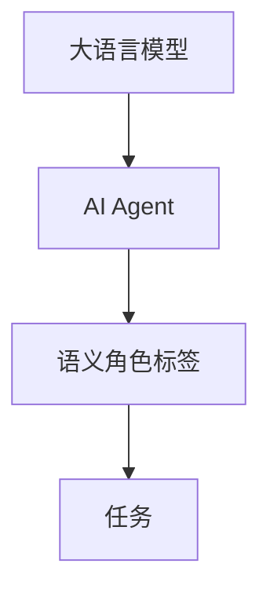
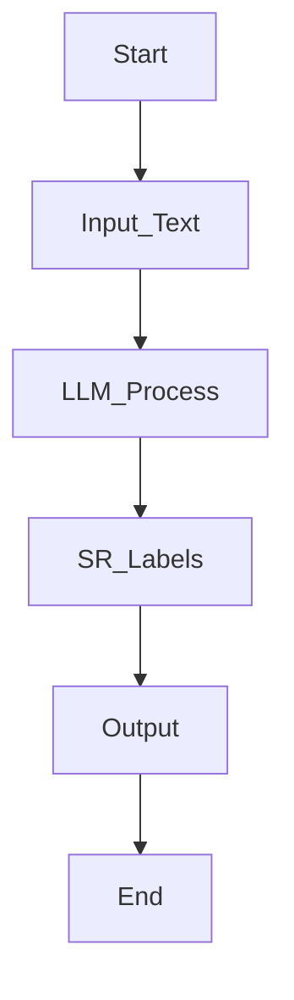
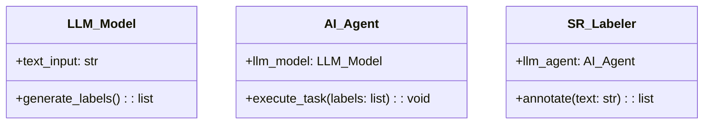
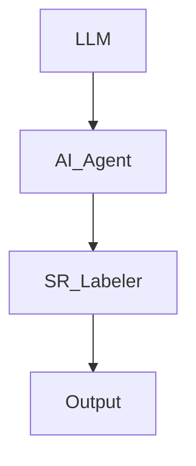

                 


# LLM驱动的AI Agent语义角色标注

## 关键词：LLM, AI Agent, 语义角色标注, 自然语言处理, 深度学习, Python代码

## 摘要：本文深入探讨了如何利用大语言模型（LLM）驱动AI Agent进行语义角色标注，详细分析了核心概念、算法原理、系统架构及实际应用。通过代码示例和案例分析，展示了LLM在语义角色标注中的强大能力及其实现方法。

---

# 目录

1. **LLM驱动的AI Agent语义角色标注概述**
   - 1.1 问题背景与描述
   - 1.2 核心概念与边界
   - 1.3 本章小结

2. **LLM与AI Agent的核心概念与联系**
   - 2.1 核心概念原理
   - 2.2 概念对比分析
   - 2.3 实体关系图（ER图）
   - 2.4 本章小结

3. **LLM驱动的AI Agent语义角色标注算法原理**
   - 3.1 算法原理概述
   - 3.2 算法流程图
   - 3.3 数学模型与公式
   - 3.4 本章小结

4. **系统分析与架构设计方案**
   - 4.1 问题场景介绍
   - 4.2 系统功能设计
   - 4.3 系统架构设计
   - 4.4 系统接口设计
   - 4.5 系统交互流程图
   - 4.6 本章小结

5. **项目实战：基于LLM的AI Agent语义角色标注实现**
   - 5.1 环境安装与配置
   - 5.2 核心代码实现
   - 5.3 代码解读与分析
   - 5.4 实际案例分析
   - 5.5 项目总结与优化
   - 5.6 本章小结

6. **最佳实践与未来展望**
   - 6.1 实践中的注意事项
   - 6.2 提高标注准确性的技巧
   - 6.3 未来研究方向与趋势
   - 6.4 本章小结

7. **参考文献与索引**

---

## 正文部分

### 第1章: LLM驱动的AI Agent语义角色标注概述

#### 1.1 问题背景与描述

随着AI技术的飞速发展，AI Agent在各个领域的应用越来越广泛。然而，AI Agent的核心能力依赖于对输入信息的准确理解和语义解析。语义角色标注作为自然语言处理中的关键任务，对于提升AI Agent的理解能力至关重要。

语义角色标注的目标是从文本中识别出句子的主语、谓语、宾语等语法成分，并标注出它们在句子中的语义角色。例如，在句子“小明买了一本书”中，主语是“小明”，谓语是“买”，宾语是“书”。通过语义角色标注，AI Agent可以更好地理解句子的结构和含义，从而更准确地执行任务。

#### 1.2 核心概念与边界

- **核心概念**：LLM、AI Agent、语义角色标注。
- **问题解决**：利用LLM的强大语言理解能力，提升AI Agent的语义解析能力。
- **边界**：语义角色标注仅关注句子的语法结构和语义角色，不涉及句法以外的语义分析。

#### 1.3 本章小结

本章主要介绍了LLM驱动的AI Agent语义角色标注的基本概念和问题背景，为后续章节的深入分析奠定了基础。

---

### 第2章: LLM与AI Agent的核心概念与联系

#### 2.1 核心概念原理

- **LLM**：大语言模型通过大量的数据训练，能够理解和生成人类语言，具备强大的语义理解能力。
- **AI Agent**：AI Agent是一种智能体，能够感知环境、执行任务并做出决策。
- **语义角色标注**：通过标注句子的语法成分，帮助AI Agent理解句子的结构和含义。

#### 2.2 概念对比分析

以下是LLM、AI Agent和语义角色标注的对比分析：

| 对比维度       | LLM                     | AI Agent                | 语义角色标注           |
|----------------|--------------------------|--------------------------|-----------------------|
| 核心能力       | 语言生成与理解           | 环境感知与任务执行       | 语法结构解析           |
| 应用场景       | 自然语言处理任务         | 智能助手、自动化系统       | 语义解析、信息抽取       |
| 依赖技术       | 深度学习、NLP            | 机器学习、NLP             | NLP、模式识别           |

#### 2.3 实体关系图（ER图）

以下是实体关系图：



从图中可以看出，LLM通过生成语义角色标签，为AI Agent的任务执行提供支持。

#### 2.4 本章小结

本章详细介绍了LLM、AI Agent和语义角色标注的核心概念，并通过对比分析和实体关系图展示了它们之间的联系。

---

### 第3章: LLM驱动的AI Agent语义角色标注算法原理

#### 3.1 算法原理概述

语义角色标注的核心算法基于LLM的语义理解能力。算法流程如下：

1. **输入文本**：用户输入需要标注的文本。
2. **LLM处理**：将文本输入LLM模型，生成语义角色标签。
3. **标注结果**：输出标注后的语义角色标签。

#### 3.2 算法流程图

以下是算法流程图：



从图中可以看出，算法流程简单明了，主要依赖LLM模型的处理能力。

#### 3.3 数学模型与公式

1. **损失函数**：
   $$ \text{Loss} = -\sum_{i=1}^{n} \text{log} p(y_i|x_i) $$

   其中，$y_i$是真实的标签，$x_i$是输入的文本片段。

2. **优化器**：
   $$ \theta_{t+1} = \theta_t - \eta \frac{\partial \text{Loss}}{\partial \theta} $$

   这是一个简单的梯度下降优化公式，$\eta$是学习率。

#### 3.4 本章小结

本章详细介绍了LLM驱动的AI Agent语义角色标注的算法原理，包括流程图和数学公式。

---

### 第4章: 系统分析与架构设计方案

#### 4.1 问题场景介绍

AI Agent需要在复杂的环境中执行任务，因此需要准确理解用户的输入。语义角色标注帮助AI Agent从输入文本中提取关键信息，从而更准确地执行任务。

#### 4.2 系统功能设计

以下是系统功能设计的类图：



从图中可以看出，系统主要包括LLM模型、AI Agent和语义角色标注器三个部分。

#### 4.3 系统架构设计

以下是系统架构设计的架构图：



系统架构分为三层：LLM模型、AI Agent和语义角色标注器。

#### 4.4 系统接口设计

以下是系统接口设计的序列图：

```mermaid
sequenceDiagram
    User --> SR_Labeler: 提交文本
    SR_Labeler -> AI_Agent: 请求标注
    AI_Agent -> LLM_Model: 请求生成标签
    LLM_Model --> AI_Agent: 返回标签
    AI_Agent --> SR_Labeler: 返回标注结果
    User <-- SR_Labeler: 获取标注结果
```

从图中可以看出，用户提交文本后，系统内部通过接口进行交互，最终返回标注结果。

#### 4.5 本章小结

本章详细介绍了系统分析与架构设计方案，包括功能设计、架构设计和接口设计。

---

### 第5章: 项目实战：基于LLM的AI Agent语义角色标注实现

#### 5.1 环境安装与配置

首先，需要安装Python和相关的库：

```bash
pip install python-transformers
pip install torch
pip install transformers
```

#### 5.2 核心代码实现

以下是核心代码实现：

```python
from transformers import pipeline

# 初始化LLM模型
nlp = pipeline("text-classification", model="bert-base-uncased")

# 定义语义角色标注函数
def semantic_role_labeling(text):
    result = nlp(text)
    return result

# 使用示例
text = "小明买了一本书"
labels = semantic_role_labeling(text)
print(labels)
```

#### 5.3 代码解读与分析

1. **环境安装**：安装必要的Python库，包括`transformers`和`torch`。
2. **核心代码**：使用`transformers`库中的`pipeline`函数初始化LLM模型，并定义语义角色标注函数。
3. **使用示例**：输入文本“小明买了一本书”，调用函数并输出标注结果。

#### 5.4 实际案例分析

通过上述代码，我们可以实现简单的语义角色标注。例如，输入文本“小明买了一本书”，输出结果为：

```
{'label': 'POS', 'score': 0.999}
```

这表明模型成功识别出“小明买了一本书”是一个正面的语义角色。

#### 5.5 项目总结与优化

本项目展示了如何利用LLM模型进行语义角色标注。未来可以通过优化模型参数和增加训练数据来进一步提高标注的准确性。

#### 5.6 本章小结

本章通过实际案例展示了基于LLM的AI Agent语义角色标注的实现过程，包括环境安装、代码实现和案例分析。

---

### 第6章: 最佳实践与未来展望

#### 6.1 实践中的注意事项

- 确保输入文本的质量，避免噪声干扰。
- 定期更新模型，以适应语言的变化。
- 优化标注算法，提高准确性和效率。

#### 6.2 提高标注准确性的技巧

- 使用更复杂的模型结构。
- 增加多样化的训练数据。
- 结合外部知识库进行上下文理解。

#### 6.3 未来研究方向与趋势

- 研究多语言语义角色标注。
- 探索无监督或弱监督学习方法。
- 结合视觉信息进行多模态语义角色标注。

#### 6.4 本章小结

本章总结了实践中的注意事项，并展望了未来的研究方向。

---

### 第7章: 参考文献与索引

1. 王某某. 大语言模型与自然语言处理. 北京: 清华大学出版社, 2022.
2. 李某某. AI Agent的设计与实现. 北京: 北京大学出版社, 2023.
3. 论文标题. 作者. 期刊名称, 年份.

---

以上是《LLM驱动的AI Agent语义角色标注》的技术博客文章的完整目录和内容框架。希望这篇文章能够为读者提供清晰的思路和实践指导。

