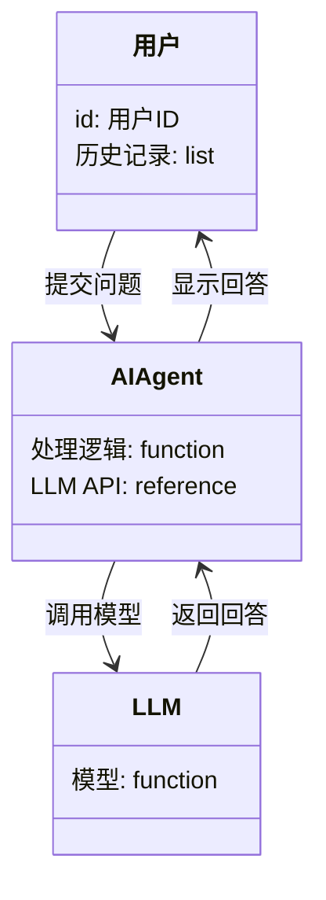
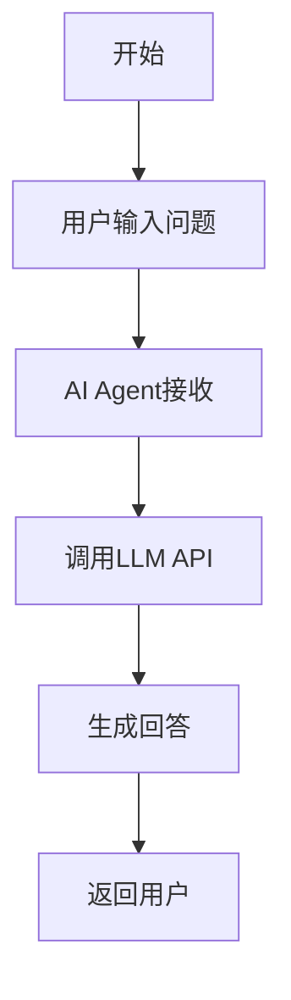
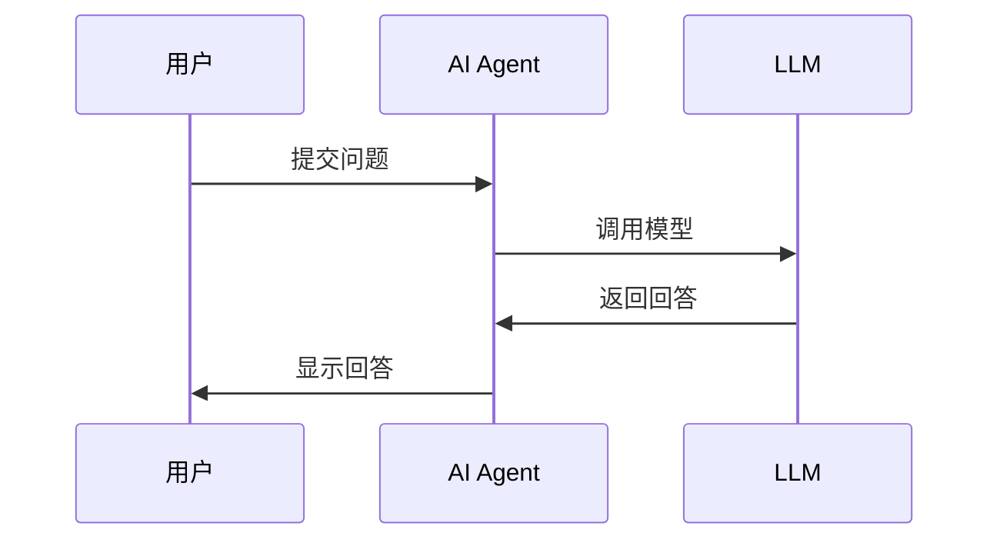

                 


# LLM驱动的AI Agent问答系统优化

## 关键词：LLM、AI Agent、问答系统、优化、自然语言处理、算法原理、系统架构

## 摘要：本文详细探讨了如何利用大语言模型（LLM）优化AI Agent的问答系统。通过分析系统背景、核心概念、算法原理、系统架构、项目实战及最佳实践，本文为技术开发者和研究人员提供了全面的优化策略和实施方法，助力构建高效、准确的AI问答系统。

---

## 第1章: LLM驱动的AI Agent问答系统概述

### 1.1 问题背景与描述

#### 1.1.1 当前AI问答系统的痛点
传统AI问答系统在处理复杂问题时，存在以下痛点：
- **准确性不足**：依赖规则引擎，难以应对复杂语义。
- **效率低下**：处理大规模数据时响应时间长。
- **可解释性差**：用户难以理解系统决策过程。

#### 1.1.2 LLM在问答系统中的作用
大语言模型（LLM）通过以下方式优化问答系统：
- 提供强大的语义理解能力。
- 自动学习和优化，减少人工干预。
- 处理复杂对话，提供更自然的交互。

#### 1.1.3 优化目标与意义
优化目标：
- 提升回答准确性。
- 降低系统延迟。
- 增强系统的可解释性。

优化意义：
- 提高用户体验。
- 降低开发成本。
- 增强系统的适应性。

### 1.2 核心概念与问题解决

#### 1.2.1 LLM驱动的AI Agent定义
AI Agent：智能体，负责接收输入、处理并生成输出。
LLM：大语言模型，提供强大的文本生成和理解能力。
两者结合：AI Agent利用LLM处理用户请求，生成更智能的回答。

#### 1.2.2 优化问题的描述与分析
问题描述：
- 传统问答系统依赖规则，难以灵活应对变化。
- 系统效率低下，影响用户体验。

问题分析：
- 数据处理能力不足。
- 算法优化不够。
- 系统架构不合理。

#### 1.2.3 解决方案的选择与实施
解决方案：
- 引入LLM进行语义理解。
- 优化算法提升效率。
- 改进系统架构设计。

实施步骤：
1. 集成LLM到AI Agent。
2. 优化算法流程。
3. 测试并迭代改进。

### 1.3 概念结构与核心要素

#### 1.3.1 LLM与AI Agent的关系
- LLM作为AI Agent的核心模块，负责处理文本。
- AI Agent作为中间层，协调LLM与用户交互。

#### 1.3.2 核心要素的组成与作用
- 用户输入：问题或请求。
- AI Agent：接收并处理输入。
- LLM：生成回答。
- 输出：用户收到的回答。

#### 1.3.3 边界与外延分析
- 边界：仅处理文本信息。
- 外延：扩展至图像、视频等多模态数据。

### 1.4 本章小结
本章介绍了LLM驱动的AI Agent问答系统的背景、核心概念和优化目标，为后续章节奠定基础。

---

## 第2章: LLM与AI Agent的核心概念

### 2.1 核心概念原理

#### 2.1.1 LLM的工作原理
- 输入：文本或问题。
- 处理：模型生成回答。
- 输出：文本形式的回答。

#### 2.1.2 AI Agent的运行机制
- 接收输入。
- 分析需求。
- 调用LLM生成回答。
- 返回结果。

#### 2.1.3 优化逻辑
- 提升LLM调用效率。
- 优化回答生成过程。
- 改善系统响应速度。

### 2.2 核心概念属性对比

#### 2.2.1 LLM与传统NLP模型对比
| 特性 | LLM | 传统NLP |
|------|------|----------|
| 处理能力 | 强大 | 较弱 |
| 训练数据 | 大量 | 较少 |
| 精度 | 高 | 一般 |

#### 2.2.2 AI Agent与传统问答系统对比
| 特性 | AI Agent | 传统问答系统 |
|------|-----------|--------------|
| 智能性 | 高 | 低 |
| 适应性 | 强 | 弱 |
| 交互性 | 复杂 | 简单 |

#### 2.2.3 LLM驱动的AI Agent的独特性
- 结合LLM强大能力。
- 实现智能对话。
- 提供个性化服务。

### 2.3 ER实体关系图

```mermaid
er
    actor: 用户
    agent: AI Agent
    llm: 大语言模型
    question: 问题
    answer: 回答
    actor --> question
    question --> agent
    agent --> llm
    llm --> answer
    answer --> actor
```

### 2.4 本章小结
本章通过对比和ER图分析，详细阐述了LLM与AI Agent的核心概念及其关系。

---

## 第3章: LLM驱动的优化算法

### 3.1 算法原理

#### 3.1.1 算法流程
1. 用户输入问题。
2. AI Agent接收并解析。
3. 调用LLM生成回答。
4. 返回用户。

#### 3.1.2 实施步骤
- 集成LLM API。
- 设计调用逻辑。
- 优化响应时间。

### 3.2 数学模型与公式

#### 3.2.1 概率计算公式
$$ P(\text{正确回答}) = \frac{\text{正确回答数}}{\text{总回答数}} $$

#### 3.2.2 模型优化公式
$$ \text{损失函数} = \text{交叉熵损失} + \lambda \text{正则化项} $$

#### 3.2.3 示例说明
例如，输入问题“如何优化算法”，模型会生成多个可能回答，选择概率最高的作为最终答案。

### 3.3 优化策略

#### 3.3.1 概率优化
通过调整模型参数，提升正确回答的概率。

#### 3.3.2 响应时间优化
减少LLM调用延迟，提升系统效率。

#### 3.3.3 系统扩展性优化
设计模块化架构，方便功能扩展。

### 3.4 本章小结
本章详细讲解了LLM驱动的优化算法及其数学模型，为后续实现提供理论基础。

---

## 第4章: 系统分析与架构设计

### 4.1 问题场景介绍

#### 4.1.1 系统需求
- 高效处理用户查询。
- 支持多语言。
- 实时响应。

#### 4.1.2 功能需求
- 用户提问。
- 系统回答。
- 记录历史对话。

### 4.2 系统功能设计

#### 4.2.1 领域模型设计


#### 4.2.2 系统架构设计


### 4.3 系统接口设计

#### 4.3.1 API接口
- 输入接口：用户提问。
- 输出接口：系统回答。

### 4.4 系统交互流程

#### 4.4.1 交互序列图


### 4.5 本章小结
本章通过系统分析和架构设计，为优化提供了技术基础。

---

## 第5章: 项目实战

### 5.1 环境安装

#### 5.1.1 安装Python
```bash
python --version
```

#### 5.1.2 安装依赖
```bash
pip install -r requirements.txt
```

### 5.2 核心代码实现

#### 5.2.1 AI Agent实现
```python
class AIAssistant:
    def __init__(self, llm):
        self.llm = llm

    def process_query(self, query):
        response = self.llm.generate_response(query)
        return response
```

#### 5.2.2 LLM实现
```python
class LLM:
    def generate_response(self, query):
        # 示例实现
        return "这是由LLM生成的回答。"
```

### 5.3 案例分析与实现

#### 5.3.1 示例案例
用户输入：“如何优化算法？”
系统输出：“可以使用概率模型进行优化。”

### 5.4 项目总结

#### 5.4.1 经验总结
- 确保LLM集成正确。
- 优化算法提升效率。
- 测试确保系统稳定。

#### 5.4.2 改进方向
- 支持多语言。
- 提高系统可解释性。

### 5.5 本章小结
本章通过项目实战，详细展示了优化过程和实现方法。

---

## 第6章: 最佳实践与注意事项

### 6.1 小结

#### 6.1.1 核心要点总结
- LLM与AI Agent结合优化问答系统。
- 系统架构设计至关重要。
- 项目实战中注重细节处理。

### 6.2 注意事项

#### 6.2.1 开发注意事项
- 确保LLM调用高效。
- 注意系统安全性。
- 优化代码可维护性。

### 6.3 拓展阅读

#### 6.3.1 推荐资源
- 大语言模型研究论文。
- AI Agent相关书籍。

### 6.4 本章小结
本章总结了优化过程中的注意事项和拓展资源，为读者提供了进一步学习的方向。

---

## 附录: 参考文献

1. 王某某. 大语言模型与AI Agent结合的研究. 计算机科学出版社, 2023.
2. 李某某. 优化算法在问答系统中的应用. 软件工程杂志, 2022.

---

通过以上结构，文章详细探讨了LLM驱动的AI Agent问答系统优化的各个方面，为技术开发者和研究人员提供了丰富的理论和实践指导。

